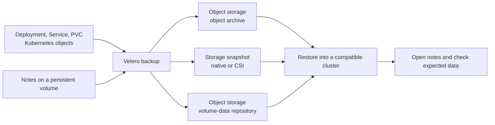

# Where a Velero backup keeps objects and volume data

## The idea in one minute

A Velero backup has **two different things to protect**. Kubernetes
objects describe what to run: a Deployment, Service, or PersistentVolumeClaim
(PVC). A persistent volume holds data the application wrote. Velero
stores its backup of selected Kubernetes objects in object storage.
Volume data might stay as a snapshot in a storage system, or it might
be copied to a backup repository in object storage. The chosen method
determines what the restore will need.[^velero-how][^velero-csi]

Think of moving a workshop. Its inventory says which machines belong
there; copies of unfinished work are separate. An inventory alone
cannot bring back the work. The analogy stops at consistency: a copy
of changing files might not represent one valid application moment.

Read [Velero fundamentals](fundamentals.md) first if Backup, PVC, and
restore are unfamiliar. This page compares methods; it is not a
ready-to-run backup procedure. The [workflow guide](backup-restore-workflows.md)
covers operations after you choose a method.

## One invented workload, four possible copies

Suppose a `notes` application runs in Kubernetes and writes notes to a
PVC. The team wants to recover the application after a cluster loss.
The example is invented; no cluster, volume, snapshot, backup, or
restore was created or tested for this page.

Text alternative: Velero saves selected Kubernetes object definitions
to an object archive. Volume data takes another path: a provider or CSI
snapshot remains in a storage system, or a file/data mover copies bytes
to an object-storage repository. A restore needs the archive and the
chosen volume path, then a real application data check.

The diagram shows alternatives, not three simultaneous volume backups.
If the PVC's data was never protected, restoring its PVC definition
will not recreate the missing notes. A completed backup is not yet
evidence that a restored application works.[^velero-how]

## Compare the volume paths

| Method | Where the volume data goes | What the restore needs | Main limit |
| --- | --- | --- | --- |
| Provider-native snapshot, such as an AWS EBS snapshot | Snapshot in the provider's storage system. | Access to that snapshot through a compatible provider integration. | The backup archive in object storage does **not** contain the volume bytes; migration across provider, account, or region needs a separate supported path. |
| CSI snapshot | Snapshot in the CSI driver's storage backend. | Compatible snapshot APIs and driver on the destination, plus access to the underlying snapshot. | A matching driver name alone does not make a remote snapshot accessible or durable.[^velero-csi] |
| CSI snapshot data movement | A CSI snapshot supplies a source; a data mover copies its contents into a Velero repository in object storage. | Backup repository, suitable target storage, and data-mover restore path. | Extra staging volumes, Pods, time, network, and object-storage capacity.[^velero-data-movement] |
| File System Backup (FSB) | Velero's node-agent reads a mounted Pod volume and writes files to a backup repository in object storage. | Backup repository, node-agent restore path, and a compatible application target. | Reads a live file system; application-consistent recovery may require hooks or an application-native backup.[^velero-fsb] |

**CSI** is the Container Storage Interface, which lets a storage
driver implement Kubernetes volume operations. A `VolumeSnapshot`
requests a snapshot of a PVC; `VolumeSnapshotContent` represents the
bound storage snapshot; `VolumeSnapshotClass` identifies driver and
snapshot behavior. Having these API objects installed does not prove
that the particular driver can take and restore a snapshot for this
PVC.[^kubernetes-snapshot]

CSI data movement and FSB both put volume bytes into a Velero backup
repository, but they read from different sources. Data movement reads
a volume made from a CSI snapshot; FSB reads a running Pod's mounted
volume. Velero uses `DataUpload` and `DataDownload` resources to track
its built-in data-movement work.[^velero-data-movement][^velero-fsb]

**Data movement is an explicit choice, not the automatic result of a
CSI snapshot.** The Velero v1.18 guide requires the server's
`EnableCSI` feature, a node-agent for the built-in mover, and a backup that requests
movement, such as with `--snapshot-move-data`. Check for completed
`DataUpload` work and accessible repository data before saying the
snapshot was copied off the storage backend. FSB also needs node-agent
and a Pod with the volume mounted; it cannot read an unmounted PVC
directly and does not back up `hostPath` volumes.[^velero-data-movement]
[^velero-fsb]

## Make the decision from the restore target

For the invented notes app, ask these in order:

1. **Does this workload need the PVC's contents?** If the contents are
   disposable, object definitions and an independent source such as
   Git may be enough. If they are valuable, name the data recovery path.
2. **Where must it restore?** For recovery inside a compatible storage
   boundary with the original snapshot accessible, a native or CSI
   snapshot may be suitable. For a different provider or region, verify
   an actual snapshot-copy process or use a method that copies volume
   bytes to object storage. Never infer portability just from a
   completed Velero `Backup`.[^velero-csi][^velero-data-movement]
3. **Can the app tolerate a live-volume copy?** A busy database may
   need a database-native backup, quiescing, or another documented
   consistency method. Neither a file copy nor an ordinary snapshot
   alone proves transaction-level recovery.[^velero-fsb]
4. **Can you test the destination?** Restore into a compatible target,
   inspect Velero and volume status, then open the application and
   read a known note. Record the elapsed time and the newest data
   actually recovered; those are evidence for a recovery plan.

> [!IMPORTANT]
> Choose per workload, not by a single cluster-wide slogan. A team
> might use snapshots for one PVC, FSB for another, and a database-native
> backup for a database. The decisive question is whether the required
> data can be restored and used at the intended destination.

## Where configuration fits

A `BackupStorageLocation` points Velero at object storage for backup
artifacts. It does not, by itself, select a volume-copy method or turn
an EBS snapshot into S3 object data. For provider-native snapshots,
a `VolumeSnapshotLocation` can carry provider-specific settings; CSI
snapshots instead use the Kubernetes snapshot API and an appropriate
`VolumeSnapshotClass`.[^velero-how][^velero-csi]

Velero volume policies can select `snapshot`, `fs-backup`, or `skip`
for volumes that match documented conditions. Order matters: the
first matching volume policy wins, and those policies take priority
over older FSB annotations and default volume settings. The `snapshot`
action can lead to different snapshot paths according to the backup's
configuration, so do not read that word as proof of object-storage
data movement.[^velero-resource-policy]

Before relying on any method, check that the backup reports the
expected volumes, that the underlying snapshot or repository data
exists and remains accessible, and that a test restore produces the
application result you care about. A backup and a restore can both
finish without proving the application data is correct.

## Check your understanding

1. If Velero stored the PVC definition in S3 but used an EBS snapshot,
   where are the notes' volume bytes?
2. Why can a CSI snapshot with a matching driver name still fail to
   restore in a different cluster?
3. Which method reads a mounted live volume, and what consistency
   question would you ask about it?
4. What observation would prove more than a completed backup status?

## Official documentation for deeper study

- [How Velero works](https://velero.io/docs/v1.18/how-velero-works/)
  for the object archive and storage-location roles.
- [CSI snapshot support](https://velero.io/docs/v1.18/csi/)
  and [Kubernetes volume snapshots](https://kubernetes.io/docs/concepts/storage/volume-snapshots/)
  for the storage-driver boundary.
- [CSI snapshot data movement](https://velero.io/docs/v1.18/csi-snapshot-data-movement/)
  and [File System Backup](https://velero.io/docs/v1.18/file-system-backup/)
  for the two object-storage volume-data paths.
- [Volume policies](https://velero.io/docs/v1.18/resource-filtering/)
  for exact selection and precedence rules.

Next, use [AWS S3 and EBS installation](aws-s3-ebs-installation.md)
for an AWS-specific setup or [backup and restore workflows](backup-restore-workflows.md)
for task steps. Return to the [Velero index](index.md).

[^velero-how]: [Velero v1.18 - How Velero Works](https://velero.io/docs/v1.18/how-velero-works/).
[^velero-csi]: [Velero v1.18 - CSI Snapshot Support](https://velero.io/docs/v1.18/csi/).
[^velero-data-movement]: [Velero v1.18 - CSI Snapshot Data Movement](https://velero.io/docs/v1.18/csi-snapshot-data-movement/).
[^velero-fsb]: [Velero v1.18 - File System Backup](https://velero.io/docs/v1.18/file-system-backup/).
[^velero-resource-policy]: [Velero v1.18 - Resource Filtering and Volume Policies](https://velero.io/docs/v1.18/resource-filtering/).
[^kubernetes-snapshot]: [Kubernetes - Volume Snapshots](https://kubernetes.io/docs/concepts/storage/volume-snapshots/).
