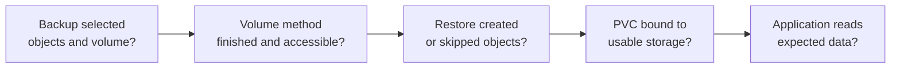

# Find why a Velero restore has no application data

## Start with the symptom

A Velero Restore may finish while an application still cannot read its
old files. The missing piece could be the **PVC object**, the **volume
bytes**, a **target storage binding**, or the **application's own
startup and data check**. Investigate those boundaries in order before
changing a backup, deleting a namespace, or retrying a restore.

Think of a parcel delivery: the address label may arrive, but the box
can be missing, undeliverable, or full of the wrong contents. The
analogy stops at application consistency: a box of files can exist
while a database inside it is unusable.

This guide is a read-only investigation. Replace the names in the
first command block with names from **your** backup and restore; run
all blocks in the same shell. No live incident or Velero server was
used to validate these commands in this review. For the distinction
between object archives and volume copies, read [where Velero keeps
volume data](storage-and-volume-backups.md) first.



Text alternative: confirm what the source backup selected, then
whether the selected volume method completed and remains accessible.
Next inspect what the restore created or skipped, whether its PVC
bound to usable storage, and finally whether the application can read
the expected data.

## 1. Confirm the target and operation

```bash
backup_name='REPLACE_WITH_BACKUP_NAME'
restore_name='REPLACE_WITH_RESTORE_NAME'
target_namespace='REPLACE_WITH_TARGET_NAMESPACE'
pvc_name='REPLACE_WITH_PVC_NAME'
velero_ns='velero' # replace if Velero was installed elsewhere
kubectl config current-context
velero version
velero backup describe "$backup_name" --details
velero restore describe "$restore_name" --details
```

Stop if the context, version, backup, or restore is not the one you
intend to diagnose. Record the `Backup` and `Restore` phases plus
warnings and errors. `Completed`, `PartiallyFailed`, and `Failed`
are examples of terminal results; validation failures and in-progress
phases can also appear. `--wait` on an earlier command did not prove
the application recovered. The Velero CLI must also be configured for
the installation namespace named by `velero_ns`; otherwise its backup
and restore commands may inspect a different installation.
[^velero-troubleshooting]

If the **Kubernetes object** was never in the backup, investigate its
namespace, resource, or label filter before inspecting storage.
If Velero reports that the object **already existed** in the target,
remember that the default restore leaves it unchanged; an existing
PVC may be unrelated to the backup's volume bytes. Do not use
`--existing-resource-policy update` as a blind repair: Velero says
that updating a PVC object does not overwrite its volume data.
[^velero-restore]
The restore description and logs report skipped existing resources.
For a created object, Velero adds `velero.io/restore-name` and
`velero.io/backup-name` labels. Labels alone are not conclusive if an
earlier restore or an `update` policy labeled an existing object; read
them together with this Restore's logs.[^velero-restore]

## 2. Find the intended volume path

```bash
velero backup logs "$backup_name"
velero restore logs "$restore_name"
kubectl -n "$velero_ns" get podvolumebackups \
  -l "velero.io/backup-name=$backup_name"
kubectl -n "$velero_ns" get datauploads \
  -l "velero.io/backup-name=$backup_name"
```

If `velero backup logs` or `velero restore logs` cannot read the
backup location, inspect the Velero server log for the storage or
credential error instead:
`kubectl -n "$velero_ns" logs deploy/velero`.
An unavailable log archive should not hide a storage failure.

Read the native snapshots, CSI snapshots, and Pod volume backups
sections of the backup details, then check the logs to identify
whether this PVC used a provider snapshot, CSI snapshot, File System
Backup (FSB), or CSI
snapshot data movement. `PodVolumeBackup` records point to FSB;
`DataUpload` records point to CSI snapshot data movement. Check
`spec.datamover` in a `DataUpload` to distinguish Velero's built-in
mover from a custom one. Their
absence alone is **not** an error if the selected path was a plain
snapshot. An object-only backup can contain the PVC definition while
protecting none of its file data.[^velero-fsb][^velero-data-movement]
If a label selector returns nothing but the details say a copy ran,
list those records without a selector and inspect their specs; a
record's label can differ from a long operation name.

| If the intended path was... | Look for | What a gap may mean |
| --- | --- | --- |
| Provider or CSI snapshot | Snapshot evidence in backup/restore details and an accessible underlying storage snapshot. | The snapshot was not created, expired, or cannot be used in the target storage boundary. |
| FSB | A completed `PodVolumeBackup` and ready repository; later a `PodVolumeRestore`. | The mounted Pod volume was not selected, node-agent could not read it, or the repository is unavailable. |
| CSI data movement | Completed `DataUpload` and later `DataDownload` plus repository access. | A plain CSI snapshot was taken without movement, or transfer/staging failed. |
| None | No recorded volume method for this PVC. | The backup may only restore object definitions, not prior files. |

Velero's FSB path reads volumes mounted by running Pods; it cannot
read an orphan PVC directly. CSI data movement needs explicit
selection and a node-agent for its built-in mover. Do not infer that
files reached object storage merely because S3 contains the Kubernetes
object archive.[^velero-fsb][^velero-data-movement]

## 3. Inspect the destination volume

```bash
kubectl -n "$target_namespace" get pvc "$pvc_name" -o wide
kubectl -n "$target_namespace" get pvc "$pvc_name" --show-labels
kubectl -n "$target_namespace" describe pvc "$pvc_name"
kubectl -n "$target_namespace" get pods
kubectl -n "$target_namespace" get events \
  --sort-by=.metadata.creationTimestamp
kubectl -n "$velero_ns" get podvolumerestores \
  -l "velero.io/restore-name=$restore_name"
kubectl -n "$velero_ns" get datadownloads \
  -l "velero.io/restore-name=$restore_name"
```

If the PVC is **absent**, inspect the restore filters, logs, API
availability, and existing-object messages. If it is **Pending**,
inspect its StorageClass, storage driver, zone or topology, and events.
With a `WaitForFirstConsumer` StorageClass, Pending can be expected
until a Pod that uses the claim is scheduled; check that condition
before treating it as a provisioning failure. For CSI data movement,
also check whether its `DataDownload` is still running before treating
Pending as a storage failure. Events can expire, so no events now does
not prove there was no earlier problem.[^velero-data-movement]
If it is **Bound**, a PV was provisioned or matched to the claim; this
does not show that the volume is attached or that the old bytes are
there. The relevant restore object
(`PodVolumeRestore`, `DataDownload`, or snapshot path) must match the
method found in step 2.[^velero-restore][^velero-fsb]
[^velero-data-movement]

For FSB, inspect the restored workload Pod as well as the claim. The
Pod must be scheduled and run Velero's restore helper init container
before its `PodVolumeRestore` can copy files into the mounted volume.
If the Pod is Pending, use
`kubectl -n "$target_namespace" describe pod POD_NAME` to find the
scheduling or mount reason; a Bound claim
by itself does not mean the FSB restore finished.[^velero-fsb]

For a CSI snapshot restore, the target also needs a compatible CSI
driver and access to the underlying snapshot. Kubernetes
`VolumeSnapshot` objects may have been cleaned up after a completed
backup, so their absence **now** is not enough to say no snapshot was
taken. Use the backup record and provider or storage-backend evidence
for that conclusion.[^velero-csi]

## 4. Check the application result

Ask the application owner to read one known item from the restored
workload, such as a file name and content or an application record.
If authorized, compare a checksum or known version with the source's
recorded recovery point. A directory listing alone is weak evidence:
empty files, stale data, or a broken database can still look present.

| Evidence found | Next investigation |
| --- | --- |
| Backup never selected the PVC or its data | This recovery point has no copy of those bytes. Change backup scope or volume method for future backups, then prove it with a restore into a disposable target. |
| Data copy failed or is inaccessible | Follow the method-specific repository, snapshot, identity, and storage logs before attempting another restore. |
| PVC cannot bind | Resolve target StorageClass, topology, and driver compatibility before judging application data. |
| PVC bound and copy completed, app still fails | Check mount path, permissions, consistency, external dependencies, and application logs with its owner. |

Do not delete target PVCs, change storage-class mappings, or update
existing resources solely because a restore says `PartiallyFailed`.
Those actions may destroy the only good copy or hide the original
failure. A fresh restore into a disposable target should be planned
with the application owner and the [restore reference](https://velero.io/docs/v1.18/restore-reference/).

## Check your understanding

1. Why can `kubectl get pvc` show `Bound` while old files are missing?
2. What does an empty `DataUpload` list mean if the backup used an EBS
   snapshot without data movement?
3. Which evidence distinguishes a skipped existing PVC from one
   created by the Restore?
4. What application check would prove more than a directory listing?

## Official documentation for deeper study

- [Velero troubleshooting](https://velero.io/docs/v1.18/troubleshooting/)
  for debug bundles and server/plugin logs.
- [Restore reference](https://velero.io/docs/v1.18/restore-reference/)
  for existing-object behavior and PVC restoration.
- [File System Backup](https://velero.io/docs/v1.18/file-system-backup/)
  for `PodVolumeBackup` and `PodVolumeRestore`.
- [CSI snapshot data movement](https://velero.io/docs/v1.18/csi-snapshot-data-movement/)
  for `DataUpload`, `DataDownload`, and repository checks.
- [CSI snapshot support](https://velero.io/docs/v1.18/csi/)
  for snapshot class and driver prerequisites.

[Back to Velero index](index.md)

[^velero-troubleshooting]: [Velero v1.18 - Troubleshooting](https://velero.io/docs/v1.18/troubleshooting/).
[^velero-restore]: [Velero v1.18 - Restore Reference](https://velero.io/docs/v1.18/restore-reference/).
[^velero-fsb]: [Velero v1.18 - File System Backup](https://velero.io/docs/v1.18/file-system-backup/).
[^velero-data-movement]: [Velero v1.18 - CSI Snapshot Data Movement](https://velero.io/docs/v1.18/csi-snapshot-data-movement/).
[^velero-csi]: [Velero v1.18 - CSI Snapshot Support](https://velero.io/docs/v1.18/csi/).
