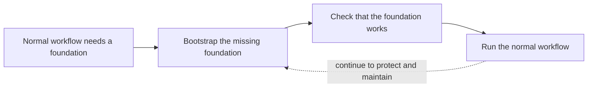

# Bootstrapping a system

## Purpose

Use this page when a project, application, or infrastructure tool cannot start
because it first needs a dependency that normal operation assumes already
exists. You will learn to identify that first dependency, prepare it safely,
and decide when ordinary setup can take over. This is an explanation, not a
command sequence for a particular cloud account.

## The idea

**Bootstrapping** is the first setup that creates the minimum working
foundation for a system. The normal workflow can then run on top of it.
Sometimes the foundation is simple: a checked-out Node project needs its
declared packages installed before its scripts can run.[^npm-install]
Sometimes it is a dependency loop: infrastructure automation wants to save
its state in a storage bucket that does not exist yet.[^terraform-s3-backend]

The key question is: **What must exist before the usual first step can
succeed?** List only that dependency and its owner. The goal is to make the
one-time step small, visible, and repeatable.

Think of putting up scaffolding before constructing a building. Once the
building can stand, you can work normally. The analogy stops at lifecycle:
some bootstrap resources, such as a Terraform state bucket, remain critical
for the system's entire life and must not be casually removed.

## A dependency, not a magic command

Text alternative: first identify what the normal workflow requires, create
the missing foundation through an accountable setup step, check that it is
usable, and then start ordinary work. The return arrow means the foundation
may remain an operational dependency after setup. The diagram helps separate
the first-time creation from the repeatable day-to-day workflow.

Bootstrapping is about dependency order, not a special product. A team might
call a setup script `bootstrap`, but the name alone does not tell you what it
changes. Read what resources or files it creates before running it.

## Example: a Terraform state backend

This is a conceptual example, not a tested cloud run. A team wants Terraform
to store its state in an Amazon S3 bucket. The S3 backend configuration names
an existing bucket; HashiCorp's documentation explicitly assumes that the
named bucket has already been created.[^terraform-s3-backend]

1. The team first decides who owns the state bucket, its access, recovery,
   and retention. State can contain sensitive information, so this is a
   security and continuity decision, not merely a naming choice.[^terraform-backend]
2. An authorized setup path creates the bucket and any required access before
   the main Terraform configuration uses it. That path may be a separate
   configuration or a controlled manual procedure; the choice should be
   documented.
3. The main configuration names the prepared backend. Its first
   `terraform init` configures the backend. If state already exists locally,
   a backend change may offer to migrate it; inspect that prompt and preserve
   a recovery copy before proceeding.[^terraform-init]
4. The team verifies that state is in the intended backend and that the next
   authorized run can read it. If S3 lockfile locking was enabled, also check
   that the run can use the lock. The bucket then remains protected as part of
   normal operation.[^terraform-s3-backend]

What you should observe is not simply "the command returned zero." The
ordinary workflow now has a usable foundation, and its owner knows how to
recover it. For the operational details, use [Terraform state
management](../terraform/fundamentals/state-management.md) and the official
backend documentation.

## A smaller project example

A newcomer clones a Node project whose `package.json` lists dependencies.
Installing those dependencies prepares the local environment so the
project's scripts can find the packages they import.[^npm-install] That is
project bootstrapping. It does not prove that environment variables, a
database, or external services are configured. The repository's own setup
guide should say which of those are needed.

## Avoid common mistakes

- **Do not hide the first dependency.** If a guide starts with a command that
  requires a bucket or identity, link to the owned setup path.
- **Do not turn one-time setup into a daily action.** Recreating a state
  bucket or database on every run can erase or disconnect important data.
- **Do not assume success from existence alone.** Check permissions,
  reachability, and whether the normal workflow can actually use the result.
- **Do not leave the foundation ownerless.** Record who maintains and recovers
  a bootstrap resource once the application is running.

## Check your understanding

- Why can't a main Terraform configuration use an S3 backend before the
  bucket exists?
- Which part of the Node example is first-time setup, and what remains
  unverified after installing packages?
- What information would you want before running a script named `bootstrap`?

## Official documentation for deeper study

- [npm install](https://docs.npmjs.com/cli/v11/commands/npm-install/) explains one local dependency installation step.
- [Terraform backend configuration](https://developer.hashicorp.com/terraform/language/backend) explains state storage and sensitive backend details.
- [Terraform S3 backend](https://developer.hashicorp.com/terraform/language/backend/s3) identifies the existing-bucket assumption and state protection concerns.
- [terraform init](https://developer.hashicorp.com/terraform/cli/commands/init) covers initialization and backend changes.

## Related links

- [Bootstrap and bootstrapping](bootstrap-and-bootstrapping.md)
- [Bootstrap frontend toolkit](bootstrap-frontend-toolkit.md)
- [Terraform state management](../terraform/fundamentals/state-management.md)
- [Back to programming languages](index.md)
- [Back to knowledge index](../index.md)

[^npm-install]: [npm - npm install](https://docs.npmjs.com/cli/v11/commands/npm-install/), source record `npm-install`.
[^terraform-backend]: [Terraform - Backend configuration](https://developer.hashicorp.com/terraform/language/backend), source record `terraform-backend`.
[^terraform-s3-backend]: [Terraform - S3 backend](https://developer.hashicorp.com/terraform/language/backend/s3), source record `terraform-s3-backend`.
[^terraform-init]: [Terraform - terraform init](https://developer.hashicorp.com/terraform/cli/commands/init), source record `terraform-init`.
