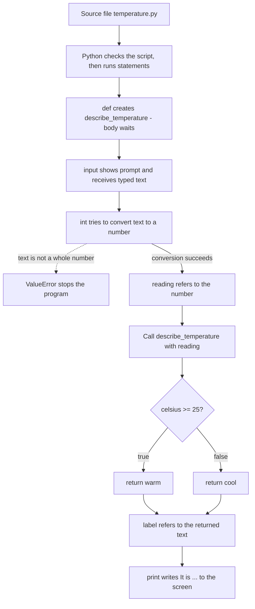

# Programming fundamentals

## Purpose

Read this page if you have never written a program and want to understand
what happens when one runs. By the end you should be able to explain eight
words: **source code**, **interpreter**, **runtime**, **variable**,
**function**, **condition**, **input**, and **output**. You should also be
able to follow a tiny Python program one line at a time.

The example program is a small teaching example. Python is used to make the
path visible, not because every language works the same way.

## Simple definitions

- A **program** is instructions a computer runs to produce an outcome.
  **Source code** is the text a person writes to express those instructions.
  A Python script can live in a text file that the interpreter reads
  when you run it.[^python-interpreter]
- An **interpreter** is a program that reads source code and carries it
  out. When you give the Python interpreter a file name, it reads and runs
  the script in that file. When you start it with no file, it reads and
  runs commands you type at its `>>>` prompt.[^python-interpreter]
- **At runtime** means *while the program is running*.
  Some problems only show up at runtime. Python calls an error found while
  the code runs an **exception**. It is different from a **syntax error**,
  which the parser reports when the text itself is not valid
  Python.[^python-errors] When running a script from a file, Python parses
  the whole script before executing it. A syntax error even near the end
  prevents its earlier statements from running.[^python-command-line]
- A **variable** is a name that refers to a value. In Python, `=` assigns
  a value to a name. It does not test whether two things are equal; `==`
  does that. Using a name that has never been assigned a value causes an
  error.[^python-introduction]
- A **function** is a named block of instructions you can use again. In
  Python, `def` starts a function definition. In
  `def describe_temperature(celsius)`, `celsius` is a **parameter**: a name
  that receives the **argument** supplied when the function is called.
  `return` sends a value back to the caller.[^python-control-flow][^python-function-definitions]
- A **condition** is an expression that is treated as true or false. It is
  used to decide what runs next. An `if` statement runs its indented block
  only when the condition is true. `else` is optional and covers the other
  case.[^python-control-flow][^python-introduction]
- **Input** is data that comes into a program while it runs, such as what
  a person types. **Output** is what the program produces for the outside
  world. Here, `input()` gets typed text and `print()` writes text to the
  terminal.[^python-builtins]

## Why it matters

A program's text, the values it handles, and what it shows a person are
different things. Keeping them separate lets you predict what a program will
do before running it and locate the point where a bad input stops it.

## The mental model

| Part | Role | What moves |
| --- | --- | --- |
| Source file | Holds the instructions as text | The interpreter reads it[^python-interpreter] |
| Interpreter | Parses the script, then runs its statements | A syntax error stops execution; otherwise `if` choices and function calls direct the path[^python-command-line][^python-control-flow] |
| Variables | Names for values | A value is assigned to a name and read again later[^python-introduction] |
| Functions | Named, reusable steps | Arguments go in and a `return` value comes out[^python-control-flow] |
| Conditions | Choose between paths | A true or false result picks the block that runs[^python-control-flow] |
| Input / output | The program's connection to a person | Typed text comes in; printed text goes out[^python-builtins] |

Python uses **indentation** to group statements. The indented lines under
`if` or `def` belong to it. The spaces are part of the meaning, not just a
matter of style.[^python-introduction]

### Not every language runs like this

Different languages and environments prepare and run code differently. MDN
contrasts code compiled before a program runs with JavaScript in a browser,
whose engine may compile code while it runs. Python also prepares code
internally, including bytecode in CPython, but you normally run the script
directly through its interpreter. The ideas on this page transfer; another
language may start or report errors differently.[^mdn-what-is-javascript][^python-glossary]

## An analogy: a tour guide and a written tour script

Imagine a museum guide working from a written tour script. The script is
the source code. The guide reading and acting on it is the interpreter.
When the guide says "remember this painting as *the blue one*", that's a
variable. A short side tour described once at the top of the script, and
given only when the script says "now do the sculpture side tour", is a
function. "If the gallery is crowded, start upstairs; otherwise, start
here" is a condition. A visitor's answer to the guide's question is input,
and what the guide says aloud is output.

Where the analogy breaks, and the true fact behind each break:

- **A guide can work out what a typo meant. Python cannot.** If the text
  isn't valid Python, Python reports a syntax error and points to where it
  found the problem.[^python-errors]
- **A guide can skip ahead on a whim. This program cannot.** Its `if`
  chooses a branch, and its function call enters the named function.
  Other programs can also use loops.[^python-control-flow]
- **A guide can ask "which painting?" Python can't.** Using a name before
  it has been assigned stops the program with a `NameError`.[^python-introduction][^python-errors]
- **A guide understands "thirty".** Here `input()` returns text and
  `int()` must convert it to a whole number. Text such as `warm` cannot
  be converted this way and raises `ValueError`.[^python-builtins][^python-errors]
- **A guide can start reading before checking the last page.** Python
  parses a complete script before running its first statement, so a syntax
  error later in the file stops it at the start.[^python-command-line]

## Example: tracing one tiny program

This file, `temperature.py`, uses an invented temperature label. It is an
example of program flow, not a weather or health rule.

```python
def describe_temperature(celsius):
    if celsius >= 25:
        return "warm"
    else:
        return "cool"

reading = int(input("Temperature in Celsius: "))
label = describe_temperature(reading)
print("It is", label)
```

**Start:** someone runs the file with the Python interpreter, for example
`python3 temperature.py` in a terminal.[^python-interpreter] The exact
command can differ by operating system and installation.

1. **Lines 1–5 (`def`).** Python creates a function named
   `describe_temperature` and remembers it under that name. The `if` inside
   does **not** run yet. Its statements run each time the function is
   called.[^python-function-definitions]
2. **Line 7, right-hand side first.** `input(...)` shows the prompt
   `Temperature in Celsius:` and receives what the person types, say `30`.
   `int(...)` turns that text into the whole number 30.[^python-builtins]
3. **Line 7, the assignment.** `=` makes the name `reading` refer to
   30.[^python-introduction]
4. **Line 8, the call.** Python runs the function body with `celsius`
   referring to 30. Names created by a function call are local to that
   call.[^python-control-flow]
5. **Line 2, the condition.** `30 >= 25` is true, so the first block runs.
   `>=` compares two values; it doesn't assign
   anything.[^python-introduction][^python-control-flow]
6. **Line 3, `return`.** The function hands back `"warm"`. Back on line 8,
   `=` makes `label` refer to `"warm"`.[^python-control-flow]
7. **Line 9, output.** `print` writes both items with a space between them
   and no quotes, so the output after the prompt is
   `It is warm`.[^python-builtins] **End:** there are no more statements, so
   the program finishes.

**What changes with other input?**

- Type `12`: the condition is false, the `else` block returns `"cool"`,
  and the output is `It is cool`.[^python-control-flow]
- Type `warm`: `int()` can't turn that text into a number. Python raises a
  `ValueError` and lines 8 and 9 never run.[^python-builtins][^python-errors]

The exact code block above was run locally on 2026-10-09 with Python 3.14.4;
the three inputs were supplied on standard input. Inputs `30` and `12`
printed `It is warm` and `It is cool` after the prompt
and exited successfully. Input `warm` printed the prompt, raised a
`ValueError`, and exited with code 1. This checks the example's three paths;
it is not an independent beginner reader test.

## Visual: the path through the program



**Text alternative:** The flow goes from top to bottom. The Python
interpreter reads the source file. It first defines the function without
running its body. It then asks the person for input and converts the typed
text to a number. If the text is not a whole number, a `ValueError` stops
the program at that point. Otherwise the number is passed to the function,
whose condition checks whether it is at least 25. The true path returns
"warm" and the false path returns "cool". Either result is stored in
`label` and printed. Use the diagram to work out which line a given input
will reach, and where an error would stop the program.

## Common misconceptions

- **"`=` means equals."** It assigns a value to a name. Comparison uses
  `==`.[^python-introduction]
- **"Writing a function runs it."** `def` defines the function. Its
  body runs when it is called.[^python-function-definitions]
- **"`print` and `return` do the same thing."** `print` writes to the
  screen. `return` gives a value back to the code that called the
  function. A function with no `return` still returns `None`.[^python-control-flow]
- **"Indentation is just neatness."** In Python it decides which statements
  belong to an `if` or a `def`.[^python-introduction]
- **"An error means I broke the computer."** An error is the interpreter
  reporting a problem. Read the last line for the error type, then the
  lines above it to find the location.[^python-errors]

## Check your understanding

1. If the person types `25`, what does the program print, and which line
   decides that?
2. Why can line 8 call `describe_temperature` even though the function's
   `if` did not run when Python first passed lines 1–5?
3. If line 3 said `print("warm")` instead of `return "warm"`, what would
   `label` refer to, and what would line 9 then show?

## Next steps

This section has no hands-on beginner tutorial yet. To practice, follow the
official Python tutorial in this order:

1. [Using the Python interpreter](https://docs.python.org/3/tutorial/interpreter.html)
   shows how to start Python and run a script.
2. [An informal introduction](https://docs.python.org/3/tutorial/introduction.html)
   covers values, variables, `print`, and a first loop with a condition.
3. [More control flow tools](https://docs.python.org/3/tutorial/controlflow.html)
   covers `if`, `def`, arguments, and `return`.
4. [Errors and exceptions](https://docs.python.org/3/tutorial/errors.html)
   shows how to read error messages and handle bad input.

These links point to the current Python 3 tutorial and are not pinned to a
release.

To see how a different language runs, read MDN's
[What is JavaScript?](https://developer.mozilla.org/en-US/docs/Learn_web_development/Core/Scripting/What_is_JavaScript).

## Related links

- [AI fundamentals](../ai/ai-fundamentals.md) explains why an ordinary
  `if` rule is not AI.
- [Glossary](../glossary.md)
- [Start here](../start-here.md)
- [Back to programming languages](index.md)
- [Back to knowledge index](../index.md)

[^python-interpreter]: [Python Tutorial - Using the Python Interpreter](https://docs.python.org/3/tutorial/interpreter.html), source record `python-interpreter`.
[^python-introduction]: [Python Tutorial - An Informal Introduction to Python](https://docs.python.org/3/tutorial/introduction.html), source record `python-introduction`.
[^python-control-flow]: [Python Tutorial - More Control Flow Tools](https://docs.python.org/3/tutorial/controlflow.html), source record `python-control-flow`.
[^python-errors]: [Python Tutorial - Errors and Exceptions](https://docs.python.org/3/tutorial/errors.html), source record `python-errors`.
[^python-builtins]: [Python Standard Library - Built-in Functions](https://docs.python.org/3/library/functions.html), source record `python-builtins`.
[^python-command-line]: [Python Documentation - Command line and environment](https://docs.python.org/3/using/cmdline.html), source record `python-command-line`.
[^python-function-definitions]: [Python Language Reference - Function definitions](https://docs.python.org/3/reference/compound_stmts.html#function-definitions), source record `python-function-definitions`.
[^python-glossary]: [Python Glossary - Bytecode](https://docs.python.org/3/glossary.html#term-bytecode), source record `python-glossary`.
[^mdn-what-is-javascript]: [MDN - What is JavaScript?](https://developer.mozilla.org/en-US/docs/Learn_web_development/Core/Scripting/What_is_JavaScript), source record `mdn-what-is-javascript`.
