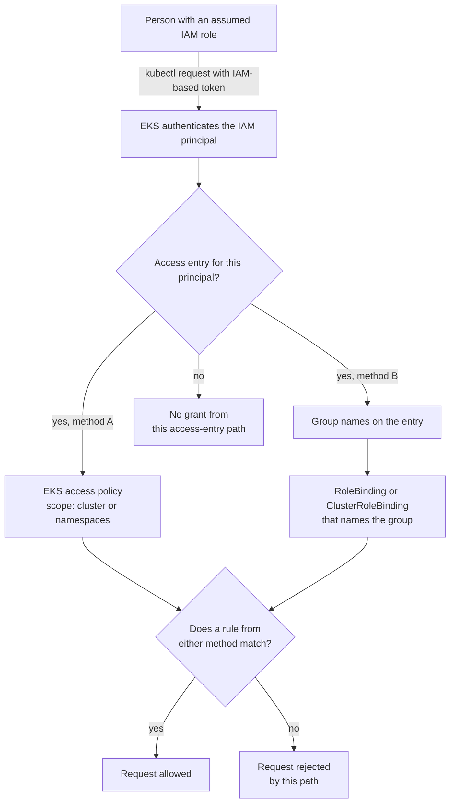

# EKS human identity and Kubernetes RBAC

## Purpose

Use this page to understand how a person reaches the Kubernetes API of an
Amazon Elastic Kubernetes Service (Amazon EKS) cluster, and which settings
decide what that person may do there. It is a conceptual explanation. For the
procedures, follow the official how-to pages linked in
[Official documentation for deeper study](#official-documentation-for-deeper-study).

Terms used on this page:

| Term | Meaning |
| --- | --- |
| AWS IAM | AWS Identity and Access Management, which defines AWS identities and their permissions for AWS APIs. |
| IAM principal | An IAM role or IAM user. People usually reach AWS through a role, often by federation. |
| ARN | Amazon Resource Name, the unique identifier of an AWS resource such as an IAM role. |
| Kubernetes API | The cluster endpoint that `kubectl` talks to. It is a different API from the AWS APIs. |
| Access entry | An EKS record that links one IAM principal to Kubernetes permissions on one cluster. |
| EKS access policy | An AWS-maintained set of **Kubernetes** permissions that can be attached to an access entry. |
| RBAC | Kubernetes role-based access control: Roles and ClusterRoles list allowed actions, and RoleBindings and ClusterRoleBindings give them to users, groups, or service accounts. |
| OIDC | OpenID Connect, an identity layer used by some external sign-in providers. See [OIDC fundamentals](oidc-fundamentals.md). |

## Simple definition

On EKS, a person first proves an **IAM identity** to the cluster. An **access
entry** then connects that identity to Kubernetes permissions in one of two
ways: an **EKS access policy** that EKS evaluates, or one or more
**Kubernetes group names** that Kubernetes RBAC bindings refer to. An entry
can use either method or both.[^aws-eks-access-entries]

## Why it matters

Three different identity problems sit close together on EKS, and mixing them
up produces both lockouts and over-broad access:

| Question | Where it is answered | Covered on |
| --- | --- | --- |
| May this person use AWS APIs and the AWS console? | IAM permissions of the person's IAM role. | [IAM OIDC provider and STS web identity](../../cloud/aws/security/iam-oidc-provider-and-sts-web-identity.md) for federation basics. |
| May this person read or change objects through the Kubernetes API? | The cluster's access entries, EKS access policies, and Kubernetes RBAC. | This page. |
| May a Pod call AWS APIs? | IAM roles for service accounts (IRSA) or EKS Pod Identity. | [EKS workload identity](../../cross-topic-guides/eks-workload-identity.md). |

An EKS access policy can authorize Kubernetes requests without any RBAC
object in the cluster, so a review that inspects only RoleBindings can
miss real access.[^aws-eks-creating-access-entries]

## The mental model: one identity, two ways to be allowed

| Part | What it does |
| --- | --- |
| IAM principal | The identity the person authenticates as, usually an assumed IAM role. The AWS IAM Authenticator for Kubernetes on the EKS control plane lets IAM principals authenticate to the cluster.[^aws-eks-grant-k8s-access] |
| Cluster authentication mode | Decides whether the cluster reads access entries, the older `aws-auth` ConfigMap, or both. Once access entries are enabled, they cannot be disabled.[^aws-eks-grant-k8s-access] |
| Access entry | Contains the ARN of exactly one existing IAM principal, and a principal can be in only one entry per cluster. A `STANDARD` entry can also hold a Kubernetes username and group names.[^aws-eks-creating-access-entries] |
| EKS access policy, with a scope | A fixed, AWS-maintained set of Kubernetes allow rules, such as `AmazonEKSViewPolicy`. It is scoped to the whole cluster or to named namespaces. You cannot edit these policies or create your own.[^aws-eks-access-policy-permissions][^aws-eks-access-policies] |
| Kubernetes group on the entry | A group name the principal will carry into the cluster. It grants nothing by itself. |
| Role or ClusterRole | Kubernetes object that lists allowed verbs on resources. A Role always belongs to one namespace.[^k8s-rbac] |
| RoleBinding or ClusterRoleBinding | Gives a Role or ClusterRole to subjects such as a group. A RoleBinding can reference a ClusterRole and still grant it only inside the binding's namespace.[^k8s-rbac] |

Four facts make the model accurate:

1. **Access policies are Kubernetes permissions, not IAM permissions.** They
   decide what the principal may do to Kubernetes objects. They do not let
   anyone call an AWS API.[^aws-eks-access-policies]
2. **The two methods add up.** If an entry has both an access policy and group
   names, the principal has every permission in the associated access policies
   plus every permission from RBAC bindings that name those groups. Associating
   several access policies also adds them together.[^aws-eks-access-policies]
3. **There are no deny rules to subtract access.** Access policies and RBAC
   objects contain only allow rules, so one method cannot take away what the
   other grants.[^aws-eks-access-policy-permissions][^k8s-rbac] When
   several Kubernetes authorizers are configured, the first one that approves
   or denies decides, and if none has an opinion the request is
   rejected.[^k8s-authorization]
4. **A group name is only a label until a binding uses it.** EKS does not check
   that any RBAC object mentions the group you put on an access entry. A
   misspelled or missing binding is accepted silently and grants
   nothing.[^aws-eks-creating-access-entries]

Text alternative: a person sends a `kubectl` request using an IAM-based
token. EKS authenticates the IAM principal and looks for its access entry. If
there is no entry, this access-entry path grants nothing. If there is an entry, it
can grant permissions through method A, an EKS access policy with a cluster or
namespace scope, and through method B, group names that Kubernetes RBAC
bindings refer to. The request is allowed when a rule from either method
matches; this path rejects it when neither does. The diagram shows the
standard access-entry path. Older clusters may also have `aws-auth` mappings
or cluster-creator access, which must be reviewed separately. Use the
diagram to decide which two places to inspect when someone has too little
or too much access through an access entry.[^aws-eks-grant-k8s-access]

## An analogy: a shared workshop

Think of the cluster as a shared workshop.

- Showing your staff badge at the entrance is **authentication**: the
  workshop learns which employee you are.
- The **register at the desk** lists employees who may come in at all. That is
  the access entry.
- The workshop manager keeps a few **standard key rings**, such as "look but do
  not touch" and "full access". The desk can hand you one for the whole
  building or for named rooms. Those are EKS access policies with a scope.
- A team can also keep its **own key cabinet** and write on it which team
  names may open it. The register can list your team names. That is RBAC with
  group names.

Where the analogy breaks, and what is true instead:

- **Your staff badge also opens the office.** In the workshop, your badge
  might let you into the office next door too. On AWS, IAM permissions for the
  console and AWS APIs are separate from Kubernetes permissions. A person can
  hold one and not the other.[^aws-eks-grant-k8s-access]
- **You cannot make new standard key rings.** You choose from the AWS-maintained
  access policies as they are. When none fits, you use RBAC
  instead.[^aws-eks-access-policy-permissions]
- **The register does not check that a cabinet exists.** A group name on an
  access entry is accepted even when no binding uses it, and then it grants
  nothing.[^aws-eks-creating-access-entries]
- **Keys only open; nothing locks you out.** There is no "anti-key". Access
  from both sources adds up.[^aws-eks-access-policies][^k8s-rbac]
- **A new badge with the same name is a different person.** If an IAM
  principal is deleted and re-created with the same ARN, the old access entry
  does not work for it, because EKS stored the original principal's internal
  ID.[^aws-eks-creating-access-entries]

## Follow an invented example

This example is illustrative. The cluster, account, role, namespace, and
person are invented, and nothing was created or run.

Sam is a developer on the payments team. The cluster is `platform-prod` and
the team's workloads run in the `payments` namespace. This invented cluster
has no legacy `aws-auth` mapping for Sam. Sam signs in through the company's
identity provider and assumes the IAM role `payments-developer`.

1. **AWS access, no Kubernetes access.** The `payments-developer` role has IAM
   permissions to see the cluster in the Amazon EKS console. The cluster has no
   access entry for this role. Sam can see that the cluster exists but cannot
   list Pods: IAM permissions do not grant Kubernetes
   permissions.[^aws-eks-grant-k8s-access]
2. **Registered, still nothing allowed.** An administrator creates a
   `STANDARD` access entry for the role, with no access policy and no group
   names. Sam can now authenticate, but no rule allows reading Pods, so the
   request is rejected.
3. **Route A: an access policy.** The administrator associates
   `AmazonEKSViewPolicy` with a namespace scope of `payments`. Sam can now
   `get`, `list`, and `watch` Pods in `payments`, but not in other namespaces.
   That policy's published rules do not include
   Secrets.[^aws-eks-access-policies][^aws-eks-access-policy-permissions]
4. **Route B instead: a group and RBAC.** Suppose the administrator had added
   the group name `payments-viewers` to the entry, and the payments team had
   created a RoleBinding in `payments` like this:

   | RoleBinding field | Value | Effect |
   | --- | --- | --- |
   | Namespace | `payments` | The grant applies only inside this namespace. |
   | Subject | Group `payments-viewers` | Anyone whose request carries that group gets the grant. |
   | Role reference | ClusterRole `view` | The built-in read-only role. It does not allow viewing Secrets, roles, or role bindings.[^k8s-rbac] |

   Sam would get a similar result through Kubernetes objects rather than an EKS
   setting.
5. **Both at once.** If the entry had both, Sam's permissions would be the
   union of the two. Removing only the RoleBinding would leave the access
   policy's permissions in place.[^aws-eks-access-policies]

The example ends with Sam able to read Pods in one namespace, and with a
reviewer who knows that the answer to "what can Sam do?" lives in two places:
the access entry's policy associations and the RBAC bindings for its group
names.

## Checking access: the limits of `kubectl auth can-i`

`kubectl auth can-i` asks the cluster's authorization layer whether the
current identity may perform an action.[^k8s-rbac] With EKS access
policies, AWS documents two important limits:[^aws-eks-access-policies]

- **`kubectl auth can-i --list` does not show permissions from access
  policies.** It shows only permissions granted through Roles or ClusterRoles
  bound to the entry's username or group names. An empty or short list does
  not prove that the person has little access.
- **Impersonation forces RBAC only.** Using `--as` or `--as-group`, including
  with `kubectl auth can-i`, makes the request use Kubernetes RBAC
  authorization, so access policy permissions do not apply. Asking "what can
  this group do?" by impersonation therefore answers only the RBAC half.

The AWS page does not describe other forms of the check. Treat any
`kubectl auth can-i` answer as one signal, and review the access entry's
associated access policies alongside the RBAC bindings for its groups.

## External OIDC sign-in for people

EKS can also authenticate people through your own OIDC identity provider, in
addition to IAM. This is optional, and IAM authentication cannot be
turned off.[^aws-eks-grant-k8s-access] Keep its limits in view:

- OIDC-authenticated users receive Kubernetes permissions through Roles,
  ClusterRoles, and bindings. Access entries hold IAM principal ARNs, so EKS
  access policies are not the route for these users.[^aws-eks-external-oidc][^aws-eks-creating-access-entries]
- The EKS external OIDC association itself grants no AWS IAM permissions or
  AWS console session. Those require a separate AWS identity and access
  path.[^aws-eks-grant-k8s-access][^aws-eks-external-oidc]
- The provider's issuer URL must be publicly reachable so that EKS can find
  its signing keys; self-signed certificates are not
  supported.[^aws-eks-external-oidc]

This is a different direction from workload identity. Here the cluster
**trusts an external issuer** about people. With IRSA, the cluster itself acts
as the issuer and AWS IAM trusts it about service accounts. Do not reuse
settings or reasoning between the two.

## Common misconceptions

- **"Kubernetes RBAC is always the second gate."** On current EKS, an EKS
  access policy can authorize requests with no RBAC object at all.
- **"An EKS access policy is an IAM policy."** It grants Kubernetes
  permissions only.[^aws-eks-access-policies]
- **"Console access means cluster access."** IAM permissions and Kubernetes
  permissions are granted separately.[^aws-eks-grant-k8s-access]
- **"Adding a group to the access entry grants access."** Only a binding that
  names the group grants anything.[^aws-eks-creating-access-entries]
- **"A short `kubectl auth can-i --list` result means limited access."** It
  omits access-policy permissions.[^aws-eks-access-policies]

## Design and review habits

- Prefer IAM roles with short-term credentials over IAM users as access-entry
  principals, as AWS recommends.[^aws-eks-creating-access-entries]
- Give access to groups and namespaces rather than to individuals and the
  whole cluster. Keep cluster-wide administrator access rare.
- Record which method each access entry uses, so a review checks both.
- Remember that permission to create Pods in a namespace is powerful: Pods can
  run as any service account there, and inherit its access. See [EKS workload
  identity](../../cross-topic-guides/eks-workload-identity.md).

## Troubleshoot at the right boundary

| Symptom | First question |
| --- | --- |
| `kubectl` cannot authenticate. | Is the person using the intended IAM role, and does the cluster have an access entry for it under an authentication mode that reads access entries? |
| Authenticated, but everything is forbidden. | Does the entry have an access policy in scope for this namespace, or group names with a matching binding? |
| Access is broader than expected. | Is there a cluster-scoped access policy, a ClusterRoleBinding, or a second access policy on the entry? |
| Group-based access does not work. | Does the group name on the entry exactly match the subject in a binding? |
| A re-created role lost access. | Was the IAM principal deleted and re-created, which requires a new access entry?[^aws-eks-creating-access-entries] |

Do not widen a scope or attach a cluster-wide policy only to clear an error.
Confirm which person and which namespace actually need the access.

## Check your understanding

1. Sam can open the EKS console but cannot list Pods. Which two settings
   would you look at first?
2. Name the two ways an access entry can grant Kubernetes permissions, and
   explain why they cannot cancel each other.
3. Why can `kubectl auth can-i --list` understate what a person may do?
4. What does an EKS access policy let someone do with an AWS API such as
   Amazon S3?

## Next steps

- Understand how Pods, not people, get AWS permissions in [EKS workload
  identity](../../cross-topic-guides/eks-workload-identity.md).
- Review the claims and checks behind external sign-in in [OIDC
  fundamentals](oidc-fundamentals.md) and [OIDC token
  validation](oidc-token-validation.md).
- See the day-to-day command context in [EKS
  operations](../../cross-topic-guides/eks-operations.md).

## Official documentation for deeper study

- How EKS authenticates IAM principals, authentication modes, and the
  optional OIDC method: [Grant IAM users and roles access to Kubernetes
  APIs](https://docs.aws.amazon.com/eks/latest/userguide/grant-k8s-access.html).
- Overview of access entries and the two ways to attach permissions: [EKS
  access entries](https://docs.aws.amazon.com/eks/latest/userguide/access-entries.html).
- Procedure to create an entry, and its username, group, and type rules:
  [Create access entries](https://docs.aws.amazon.com/eks/latest/userguide/creating-access-entries.html).
- Procedure to associate and scope a policy, and the `kubectl auth can-i`
  limits: [Associate access policies with access
  entries](https://docs.aws.amazon.com/eks/latest/userguide/access-policies.html).
- The exact Kubernetes rules inside each policy: [Review access policy
  permissions](https://docs.aws.amazon.com/eks/latest/userguide/access-policy-permissions.html).
- People from your own identity provider: [Grant users access to Kubernetes
  with an external OIDC provider](https://docs.aws.amazon.com/eks/latest/userguide/authenticate-oidc-identity-provider.html).
- Roles, bindings, and default roles: [Kubernetes RBAC
  authorization](https://kubernetes.io/docs/reference/access-authn-authz/rbac/).
- How multiple authorizers combine: [Kubernetes
  authorization](https://kubernetes.io/docs/reference/access-authn-authz/authorization/).

## Related links

- [OIDC fundamentals](oidc-fundamentals.md)
- [OIDC token validation](oidc-token-validation.md)
- [EKS workload identity](../../cross-topic-guides/eks-workload-identity.md)
- [Back to identity federation](index.md)
- [Back to security index](../index.md)
- [Back to knowledge index](../../index.md)

[^aws-eks-grant-k8s-access]: [Amazon EKS User Guide - Grant IAM users and roles access to Kubernetes APIs](https://docs.aws.amazon.com/eks/latest/userguide/grant-k8s-access.html), source record `aws-eks-grant-k8s-access`.
[^aws-eks-access-entries]: [Amazon EKS User Guide - Grant IAM users access to Kubernetes with EKS access entries](https://docs.aws.amazon.com/eks/latest/userguide/access-entries.html), source record `aws-eks-access-entries`.
[^aws-eks-creating-access-entries]: [Amazon EKS User Guide - Create access entries](https://docs.aws.amazon.com/eks/latest/userguide/creating-access-entries.html), source record `aws-eks-creating-access-entries`.
[^aws-eks-access-policies]: [Amazon EKS User Guide - Associate access policies with access entries](https://docs.aws.amazon.com/eks/latest/userguide/access-policies.html), source record `aws-eks-access-policies`.
[^aws-eks-access-policy-permissions]: [Amazon EKS User Guide - Review access policy permissions](https://docs.aws.amazon.com/eks/latest/userguide/access-policy-permissions.html), source record `aws-eks-access-policy-permissions`.
[^aws-eks-external-oidc]: [Amazon EKS User Guide - Grant users access to Kubernetes with an external OIDC provider](https://docs.aws.amazon.com/eks/latest/userguide/authenticate-oidc-identity-provider.html), source record `aws-eks-external-oidc`.
[^k8s-rbac]: [Kubernetes Documentation - Using RBAC Authorization](https://kubernetes.io/docs/reference/access-authn-authz/rbac/), source record `k8s-rbac`.
[^k8s-authorization]: [Kubernetes Documentation - Authorization](https://kubernetes.io/docs/reference/access-authn-authz/authorization/), source record `k8s-authorization`.
