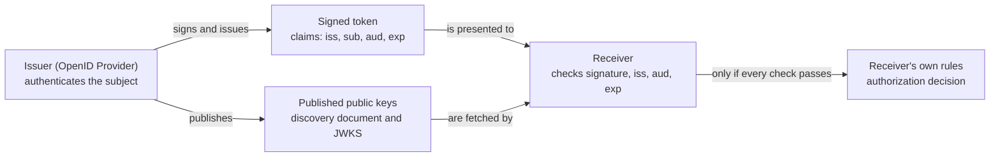

# OIDC fundamentals

## Purpose

Use this page to understand what OpenID Connect (OIDC) is, what an ID token
says, and how to read its claims, before you apply OIDC to AWS, EKS, or GitHub
Actions.

> [!IMPORTANT]
> This page is a conceptual introduction to a security-sensitive subject. It
> is not an implementation or validation procedure. When you write code or
> policy that accepts tokens, follow [OIDC token validation](oidc-token-validation.md)
> and the official specifications and provider documentation linked below.

The page keeps two uses apart, because mixing them causes real mistakes:

- **OIDC sign-in**, as defined by the OpenID Connect Core specification. The
  common case, and the one used as the example here, is a person signing in
  through a browser so that an application learns who they are. Core defines
  more than one flow, and real deployments vary; this page does not describe
  them all.[^openid-connect-core]
- **OIDC-compatible workload federation**: an automated job, with no person
  and no browser, presents a signed token to a cloud provider to obtain
  short-lived credentials. This reuses OIDC's token format and trust model but
  is defined by each provider's own documentation.

## What OIDC is

OpenID Connect is an identity layer on top of the OAuth 2.0 protocol. It lets
an application confirm who an end user is, based on authentication performed
by a separate identity provider, without the application handling the user's
password.[^openid-connect-core]

The provider reports the result in an **ID token**: a signed statement that
says who authenticated, who issued the statement, who it is intended for, and
when it expires.

## Why it matters

Applications and automated jobs both need some way to establish identity. Two
long-standing approaches are for each application to keep its own user
passwords, and for automated jobs to carry long-lived secret keys. Credentials
like these tend to be copied into many places and are hard to rotate.

OIDC is one standard way to avoid them; it is not the only one. With OIDC, an
application can rely on a provider's signed statements instead of holding
passwords. The same trust model lets a CI job obtain short-lived cloud
credentials instead of storing a long-lived cloud secret.[^github-actions-oidc]
The benefit holds only if the receiver checks each token strictly, which is why
the vocabulary below matters.

## Authentication is not authorization

**Authentication** answers "who is this?" **Authorization** answers "what may
they do?"

OIDC provides authentication. An ID token tells the receiver who the subject
is. Deciding what that subject may do remains the receiver's job, using its
own rules: an application's roles, an AWS IAM role's permissions, or
Kubernetes RBAC. A valid token is a reason to believe an identity, never by
itself a reason to grant access.

## Vocabulary

| Term | Simple definition |
| --- | --- |
| OpenID Provider (OP) | The service that authenticates the end user and issues tokens about that event.[^openid-connect-core] Often called the identity provider. |
| Relying Party (RP) | The application that asks for authentication and relies on the provider's answer.[^openid-connect-core] |
| End user | The person being authenticated. |
| ID token | A signed JSON Web Token (JWT) containing claims about an authentication event.[^openid-connect-core] |
| Claim | One piece of information asserted about a subject, such as an identifier.[^openid-connect-core] |
| Access token | A different token, used to call a protected API. In OIDC it is what a client presents to the provider's UserInfo endpoint.[^openid-connect-core] |

The claims you must be able to read:

| Claim | Meaning | What the receiver does with it |
| --- | --- | --- |
| `iss` (issuer) | Identifier of whoever issued the token, as an `https` URL.[^openid-connect-discovery] | Must exactly match the issuer the receiver expects. |
| `sub` (subject) | Identifier of the subject, unique within the issuer and never reassigned.[^openid-connect-core] | Identifies who the token is about. Meaningful only together with `iss`. |
| `aud` (audience) | Who the token is intended for. In OIDC sign-in it must contain the relying party's client identifier.[^openid-connect-core] | Must include the receiver. A token meant for someone else is rejected. |
| `exp` (expiry) | The time on or after which the token must not be accepted.[^openid-connect-core] | Reject expired tokens. |
| `iat` (issued at) | When the token was issued.[^openid-connect-core] | Helps judge the token's age. |

Two supporting pieces make the signature checkable:

- **Discovery.** A provider that supports OIDC Discovery publishes a JSON
  document at the issuer URL followed by `/.well-known/openid-configuration`.
  The `issuer` value in that document must be identical to the issuer URL and
  to the `iss` claim in the provider's ID tokens.[^openid-connect-discovery]
- **JWKS.** The discovery document's `jwks_uri` points to the provider's JSON
  Web Key Set: the public keys a receiver uses to verify the provider's
  signatures.[^openid-connect-discovery]

## The mental model: a signed statement, checked by the receiver

Text alternative: the issuer authenticates the subject, then signs and issues
a token containing the claims `iss`, `sub`, `aud`, and `exp`. The issuer also
publishes its public keys through its discovery document and JWKS. The token
is presented to a receiver, which fetches the published keys and checks the
signature, issuer, audience, and expiry. Only if every check passes does the
receiver move on to its own rules to make an authorization decision. The
issuer takes no part in that last step.

This shape is common to both uses of OIDC on this page. What changes is who
the subject is, who the receiver is, and what the receiver hands back.

## Two uses, kept apart

| Question | OIDC sign-in (OpenID Connect Core) | OIDC-compatible workload federation |
| --- | --- | --- |
| Who is the subject? | A person, the end user. | A workload, such as one CI job. |
| Is a browser involved? | In the common case shown on this page, yes: the person is sent to the provider to sign in. | No. |
| Who issues the token? | The OpenID Provider the application is registered with. | The platform running the workload, acting as an OIDC provider. |
| Who receives and checks it? | The relying party application. | A cloud provider's token service. |
| What does `aud` name? | The application's client identifier. | The value the cloud provider's trust configuration expects. |
| What comes back? | A signed-in session in the application. | Short-lived cloud credentials for the job. |
| Where is it specified? | OpenID Connect Core. | The platform's and the cloud provider's documentation. |

OpenID Connect Core describes end-user authentication flows. Workload
federation borrows the signed JWT, the standard claims, and the discovery and
JWKS mechanism. Do not assume that a rule stated for one use holds for the
other; read the documentation for the specific pair of platforms.

## Example 1: a person signs in to an internal application

This is a conceptual example of the common browser-based case. The names and
values are invented placeholders, and no real token is shown.

Dana opens an internal application called Team Wiki. Team Wiki is a relying
party registered with the company's OpenID Provider.

1. Team Wiki sends Dana's browser to the provider.
2. Dana signs in there. Team Wiki never sees the password.
3. The provider returns an ID token to Team Wiki through the flow.
4. Team Wiki validates the token and reads these claims:

| Claim | Illustrative value | What Team Wiki concludes |
| --- | --- | --- |
| `iss` | `https://login.example.com` | Issued by the provider Team Wiki trusts. |
| `sub` | `user-8f3a` | The subject is the account with this identifier at that provider. |
| `aud` | `team-wiki` | The token was issued for Team Wiki. |
| `exp` | ten minutes after issue | Still within its lifetime. |

Team Wiki now knows who Dana is. Whether Dana may edit a page is decided by
Team Wiki's own permission rules, not by the token.

If Team Wiki also needs to call an API, it uses an access token for that. It
does not forward the ID token, whose audience is Team Wiki itself.

## Example 2: a CI job obtains cloud credentials

This example is also conceptual, with placeholder names. It follows the flow
that GitHub and AWS document for GitHub Actions. Other platforms differ.

A workflow in the repository `octo-org/octo-repo` needs to deploy to AWS
without a stored AWS secret.

1. **Trust is configured in advance.** In AWS, GitHub's token issuer is
   registered as an identity provider, and an IAM role's trust policy names
   that provider.[^github-actions-oidc-aws][^aws-sts-assume-role-with-web-identity]
2. **The job requests a token.** GitHub's OIDC provider issues a JWT that is
   unique to that workflow job.[^github-actions-oidc]
3. **The job presents the token to AWS.** It calls the AWS Security Token
   Service operation `AssumeRoleWithWebIdentity`. The call is not signed with
   AWS credentials; the token is what identifies the
   caller.[^aws-sts-assume-role-with-web-identity]
4. **AWS checks the token against the role's trust policy** and, if it is
   accepted, returns temporary credentials: an access key ID, a secret access
   key, and a session token, lasting one hour by
   default.[^aws-sts-assume-role-with-web-identity]

| Claim | Illustrative value | Role in the trust decision |
| --- | --- | --- |
| `iss` | `https://token.actions.githubusercontent.com` | Must be the provider registered in AWS.[^github-actions-oidc-aws] |
| `aud` | `sts.amazonaws.com` | The audience GitHub's documentation gives for the official AWS credentials action.[^github-actions-oidc-aws] |
| `sub` | `repo:octo-org/octo-repo:ref:refs/heads/main` | Says which repository and branch the job ran from. |

What to notice:

- **The trust decision has several parts, and `sub` is the one that names
  your workload.** The role's trust policy should require the trusted issuer,
  the expected audience, and a subject condition together. The issuer is the
  same for every repository that uses the platform, so issuer and audience
  alone do not single out your repository. GitHub's documentation relays AWS
  IAM's recommendation to evaluate the `sub` condition key in the trust policy
  of any role that trusts GitHub's provider, because doing so limits which
  workflows can assume the role.[^github-actions-oidc-aws] No single condition
  is the whole boundary.
- **Assuming the role and using it are separate controls.** The trust policy
  decides who may assume the role. The role's IAM permissions decide which
  operations the resulting credentials allow. Both need to be narrow.
- **What comes back is not an OIDC token.** The temporary credentials are AWS
  credentials.[^aws-sts-assume-role-with-web-identity]
- **There is no end user.** No person signs in and no browser is involved,
  which is why OpenID Connect Core's sign-in flows do not describe this case.

For the AWS and GitHub specifics, see [IAM OIDC provider and STS web
identity](../../cloud/aws/security/iam-oidc-provider-and-sts-web-identity.md)
and [AWS OIDC federation for GitHub
Actions](../../git/github-actions/aws-oidc-federation.md).

## An analogy: a conference badge

Think of an ID token as a conference badge:

- The **registration desk** (issuer) checks who you are and prints the badge.
- The badge states **who you are** (`sub`), **which desk issued it** (`iss`),
  **which event it is for** (`aud`), and **when it stops being valid** (`exp`).
- **Door staff** (the receiver) check the badge's stamp against the stamp they
  were told to trust, and check the event and the date.
- The badge says who you are. The **list at each door** decides where you may
  go.

Where the analogy stops being accurate:

- **Anyone can read a signed token.** ID tokens must be signed, and encryption
  is optional.[^openid-connect-core] Unless a token is also encrypted, its
  payload is encoded, not hidden. The signature prevents tampering; it does
  not keep the contents secret.
  Tokens must not be logged, pasted into tickets, or shared.
- **A genuine badge for another event must be refused.** A token with a valid
  signature but the wrong audience was not issued for this receiver and must
  be rejected.
- **A copied token works until it expires.** Whoever holds a bearer token can
  present it. Short lifetimes limit the damage; they do not remove the risk.
- **The stamp changes.** A provider can rotate its signing keys by publishing
  new keys in its JWK Set, which is why a receiver looks up the current keys
  there instead of fixing one key forever.[^openid-connect-core]
- **A badge is not a room key.** An ID token's audience is the relying party
  it names, and the specification has clients use an access token, not the ID
  token, to call the UserInfo endpoint.[^openid-connect-core] From that, this
  page concludes that an ID token should not be sent to other APIs as a
  credential. The conclusion is this page's reasoning, not a quoted rule.

## Common misconceptions

- **"The token decoded, so it is valid."** Decoding proves nothing. Trust
  begins only after the signature, issuer, audience, and expiry checks pass.
- **"OIDC handles permissions."** It establishes identity. Permissions come
  from the receiver's own policy.
- **"An ID token can be sent to any API as a bearer token."** Its audience is
  the relying party. APIs are called with access tokens issued for them.
- **"Trusting the issuer is enough for CI federation."** The issuer is shared
  by every repository on the platform. The trust policy needs the issuer, the
  audience, and a subject condition together, and the role's permissions
  should still be limited to what the job needs.
- **"Workload federation is OIDC sign-in without the browser."** It reuses the
  token and key mechanisms, but its rules come from the platforms involved.

## Check your understanding

- Which claim tells a receiver that a token was intended for it, and what
  should the receiver do when that claim names someone else?
- Why does a valid ID token not tell Team Wiki whether Dana may edit a page?
- In the CI example, what could go wrong if the role's trust policy did not
  restrict the `sub` claim?
- What does AWS return after accepting the job's token, and why is that not an
  OIDC token?

## Next steps

- Learn the checks a receiver must perform in [OIDC token
  validation](oidc-token-validation.md).
- See how AWS trusts external issuers in [IAM OIDC provider and STS web
  identity](../../cloud/aws/security/iam-oidc-provider-and-sts-web-identity.md).
- Apply federation to pipelines in [AWS OIDC federation for GitHub
  Actions](../../git/github-actions/aws-oidc-federation.md).
- Separate human and workload access on EKS in [EKS human identity and
  Kubernetes RBAC](eks-human-identity-and-rbac.md) and [EKS workload
  identity](../../cross-topic-guides/eks-workload-identity.md).

## Official documentation for deeper study

- Actors, ID token claims, and ID token validation rules: [OpenID Connect Core 1.0](https://openid.net/specs/openid-connect-core-1_0.html).
- The discovery document, `issuer`, and `jwks_uri`: [OpenID Connect Discovery 1.0](https://openid.net/specs/openid-connect-discovery-1_0.html).
- How GitHub Actions issues tokens to jobs: [GitHub Docs - OpenID Connect](https://docs.github.com/en/actions/concepts/security/openid-connect).
- Provider, audience, and subject conditions for AWS: [GitHub Docs - Configuring OpenID Connect in Amazon Web Services](https://docs.github.com/en/actions/how-tos/secure-your-work/security-harden-deployments/oidc-in-aws).
- What AWS accepts and returns: [AWS STS - AssumeRoleWithWebIdentity](https://docs.aws.amazon.com/STS/latest/APIReference/API_AssumeRoleWithWebIdentity.html).
- All OpenID specifications: [OpenID specifications](https://openid.net/developers/specs/).

## Related links

- [OIDC token validation](oidc-token-validation.md)
- [EKS human identity and Kubernetes RBAC](eks-human-identity-and-rbac.md)
- [IAM OIDC provider and STS web identity](../../cloud/aws/security/iam-oidc-provider-and-sts-web-identity.md)
- [EKS workload identity](../../cross-topic-guides/eks-workload-identity.md)
- [AWS OIDC federation for GitHub Actions](../../git/github-actions/aws-oidc-federation.md)
- [OpenID Connect specification](https://openid.net/developers/specs/)
- [Back to identity federation](index.md)
- [Back to security index](../index.md)
- [Back to root index](../../../README.md)

[^openid-connect-core]: [OpenID Connect Core 1.0](https://openid.net/specs/openid-connect-core-1_0.html), source record `openid-connect-core`.
[^openid-connect-discovery]: [OpenID Connect Discovery 1.0](https://openid.net/specs/openid-connect-discovery-1_0.html), source record `openid-connect-discovery`.
[^github-actions-oidc]: [GitHub Docs - OpenID Connect](https://docs.github.com/en/actions/concepts/security/openid-connect), source record `github-actions-oidc`.
[^github-actions-oidc-aws]: [GitHub Docs - Configuring OpenID Connect in Amazon Web Services](https://docs.github.com/en/actions/how-tos/secure-your-work/security-harden-deployments/oidc-in-aws), source record `github-actions-oidc-aws`.
[^aws-sts-assume-role-with-web-identity]: [AWS STS API Reference - AssumeRoleWithWebIdentity](https://docs.aws.amazon.com/STS/latest/APIReference/API_AssumeRoleWithWebIdentity.html), source record `aws-sts-assume-role-with-web-identity`.
