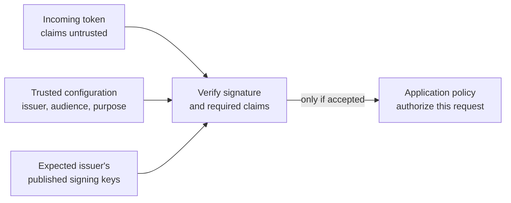

# OIDC token validation

## The question this page answers

The common signed form of a JSON Web Token (JWT) has three encoded parts
separated by dots; encrypted forms differ. Decoding a signed token's
payload can reveal claims such as an identity, expiry, and intended
audience. Anyone can write text that decodes into those claims. **Validation**
is the receiver's process of deciding whether the token really came from
the expected issuer, is meant for this receiver and purpose, is still
usable, and satisfies the rules for the current request. This page explains
the model; use a maintained library and the chosen provider's exact
instructions for an implementation.[^jwt-best-practices]

Read [OIDC fundamentals](oidc-fundamentals.md) first if `iss`, `aud`,
`sub`, and `exp` are unfamiliar.

## Establish trust before reading claims as facts

The application starts with configuration it trusts: the expected issuer,
its own client or resource identifier, an allowed signing algorithm, and
the kind of token it accepts. OpenID Connect Discovery can locate the
issuer's public signing keys through `jwks_uri`. The metadata's `issuer`
must match the expected issuer and the token's `iss` claim. A token's own
unverified `iss`, key ID (`kid`), or key URL is **not** permission to trust
a new issuer or fetch arbitrary keys.[^openid-discovery][^jwt-best-practices]

Text alternative: the receiver has an incoming, untrusted token and a
separately configured issuer, audience, and token purpose. It obtains keys
for that expected issuer. It verifies the signature and required claims.
Only an accepted token reaches the application's separate decision about
what the identified subject may do.

Think of a token as a signed letter. Reading its return address is easy;
proving it came from the expected sender requires checking the signature
against that sender's known keys. A letter addressed to another recipient
must also be rejected. This analogy has limits: JWTs are bearer tokens
that can be copied, signing keys rotate, and a valid signature does not
grant a permission in the application.

## Checks depend on the token's purpose

For an **OIDC ID token**, the receiver is the relying-party application.
The OpenID Connect Core validation rules include the expected issuer,
signature, `aud` containing that application's client ID, and an `exp`
value later than the current time. Other rules apply to the actual flow:
for example, when the authorization request sent a `nonce`, the returned
ID token must contain the matching value. Multiple audiences and an
`azp` claim need the Core specification's additional checks. These are
flow-dependent checks, not a universal four-line JWT recipe.[^openid-core]

An **OAuth access token** is for a protected resource such as an API, not
for signing a person into the relying party. Its format is not universally
a JWT. If the provider issues **RFC 9068 profile JWT access tokens**, the
resource server checks the `at+jwt` type, issuer, its own audience,
signature, and expiry under that profile. An opaque access token can
instead be checked through the authorization server's supported token
introspection endpoint. A receiver must use the contract of its provider
and token type; it must not apply ID-token rules to an arbitrary access
token or treat an ID token as an API access token.[^jwt-access-token-profile][^oauth-token-introspection]

| Check | What it rules out |
| --- | --- |
| Expected issuer and issuer-bound signing keys | A token from an unrelated provider, or an attacker-selected key. |
| Permitted algorithm and valid signature | A modified or incorrectly signed token, including algorithm confusion.[^jwt-best-practices] |
| Audience and token purpose | A genuine token issued to a different application or for a different use. |
| Expiry and other applicable time/flow claims | A token outside its allowed lifetime or an ID token detached from its login request. |
| Local authorization | An authenticated subject doing something the application has not allowed. |

When keys rotate, a previously unseen `kid` can prompt a controlled refresh
of the expected issuer's keys. If verification cannot be completed, reject
the token. Do not disable signature, audience, or issuer checks to keep a
request working. Key refresh and caching behavior belong in the chosen
library/provider integration, not in a copy-pasted universal algorithm.

## An invented two-token example

Suppose Team Wiki expects ID tokens from `https://login.example.com` for
client `team-wiki`. An attacker sends a JWT whose decoded claims say
`iss: https://login.example.com`, `aud: team-wiki`, and `sub: editor-7`,
but it is signed with the attacker's key. The text looks right; signature
verification against **Team Wiki's configured issuer keys** fails. Team
Wiki rejects it before mapping `editor-7` to any account.

Now suppose a genuine token from the expected issuer is signed correctly
but says `aud: payroll-app`. Team Wiki rejects that token too: its issuer
is real, but the token was issued for another client. If a genuine,
correctly addressed ID token is accepted, Team Wiki still uses its own
permissions to decide whether the subject may edit an article. These
names and claims are illustrative; no token or application was tested.

## Check your understanding

1. Why does decoding a JWT not establish the identity in its `sub` claim?
2. Why can a correctly signed token still be rejected by an application?
3. Why must an API know whether it accepts RFC 9068 JWT access tokens,
   opaque access tokens, or a different provider-specific format?

## Official documentation and next steps

- [OpenID Connect Core](https://openid.net/specs/openid-connect-core-1_0.html)
  gives ID-token validation rules for each supported flow.
- [OpenID Connect Discovery](https://openid.net/specs/openid-connect-discovery-1_0.html)
  defines issuer metadata and the key-set location.
- [RFC 8725](https://www.rfc-editor.org/rfc/rfc8725.html) explains JWT
  validation pitfalls and mutually exclusive token-use rules.
- [RFC 9068](https://www.rfc-editor.org/rfc/rfc9068.html) specifies one JWT
  access-token profile, while [RFC 7662](https://www.rfc-editor.org/rfc/rfc7662.html)
  specifies token introspection.
- [IAM OIDC provider and STS web identity](../../cloud/aws/security/iam-oidc-provider-and-sts-web-identity.md)
  shows how AWS performs a provider-specific federation decision.

[Back to identity federation](index.md) | [Back to security index](../index.md)

[^openid-core]: [OpenID Connect Core 1.0](https://openid.net/specs/openid-connect-core-1_0.html), source record `openid-core`.
[^openid-discovery]: [OpenID Connect Discovery 1.0](https://openid.net/specs/openid-connect-discovery-1_0.html), source record `openid-discovery`.
[^jwt-best-practices]: [RFC 8725 - JSON Web Token Best Current Practices](https://www.rfc-editor.org/rfc/rfc8725.html), source record `jwt-best-practices`.
[^jwt-access-token-profile]: [RFC 9068 - JWT Profile for OAuth 2.0 Access Tokens](https://www.rfc-editor.org/rfc/rfc9068.html), source record `jwt-access-token-profile`.
[^oauth-token-introspection]: [RFC 7662 - OAuth 2.0 Token Introspection](https://www.rfc-editor.org/rfc/rfc7662.html), source record `oauth-token-introspection`.
