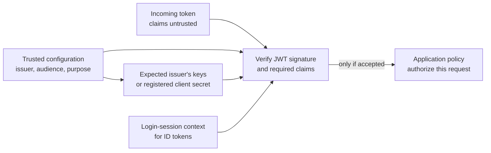

# OIDC token validation

## The question this page answers

The common signed form of a JSON Web Token (JWT) has three encoded parts
separated by dots; encrypted forms differ. Decoding a signed token's
payload can reveal claims such as an identity, expiry, and intended
audience. Anyone can write text that decodes into those claims. **Validation**
is the receiver's process of deciding whether the token really came from
the expected issuer, is meant for this receiver and purpose, is still
usable, and satisfies the rules for the current request. This page explains
the model; use a maintained library and the chosen provider's exact
instructions for an implementation.[^jwt-best-practices]

Read [OIDC fundamentals](oidc-fundamentals.md) first if `iss`, `aud`,
`sub`, and `exp` are unfamiliar.

## Establish trust before reading claims as facts

The application starts with configuration it trusts: the expected issuer,
its own client or resource identifier, allowed signing algorithms, and
the kind of token it accepts. For an asymmetrically signed token, OpenID
Connect Discovery can locate the expected issuer's public signing keys
through `jwks_uri`. Fetch metadata and keys through HTTPS with certificate
validation. The metadata's `issuer` must exactly match the configured
issuer and the token's `iss` claim; a trailing slash or different letter
case changes the value. A token's own unverified `iss`, key ID (`kid`), or
key URL is **not** permission to trust a new issuer or fetch arbitrary
keys. Some ID tokens instead use a registered client secret to validate
an HMAC signature; follow the provider's registered algorithm and the
corresponding Core rules.[^openid-core][^openid-discovery][^jwt-best-practices]

For a JWT that the application validates locally, the trust boundary
looks like this. An opaque access token follows the introspection path
described below instead.

Text alternative: the receiver has an incoming, untrusted token and a
separately configured issuer, audience, and token purpose. For an ID
token, it also has context from its own login session. It obtains
verification material through the trusted provider configuration and
verifies the JWT signature and required claims. Only an accepted token
reaches the application's separate decision about what the identified
subject may do.

Think of a token as a signed letter. Reading its return address is easy;
proving it came from the expected sender requires checking the signature
against that sender's known key. A letter addressed to another recipient
must also be rejected. This analogy has limits: tokens used as bearer
credentials can be copied and replayed, signing keys rotate, and a valid
signature does not grant a permission in the application.

## Checks depend on the token's purpose

For an **OIDC ID token**, the receiver is the relying-party application
handling its own sign-in response, not an API accepting an arbitrary token
from a caller. The response must be tied to the application's login request.
In a browser flow, the library must check the request-to-response binding,
such as a session-bound `state` value, and protect the authorization-code
exchange, usually with Proof Key for Code Exchange (PKCE). An ID token in
the code flow comes from the token endpoint after that code exchange.
The OpenID Connect Core validation rules include the expected issuer,
signature or the narrow direct-token-endpoint TLS alternative, `aud`
containing the application's client ID, and an `exp` value later than the
current time. A `nonce` is required in the implicit flow and in hybrid
requests that return an ID token from the authorization endpoint. If the
application sent a `nonce` in any flow, the returned ID token must contain
the value stored for that login session. Multiple audiences and an `azp`
claim need the Core specification's additional checks. These are
flow-dependent checks, not a universal four-line JWT recipe.[^openid-core][^oauth-security-bcp]

An **OAuth access token** is for a protected resource such as an API, not
for signing a person into the relying party. Its format is not universally
a JWT. If the provider issues **RFC 9068 profile JWT access tokens**, the
resource server checks the `at+jwt` or `application/at+jwt` type, issuer,
its own audience, signature, and expiry under that profile. It can find
the authorization server's expected issuer and keys through trusted OAuth
metadata or OIDC Discovery, as supported by that server.[^jwt-access-token-profile][^oauth-server-metadata]

An opaque access token can instead be checked through the authorization
server's supported token introspection endpoint. The resource server must
be authorized to call it and must check the response's `active` value:
even an inactive token can produce HTTP 200 with `"active": false`.
An active result still needs the provider's applicable audience, scope,
and local authorization checks. Cached introspection results can delay
recognition of a revoked token. A receiver must use the contract of its
provider and token type; it must not apply ID-token rules to an arbitrary
access token or treat an ID token as an API access token.[^oauth-token-introspection]

For a JWT checked locally, the main checks rule out different mistakes:

| Check | What it rules out |
| --- | --- |
| Expected issuer and trusted verification material | A token from an unrelated provider, or an attacker-selected key. |
| Permitted algorithm and valid signature | A modified or incorrectly signed token, including one whose untrusted `alg` header asks the receiver to use an algorithm or key outside its configured policy.[^jwt-best-practices] |
| Audience and token purpose | A genuine token issued to a different application or for a different use. |
| Expiry and other applicable time/flow claims | A token outside its allowed lifetime or an ID token detached from its login request. |
| Local authorization | An authenticated subject doing something the application has not allowed. |

When keys rotate, a previously unseen `kid` can prompt a controlled refresh
of the expected issuer's keys. If verification cannot be completed, reject
the token. Do not disable signature, audience, or issuer checks to keep a
request working. Key refresh and caching behavior belong in the chosen
library/provider integration, not in a copy-pasted universal algorithm.

## An invented two-token example

Suppose Team Wiki expects ID tokens from `https://login.example.com` for
client `team-wiki` during its own sign-in flow. An attacker tries to
substitute a JWT whose decoded claims say `iss: https://login.example.com`,
`aud: team-wiki`, and `sub: editor-7`, but it is signed with the attacker's
key. The text looks right; signature verification against **Team Wiki's
configured issuer keys** fails. Team Wiki rejects it before mapping
`editor-7` to any account.

Now suppose a genuine token from the expected issuer is signed correctly
but says `aud: payroll-app`. Team Wiki rejects that token too: its issuer
is real, but the token was issued for another client. If a correctly
addressed token came from another login session, it still fails a
required match to the nonce Team Wiki stored for this request, when that
request sent a nonce. Only after the applicable login-flow checks pass
does Team Wiki use its own permissions to decide whether the subject may
edit an article. These names and claims are illustrative; no token or
application was tested.[^openid-core]

## Check your understanding

1. Why does decoding a JWT not establish the identity in its `sub` claim?
2. Why can a correctly signed token still be rejected by an application?
3. Why must an API know whether it accepts RFC 9068 JWT access tokens,
   opaque access tokens, or a different provider-specific format?

## Official documentation and next steps

- [OpenID Connect Core](https://openid.net/specs/openid-connect-core-1_0.html)
  gives ID-token validation rules for each supported flow.
- [OpenID Connect Discovery](https://openid.net/specs/openid-connect-discovery-1_0.html)
  defines issuer metadata and the key-set location.
- [RFC 8725](https://www.rfc-editor.org/rfc/rfc8725.html) explains JWT
  validation pitfalls and mutually exclusive token-use rules.
- [RFC 9068](https://www.rfc-editor.org/rfc/rfc9068.html) specifies one JWT
  access-token profile, while [RFC 7662](https://www.rfc-editor.org/rfc/rfc7662.html)
  specifies token introspection.
- [RFC 8414](https://www.rfc-editor.org/rfc/rfc8414.html) defines OAuth
  authorization-server metadata for issuer and key discovery.
- [RFC 9700](https://www.rfc-editor.org/rfc/rfc9700.html) explains current
  browser-response and authorization-code protections.
- [IAM OIDC provider and STS web identity](../../cloud/aws/security/iam-oidc-provider-and-sts-web-identity.md)
  shows how AWS performs a provider-specific federation decision.

[Back to identity federation](index.md) | [Back to security index](../index.md)

[^openid-core]: [OpenID Connect Core 1.0](https://openid.net/specs/openid-connect-core-1_0.html), source record `openid-core`.
[^openid-discovery]: [OpenID Connect Discovery 1.0](https://openid.net/specs/openid-connect-discovery-1_0.html), source record `openid-discovery`.
[^jwt-best-practices]: [RFC 8725 - JSON Web Token Best Current Practices](https://www.rfc-editor.org/rfc/rfc8725.html), source record `jwt-best-practices`.
[^jwt-access-token-profile]: [RFC 9068 - JWT Profile for OAuth 2.0 Access Tokens](https://www.rfc-editor.org/rfc/rfc9068.html), source record `jwt-access-token-profile`.
[^oauth-token-introspection]: [RFC 7662 - OAuth 2.0 Token Introspection](https://www.rfc-editor.org/rfc/rfc7662.html), source record `oauth-token-introspection`.
[^oauth-server-metadata]: [RFC 8414 - OAuth 2.0 Authorization Server Metadata](https://www.rfc-editor.org/rfc/rfc8414.html), source record `oauth-server-metadata`.
[^oauth-security-bcp]: [RFC 9700 - Best Current Practice for OAuth 2.0 Security](https://www.rfc-editor.org/rfc/rfc9700.html), source record `oauth-security-bcp`.
