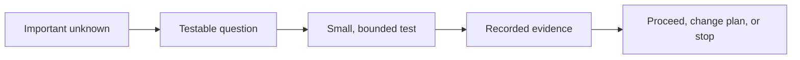

# Proof of concept

## The simple idea

A **proof of concept** (PoC) is a small experiment that helps a team answer
one important question before committing to a larger project. The question
might be “Can this service handle our data?” or “Can this application run
in the target environment?” A useful PoC starts with a specific unknown,
sets success criteria, gathers evidence, and ends in a decision.[^google-poc]

Think of testing a bridge design with a model. The model can reveal a
problem before construction. It cannot prove the full bridge is safe in
every condition. Likewise, a PoC can reduce uncertainty about the
tested case; it does not make a production system ready.

## From uncertainty to a decision

Text alternative: choose one important unknown, write a testable
question, run the smallest useful test, record what happened, then
decide whether to proceed, change the plan, or stop.

A demo that merely looks promising is weak evidence. State the
constraints before testing: the workload, environment, time box,
measurement method, and the result that would change the decision.
Google Cloud's migration guidance recommends a defined scope and
specific success criteria; AWS's Redshift PoC guide starts from
business requirements and measurable targets.[^google-poc][^aws-poc]

## One bounded example

Suppose a team is considering a new search service for a public
knowledge website. The uncertainty is whether it can help readers
find the right article, including when they use beginner wording.

| Part | Illustrative PoC choice |
| --- | --- |
| Decision | Should this search approach go into the next site design? |
| Testable question | Can it return the expected article in the first five results for ten representative reader questions? |
| Small test | Index a fixed snapshot of articles and run those ten questions, including a query with no good answer. |
| Evidence | Record the snapshot revision, each query, returned result order, expected article, misses, and setup effort. |
| Boundary | This test says nothing yet about mobile usability, accessibility, site traffic, or how articles are reviewed. |

The numbers and scenario above are **invented teaching examples**. No
search experiment was run for this page. A result such as “eight of ten
questions found the expected article” would inform the decision but
would not prove that future readers will always find what they need.
The team might proceed with conditions, revise the search approach,
or test more representative questions.

## What the result can and cannot tell you

| If the PoC shows... | Reasonable conclusion | Still to do |
| --- | --- | --- |
| The required path works in the test setting. | The idea is plausible under those conditions. | Test unrepresented cases and design production controls. |
| A required condition fails. | The current approach has a blocker. | Change the design or choose another option. |
| The result is unclear. | The question or measurement was too broad. | Narrow the unknown and run a better test. |

A PoC is often built quickly, without the security, logging, recovery,
and support work needed for real users. Microsoft explicitly warns
against treating PoC code as production-ready.[^microsoft-poc] If a team
keeps experimental code, it should plan and review the missing work
before release.

A PoC differs from a production rollout because its purpose is to
**learn enough to decide**. Teams may use words such as *prototype*,
*pilot*, or *spike* differently; ask which decision the work must
support rather than relying on the label alone.

## Check your understanding

- What unknown would the example PoC answer? Which important questions
  would it leave open?
- If the search test succeeds on ten questions, why is that not proof
  that every visitor will find the right article?
- What evidence would a teammate need to repeat or challenge the result?

## Explore further

- [Google Cloud's migration validation guidance](https://docs.cloud.google.com/architecture/migration-to-google-cloud-best-practices)
  shows how scope, criteria, and findings support a larger decision.[^google-poc]
- [Microsoft's architecture collaboration guidance](https://learn.microsoft.com/en-us/azure/well-architected/architect-role/collaboration)
  explains the production-code boundary.[^microsoft-poc]
- [AWS's Redshift PoC playbook](https://docs.aws.amazon.com/en_en/redshift/latest/dg/proof-of-concept-playbook.html)
  gives a product-specific example of selecting data and success targets.[^aws-poc]
- [Evaluation and quality](../ai/ai-tooling/knowledge-bases/evaluation-and-quality.md)
  goes deeper on measuring retrieval.
- [Back to solutions architect](index.md).

[^google-poc]: [Google Cloud, validate a migration plan](https://docs.cloud.google.com/architecture/migration-to-google-cloud-best-practices), source record `google-poc`.
[^microsoft-poc]: [Microsoft Azure Well-Architected, architect collaboration](https://learn.microsoft.com/en-us/azure/well-architected/architect-role/collaboration), source record `microsoft-poc`.
[^aws-poc]: [AWS, conduct a proof of concept for Amazon Redshift](https://docs.aws.amazon.com/en_en/redshift/latest/dg/proof-of-concept-playbook.html), source record `aws-poc`.
