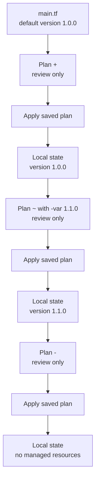

# Terraform local state lifecycle

## What you will learn

Create one `terraform_data` resource, inspect its state, change
an input, and remove it. This resource follows Terraform's
managed-resource lifecycle but **does not create cloud
infrastructure**. It lets you see what plan, apply, and state
mean without an AWS account or bill.[^terraform-data]

Read [Terraform fundamentals](../../fundamentals/terraform-fundamentals.md)
first if configuration, resource, state, plan, and apply are new
terms. This page is a hands-on path, not an explanation of all
Terraform providers or backends.

The core Terraform command sequence was rerun on 2026-10-06
with Terraform v1.13.1 in a disposable local directory. The
downloaded CLI archive passed its published SHA-256 check.
The run created one resource, updated one in place, and
destroyed one; the final state listed no resources. A plain
plan after the override and a stale saved-plan error were also
observed. This is local execution evidence, not a human
reader test. Claude Opus 5.5 reviewed the route read-only; the
revised prose and cleanup guidance still need a novice trial.
The page remains `draft`.

| Stage | What should change | What should stay the same |
| --- | --- | --- |
| Initialize and validate | Terraform prepares the directory and checks configuration. | No managed resource exists yet. |
| Plan creation | A saved plan proposes one resource. | State is not yet created by this plan. |
| Apply creation | State records `terraform_data.release`. | No external service is created. |
| Plan and apply an update | The stored version changes from `1.0.0` to `1.1.0`. | The resource address stays the same. |
| Plan and apply destruction | State no longer lists the resource. | There was no cloud resource to delete. |



Text alternative: the configuration starts with version `1.0.0`. A create
plan proposes one addition, but only applying it records that version in
local state. A second plan uses a one-command `-var` override to propose
version `1.1.0`; applying it updates state. A destroy plan proposes one
resource deletion, and applying it leaves no managed resources in state.
Each plan is a review step, while each apply changes the recorded state.

## Before you start

You need Terraform 1.4.0 or newer, Git, a terminal, and
permission to create a temporary local directory. You also need a local
clone of this repository for the supporting files. If you are reading
online and do not already have one, run this in a directory where
`knowledge-source` does not exist:

```bash
git clone https://github.com/David-A18/MY-humble-knowledge-for-everyone.git knowledge-source
cd knowledge-source
```

The [supporting `main.tf`](main.tf) defines a variable
`release_version`, a `terraform_data.release` resource,
and an output named `release_summary`. Its `input` map
stores illustrative application release details in local
state.[^terraform-data]

The exercise uses the default local backend. Terraform stores
its state as a local file here; in a shared infrastructure
project, state needs different storage and access controls.
[^terraform-state]

## 1. Make a disposable copy

From the knowledge-base repository root:

```bash
terraform_lab_dir=$(mktemp -d /tmp/kb-terraform-local.XXXXXX)
cp knowledge/terraform/examples/local-state-lifecycle/main.tf "$terraform_lab_dir/"
cp knowledge/terraform/examples/local-state-lifecycle/.gitignore "$terraform_lab_dir/"
cd "$terraform_lab_dir"
git init
git add -- main.tf .gitignore
git -c user.name="Local Lab" -c user.email="lab@example.invalid" commit -m "add local Terraform exercise"
pwd
```

The temporary Git commit gives you a known starting point.
The example identity applies only to this local commit. All
Terraform commands below run **inside this temporary
directory**, never in the knowledge-base checkout. The
copied [`.gitignore`](.gitignore) excludes local state,
saved plans, and Terraform's working directory. Keep using
this terminal and note the path printed by `pwd`; the
`terraform_lab_dir` shell variable is lost when that shell closes.

## 2. Initialize and check the configuration

```bash
terraform version
terraform init
terraform fmt -check
terraform validate
```

Expected result: `terraform init` succeeds,
`terraform fmt -check` exits successfully (it may print
nothing), and `terraform validate` reports that the
configuration is valid. Formatting and validation inspect
the configuration; they do not create the managed resource. Stop and fix any
reported error before planning.

## 3. Plan and create the first state entry

```bash
terraform plan -out=create.tfplan
terraform show create.tfplan
```

Look for **one resource addition**: `terraform_data.release`,
with a plan summary of `1 to add, 0 to change, 0 to destroy`.
The root output `release_summary` also appears under
`Changes to Outputs`; it is a result, not a second resource.
The `+` symbol means create. Planning proposes a change;
it does not yet save the new resource in state. The saved
`create.tfplan` fixes the plan you are about to apply.
Read it before the next command.[^terraform-plan]
[^terraform-show]

```bash
terraform apply create.tfplan
terraform state list
terraform state show terraform_data.release
terraform output release_summary
git status --short --ignored
```

Expected result: state lists `terraform_data.release`.
Its input and output have a `version`
entry with value `"1.0.0"`; spacing and key quoting differ between
`state show` and `output`. In Git status, `!! create.tfplan` and
`!! terraform.tfstate` mean those files are ignored, not absent.
Applying a saved plan does **not** prompt for another approval; passing
the plan file is the approval. Here the resource's data
exists only in local Terraform state.[^terraform-apply]
[^terraform-data]

## 4. Change a value without replacing the resource

The `release_version` variable defaults to `1.0.0`.
Override it for this run, save the proposed update, and
inspect it:

```bash
terraform plan -var='release_version=1.1.0' -out=change.tfplan
terraform show change.tfplan
```

Expected result: Terraform proposes an **in-place update**
of `terraform_data.release`, shown by `~` and the summary
`0 to add, 1 to change, 0 to destroy`. The
`release_summary` output also changes. This is an update rather
than a replacement. The address remains
`terraform_data.release`; its stored `input.version`
will change. `terraform_data` uses `input` for an
update; `triggers_replace` would request replacement
instead.[^terraform-data][^terraform-plan]

Apply **that same reviewed plan**, then inspect the new
record:

```bash
terraform apply change.tfplan
terraform state show terraform_data.release
terraform output release_summary
```

Expected result: the state and output now have a `version` entry
with value `"1.1.0"`. A plain apply with the same `-var` option
would calculate a fresh plan; using `change.tfplan` applies the
one you just reviewed.[^terraform-apply]

The `-var` override belonged to the saved update plan only;
`main.tf` still defaults to `1.0.0`. If you run a plain
plan now, it proposes changing the stored value back to `1.0.0`:

```bash
terraform plan
```

This is a read-only comparison. Do not apply that extra plan in this
tutorial; its `~` is a consequence of the unchanged default, not a
failed update.
The following destroy-mode plan removes the resource regardless
of that default; it does not first update the resource.

## 5. Review cleanup before removing state

> [!WARNING]
> The following destroy-mode plan is for this disposable
> `terraform_data` exercise only. In a real Terraform
> project, applying a destroy plan can delete external
> infrastructure and data.

```bash
terraform plan -destroy -out=destroy.tfplan
terraform show destroy.tfplan
```

Expected result: one proposed resource destruction,
`terraform_data.release`, shown by `-` and the summary
`0 to add, 0 to change, 1 to destroy`. The
`release_summary` output is also removed. If the plan
proposes any other resource action, **stop**. Check the current
directory and state before applying.[^terraform-plan]

```bash
terraform apply destroy.tfplan
terraform state list
```

Expected result: `terraform state list` prints no
managed resources. Destroying this `terraform_data`
resource removes its state entry; it has no corresponding
cloud object to delete.[^terraform-data][^terraform-apply]
The local `terraform.tfstate` file, its backup, and saved
plans can still exist even though the state lists no managed
resources; `destroy` does not securely erase those files.

## If a step fails or you stop early

Do not apply a different saved plan just to make progress.
If Terraform reports `Saved plan is stale`, its state has
changed since that plan was made. Inspect the current state,
rerun the `terraform plan` command for the intended next step,
review the new plan, and apply that new file only if it matches
your intent. Reapplying `create.tfplan` after the resource was
created produced this expected error in the disposable run.
[^terraform-plan][^terraform-apply]

If your terminal closes, find the directory using the path
printed by `pwd` in step 1. Multiple `/tmp/kb-terraform-local.*`
directories may exist, so inspect its `main.tf` and `.gitignore`
before running commands or removing it.

Once the final state has no resources and you no longer need the
exercise, check the exact directory that would be removed:

```bash
printf 'Lab directory: %s\n' "$terraform_lab_dir"
```

Only if that path is this exercise's `/tmp/kb-terraform-local.*`
directory, leave it and remove it:

```bash
cd /tmp
rm -r -- "$terraform_lab_dir"
```

This removes the local state, backup, saved plans, and temporary
Git repository. If the shell variable is missing or the path is
uncertain, do not run the removal command; locate and inspect the
directory first.

## What the files teach

| Path | Why it exists | Git handling |
| --- | --- | --- |
| `main.tf` | The requested resource, inputs, and output. | Commit the configuration. |
| `.terraform/`, if present | Terraform working data for installed providers and modules. This built-in-provider example did not create it in the recorded run. | Ignore it if present. |
| `terraform.tfstate` and backup files | Local record of managed objects and prior snapshots; a backup can retain earlier values after destroy. | Ignore and protect them. |
| `create.tfplan`, `change.tfplan`, `destroy.tfplan` | Opaque saved plans for the exact steps above. | Ignore and protect them. |

In this lab the values are harmless examples, but real
state and saved plans can contain sensitive values.
`.gitignore` prevents accidental normal staging; it is
not encryption or access control. Treat real plan and
state files accordingly.[^terraform-state]
[^terraform-sensitive]

## Check your understanding

1. Which command first caused
   `terraform_data.release` to appear in state?
2. Why did `terraform show change.tfplan` show
   an update instead of a replacement?
3. Why did the tutorial apply a saved plan after
   inspecting it instead of running a fresh apply?
4. What would be different if the same destroy
   workflow targeted a real cloud provider resource?

## Deeper study

- [`terraform_data` resource](https://developer.hashicorp.com/terraform/language/resources/terraform-data)
  for its `input`, `output`, and replacement behavior.
- [Terraform plan](https://developer.hashicorp.com/terraform/cli/commands/plan),
  [show](https://developer.hashicorp.com/terraform/cli/commands/show),
  and [apply](https://developer.hashicorp.com/terraform/cli/commands/apply)
  for the saved-plan workflow.
- [Terraform state](https://developer.hashicorp.com/terraform/language/state)
  for the local record and team storage choices.
- [Core Terraform workflow](../../commands/core-workflow.md)
  for applying this sequence to real infrastructure.

[Back to Terraform local state lifecycle](index.md)

[^terraform-data]: [Terraform - terraform_data resource](https://developer.hashicorp.com/terraform/language/resources/terraform-data).
[^terraform-plan]: [Terraform - terraform plan](https://developer.hashicorp.com/terraform/cli/commands/plan).
[^terraform-show]: [Terraform - terraform show](https://developer.hashicorp.com/terraform/cli/commands/show).
[^terraform-apply]: [Terraform - terraform apply](https://developer.hashicorp.com/terraform/cli/commands/apply).
[^terraform-state]: [Terraform - State](https://developer.hashicorp.com/terraform/language/state).
[^terraform-sensitive]: [Terraform - Manage sensitive data](https://developer.hashicorp.com/terraform/language/manage-sensitive-data).
