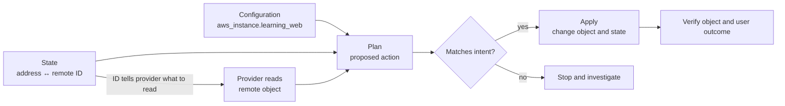

# Terraform state management

## In one minute

Terraform **state** is its record of which managed object belongs to each
resource address in your configuration. The address is a name in Terraform,
such as `aws_instance.learning_web`; the object is the server or other thing
a provider manages. Terraform needs the link between them to decide what to
change next.[^terraform-state]

A **backend** is where Terraform stores that record. A **lock**, when the
backend supports it, keeps two runs from writing the same state at once.
The record can contain sensitive values, so choosing who can read it matters
as much as choosing where it lives.[^terraform-backends]
[^terraform-state-locking][^terraform-sensitive-data]

Read [Terraform fundamentals](terraform-fundamentals.md) first if resource,
provider, plan, or apply is new. This page explains why state deserves care;
the [local state tutorial](../examples/local-state-lifecycle/local-state-lifecycle.md)
lets you inspect state without a cloud account.

## Why the record matters

Imagine changing only the Terraform name of a server from
`aws_instance.learning_web` to `aws_instance.course_web`. The real server
does not automatically change its identity. Without a recorded move,
Terraform can interpret the old address as removed and the new one as a
request for a new object. A plan may therefore propose destruction and
creation even though the intended change was only a name.[^terraform-moved-blocks]

State makes that distinction possible. It records a binding between a
configured resource instance and an object in the provider's system. A
normal plan reads the configuration, prior state, and current remote
object information, then proposes actions. The plan is the moment to
check whether Terraform understood your intent.[^terraform-state]
[^terraform-plan]

| Piece | Simple question it answers |
| --- | --- |
| Configuration | What objects and settings do we want? |
| Resource address | What do we call this instance in Terraform? |
| State binding | Which existing object does that address refer to? |
| Provider read | What does that object look like now? |
| Plan | What would Terraform change to match the configuration? |



Text alternative: configuration says what is wanted; state connects the
Terraform address to a remote object ID. The provider uses that ID to read
the remote object. Those inputs produce a plan.
A person reviews the proposed action before apply changes the object and
updates state, then checks the object and user outcome. An unexpected destroy,
replacement, or target environment is a reason to stop.

## A useful analogy, with limits

Think of state as a museum's collection register. A catalog number points
to one physical artifact, and the register records where staff last placed
it. Renaming a display label should not make staff acquire a second artifact.

The analogy has limits:

- Terraform also records attributes and other metadata, not only an ID.
  Some of those values can be sensitive.[^terraform-state][^terraform-sensitive-data]
- The register can become stale. A provider read may find that someone
  changed or removed the real object outside Terraform.[^terraform-plan]
- Terraform cannot infer every rename from intent. Record a resource
  address change with a `moved` block and review the resulting plan.
  Merely changing the name in configuration is insufficient.[^terraform-moved-blocks]
- A shared register needs controlled access and, where supported,
  locking. A Git commit of a state file does not supply Terraform's
  state locking or suitable secret protection.[^terraform-state-locking]
  [^terraform-sensitive-data]

## Example: one server, three different changes

The following server is **illustrative**. No AWS server was
created or modified for this page.

| Event | What changed | What to check in the plan |
| --- | --- | --- |
| An operator changes a server setting outside Terraform | The real object changed; configuration and prior state did not. | Does the plan propose to restore the configured setting? If the outside change should remain, first decide how to represent it in configuration. |
| A contributor renames `aws_instance.learning_web` to `aws_instance.course_web` | The Terraform address changed; the intended remote object did not. | Add a reviewed `moved` block so the existing binding follows the new address, then confirm the plan does not replace the server merely because of the rename.[^terraform-moved-blocks] |
| A team stops managing the server but keeps it running | Terraform ownership changes; the remote object should remain. | Replace the resource block with a reviewed `removed` block whose `lifecycle` sets `destroy = false`; verify the plan leaves the server in place. Simply deleting the resource block normally requests destruction.[^terraform-removed-blocks] |

For that last row, the shape is important. Terraform v1.7 or later is
required for `removed` blocks. This is **illustrative configuration**, not
an instruction to stop managing a real server.[^terraform-state-cli-tutorial]

```hcl
removed {
  from = aws_instance.course_web

  lifecycle {
    destroy = false
  }
}
```

Remove the matching `resource "aws_instance" "course_web"` block in the
same reviewed change and update any references to it. Confirm that the
plan identifies this address as no longer managed **without** a destroy
action. The example in HashiCorp's tutorial has zero destroys, although
output changes may still appear. Arrange a new owner for the running
object.[^terraform-state-cli-tutorial]

The key question is **which layer changed**: the configuration, the
state binding, or the real object. They can disagree for different
reasons, and the correct response depends on which change was intended.

## Where state lives and how teams share it

By default, Terraform stores state in a local `terraform.tfstate` file
and may keep a previous snapshot as `terraform.tfstate.backup`. That is
convenient for a single-person exercise. Teams usually need HCP
Terraform or an appropriate remote backend so runs share the current
record and access can be controlled.[^terraform-state][^terraform-local-backend]

With the local backend, non-default CLI workspaces keep state under
`terraform.tfstate.d/` by default; other backends store workspace state
in their own locations.
The similarly named `.terraform/terraform.tfstate` stores backend
configuration for the working directory, **not** the managed-object state.
It too can contain sensitive backend settings.[^terraform-workspaces]
[^terraform-backends]

A backend is a storage choice, not a guarantee of every safety
feature. Check its documentation for locking and access controls.
Terraform automatically locks operations that could write state
**when the backend supports locking**. If it cannot acquire a needed
lock, it does not continue. Do not use `-lock=false` as a routine way
past another run; force-unlock is for your own stale lock after
automatic unlocking failed.[^terraform-state-locking]

Backend configuration has its own rules: a root module can have only
one backend block, and that block cannot read ordinary input
variables, locals, or data source attributes. Avoid putting backend
credentials directly in configuration; use the backend's supported
credential mechanism.[^terraform-backends]

## State is sensitive even when output looks hidden

State and saved plans may contain values that Terraform hides in
terminal output. Marking a variable or output `sensitive` changes
display behavior; it does not by itself remove ordinary secret values
from state or saved plans. Protect storage, access, backups, and plan
artifacts. Keep local state and plans out of Git.[^terraform-sensitive-data]
[^terraform-plan]

Newer Terraform versions offer **ephemeral** values and provider-defined
**write-only** arguments for certain secrets that should not persist in
state or plans. These have placement and provider-support limits; an ordinary
`sensitive` value does not become ephemeral automatically. Local state is
plaintext, and encryption at rest for remote state depends on the backend.
Read the current feature and backend documentation before relying on these
controls to protect a particular secret.[^terraform-sensitive-data][^terraform-backends]

Avoid editing the state JSON file by hand. For inspection, use
`terraform state list` to find addresses and `terraform state show`
for one address; inspect the output only where sensitive data may
safely be displayed. For refactoring, prefer configuration-based
`moved` or `removed` blocks because their effect appears in a
reviewable plan. Direct `terraform state` mutation commands are
narrow recovery tools. Before one, follow the backend's recovery procedure
to obtain a restricted, restorable state snapshot; the backup itself may
contain secrets. Review ownership and a fresh plan afterward.
[^terraform-state-cli]
[^terraform-moved-blocks][^terraform-removed-blocks]

## Drift and a refresh-only plan

**Drift** means a managed object's real settings changed outside the
usual Terraform workflow. Normal planning reads remote objects to
account for such changes. A `terraform plan -refresh-only` instead
proposes changes to Terraform's state and root outputs so they match
the remote objects; it does not propose normal infrastructure changes.
Applying a refresh-only plan updates Terraform's record, so review it
rather than treating it as a harmless read.[^terraform-plan]

If an outside change should persist, decide whether configuration must
change too. Updating only state while configuration still requests the
old setting can leave a later normal plan proposing to change the
object back.

## Stop and investigate when

- A plan proposes to destroy or replace an object you meant to keep.
- The workspace, backend, account, or project is not the intended one.
- A lock belongs to an active run or its owner is unknown.
- A state operation would make two addresses claim one real object, or
  make Terraform forget an object without a clear new owner.
- A saved plan or state snapshot is about to enter a public artifact,
  chat, or repository.[^terraform-state][^terraform-plan]

## Check your understanding

1. What does state connect to a resource address?
2. Why can a resource rename look like destroy-and-create without a
   `moved` block?
3. Why can two people sharing a remote state file still need a lock?
4. If a remote setting changed outside Terraform, what should you
   decide before applying a refresh-only plan?

## Next steps and official documentation

- Practice with one local object in the
  [state lifecycle tutorial](../examples/local-state-lifecycle/local-state-lifecycle.md).
- Follow the [core Terraform workflow](../commands/core-workflow.md)
  when reviewing a real plan.
- Read HashiCorp's [state overview](https://developer.hashicorp.com/terraform/language/state)
  and [backend configuration](https://developer.hashicorp.com/terraform/language/backend)
  for storage and ownership.
- Read [state locking](https://developer.hashicorp.com/terraform/language/state/locking)
  and [sensitive data](https://developer.hashicorp.com/terraform/language/manage-sensitive-data)
  before a shared deployment.
- Use [moved blocks](https://developer.hashicorp.com/terraform/language/modules/develop/refactoring)
  and [removed blocks](https://developer.hashicorp.com/terraform/language/state/remove)
  for a reviewed ownership change.
- Return to the [Terraform fundamentals section](index.md) or the
  [knowledge index](../../index.md).

[^terraform-state]: [Terraform state](https://developer.hashicorp.com/terraform/language/state).
[^terraform-backends]: [Terraform backend configuration](https://developer.hashicorp.com/terraform/language/backend).
[^terraform-state-locking]: [Terraform state locking](https://developer.hashicorp.com/terraform/language/state/locking), source record `terraform-state-locking`.
[^terraform-sensitive-data]: [Manage sensitive data in Terraform](https://developer.hashicorp.com/terraform/language/manage-sensitive-data), source record `terraform-sensitive-data`.
[^terraform-plan]: [terraform plan command](https://developer.hashicorp.com/terraform/cli/commands/plan).
[^terraform-moved-blocks]: [Refactor Terraform modules](https://developer.hashicorp.com/terraform/language/modules/develop/refactoring), source record `terraform-moved-blocks`.
[^terraform-removed-blocks]: [Remove a resource from Terraform state](https://developer.hashicorp.com/terraform/language/state/remove), source record `terraform-removed-blocks`.
[^terraform-state-cli]: [terraform state command](https://developer.hashicorp.com/terraform/cli/commands/state).
[^terraform-local-backend]: [Terraform local backend](https://developer.hashicorp.com/terraform/language/backend/local), source record `terraform-local-backend`.
[^terraform-workspaces]: [Terraform CLI workspaces](https://developer.hashicorp.com/terraform/cli/workspaces), source record `terraform-workspaces`.
[^terraform-state-cli-tutorial]: [HashiCorp tutorial - Manage Terraform state](https://developer.hashicorp.com/terraform/tutorials/state/state-cli), source record `terraform-state-cli-tutorial`.
