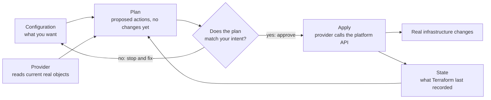

# Terraform fundamentals

## Purpose

Build the Terraform mental model before you run it against a cloud account or
shared infrastructure. The page explains what each part of Terraform is for,
how the parts work together, and why the plan is the moment to stop and think.

It is not a command procedure. When you are ready to run commands, use the
[core Terraform workflow](../commands/core-workflow.md) or the no-cloud
[local state lifecycle tutorial](../examples/local-state-lifecycle/local-state-lifecycle.md).

## What Terraform is

Terraform is an infrastructure-as-code tool. You write text files that describe
the infrastructure you want, and Terraform works out which changes would make
the real infrastructure match those files.

The Terraform language is declarative: it describes an intended result, not the
steps to reach it. The order in which you write blocks generally does not
matter; Terraform orders operations from the relationships between
resources.[^terraform-language]

## Why it matters

Clicking through a web console is quick once and hard to repeat exactly.
Written configuration can be reviewed, versioned in Git, and reused. The larger
benefit is the preview: Terraform tells you what it intends to change before it
changes anything.

The trade-off is responsibility. Terraform will carry out what the
configuration and your approval say, including deleting things. The preview
helps only if someone reads it.

## The mental model: six parts

| Part | Simple definition | Role in the model |
| --- | --- | --- |
| Configuration | `.tf` files that declare what you want. | The desired result, kept under version control. |
| Provider | A plugin that knows how to talk to one platform's API, such as a cloud, a SaaS product, or another service. | Supplies the resource types you can use. Installed when the working directory is initialized.[^terraform-providers] |
| Resource | One declared infrastructure object, identified by an address such as `terraform_data.release`. | The unit Terraform creates, changes, replaces, or destroys.[^terraform-resources] |
| State | Terraform's record of which real object belongs to each resource address, plus metadata. | Lets Terraform tell "already exists" from "needs creating".[^terraform-state-purpose] |
| Plan | A proposed list of create, update, replace, and destroy actions. | Your review point. Planning does not change real infrastructure.[^terraform-plan] |
| Apply | The step that carries out the planned actions through the providers. | Changes real objects and then updates state.[^terraform-cli-run] |

When Terraform plans, it reads the current condition of objects it already
manages, compares your configuration with its recorded state, and proposes the
actions that would make the real objects match the
configuration.[^terraform-plan]

## An analogy: a renovation contractor

Think of hiring a contractor to renovate a room:

- The **configuration** is the drawing of the finished room.
- **Providers** are specialist trades, such as an electrician or a plumber.
  Each one knows how to work on one kind of system.
- **State** is the contractor's job ledger: which fixtures they installed, and
  where each one is.
- The **plan** is a written quote: "add two sockets, move the sink, remove the
  old radiator".
- **Apply** is signing the quote and letting the work begin.

Where the analogy stops being accurate:

- **Terraform does not guess intent.** A contractor might ask "did you really
  mean to remove the radiator?" Terraform treats a resource block you deleted
  from configuration as a request to destroy that object, and it will say so in
  the plan.
- **The ledger can contain secrets.** State is a plain-text file that can hold
  secret values from your configuration. It is closer to a key cabinet than a
  notebook.[^terraform-sensitive-data]
- **Some changes cannot be done in place.** Depending on the provider and the
  attribute, a change can require replacing the whole object, which means
  destroying one and creating another.
- **The quote can go out of date.** If you run `terraform apply` without a
  saved plan, it builds a fresh plan and asks you to approve that one. Review
  what apply shows, not only an earlier plan.[^terraform-cli-run]

## Visual: from configuration to real change



Text alternative: three inputs feed the plan: your configuration, the state
Terraform recorded last time, and the provider's reading of the real objects.
The plan lists proposed actions without changing anything. You then decide
whether the plan matches your intent. If it does not, you stop and fix the
configuration or the context. If it does, apply asks the provider to call the
platform's API, the real infrastructure changes, and Terraform updates its
state to record the result.

Use the diagram to locate a surprise: an unexpected action in a plan comes from
one of the three inputs, so check the configuration change, the state, and the
selected account or environment before approving.

## Example: a resource that only lives in state

This example is illustrative and has not been executed as part of this page.
It uses `terraform_data`, a resource type that is always available through
Terraform's built-in provider. It follows the normal resource lifecycle but
creates nothing outside Terraform: it only stores values in
state.[^terraform-data] That makes it a safe way to see plans and state without
a cloud account.

```hcl
resource "terraform_data" "release" {
  input = {
    app_name = "kb-local-example"
    version  = "1.0.0"
  }
}
```

What it declares: one resource at the address `terraform_data.release`, whose
`input` value is recorded in state. The values are placeholders chosen to look
like application release details.

How the model plays out:

| Situation | What the plan proposes | Why |
| --- | --- | --- |
| First plan, no state yet | Create `terraform_data.release`. | Configuration declares it, and state has no record of it. |
| After apply, nothing edited | No changes. | Configuration, state, and the stored object agree. |
| `version` changed to `1.1.0` | Update `terraform_data.release` in place. | The object is recorded in state, but its input differs from configuration. |
| The resource block is deleted | Destroy `terraform_data.release`. | State still records an object that the configuration no longer declares. |

The in-place update result matches the expected condition recorded in the
[local state lifecycle tutorial](../examples/local-state-lifecycle/local-state-lifecycle.md).
If the changed value were placed in the resource's `triggers_replace` argument
instead, Terraform would plan a replacement rather than an
update.[^terraform-data] With a cloud provider, the same four situations would
create, keep, modify, or delete real infrastructure.

## Plan versus apply

| | `terraform plan` | `terraform apply` |
| --- | --- | --- |
| Main job | Proposes changes. | Carries out changes. |
| Changes real infrastructure | No.[^terraform-plan] | Yes, through the providers. |
| Saves new state | No. It reads current objects but does not save a new state. | Yes, after it acts. |
| Asks for approval | Not applicable. | Yes, when it creates its own plan, unless told to skip approval.[^terraform-cli-run] |
| Safe to repeat | Yes, while you understand the selected account or environment. | Only when you have read what it will do. |

Why inspect the plan before applying:

- **Scope.** The plan shows the counts of objects to add, change, and destroy.
  A number much larger than you expected is a stop signal.
- **Destroy and replace lines.** These are the actions most likely to lose data
  or cause downtime.
- **Target.** Terraform acts in whatever account, workspace, and backend the
  current context selects. A valid configuration can still be pointed at the
  wrong place.

Passing `terraform validate` proves the configuration is internally
consistent. It does not prove that the plan targets the right environment.

## Why state is sensitive

State matters for two reasons.

First, it is how Terraform knows which real object belongs to each address.
Terraform expects each remote object to be bound to only one resource
instance.[^terraform-state-purpose] If state is lost, edited by hand, or shared
carelessly, Terraform may try to create duplicates or lose track of objects it
manages.

Second, state is stored as plain text and can include secret values from your
configuration. Marking a value as `sensitive` hides it from command output, but
the value is still written to state and saved plan files. Anyone who can read
those files can read the value.[^terraform-sensitive-data]

For that reason, keep state and saved plans out of Git, restrict who can read
them, and use a protected shared backend for team work.[^terraform-state]
[Terraform state
management](state-management.md) explains backends, locking, and safe state
commands.

## Common misconceptions

- **"Plan and apply show the same thing."** Only if you apply the saved plan
  file. Otherwise apply computes a new plan, which can differ if something
  changed in between.
- **"Deleting a block just stops Terraform managing it."** Deleting a resource
  block normally produces a destroy action. Removing an object from management
  without destroying it is a separate, deliberate operation.
- **"State is just a cache I can delete."** State records identity. Losing it
  can make Terraform treat existing objects as new ones.
- **"`sensitive = true` encrypts the value."** It only hides the value from
  output.[^terraform-sensitive-data]

## Check your understanding

- Which three inputs does Terraform compare when it builds a plan?
- In the `terraform_data` example, why does the first plan propose a create
  while the second proposes no changes?
- Why can a plan that passed `terraform validate` still be dangerous?
- Why is `terraform.tfstate` kept out of version control even when the
  configuration contains no secrets?

## Next steps

- Trace variables, locals, a resource, and an output in [How values move
  through Terraform configuration](../language/how-values-move-through-terraform.md).
- Practise the model without a cloud account in the [local state lifecycle
  tutorial](../examples/local-state-lifecycle/local-state-lifecycle.md).
- Learn the command sequence and plan-review signals in the [core Terraform
  workflow](../commands/core-workflow.md).
- Go deeper on backends, locking, and drift in [Terraform state
  management](state-management.md).
- Return to the [Start here](../../start-here.md) learning route.

## Official documentation for deeper study

- Declarative configuration and how Terraform orders work: [Terraform language](https://developer.hashicorp.com/terraform/language).
- Provider installation, versions, and lock files: [Providers](https://developer.hashicorp.com/terraform/language/providers).
- Declaring and managing resources: [Resources](https://developer.hashicorp.com/terraform/language/resources).
- Why state exists: [Purpose of Terraform state](https://developer.hashicorp.com/terraform/language/state/purpose).
- State storage and related topics: [State](https://developer.hashicorp.com/terraform/language/state).
- Plan, apply, and destroy as a workflow: [Provisioning infrastructure with Terraform CLI](https://developer.hashicorp.com/terraform/cli/run) and the [`terraform plan` command](https://developer.hashicorp.com/terraform/cli/commands/plan).
- The resource used in the example: [`terraform_data`](https://developer.hashicorp.com/terraform/language/resources/terraform-data).
- Secrets, state, and ephemeral values: [Manage sensitive data](https://developer.hashicorp.com/terraform/language/manage-sensitive-data).

## Related links

- [How values move through Terraform configuration](../language/how-values-move-through-terraform.md)
- [Core Terraform workflow](../commands/core-workflow.md)
- [Terraform state management](state-management.md)
- [Terraform local state lifecycle](../examples/local-state-lifecycle/local-state-lifecycle.md)
- [Back to Terraform fundamentals](index.md)
- [Back to Terraform index](../index.md)
- [Back to knowledge index](../../index.md)

[^terraform-language]: [Terraform language documentation](https://developer.hashicorp.com/terraform/language), source record `terraform-language`.
[^terraform-providers]: [Terraform providers](https://developer.hashicorp.com/terraform/language/providers), source record `terraform-providers`.
[^terraform-resources]: [Terraform resources](https://developer.hashicorp.com/terraform/language/resources), source record `terraform-resources`.
[^terraform-state]: [Terraform state documentation](https://developer.hashicorp.com/terraform/language/state), source record `terraform-state`.
[^terraform-state-purpose]: [Purpose of Terraform state](https://developer.hashicorp.com/terraform/language/state/purpose), source record `terraform-state-purpose`.
[^terraform-cli-run]: [Provisioning infrastructure with Terraform CLI](https://developer.hashicorp.com/terraform/cli/run), source record `terraform-cli-run`.
[^terraform-plan]: [terraform plan command](https://developer.hashicorp.com/terraform/cli/commands/plan), source record `terraform-plan`.
[^terraform-data]: [The terraform_data managed resource type](https://developer.hashicorp.com/terraform/language/resources/terraform-data), source record `terraform-data`.
[^terraform-sensitive-data]: [Manage sensitive data in Terraform](https://developer.hashicorp.com/terraform/language/manage-sensitive-data), source record `terraform-sensitive-data`.
