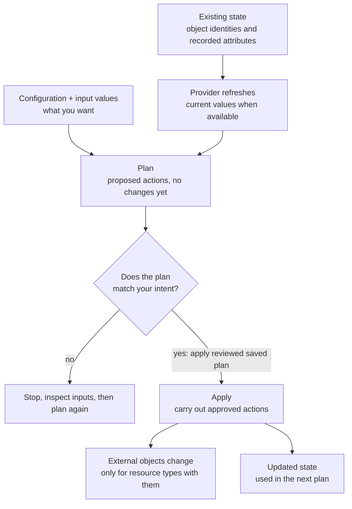

# Terraform fundamentals

## Purpose

Build the Terraform mental model before you run it against a cloud account or
shared infrastructure. The page explains what each part of Terraform is for,
how the parts work together, and why the plan is the moment to stop and think.

It is not a command procedure. When you are ready to run commands, use the
[core Terraform workflow](../commands/core-workflow.md) or the no-cloud
[local state lifecycle tutorial](../examples/local-state-lifecycle/local-state-lifecycle.md).

## What Terraform is

Terraform is an infrastructure-as-code tool. You write text files that describe
the infrastructure you want, and Terraform works out which changes would make
the real infrastructure match those files.[^terraform-cli-run]

The Terraform language is declarative: it describes an intended result, not the
steps to reach it. The order in which you write blocks generally does not
matter; Terraform orders operations from the relationships between
resources.[^terraform-language]

## Why it matters

Clicking through a web console is quick once and hard to repeat exactly.
Written configuration can be reviewed, versioned in Git, and reused. The larger
benefit is the preview: Terraform tells you what it intends to change before it
changes anything.

The trade-off is responsibility. Terraform will carry out what the
configuration and your approval say, including deleting things. The preview
helps only if someone reads it.

## The mental model: six parts

| Part | Simple definition | Role in the model |
| --- | --- | --- |
| Configuration | `.tf` files that declare what you want. | The desired result, kept under version control. |
| Provider | A component that supplies resource types and knows how to work with their platform, such as a cloud or SaaS API. | Most are downloaded during `terraform init`; the built-in `terraform` provider used below ships with Terraform.[^terraform-providers][^terraform-data] |
| Resource | A managed object described by a `resource` block. An instance has an address such as `terraform_data.release`. | The unit Terraform creates, changes, replaces, or destroys. A block using `count` or `for_each` can describe several instances.[^terraform-resources][^terraform-resource-configure] |
| State | Terraform's record of each managed instance's identity, last-known attributes, and other metadata. | Links configuration addresses to objects Terraform manages. A `terraform_data` instance exists only in this state.[^terraform-state-purpose][^terraform-data] |
| Plan | A proposed list of create, update, replace, and destroy actions. | Your review point. Planning does not change real infrastructure.[^terraform-plan] |
| Apply | The step that carries out the planned actions through the providers. | Creates or changes external objects for resource types that have them, and records results in state. A partial failure can leave some changes made.[^terraform-apply] |

By default, Terraform uses state to find the real objects it manages, asks
their providers for current attributes, then compares that refreshed view with
your configuration and input values. A change made outside Terraform, called
**drift**, can therefore appear in the plan. The `-refresh=false` option skips
that normal check and can hide drift.[^terraform-plan]

## An analogy: a renovation contractor

Think of hiring a contractor to renovate a room:

- The **configuration** is the drawing of the finished room.
- **Providers** are specialist trades, such as an electrician or a plumber.
  Each one knows how to work on one kind of system.
- **State** is the contractor's job ledger: which fixtures they installed, and
  where each one is.
- The **plan** is a written quote: "add two sockets, move the sink, remove the
  old radiator".
- **Apply** is signing the quote and letting the work begin.

Where the analogy stops being accurate:

- **Terraform does not guess intent.** A contractor might ask "did you really
  mean to remove the radiator?" Terraform treats a resource block you deleted
  from configuration as a request to destroy that object, and it will say so in
  the plan.
- **The ledger can contain secrets.** Local state is a plain-text file that can hold
  secret values from your configuration **or** from attributes a provider
  returns. It is closer to a key cabinet than a notebook.
  [^terraform-sensitive-data]
- **The contractor re-inspects the room before the quote.** A normal plan
  checks managed objects again. The saved ledger identifies them, but it is
  not assumed to describe their current condition.[^terraform-plan]
- **The ledger lists only work the contractor took on.** Terraform does not
  automatically take ownership of every object in an account. An object
  created elsewhere must be deliberately imported before Terraform can manage
  it.
  [^terraform-state-import]
- **Some changes cannot be done in place.** Depending on the provider and the
  attribute, a change can require replacing the whole object, which means
  destroying one and creating another.[^terraform-resources]
- **The quote can go out of date.** If you run `terraform apply` without a
  saved plan, it builds a fresh plan and asks you to approve that one. Review
  what apply shows, not only an earlier plan. A saved plan can also become
  stale if state changes before it is applied; Terraform refuses a stale plan.
  [^terraform-apply][^terraform-plan]

## Visual: from configuration to an applied result



Text alternative: state identifies the managed objects, and the provider reads
their current attributes. Terraform compares that refreshed view with your
configuration and its input values to build a plan. The plan lists proposed
actions without applying managed-resource changes. You then decide whether it
matches your intent. If not, stop and fix the inputs or context. If so, apply
the *saved plan you reviewed* to carry out those actions and update state. A
plain `terraform apply` instead makes a fresh plan and asks for approval. For
a cloud resource, its provider also calls the platform API; the
`terraform_data` example below changes only state.[^terraform-apply]

Use the diagram to locate a surprise: check the configuration and input
values, the state mapping, and what the provider found. Also check the selected
account, workspace, and backend before approving. A CLI workspace selects one
state instance; a backend determines where state is stored.
[^terraform-workspaces][^terraform-state]

## Example: a resource that only lives in state

This example is illustrative and has not been executed as part of this page.
It uses `terraform_data`, a resource type that is always available through
Terraform's built-in provider. The block below follows the normal resource
lifecycle but has no provisioner and creates nothing outside Terraform: its
values live in state.[^terraform-data] That makes it a way to see plans and
state without a cloud account.

```hcl
resource "terraform_data" "release" {
  input = {
    app_name = "kb-local-example"
    version  = "1.0.0"
  }
}
```

What it declares: one resource at the address `terraform_data.release`, whose
`input` value is recorded in state. The values are placeholders chosen to look
like application release details. They are **not** an application deployment:
changing `version` here does not install or update software.

Read the block from the outside in: `resource` says Terraform manages a
lifecycle; `terraform_data` chooses the built-in, state-only resource type;
`release` gives this resource block its local name; and `input` is the value
to keep in state. Together, the type and name form the address
`terraform_data.release`.[^terraform-resource-configure][^terraform-data]

How the model plays out:

| Situation | What the plan proposes | Why |
| --- | --- | --- |
| First plan, no state yet | Create `terraform_data.release`. | Configuration declares it, and state has no record of it. |
| After apply, nothing edited | No changes. | Configuration and the recorded state agree. |
| `version` changed to `1.1.0` | Update `terraform_data.release` in place. | The object is recorded in state, but its input differs from configuration. |
| The resource block is deleted | Destroy `terraform_data.release`. | State still records an object that the configuration no longer declares. |

The [local state lifecycle
tutorial](../examples/local-state-lifecycle/local-state-lifecycle.md) uses a
longer version of this example with variables. Its recorded Terraform v1.13.1
run observed the in-place update.
If the changed value were placed in the resource's `triggers_replace` argument
instead, Terraform would plan a replacement rather than an
update.[^terraform-data] With a cloud provider, the same four situations could
create, keep, modify or replace, or delete real infrastructure. The provider's
rules determine when a change needs replacement.

The tutorial ends with `terraform plan -destroy`, which proposes removing its
state-only resource even while the block remains in the file. That differs
from the deleted-block row above, but both request a destruction.
[^terraform-plan]

## Plan versus apply

| | `terraform plan` | `terraform apply` |
| --- | --- | --- |
| Main job | Proposes changes. | Carries out changes. |
| Changes managed infrastructure | No.[^terraform-plan] | Yes for resources with external objects; `terraform_data` changes only state. |
| Saves new state | No. A normal plan reads current objects but does not apply the proposed state changes. | Yes. If a step fails, state records completed changes; plan again before retrying.[^terraform-apply] |
| Asks for approval | Not applicable. | Yes when it creates its own plan, unless configured to skip approval. Passing a saved plan file counts as approval.[^terraform-apply] |
| What it can still do | Runs providers and may read data sources with your credentials, even though it does not apply managed-resource changes. Use trusted configuration.[^terraform-data-sources] | Calls providers to make changes and may leave completed changes if another step fails.[^terraform-apply] |

Why inspect the plan before applying:

- **Scope.** The plan shows the counts of objects to add, change, and destroy.
  A number much larger than you expected is a stop signal. A replacement can
  count as both an addition and a destruction.[^terraform-plan-summary]
- **Destroy and replace lines.** These are the actions most likely to lose data
  or cause downtime.
- **Target.** Terraform acts in whatever account, workspace, and backend the
  current context selects. A valid configuration can still be pointed at the
  wrong place.

Passing `terraform validate` checks syntax and internal consistency. It does
not check remote services or prove that a plan targets the right environment.
[^terraform-validate]

A plain `terraform plan` is a preview. `terraform plan -out=review.tfplan`
instead saves an executable plan. Inspect it with
`terraform show review.tfplan`, then pass it to
`terraform apply review.tfplan`. Passing that file does **not** prompt for
another approval, so protect and review it before the apply. Without a saved
plan, `terraform apply` calculates and displays a fresh plan for approval. A
saved plan can contain sensitive values even if the terminal hides them, and
Terraform can reject it if state changed since it was created.
[^terraform-plan][^terraform-apply][^terraform-sensitive-data]

## Why state is sensitive

State matters for two reasons.

First, it is how Terraform knows which real object belongs to each address.
Terraform expects each remote object to be bound to only one resource
instance.[^terraform-state-purpose] If state is lost, edited by hand, or shared
carelessly, Terraform may try to create duplicates or lose track of objects it
manages.

Second, state can contain secret values even when no secret is written in a
`.tf` file. Terraform can record attributes returned by a provider, such as a
generated database password or connection string. Local state is a plain-text
file named `terraform.tfstate` by default; a remote backend may encrypt
storage, but readers with state access can still expose its sensitive
contents. Marking a value as `sensitive` redacts it
in normal plan and apply output; it does not encrypt it or keep it out of state
and saved plans. Commands such as `terraform show -json` can reveal sensitive
state values, so treat exported output as sensitive too.
[^terraform-sensitive-data][^terraform-show]

For that reason, keep state and saved plans out of Git, restrict who can read
them, and use a protected shared backend for team work.
[^terraform-state][^terraform-style]
[Terraform state management](state-management.md) explains backends, locking,
and safe state commands.

## Common misconceptions

- **"Plan and apply show the same thing."** Only if you apply the saved plan
  file do you ask Terraform to execute that reviewed set of actions. Otherwise
  apply computes a new plan, which can differ if something changed in between.
  An apply can still fail or stop partway through; an approved plan does not
  guarantee the intended result.[^terraform-apply]
- **"Deleting a block just stops Terraform managing it."** Deleting a resource
  block normally produces a destroy action. Removing an object from management
  without destroying it is a separate, deliberate operation.
- **"State is just a cache I can delete."** State records identity. Losing it
  can make Terraform treat existing objects as new ones.
- **"`sensitive = true` encrypts the value."** It redacts normal plan and apply
  output, but the value can remain in state, saved plans, and machine-readable
  output.[^terraform-sensitive-data][^terraform-show]

## Check your understanding

- Which three inputs can explain an unexpected action in a plan, and which
  selected context should you also check?
- In the `terraform_data` example, why does the first plan propose a create
  while the second proposes no changes?
- Why can a configuration that passed `terraform validate` still produce a
  dangerous plan?
- Why does changing `terraform_data.release` not deploy an application even
  though `terraform apply` reports a resource change?
- Why is `terraform.tfstate` kept out of version control even when the
  configuration contains no secrets?

## Next steps

- Trace variables, locals, a resource, and an output in [How values move
  through Terraform configuration](../language/how-values-move-through-terraform.md).
- Practise the model without a cloud account in the [local state lifecycle
  tutorial](../examples/local-state-lifecycle/local-state-lifecycle.md).
- Learn the command sequence and plan-review signals in the [core Terraform
  workflow](../commands/core-workflow.md).
- Go deeper on backends, locking, and drift in [Terraform state
  management](state-management.md).
- Return to the [Start here](../../start-here.md) learning route.

## Official documentation for deeper study

- Declarative configuration and how Terraform orders work: [Terraform language](https://developer.hashicorp.com/terraform/language).
- Provider installation, versions, and lock files: [Providers](https://developer.hashicorp.com/terraform/language/providers).
- Declaring and managing resources: [Resources](https://developer.hashicorp.com/terraform/language/resources).
- Why state exists: [Purpose of Terraform state](https://developer.hashicorp.com/terraform/language/state/purpose).
- State storage and related topics: [State](https://developer.hashicorp.com/terraform/language/state).
- Plan, apply, and destroy as a workflow: [Provisioning infrastructure with Terraform CLI](https://developer.hashicorp.com/terraform/cli/run) and the [`terraform plan` command](https://developer.hashicorp.com/terraform/cli/commands/plan).
- The resource used in the example: [`terraform_data`](https://developer.hashicorp.com/terraform/language/resources/terraform-data).
- Secrets, state, and ephemeral values: [Manage sensitive data](https://developer.hashicorp.com/terraform/language/manage-sensitive-data).

## Related links

- [How values move through Terraform configuration](../language/how-values-move-through-terraform.md)
- [Core Terraform workflow](../commands/core-workflow.md)
- [Terraform state management](state-management.md)
- [Terraform local state lifecycle](../examples/local-state-lifecycle/local-state-lifecycle.md)
- [Back to Terraform fundamentals](index.md)
- [Back to Terraform index](../index.md)
- [Back to knowledge index](../../index.md)

[^terraform-language]: [Terraform language documentation](https://developer.hashicorp.com/terraform/language), source record `terraform-language`.
[^terraform-providers]: [Terraform providers](https://developer.hashicorp.com/terraform/language/providers), source record `terraform-providers`.
[^terraform-resources]: [Terraform resources](https://developer.hashicorp.com/terraform/language/resources), source record `terraform-resources`.
[^terraform-data-sources]: [Query infrastructure data with Terraform](https://developer.hashicorp.com/terraform/language/data-sources), source record `terraform-data-sources`.
[^terraform-resource-configure]: [Configure a Terraform resource](https://developer.hashicorp.com/terraform/language/resources/configure), source record `terraform-resource-configure`.
[^terraform-state]: [Terraform state documentation](https://developer.hashicorp.com/terraform/language/state), source record `terraform-state`.
[^terraform-state-purpose]: [Purpose of Terraform state](https://developer.hashicorp.com/terraform/language/state/purpose), source record `terraform-state-purpose`.
[^terraform-state-import]: [Import existing infrastructure resources](https://developer.hashicorp.com/terraform/language/state/import), source record `terraform-state-import`.
[^terraform-cli-run]: [Provisioning infrastructure with Terraform CLI](https://developer.hashicorp.com/terraform/cli/run), source record `terraform-cli-run`.
[^terraform-plan]: [terraform plan command](https://developer.hashicorp.com/terraform/cli/commands/plan), source record `terraform-plan`.
[^terraform-plan-summary]: [Terraform machine-readable change summary](https://developer.hashicorp.com/terraform/internals/machine-readable-ui), source record `terraform-plan-summary`.
[^terraform-apply]: [terraform apply command](https://developer.hashicorp.com/terraform/cli/commands/apply), source record `terraform-apply`.
[^terraform-validate]: [terraform validate command](https://developer.hashicorp.com/terraform/cli/commands/validate), source record `terraform-validate`.
[^terraform-data]: [The terraform_data managed resource type](https://developer.hashicorp.com/terraform/language/resources/terraform-data), source record `terraform-data`.
[^terraform-sensitive-data]: [Manage sensitive data in Terraform](https://developer.hashicorp.com/terraform/language/manage-sensitive-data), source record `terraform-sensitive-data`.
[^terraform-show]: [terraform show command](https://developer.hashicorp.com/terraform/cli/commands/show), source record `terraform-show`.
[^terraform-workspaces]: [Manage Terraform CLI workspaces](https://developer.hashicorp.com/terraform/cli/workspaces), source record `terraform-workspaces`.
[^terraform-style]: [Terraform style guide](https://developer.hashicorp.com/terraform/language/style), source record `terraform-style`.
