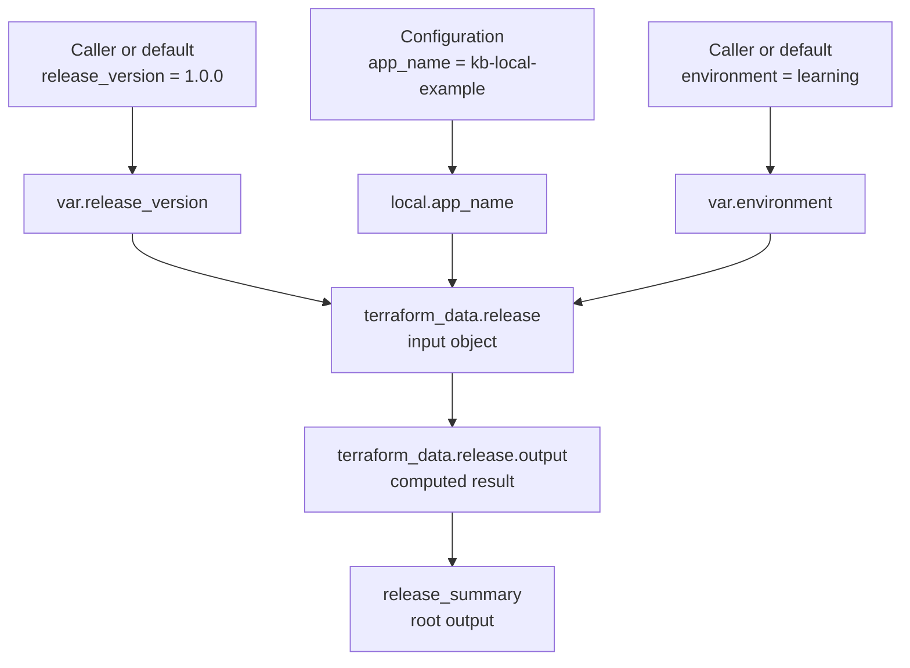

# How values move through Terraform configuration

## In one minute

A Terraform file describes values and the relationships between them. An
**input variable** lets the caller choose a value, a **local value** gives an
expression a reusable name, a **resource** describes something Terraform
manages, and an **output** exposes a result. References connect these parts;
their order in the file is not a list of steps to execute.[^terraform-syntax]
[^terraform-references]

This page explains the language in the [local state lifecycle
tutorial](../examples/local-state-lifecycle/local-state-lifecycle.md). Read
[Terraform fundamentals](../fundamentals/terraform-fundamentals.md) first if
configuration, state, plan, or apply is new. Use the tutorial when you want to
run the example; this page is a reading guide, not a command procedure.

## Why this matters

If you cannot trace a value, a plan can look like a surprise. You might think
editing a variable's default already changed an existing resource before any
plan and apply, or that a one-time `-var` choice became the new default. You
might also mistake a resource's `output` attribute for a separate resource.
Reading the references shows what the configuration requests and which result
may be unavailable until apply.

## Follow one file

The following is the configuration from the tutorial's
[`main.tf`](../examples/local-state-lifecycle/main.tf). It uses
`terraform_data`, a built-in resource that follows the resource lifecycle
while storing an illustrative value in Terraform state; it creates no cloud
object.[^terraform-data]

```hcl
terraform {
  required_version = ">= 1.4.0"
}

variable "environment" {
  type        = string
  description = "Learning environment name recorded in local Terraform state."
  default     = "learning"
}

variable "release_version" {
  type        = string
  description = "Example application version recorded in local Terraform state."
  default     = "1.0.0"
}

locals {
  app_name = "kb-local-example"
}

resource "terraform_data" "release" {
  input = {
    app_name    = local.app_name
    environment = var.environment
    version     = var.release_version
  }
}

output "release_summary" {
  description = "Values stored by the local Terraform data resource."
  value       = terraform_data.release.output
}
```

The `terraform` block sets a version requirement. The remaining blocks form
one value path:

| Part | What it means here | How another expression refers to it |
| --- | --- | --- |
| `variable "environment"` and `variable "release_version"` | Caller inputs with defaults. `type = string` asks Terraform to use string values. | `var.environment` and `var.release_version` |
| `locals { app_name = ... }` | A name for the fixed application name in this example. A local can also compute a value from other expressions.[^terraform-locals] | `local.app_name` (singular) |
| `resource "terraform_data" "release"` | One managed state entry whose `input` is an object containing three named values. | `terraform_data.release` and its attributes |
| `output "release_summary"` | A root-module result derived from the resource. It is not another managed resource. | Shown by `terraform apply` and `terraform output`. If this directory were called as a child module, its caller could read `module.<name>.release_summary`. |

An argument has the form `name = expression`; a block has a type, optional
labels, and a body in braces. In the resource block, `input` is an argument,
and `{ app_name = ..., environment = ..., version = ... }` constructs an
**object** with three attributes. It is not a sequence of three operations.
The `.tf` files in one module directory are evaluated together, so splitting
these blocks into `variables.tf`, `main.tf`, and `outputs.tf` would organize
the reading experience without changing this module's behavior.
[^terraform-syntax][^terraform-files]

## The path a value takes



Text alternative: the caller's `release_version` value becomes
`var.release_version`; the configuration's `app_name` becomes
`local.app_name`; and the caller or default supplies `var.environment` in
the same way as `var.release_version`. Those references fill the
`terraform_data.release` input object. Terraform then
computes the resource's `output` attribute, which the root output
`release_summary` exposes. Follow the arrows to decide where a surprising
result came from.

Terraform reads references to infer dependencies. For example, the root
output depends on `terraform_data.release.output`; it cannot report the
resource result before the resource has produced it. Dependencies come from
the references, even if you move the `output` block above the `resource`
block in the file.[^terraform-references]

## An analogy, with limits

Imagine a workshop filling in a labelled order card. The customer chooses
the optional fields (**input variables**); the workshop has a standard label
it reuses (**local value**); it records the completed card (**resource**);
and it prints a summary (**root output**).

The analogy stops at three important points:

- A `-var` choice for one plan does not rewrite the input default in
  `main.tf`. Planning alone does not change state. **After you apply** the
  plan made with that override, state records `"1.1.0"`; a later plain plan
  compares that stored value with the unchanged `"1.0.0"` default and
  proposes changing it back.[^terraform-variables][^terraform-plan][^terraform-apply]
- The cards are not filled from top to bottom. Terraform follows expression
  references, regardless of block order.[^terraform-references]
- This `terraform_data` example only stores a value in state; no workshop,
  package, or cloud object is created. A real provider can create an external
  object and report attributes that the caller did not supply.[^terraform-data]

## Values known now and values known after apply

The defaults `"learning"` and `"1.0.0"` and the literal local value are
available when this example is planned. Even with known inputs, the
`terraform_data` resource computes its `output` attribute during apply. A
plan that creates the resource or changes its input can therefore show that
attribute, and the root `release_summary` that reads it, as `(known after
apply)`. The placeholder means the result is not yet known in that plan, not
that the configuration has no output. The [local state lifecycle
tutorial](../examples/local-state-lifecycle/local-state-lifecycle.md) shows
when the plan is reviewed and when apply records the result.[^terraform-data]
[^terraform-references]

`type = string` is a type constraint, not a claim that every non-string input
will be rejected: Terraform can convert compatible values. The `default`
supplies a value when a caller does not set one; without a default, the caller
must provide a value before planning. The tutorial's `-var` flag supplies a
one-command override. It does not change the declaration or persist as a new
default.[^terraform-types][^terraform-variables]

The names `release_version`, `version`, and `release` refer to different
things. The resource's `output` attribute and the root `output` block are
also different:

| Name | Meaning in this file |
| --- | --- |
| `variable "release_version"` | A caller input, read as `var.release_version`. |
| `input.version` | The `version` attribute inside the object assigned to the resource's `input`; it receives `var.release_version`. |
| `release` | The local label of the `terraform_data` resource, not the version variable. |
| `terraform_data.release.input` | The resource argument that receives an object built from input and local values. |
| `terraform_data.release.output` | A computed **attribute of the resource**. |
| `output "release_summary"` | A separate **root output block** whose `value` reads that resource attribute. |

The root output is visible after apply and is stored with state. A variable or
local does not get its own state entry just because it is declared, but its
value can appear in a resource, output, or saved plan. Do not place secrets in
this teaching example or assume an output is a safe place to publish them.
[^terraform-outputs][^terraform-sensitive-data]

## Check your understanding

- If you change only the `release_version` default from `"1.0.0"` to
  `"1.1.0"`, which reference carries that value into the resource?
- Why does `local.app_name` have a singular `local.` prefix even though the
  block is named `locals`?
- Why can `release_summary` appear under output changes in a plan while no
  second resource is being created?
- If a plan used `-var='release_version=1.1.0'`, what value would a later
  plain plan use when `main.tf` still defaults to `"1.0.0"`?

## Next steps and official documentation

- Run the [local state lifecycle
  tutorial](../examples/local-state-lifecycle/local-state-lifecycle.md) and
  trace `var.`, `local.`, and `terraform_data.release.output` through its plans.
- For the caller's side, read HashiCorp's [input variable
  guide](https://developer.hashicorp.com/terraform/language/values/variables).
- For reusable names and result exposure, read [locals](https://developer.hashicorp.com/terraform/language/block/locals)
  and [output values](https://developer.hashicorp.com/terraform/language/values/outputs).
- For expression syntax and plan-time unknowns, read [references to
  values](https://developer.hashicorp.com/terraform/language/expressions/references).
- For when a proposal becomes a recorded change, read the [plan](https://developer.hashicorp.com/terraform/cli/commands/plan)
  and [apply](https://developer.hashicorp.com/terraform/cli/commands/apply)
  command references.
- For a change against real infrastructure, continue to [review and apply a
  Terraform change](../commands/core-workflow.md) only when you have a
  project-specific provider, backend, identity check, and verification plan.

[^terraform-syntax]: [Terraform configuration syntax](https://developer.hashicorp.com/terraform/language/syntax/configuration), source record `terraform-syntax`.
[^terraform-files]: [Terraform files and configuration structure](https://developer.hashicorp.com/terraform/language/files), source record `terraform-files`.
[^terraform-variables]: [Terraform input variables](https://developer.hashicorp.com/terraform/language/values/variables), source record `terraform-variables`.
[^terraform-locals]: [Terraform locals block](https://developer.hashicorp.com/terraform/language/block/locals), source record `terraform-locals`.
[^terraform-references]: [Terraform references to values](https://developer.hashicorp.com/terraform/language/expressions/references), source record `terraform-references`.
[^terraform-data]: [Terraform data resource](https://developer.hashicorp.com/terraform/language/resources/terraform-data), source record `terraform-data`.
[^terraform-outputs]: [Terraform output values](https://developer.hashicorp.com/terraform/language/values/outputs), source record `terraform-outputs`.
[^terraform-types]: [Terraform type constraints](https://developer.hashicorp.com/terraform/language/expressions/type-constraints), source record `terraform-types`.
[^terraform-sensitive-data]: [Manage sensitive data in Terraform](https://developer.hashicorp.com/terraform/language/manage-sensitive-data), source record `terraform-sensitive-data`.
[^terraform-plan]: [Terraform plan command](https://developer.hashicorp.com/terraform/cli/commands/plan), source record `terraform-plan`.
[^terraform-apply]: [Terraform apply command](https://developer.hashicorp.com/terraform/cli/commands/apply), source record `terraform-apply`.
