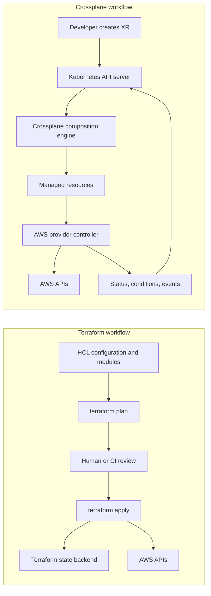

# Terraform vs Crossplane

## Purpose

Use this page to decide when Terraform is enough, when Crossplane adds a better operating model, and which problems Crossplane solves that Terraform does not solve naturally.

The short version: Terraform is excellent for provisioning infrastructure through a deliberate `plan` and `apply` workflow. Crossplane is useful when infrastructure should behave like a continuously reconciled Kubernetes API that developers can consume through self-service resources.

## Bottom line

| Question | Prefer Terraform | Prefer Crossplane |
| --- | --- | --- |
| Do you need an explicit preview before every change? | Yes. `terraform plan` is one of Terraform's biggest strengths. | Crossplane does not provide the same native plan/apply approval model. |
| Do you need continuous drift correction? | Terraform can detect drift during refresh, plan, or apply. | Crossplane controllers continuously observe and reconcile declared state. |
| Do developers need a small internal platform API? | Terraform modules can standardize implementation, but users still interact with Terraform workflows. | XRDs and Compositions expose a Kubernetes API such as `PlatformNetwork` or `AppDatabase`. |
| Is Kubernetes the platform center? | Terraform can manage Kubernetes and cloud resources, but it remains outside the cluster control loop. | Crossplane uses Kubernetes API, RBAC, namespaces, status, events, and GitOps patterns directly. |
| Do you need broad provider coverage beyond Kubernetes-centered platforms? | Terraform is usually stronger. | Crossplane depends on available provider packages and provider maturity. |
| Do you need one-off bootstrap or occasional infrastructure changes? | Terraform is usually simpler. | Crossplane adds a management cluster and controller operations. |

## Different jobs

Terraform answers this question:

> Given this configuration and current state, what changes should we make during this run?

Crossplane answers this question:

> Given these Kubernetes resources, what should controllers continuously do until external systems match the declared state?

That difference matters more than syntax. Terraform configuration is evaluated during an execution. Crossplane resources are stored in the Kubernetes API and watched by controllers.

## Workflow comparison



Terraform is run-based. Crossplane is controller-based. Terraform stops after the apply. Crossplane keeps reconciling while the objects exist.

## What Crossplane brings that Terraform does not solve naturally

### Continuous reconciliation

Terraform does not keep a process running for every resource after `apply`. It stores mappings in state and checks reality again during refresh, plan, or apply. That is strong for controlled change windows, but it is not an always-on controller.

Crossplane providers watch managed resources and keep reconciling. If a value in `spec.forProvider` is the source of truth, Crossplane can restore external drift back to the declared value.

This helps when:

- AWS resources must stay aligned with platform policy after creation.
- Manual console changes should be corrected automatically.
- Teams want readiness and sync status without rerunning a pipeline.
- GitOps should continuously drive both Kubernetes workloads and AWS infrastructure.

Trade-off: always-on reconciliation is powerful, but it means the Crossplane control plane is now production infrastructure. It must be operated, monitored, upgraded, backed up, and protected.

### Kubernetes-native platform APIs

Terraform modules are reusable configuration packages. They are called by Terraform during a run.

Crossplane XRDs define new Kubernetes API types. Developers create instances of those APIs as ordinary Kubernetes resources. A platform team can expose a resource like this:

```yaml
apiVersion: platform.example.org/v1alpha1
kind: PlatformNetwork
metadata:
  name: payments-network
  namespace: payments
spec:
  region: eu-west-1
  cidrBlock: 10.40.0.0/16
  environment: prod
  privateSubnetA:
    availabilityZone: eu-west-1a
    cidrBlock: 10.40.1.0/24
  privateSubnetB:
    availabilityZone: eu-west-1b
    cidrBlock: 10.40.2.0/24
```

What it does: gives a developer a small network API. The developer does not need to know every AWS EC2 managed-resource field, route table association, VPC endpoint object, tag rule, or provider reference.

This solves a platform problem Terraform modules do not solve by themselves: the user-facing interface becomes a live API in the cluster, not only a reusable HCL package consumed by a Terraform runner.

### Self-service with Kubernetes RBAC and namespaces

Terraform access is usually controlled through repository permissions, CI permissions, HCP Terraform workspaces, state backend permissions, cloud IAM, or wrapper portals.

Crossplane can use Kubernetes controls directly:

- A developer can be allowed to create `PlatformNetwork` in the `payments` namespace.
- The same developer can be denied access to raw AWS `VPC`, `Subnet`, or `RouteTable` managed resources.
- Platform teams can provide different `ProviderConfig` objects per namespace or environment.
- Admission policy can validate platform API requests before controllers act.
- Status and events are visible through normal Kubernetes commands.

Terraform can be wrapped to provide self-service, but that wrapper is external to Terraform. Crossplane makes the self-service object itself part of Kubernetes.

### Productized infrastructure APIs instead of shared implementation

A Terraform module primarily standardizes implementation. Consumers still need Terraform variables, Terraform state, Terraform execution permissions, and some knowledge of module behavior.

An XRD plus Composition lets the platform team define an API product:

| Layer | Terraform module model | Crossplane platform API model |
| --- | --- | --- |
| Interface | Module variables and outputs. | XRD schema. |
| Implementation | HCL resources inside the module. | Composition pipeline and composed resources. |
| Call | `module` block in a Terraform root module. | XR such as `PlatformNetwork`. |
| Runtime | Terraform process. | Crossplane and provider controllers. |
| Access control | Git, CI, workspace, state, and cloud IAM controls. | Kubernetes RBAC, namespaces, admission, provider credentials, and cloud IAM controls. |
| Status | Plan/apply output and state. | Kubernetes status, conditions, events, and managed-resource status. |

This matters when infrastructure is consumed frequently by many application teams. The platform team can evolve implementation without asking every consumer to understand AWS resource details.

### App and infrastructure composition in one control plane

Terraform can deploy Kubernetes objects and cloud infrastructure, but it is still an external execution tool. Crossplane can compose:

- AWS resources such as S3 buckets, VPCs, IAM roles, RDS instances, or EKS add-ons.
- Kubernetes resources such as Deployments, Services, Secrets, ConfigMaps, or custom resources.
- Higher-level platform APIs that tie application runtime and cloud dependencies together.

In Crossplane v2, namespaced XRs and namespaced managed resources make this model more natural for tenant and team boundaries.

This helps when an app team should request one object such as `ApplicationEnvironment` and receive the app namespace, IAM role, bucket, database, network attachment, connection details, and status through Kubernetes.

### Operational visibility through Kubernetes primitives

Terraform gives strong apply-time feedback. After the run, teams usually inspect state, CI logs, cloud consoles, monitoring tools, or HCP Terraform.

Crossplane exposes controller-style operational signals:

```bash
kubectl get platformnetworks -n payments
kubectl describe platformnetwork payments-network -n payments
crossplane beta trace platformnetwork.platform.example.org/payments-network -n payments
kubectl get events -n payments
```

What it does: shows the request, composed resources, readiness, sync state, events, and failure points from the same API surface used for Kubernetes workloads.

This is valuable for platform operations because the resource tree is live, queryable, and can be integrated with Kubernetes-native monitoring and GitOps tooling.

### Drift correction as a normal behavior

Terraform can detect drift when a plan refreshes state. That makes drift visible before an approved apply, which is a good governance model.

Crossplane can treat drift correction as part of normal reconciliation. For managed resource fields under `spec.forProvider`, Crossplane's model is that declared state should win. For fields that should not be continuously enforced, Crossplane has options such as `initProvider` and `managementPolicies`, depending on provider support.

This solves a different problem:

- Terraform is good when drift should be reviewed before correction.
- Crossplane is good when drift should usually be corrected automatically.

## What Terraform still does better

Crossplane does not replace Terraform everywhere.

| Terraform strength | Why it still matters |
| --- | --- |
| Explicit plans | Many organizations need human-readable previews before changes. |
| Mature module ecosystem | Terraform modules are widely available, tested, and understood. |
| Broad provider coverage | Terraform has a very broad provider registry and mature non-Kubernetes workflows. |
| One-off provisioning | A CLI run or CI job is simpler than operating a Crossplane management cluster. |
| Bootstrap workflows | Creating the first VPC, EKS cluster, IAM baseline, or control-plane host often fits Terraform well. |
| State refactoring tools | Terraform has mature workflows for moving, importing, and refactoring state. |
| Adoption path | Teams can start with Terraform without making Kubernetes the platform control plane. |

Use Terraform when you want controlled execution. Use Crossplane when you want a platform API that keeps operating.

## XRDs vs Terraform modules

An XRD is not the same thing as a Terraform module.

| Concept | Terraform module | Crossplane XRD |
| --- | --- | --- |
| What it defines | Reusable Terraform configuration. | A Kubernetes API schema. |
| What users create | A `module` block in HCL. | A Kubernetes custom resource, usually an XR. |
| When it runs | During `terraform plan` and `terraform apply`. | Continuously while controllers reconcile the XR. |
| Where state lives | Terraform state. | Kubernetes resources, status, external names, finalizers, and provider controller state. |
| How implementation is attached | Module source and version. | Composition selected by the XR or default XRD behavior. |

The closest Crossplane equivalent to a Terraform module is not only an XRD. It is the XRD plus Composition pair:

- XRD defines the interface.
- Composition defines the implementation.
- XR is the user call.
- Managed resources are the concrete AWS resources created by providers.

## AWS example: VPC module vs Crossplane API

### Terraform module call

```hcl
module "network" {
  source = "git::ssh://git@example.com/platform/terraform-aws-vpc.git?ref=v1.4.0"

  name             = "payments"
  region           = "eu-west-1"
  cidr_block       = "10.40.0.0/16"
  private_subnets  = ["10.40.1.0/24", "10.40.2.0/24"]
  availability_zones = ["eu-west-1a", "eu-west-1b"]
  enable_s3_endpoint = true
}
```

What it does: passes inputs to a reusable Terraform VPC module. Terraform plans the graph, applies changes, and records resource mappings in state.

### Crossplane XR call

```yaml
apiVersion: platform.example.org/v1alpha1
kind: PlatformNetwork
metadata:
  name: payments-network
  namespace: payments
spec:
  region: eu-west-1
  cidrBlock: 10.40.0.0/16
  environment: prod
  privateSubnetA:
    availabilityZone: eu-west-1a
    cidrBlock: 10.40.1.0/24
  privateSubnetB:
    availabilityZone: eu-west-1b
    cidrBlock: 10.40.2.0/24
```

What it does: creates a live Kubernetes object. Crossplane chooses the Composition, creates composed AWS managed resources, reconciles them through AWS provider controllers, and reports status back to the XR.

For the full Crossplane version of this example, read [AWS VPC platform API](aws-vpc-platform-api.md).

## Decision guide

Choose Terraform when:

- The team needs explicit `plan` approval before every change.
- Infrastructure changes are infrequent and controlled by platform or SRE teams.
- The platform does not center on Kubernetes.
- Provider coverage or module maturity is the main requirement.
- You are bootstrapping the management cluster, base cloud account, VPC, or IAM foundation.

Choose Crossplane when:

- Developers should request infrastructure through Kubernetes APIs.
- A platform team wants to publish stable internal APIs such as `PlatformNetwork`, `AppBucket`, or `PlatformDatabase`.
- Infrastructure should be continuously reconciled after creation.
- Kubernetes RBAC, namespaces, admission control, events, and status are part of the operating model.
- GitOps should manage both application manifests and infrastructure requests.
- Repeated infrastructure patterns should feel like platform products, not shared implementation details.

Use both when:

- Terraform creates the base AWS accounts, networking, EKS cluster, and Crossplane installation.
- Crossplane runs inside the management cluster and handles standardized developer-facing infrastructure.
- Ownership boundaries are explicit so both tools never manage the same field of the same external resource.

## Common failure mode

Do not put Terraform and Crossplane in charge of the same live AWS resource fields.

Bad ownership pattern:

```text
Terraform manages aws_vpc.payments.cidr_block
Crossplane manages VPC payments-vpc spec.forProvider.cidrBlock
```

That creates a control conflict. Terraform may plan one change while Crossplane reconciles another. Pick one owner per resource or per field. During migration, use import and observe-only patterns carefully, then move ownership deliberately.

## Practical rule

If the main problem is "how do we provision this infrastructure safely with review," start with Terraform.

If the main problem is "how do we give many teams a stable API that keeps infrastructure healthy after creation," Crossplane brings something Terraform does not provide by itself.

## Related links

- [Crossplane](README.md)
- [Crossplane component model](component-model.md)
- [Crossplane compositions](compositions.md)
- [Deployment patterns and references](deployment-patterns-and-references.md)
- [AWS VPC platform API](aws-vpc-platform-api.md)
- [Crossplane managed resources](https://docs.crossplane.io/latest/managed-resources/managed-resources/)
- [Crossplane XRDs](https://docs.crossplane.io/latest/composition/composite-resource-definitions/)
- [Crossplane Compositions](https://docs.crossplane.io/latest/composition/compositions/)
- [Terraform documentation](https://developer.hashicorp.com/terraform/docs)
- [Terraform modules](https://developer.hashicorp.com/terraform/language/modules)
- [Terraform state](https://developer.hashicorp.com/terraform/language/state)
- [Back to Kubernetes index](../README.md)
- [Back to root index](../../README.md)
