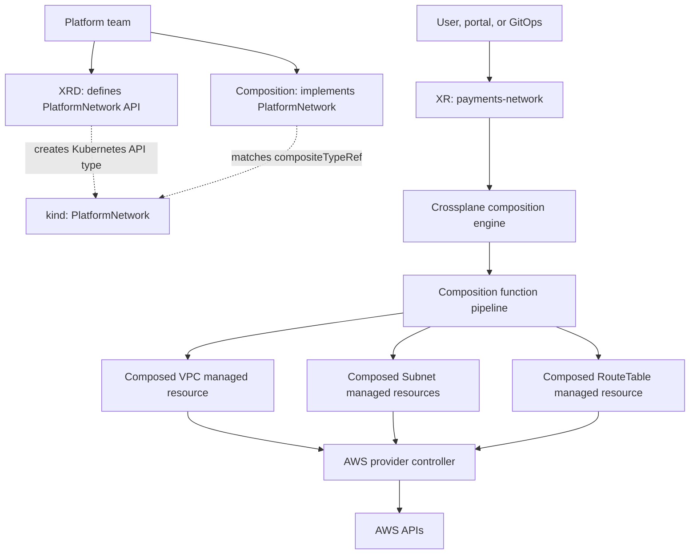

# Crossplane XRDs, Compositions, and XR calls

## Purpose

Use this page to understand the Crossplane platform API model from first principles: what an XRD is, what a Composition is, what an XR is, and what the Crossplane equivalent of a Terraform module call is.

The short answer is:

- You do not call an XRD.
- You usually do not call a Composition directly.
- You create a composite resource, also called an XR.
- The XR is the closest Crossplane equivalent to a Terraform module call.
- The XRD defines the user-facing API contract.
- The Composition implements that API by producing composed resources.

## Terraform module mental model

In Terraform, a platform team may publish a module and an application team calls it from a root module:

```hcl
module "network" {
  source = "git::ssh://git@example.com/platform/terraform-aws-vpc.git?ref=v1.4.0"

  name        = "payments"
  region      = "eu-west-1"
  cidr_block  = "10.40.0.0/16"
  environment = "prod"
}
```

What it does: passes inputs into reusable Terraform configuration. Terraform evaluates the module, builds a plan, applies the graph, and stores resource bindings in Terraform state.

Crossplane splits that idea into Kubernetes API pieces:

| Terraform idea | Crossplane equivalent | Why it is not identical |
| --- | --- | --- |
| Module variable interface | XRD schema | The XRD creates a Kubernetes API type with validation, versions, scope, and composition defaults. |
| Module implementation | Composition | The Composition is a function pipeline that renders Kubernetes and managed resources from the XR. |
| Module call | XR manifest | The user creates an XR such as `PlatformNetwork`; Crossplane reconciles it continuously. |
| Terraform resources inside module | Composed resources | These are Kubernetes resources generated for one XR, often provider managed resources. |
| Terraform provider calls | Crossplane provider controllers | Provider pods call AWS, Azure, Google Cloud, GitHub, or another external API. |
| Terraform state | Kubernetes objects and status | Desired state, observed state, external names, finalizers, conditions, and events live in Kubernetes. |

The important shift is that Terraform runs a command. Crossplane runs controllers.

## Core terms

| Term | What it is | Who creates it | Terraform analogy |
| --- | --- | --- | --- |
| XRD | `CompositeResourceDefinition`; the API definition for an XR type. | Platform team. | Module input contract plus type definition, but as a Kubernetes API. |
| XR | Composite resource; one instance of an XRD-defined API. | Application team, portal, GitOps controller, or platform operator. | The module call. |
| Composition | Implementation that says how an XR becomes other resources. | Platform team. | Module internals. |
| Composition Function | Reusable logic called by a Composition pipeline. | Platform team or package author. | Template, loop, transform, validation, or generation logic. |
| Composed resource | Resource created for one XR by the Composition. | Crossplane composition engine. | Resource blocks produced by the module. |
| Managed resource | Provider-specific Kubernetes object representing one external resource. | User directly or Composition indirectly. | A Terraform resource such as `aws_vpc`, but reconciled by a provider controller. |

## What "call" means in Crossplane

People coming from Terraform often ask, "How do I call a Composition?" The precise Crossplane language is different.

| What you want to do | Crossplane wording | Example |
| --- | --- | --- |
| Define a reusable API | Create or install an XRD. | `kubectl apply -f platformnetwork-xrd.yaml` |
| Define how the API is implemented | Create or install a Composition. | `kubectl apply -f platformnetwork-aws-composition.yaml` |
| Use the API | Create an XR. | `kubectl apply -f payments-network.yaml` |
| Choose one implementation explicitly | Set `spec.crossplane.compositionRef` on the XR. | `compositionRef.name: platformnetwork-aws-private` |
| Choose an implementation by labels | Set `spec.crossplane.compositionSelector` on the XR. | `matchLabels.provider: aws` |
| Choose a default implementation | Set `defaultCompositionRef` on the XRD. | `defaultCompositionRef.name: platformnetwork-aws-private` |
| Force one implementation for all users | Set `enforcedCompositionRef` on the XRD. | `enforcedCompositionRef.name: platformnetwork-standard` |

So the closest phrase to "module call" is:

```text
Create an XR.
```

If someone says "call the Composition," they usually mean one of these:

- Create an XR that matches the Composition's `compositeTypeRef`.
- Create an XR that selects the Composition with `compositionRef`.
- Create an XR that selects the Composition through `compositionSelector`.

The user-facing object is still the XR.

## End-to-end flow



The lifecycle is:

1. The platform team installs an XRD.
2. Kubernetes gets a new API type, such as `PlatformNetwork`.
3. The platform team installs one or more Compositions for that API type.
4. A user creates an XR, such as `payments-network`.
5. Crossplane selects a compatible Composition.
6. Crossplane runs the Composition function pipeline.
7. The pipeline returns desired composed resources.
8. Crossplane creates or updates those composed resources in Kubernetes.
9. Provider controllers reconcile managed resources against external APIs.
10. Status, conditions, resource references, and connection details flow back to the XR.

## XRD in detail

An XRD is the API contract. It answers:

- What is the API group?
- What is the kind users create?
- Is the resource namespaced or cluster-scoped?
- Which versions are served?
- Which version can Compositions reference?
- Which fields may users set under `spec`?
- Which fields are required, optional, defaulted, or constrained?
- Which Composition is the default, if more than one implementation exists?
- Should XR instances automatically follow new Composition revisions?

Example:

```yaml
apiVersion: apiextensions.crossplane.io/v2
kind: CompositeResourceDefinition
metadata:
  name: platformnetworks.platform.example.org
spec:
  scope: Namespaced
  group: platform.example.org
  names:
    kind: PlatformNetwork
    plural: platformnetworks
  defaultCompositionRef:
    name: platformnetwork-aws-private
  defaultCompositionUpdatePolicy: Manual
  versions:
    - name: v1alpha1
      served: true
      referenceable: true
      schema:
        openAPIV3Schema:
          type: object
          properties:
            spec:
              type: object
              properties:
                region:
                  type: string
                  enum:
                    - eu-west-1
                    - us-east-1
                cidrBlock:
                  type: string
                environment:
                  type: string
                  enum:
                    - dev
                    - staging
                    - prod
              required:
                - region
                - cidrBlock
                - environment
```

What it does: creates a namespaced Kubernetes API where users can create `PlatformNetwork` resources in the `platform.example.org/v1alpha1` API group.

### XRD naming rules

| XRD field | Example | Meaning |
| --- | --- | --- |
| `metadata.name` | `platformnetworks.platform.example.org` | Must match `plural.group`. |
| `spec.group` | `platform.example.org` | API group. This becomes the first half of the XR `apiVersion`. |
| `spec.names.kind` | `PlatformNetwork` | Kind users put in XR manifests. |
| `spec.names.plural` | `platformnetworks` | Resource name used by `kubectl get platformnetworks`. |
| `spec.versions[].name` | `v1alpha1` | API version. This becomes the second half of the XR `apiVersion`. |
| `served: true` | `true` | Kubernetes accepts this API version for XR objects. |
| `referenceable: true` | `true` | Compositions may use this version in `compositeTypeRef`. Only one version can be referenceable. |

You may see official examples use an `X` prefix in the kind, such as `XDatabase` or `XPlatformNetwork`, to signal that the type is a Crossplane composite resource. The key rule is consistency: the XR `kind` and every compatible Composition's `compositeTypeRef.kind` must match the XRD `spec.names.kind`.

After the XRD is established, users can work with the new API:

```bash
kubectl get platformnetworks -A
kubectl explain platformnetwork.spec
```

What it does: lists XR instances of this API and shows the schema Kubernetes knows from the XRD.

> [!IMPORTANT]
> Treat the XRD like a product API contract. Renaming `group`, `kind`, `plural`, or removing fields is a breaking change for every XR and Composition that depends on that API.

## Composition in detail

A Composition is the implementation. It answers:

- Which XR kind can use this implementation?
- Which function pipeline should Crossplane run?
- Which composed resources should exist for each XR?
- How do XR fields patch into composed resources?
- How are outputs from composed resources exposed back to the XR?
- Which readiness rules tell Crossplane that the XR is ready?

Example:

```yaml
apiVersion: apiextensions.crossplane.io/v1
kind: Composition
metadata:
  name: platformnetwork-aws-private
  labels:
    provider: aws
    network: private
spec:
  compositeTypeRef:
    apiVersion: platform.example.org/v1alpha1
    kind: PlatformNetwork
  mode: Pipeline
  pipeline:
    - step: patch-and-transform
      functionRef:
        name: function-patch-and-transform
      input:
        apiVersion: pt.fn.crossplane.io/v1beta1
        kind: Resources
        resources:
          - name: vpc
            base:
              apiVersion: ec2.aws.m.upbound.io/v1beta1
              kind: VPC
              spec:
                providerConfigRef:
                  name: default
                  kind: ClusterProviderConfig
                forProvider:
                  region: eu-west-1
                  cidrBlock: 10.0.0.0/16
            patches:
              - type: FromCompositeFieldPath
                fromFieldPath: spec.region
                toFieldPath: spec.forProvider.region
              - type: FromCompositeFieldPath
                fromFieldPath: spec.cidrBlock
                toFieldPath: spec.forProvider.cidrBlock
```

What it does: declares that `PlatformNetwork` XRs may use this Composition. For each matching XR, Crossplane runs the function pipeline and creates a composed AWS `VPC` managed resource.

### Composition matching

This part connects the Composition to the XRD-defined API:

```yaml
spec:
  compositeTypeRef:
    apiVersion: platform.example.org/v1alpha1
    kind: PlatformNetwork
```

What it does: says this Composition can implement XRs whose `apiVersion` is `platform.example.org/v1alpha1` and whose `kind` is `PlatformNetwork`.

The Composition does not define the API. It only says, "I know how to implement this API."

## XR in detail

An XR is the actual request. It answers:

- What does this user want?
- Which namespace owns the request?
- Which values should be passed into the platform API?
- Should this request use the default Composition, a selected Composition, or a selected Composition revision?
- Is the request synced and ready?
- Which composed resources belong to this request?

Example:

```yaml
apiVersion: platform.example.org/v1alpha1
kind: PlatformNetwork
metadata:
  name: payments-network
  namespace: payments
spec:
  region: eu-west-1
  cidrBlock: 10.40.0.0/16
  environment: prod
```

What it does: creates one `PlatformNetwork` XR. Crossplane sees the XR, selects a Composition, and reconciles the composed resources for the `payments-network` instance.

This is the Crossplane equivalent of a Terraform module call.

## Selecting a Composition

If the XRD has `defaultCompositionRef`, the user can omit composition selection from the XR:

```yaml
apiVersion: platform.example.org/v1alpha1
kind: PlatformNetwork
metadata:
  name: payments-network
  namespace: payments
spec:
  region: eu-west-1
  cidrBlock: 10.40.0.0/16
  environment: prod
```

What it does: lets Crossplane use the default Composition from the XRD.

To choose a specific implementation by name, add `compositionRef`:

```yaml
apiVersion: platform.example.org/v1alpha1
kind: PlatformNetwork
metadata:
  name: payments-network
  namespace: payments
spec:
  region: eu-west-1
  cidrBlock: 10.40.0.0/16
  environment: prod
  crossplane:
    compositionRef:
      name: platformnetwork-aws-private
```

What it does: creates the same XR but explicitly tells Crossplane to use the `platformnetwork-aws-private` Composition.

To select by labels, use `compositionSelector`:

```yaml
apiVersion: platform.example.org/v1alpha1
kind: PlatformNetwork
metadata:
  name: payments-network
  namespace: payments
spec:
  region: eu-west-1
  cidrBlock: 10.40.0.0/16
  environment: prod
  crossplane:
    compositionSelector:
      matchLabels:
        provider: aws
        network: private
```

What it does: selects a compatible Composition with matching labels. This is useful when platform teams publish several implementations for the same XRD, such as AWS private, AWS public, or Azure private.

> [!IMPORTANT]
> `compositionRef` and `compositionSelector` do not make an incompatible Composition valid. The selected Composition must still match the XR through `spec.compositeTypeRef.apiVersion` and `spec.compositeTypeRef.kind`.

## XRD versus Composition

| Question | XRD | Composition |
| --- | --- | --- |
| What does it define? | The API contract. | The implementation. |
| Does the user create this per request? | No. It is installed by the platform team. | No. It is installed by the platform team. |
| What does the user create? | An XR whose kind comes from the XRD. | An XR that selects or defaults to this Composition. |
| Does it contain provider resources? | No. It contains schema and API settings. | Yes, directly or through function input/templates. |
| Does it validate user fields? | Yes, through OpenAPI schema. | Not primarily; functions may add logic, but the API schema belongs in the XRD. |
| Can there be many per API? | Usually one XRD per API kind. | Yes, multiple Compositions can implement the same XRD. |
| Can it be versioned? | Yes, through served versions. | Yes, Crossplane creates CompositionRevisions. |
| Is it like a Terraform module? | Only the interface part. | Only the implementation part. |

The pair `XRD + Composition` is closer to a reusable Terraform module than either object alone.

## Naming example from definition to call

This XRD fragment:

```yaml
metadata:
  name: platformnetworks.platform.example.org
spec:
  group: platform.example.org
  names:
    kind: PlatformNetwork
    plural: platformnetworks
  versions:
    - name: v1alpha1
      served: true
      referenceable: true
```

Creates this user-facing XR shape:

```yaml
apiVersion: platform.example.org/v1alpha1
kind: PlatformNetwork
metadata:
  name: payments-network
  namespace: payments
spec: {}
```

And these inspection commands:

```bash
kubectl get platformnetworks -n payments
kubectl describe platformnetwork payments-network -n payments
kubectl get composite -n payments
crossplane beta trace platformnetwork.platform.example.org/payments-network -n payments
```

What it does: shows the custom resource type, one concrete XR instance, the generic composite view, and the full Crossplane resource tree.

## Direct managed resources versus platform APIs

You can use Crossplane without XRDs and Compositions.

Direct managed resource:

```yaml
apiVersion: s3.aws.m.upbound.io/v1beta1
kind: Bucket
metadata:
  name: payments-audit-logs
  namespace: payments
spec:
  forProvider:
    region: eu-west-1
  providerConfigRef:
    name: default
    kind: ClusterProviderConfig
```

What it does: asks the AWS provider to manage one S3 bucket directly.

Platform API:

```yaml
apiVersion: platform.example.org/v1alpha1
kind: AuditLogStore
metadata:
  name: payments
  namespace: payments
spec:
  region: eu-west-1
  retentionDays: 365
  classification: regulated
```

What it does: asks the platform API for an audit log store. The Composition may create a bucket, encryption configuration, lifecycle rules, access policy, monitoring alarms, and Kubernetes connection data behind the scenes.

Use direct managed resources when the consumer should know the provider API. Use XRDs and Compositions when the platform should expose intent and hide implementation.

## Claims and older Crossplane examples

In older Crossplane material, you may see claims or composite resource claims. A claim was a namespaced user-facing object that created or bound to a cluster-scoped XR behind it.

In Crossplane v2, namespaced XRs are the default model, so the usual beginner mental model is simpler:

```text
User creates XR -> Crossplane runs Composition -> composed resources reconcile
```

If you are reading old examples, translate carefully:

| Older or legacy wording | Modern mental model |
| --- | --- |
| Claim | User-facing request object, often replaced by a namespaced XR in v2 designs. |
| XR | Composite resource that the Composition acts on. |
| XRD with `claimNames` | Legacy compatibility pattern rather than the default v2 starting point. |

## Design advice

- Name the XRD after the product API, not after every resource it creates.
- Keep the XR spec small: expose intent, not every provider field.
- Use XRD schema for required fields, enums, simple validation, and defaults.
- Use multiple Compositions when one API needs multiple implementations.
- Use `defaultCompositionRef` when most users should not choose implementation details.
- Use `enforcedCompositionRef` when users must not bypass the standard implementation.
- Use `compositionRef` only when the user or GitOps layer is allowed to choose a specific implementation.
- Put provider credentials in `ProviderConfig` or `ClusterProviderConfig`, not in the XR.
- Patch only the XR fields that the platform API intentionally supports.
- Expose useful status back to the XR so users do not need to inspect every composed resource.
- Treat Composition changes like production code because existing XRs may adopt new CompositionRevisions.

## Troubleshooting the relationship

| Symptom | Likely cause | Next step |
| --- | --- | --- |
| `kubectl apply` rejects the XR kind | The XRD is missing, not established, or the XR `apiVersion`/`kind` does not match it. | Run `kubectl get xrd` and `kubectl api-resources | grep platform.example.org`. |
| XR exists but no composed resources appear | No compatible Composition was selected or the function pipeline failed. | Describe the XR and inspect `Synced`, events, `compositionRef`, and function logs. |
| XR selected the wrong implementation | Multiple Compositions match and defaults/selectors are unclear. | Set `defaultCompositionRef`, `enforcedCompositionRef`, `compositionRef`, or clearer Composition labels. |
| Composition is ignored | `compositeTypeRef` does not match the XRD's group, version, or kind. | Compare `Composition.spec.compositeTypeRef` with the XR `apiVersion` and `kind`. |
| A Composition update changed existing resources unexpectedly | XRs followed new CompositionRevisions automatically. | Use `defaultCompositionUpdatePolicy: Manual` or XR-level `compositionUpdatePolicy: Manual` for production APIs. |

### Inspect the API and selection

```bash
kubectl get xrd
kubectl describe xrd platformnetworks.platform.example.org
kubectl get compositions
kubectl describe composition platformnetwork-aws-private
kubectl get platformnetworks -n payments
kubectl describe platformnetwork payments-network -n payments
```

What it does: checks that the API exists, the Composition points at the right XR type, and the XR selected a Composition and produced resource references.

## Practical memory hook

Use this sentence when you get lost:

```text
The platform team installs the XRD and Composition; the user creates the XR.
```

Or in Terraform terms:

```text
XRD is the input contract, Composition is the module implementation, XR is the module call.
```

## Related links

- [Crossplane](README.md)
- [Crossplane component model](component-model.md)
- [Crossplane compositions](compositions.md)
- [Terraform vs Crossplane](terraform-vs-crossplane.md)
- [AWS VPC platform API](aws-vpc-platform-api.md)
- [Deployment patterns and references](deployment-patterns-and-references.md)
- [Crossplane XRD documentation](https://docs.crossplane.io/latest/composition/composite-resource-definitions/)
- [Crossplane composite resources](https://docs.crossplane.io/latest/composition/composite-resources/)
- [Crossplane Composition documentation](https://docs.crossplane.io/latest/composition/compositions/)
- [Terraform modules](https://developer.hashicorp.com/terraform/language/modules)
- [Back to Kubernetes index](../README.md)
- [Back to root index](../../README.md)
