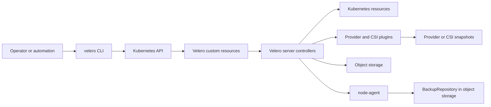

# Velero components and architecture

## Purpose

Use this page to understand Velero's server, CLI, custom resources, controllers, plugins, and data movement components.

## Contents

- [Mental model](#mental-model)
- [Component map](#component-map)
- [Controller responsibilities](#controller-responsibilities)
- [Important custom resources](#important-custom-resources)
- [Backup workflow](#backup-workflow)
- [Restore workflow](#restore-workflow)
- [Scheduled backup workflow](#scheduled-backup-workflow)
- [Storage location architecture](#storage-location-architecture)
- [Backup expiration and retention](#backup-expiration-and-retention)

## Mental model

Velero is built like a Kubernetes operator. The CLI does not directly copy every object into object storage. Instead, the CLI creates Kubernetes custom resources such as `Backup`, `Restore`, and `Schedule`. The Velero server watches those resources, reconciles them, calls the Kubernetes API and provider plugins, and records status back into the custom resources.



What it shows: operators express intent through Velero CRDs, and controllers turn that intent into backup archives, restore operations, snapshots, or file/data movement.

## Component map

| Component | Runs where | Role |
| --- | --- | --- |
| Velero CLI | Operator workstation or automation runner | Creates and inspects Backup, Restore, and Schedule resources. |
| Velero server | Kubernetes cluster | Runs controllers that process Velero custom resources. |
| Velero CRDs | Kubernetes API | Store Velero operations such as backups, restores, schedules, and locations. |
| Backup controller | Velero server | Collects Kubernetes resources and writes backup artifacts to object storage. |
| Restore controller | Velero server | Reads backup artifacts and recreates selected resources and volumes. |
| Plugins | Velero deployment init containers | Add provider-specific object store and volume snapshot behavior. |
| Node-agent | Kubernetes DaemonSet | Hosts file-system backup and data movement controllers on cluster nodes. |
| Data mover pods | Kubernetes workload pods | Move volume data between snapshots, PVCs, and backup repositories. |

## Controller responsibilities

| Controller path | Watches | Does |
| --- | --- | --- |
| Backup | `Backup` | Validates spec, collects resources, writes backup archive, starts volume operations, records warnings and errors. |
| Schedule | `Schedule` | Creates timestamped `Backup` objects from a backup template on a cron interval. |
| Restore | `Restore` | Reads backup metadata and archive, sorts resources, recreates objects, starts volume restores, records skipped resources. |
| Garbage collection | expired `Backup` objects | Deletes expired backup CRs, backup archives, snapshots, and related restores when retention allows it. |
| Backup storage sync | `BackupStorageLocation` and object storage | Recreates missing completed `Backup` CRs from backup files in object storage and removes stale completed CRs whose archive is gone. |
| Backup repository | `BackupRepository` | Manages Kopia repositories used by File System Backup and data movement. |
| Node-agent volume work | `PodVolumeBackup`, `PodVolumeRestore`, `DataUpload`, `DataDownload` | Performs file-system backup, restore, and built-in data movement on nodes. |

## Important custom resources

| Resource | Meaning | Common check |
| --- | --- | --- |
| `Backup` | Requested or completed backup operation. | `velero backup describe <name> --details` |
| `Restore` | Requested or completed restore operation. | `velero restore describe <name> --details` |
| `Schedule` | Cron-style recurring backup definition. | `velero schedule get` |
| `BackupStorageLocation` | Object storage destination for backup metadata and artifacts. | `velero backup-location get` |
| `VolumeSnapshotLocation` | Provider-specific block snapshot location. | `velero snapshot-location get` |
| `BackupRepository` | Repository used by file-system backup or data movement. | `kubectl get backuprepositories -n velero` |
| `PodVolumeBackup` | File-system backup of a pod volume. | `kubectl get podvolumebackups -n velero` |
| `PodVolumeRestore` | File-system restore of a pod volume. | `kubectl get podvolumerestores -n velero` |
| `DataUpload` | Data movement upload operation. | `kubectl get datauploads -n velero` |
| `DataDownload` | Data movement download operation. | `kubectl get datadownloads -n velero` |

### Inspect CRD status directly

```bash
kubectl get backups,restores,schedules -n velero
kubectl describe backup <backup-name> -n velero
kubectl describe restore <restore-name> -n velero
```

What it does: reads the Kubernetes objects Velero controllers reconcile and shows status, phase, errors, warnings, and labels.

### Important labels and status fields

| Field or label | Where to look | Meaning |
| --- | --- | --- |
| `status.phase` | `Backup`, `Restore`, `PodVolumeBackup`, `DataUpload` | Current lifecycle state such as `InProgress`, `Completed`, `PartiallyFailed`, or `Failed`. |
| `status.warnings` and `status.errors` | `Backup` and `Restore` | Count of issues that need log review before trusting the operation. |
| `velero.io/backup-name` | Restored resources and volume-operation objects | Connects a resource or helper object back to the backup that produced it. |
| `velero.io/restore-name` | Restored resources and volume-operation objects | Connects a resource or helper object back to the restore that created it. |
| `velero.io/gc-failure` | `Backup` | Indicates backup garbage collection could not delete one or more artifacts. |

## Backup workflow

When you create a backup, the CLI creates a `Backup` object. The Velero server validates it, queries the Kubernetes API for selected resources, writes a backup archive to the configured `BackupStorageLocation`, and optionally triggers persistent volume protection.

The workflow is:

1. The CLI sends a `Backup` custom resource to the Kubernetes API.
2. The backup controller notices the new object and validates filters, storage location, TTL, hooks, and volume options.
3. The controller queries the API server for resources that match namespace, label, resource, and cluster-scope filters.
4. Velero writes a compressed backup archive and metadata to object storage.
5. If volume backup is enabled, Velero creates provider snapshots, CSI snapshots, `PodVolumeBackup`, or `DataUpload` objects depending on the selected method.
6. The backup completes with status, warnings, errors, expiration, and volume-operation details.

### Create a namespace backup

```bash
velero backup create app-prod-$(date +%Y%m%d%H%M%S) --include-namespaces app-prod --wait
```

What it does: creates a backup for one namespace and waits until the operation reaches a terminal state.

> [!NOTE]
> Velero backups are not fully atomic. If resources are created or modified during backup, some object state may not match a single exact instant.

### Inspect what Velero captured

```bash
velero backup describe <backup-name> --details
velero backup logs <backup-name>
```

What it does: shows included resources, skipped resources, warnings, errors, hook output, and volume backup activity.

## Restore workflow

When you create a restore, the CLI creates a `Restore` object. The restore controller verifies the source backup, downloads backup content from object storage, filters and sorts resources, recreates Kubernetes objects, and restores persistent volume data according to the backup method used.

The workflow is:

1. The CLI sends a `Restore` custom resource to the Kubernetes API.
2. The restore controller validates the backup name, filters, namespace mappings, restore policy, and resource modifiers.
3. The controller reads backup metadata and archive content from object storage.
4. Velero restores eligible resources in an order intended to satisfy dependencies.
5. Existing resources are skipped by default unless an update policy is requested.
6. Velero restores persistent volume data through snapshots, CSI restore behavior, `PodVolumeRestore`, or `DataDownload`.
7. The restore completes with warnings and errors that must be reviewed before the restore is considered usable.

### Inspect restore details

```bash
velero restore describe <restore-name> --details
velero restore logs <restore-name>
```

What it does: shows the resources restored, warnings, errors, and log output needed for troubleshooting.

> [!WARNING]
> A restore can recreate or modify objects in live namespaces. Restore into a temporary namespace first when you are validating behavior or recovering a subset of data.

## Scheduled backup workflow

A `Schedule` is a reusable backup template plus a cron expression. Velero creates timestamped backups from the schedule. Scheduled backups follow the same controller path as manual backups after the `Backup` object exists.

```bash
velero schedule create app-prod-daily \
  --schedule "0 3 * * *" \
  --include-namespaces app-prod \
  --ttl 168h
```

What it does: creates a daily backup template for `app-prod`; each created backup expires after seven days unless retention tooling removes it sooner.

## Storage location architecture

Velero treats object storage as durable backup storage and as the source of truth for backup discovery. If a destination cluster points Velero to the same bucket and prefix, Velero can sync backup metadata from object storage and make those backups available for restore.

Provider snapshots are separate from the backup archive. For AWS, the backup metadata lives in S3, while EBS volume data may live in EBS snapshots unless File System Backup or CSI snapshot data movement copies data into object storage.

### What lives in object storage

| Artifact | Stored in backup object storage | Notes |
| --- | --- | --- |
| Backup metadata | Yes | Used for discovery, status, and restore selection. |
| Kubernetes resource archive | Yes | Contains serialized Kubernetes API objects selected by the backup. |
| Backup and restore logs | Yes | Useful for post-incident review and debugging. |
| Kopia repository data | Yes, when File System Backup or data movement is used | Contains volume data chunks and indexes. |
| Provider-native snapshots | No | Usually live in the cloud provider or storage backend, referenced by metadata. |

### Object storage sync behavior

When a destination cluster starts with access to an existing `BackupStorageLocation`, Velero can discover backup files and create corresponding `Backup` custom resources in the destination cluster. This is why cluster migration and disaster recovery work without copying etcd from the source cluster.

If a completed backup custom resource exists in Kubernetes but the object storage archive is missing, Velero may remove the stale completed backup object during sync. Failed and partially failed backup objects require operator review instead of being treated as trusted restore points.

## Backup expiration and retention

Each backup can have a TTL. When the TTL expires, Velero garbage collection attempts to remove the backup custom resource, backup files from object storage, related restores, and provider snapshots it owns.

```bash
velero backup create app-prod-short-lived \
  --include-namespaces app-prod \
  --ttl 24h \
  --wait
```

What it does: creates a backup that Velero should garbage-collect after 24 hours.

> [!IMPORTANT]
> Align Velero TTL with object storage lifecycle rules, snapshot retention, legal hold, and recovery objectives. If object storage lifecycle deletes data before Velero TTL, the Kubernetes backup object may exist but the restore data may be gone.

## Related links

- [How Velero works](https://velero.io/docs/v1.18/how-velero-works/)
- [Velero API types](https://velero.io/docs/v1.18/api-types/)
- [Velero backup reference](https://velero.io/docs/v1.18/backup-reference/)
- [Velero restore reference](https://velero.io/docs/v1.18/restore-reference/)
- [Backup and restore workflows](backup-restore-workflows.md)
- [Back to Velero index](README.md)
- [Back to migrations index](../README.md)
- [Back to root index](../../README.md)
