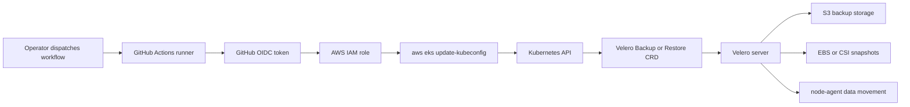

# Velero possible integrations

## Purpose

Use this page to understand how Velero can be triggered from automation systems such as GitHub Actions, what the pipeline can safely do, and what configuration must already exist in AWS, EKS, Kubernetes, and Velero.

The example focuses on GitHub Actions running against Amazon EKS. The same operating model applies to other automation runners: the runner authenticates to the cloud, connects to the cluster, creates Velero `Backup` or `Restore` custom resources, waits for completion, and publishes logs for review.

## Contents

- [Can Velero run from a pipeline?](#can-velero-run-from-a-pipeline)
- [Automation model](#automation-model)
- [Pipeline modes](#pipeline-modes)
- [Required platform setup](#required-platform-setup)
- [Instruction file](#instruction-file)
- [Default GitHub Actions workflow](#default-github-actions-workflow)
- [Velero configuration needed by the pipeline](#velero-configuration-needed-by-the-pipeline)
- [Security and approval controls](#security-and-approval-controls)
- [Operating process](#operating-process)
- [Failure handling](#failure-handling)

## Can Velero run from a pipeline?

Yes. The Velero CLI is only a client that creates and inspects Velero Kubernetes custom resources. A GitHub Actions runner can run the CLI the same way an operator does from a workstation.

The pipeline does not need direct access to object storage backup data. It needs:

- Cloud identity that can connect to the target cluster.
- Kubernetes access to create and inspect Velero resources in the `velero` namespace.
- A Velero server already installed in the cluster.
- A working `BackupStorageLocation`.
- Snapshot, node-agent, and data mover configuration when volume data is part of the operation.

> [!IMPORTANT]
> A pipeline can standardize backup and restore commands, but it does not make migrations automatically safe. Restores and migration cutovers still need application owner validation, data consistency planning, and rollback decisions.

## Automation model



What it shows: GitHub Actions authenticates to AWS with short-lived credentials, connects to EKS, creates Velero resources, and lets the Velero server perform backup or restore work.

## Pipeline modes

| Mode | Target cluster | What it does |
| --- | --- | --- |
| `backup` | Source or normal production cluster | Creates a manual backup for selected namespaces or the full cluster resource set. |
| `migration-backup` | Source cluster | Creates a migration-oriented backup, usually with File System Backup or data movement for portable PVC file data. |
| `restore-test` | Non-production or isolated target cluster | Restores a backup into mapped namespaces for validation. |
| `migration-restore` | Destination cluster | Restores a migration backup after destination prerequisites are ready. |

> [!WARNING]
> `restore-test` and `migration-restore` can create workloads, Secrets, PVCs, Services, Ingresses, and cloud load balancers. Protect these modes with GitHub environments, required reviewers, and a non-production default target.

## Required platform setup

| Area | Requirement |
| --- | --- |
| GitHub OIDC | AWS trusts `token.actions.githubusercontent.com` and only the intended repository, branch, or environment can assume the role. |
| GitHub environment | Use an environment such as `production-velero` with required reviewers for restore and migration modes. |
| AWS IAM role for GitHub Actions | Allows `eks:DescribeCluster` and, when needed, assumes or maps to the EKS cluster access role. |
| EKS access | The IAM role is authorized in EKS access entries or Kubernetes RBAC to create and inspect Velero CRDs. |
| Velero server | Installed in the cluster with provider plugins, `BackupStorageLocation`, and optional snapshot/data movement configuration. |
| Velero CLI | Installed by the workflow on the runner. |
| Object storage | S3 bucket, prefix, encryption, lifecycle, and access policy are already configured. |
| Volume backup path | EBS/CSI snapshots, CSI data movement, or File System Backup is tested before migration use. |

## Instruction file

Keep operation inputs in a small file reviewed with the workflow run. JSON is used here because GitHub-hosted runners can parse it with Node.js without adding `yq`.

Recommended path:

```text
.github/velero/operation.json
```

Default instruction file:

```json
{
  "mode": "backup",
  "aws_account_id": "111122223333",
  "aws_region": "eu-west-1",
  "cluster_name": "prod-eks",
  "github_actions_role_arn": "arn:aws:iam::111122223333:role/github-actions-velero-operator",
  "cluster_role_arn": "arn:aws:iam::111122223333:role/eks-velero-operator",
  "backup_name": "manual-app-prod-20260726",
  "restore_name": "app-prod-restore-test-20260726",
  "restore_from_backup": "manual-app-prod-20260726",
  "namespaces": [
    "app-prod"
  ],
  "namespace_mappings": {
    "app-prod": "app-prod-restore"
  },
  "full_cluster_resources": false,
  "include_cluster_resources": false,
  "snapshot_volumes": true,
  "default_volumes_to_fs_backup": false,
  "ttl": "168h",
  "backup_storage_location": "default",
  "volume_snapshot_locations": [
    "default"
  ],
  "existing_resource_policy": "none"
}
```

What it does: describes the AWS account, region, EKS cluster, IAM roles, operation mode, namespace scope, volume behavior, and restore mappings for one workflow run.

### Full cluster resource backup option

Set this when you need a broad cluster recovery point:

```json
{
  "mode": "backup",
  "aws_account_id": "111122223333",
  "aws_region": "eu-west-1",
  "cluster_name": "prod-eks",
  "github_actions_role_arn": "arn:aws:iam::111122223333:role/github-actions-velero-operator",
  "cluster_role_arn": "arn:aws:iam::111122223333:role/eks-velero-operator",
  "backup_name": "full-cluster-resources-20260726",
  "namespaces": [],
  "full_cluster_resources": true,
  "include_cluster_resources": true,
  "snapshot_volumes": false,
  "default_volumes_to_fs_backup": false,
  "ttl": "72h",
  "backup_storage_location": "default",
  "volume_snapshot_locations": []
}
```

What it does: creates a full Kubernetes resource backup across namespaces and cluster-scoped objects without volume snapshots. This is useful before platform maintenance, but it should be reviewed before restore because cluster-scoped objects can affect the whole cluster.

> [!WARNING]
> Full cluster resource backup can include Secrets, RBAC, CRDs, webhooks, and platform objects. Store backup data securely and avoid restoring cluster-scoped resources into a shared destination without review.

## Default GitHub Actions workflow

Recommended path:

```text
.github/workflows/velero-operations.yml
```

```yaml
name: Velero operations

on:
  workflow_dispatch:
    inputs:
      mode:
        description: Velero operation mode.
        required: true
        type: choice
        options:
        - backup
        - migration-backup
        - restore-test
        - migration-restore
      operation_file:
        description: Path to the JSON instruction file.
        required: true
        default: .github/velero/operation.json
      execute:
        description: Run the generated Velero command. If false, only print the plan.
        required: true
        type: boolean
        default: false
      reason:
        description: Change, incident, or migration ticket reference.
        required: true
        type: string

permissions:
  id-token: write
  contents: read

concurrency:
  group: velero-${{ inputs.mode }}-${{ github.ref }}
  cancel-in-progress: false

jobs:
  velero:
    runs-on: ubuntu-latest
    environment:
      name: production-velero
    steps:
    - name: Checkout repository
      uses: actions/checkout@v4

    - name: Parse operation file
      id: operation
      env:
        INPUT_MODE: ${{ inputs.mode }}
        OPERATION_FILE: ${{ inputs.operation_file }}
      run: |
        node <<'NODE'
        const fs = require("fs");
        const path = process.env.OPERATION_FILE;
        const mode = process.env.INPUT_MODE;
        const allowedModes = ["backup", "migration-backup", "restore-test", "migration-restore"];

        function fail(message) {
          console.error(message);
          process.exit(1);
        }

        function required(config, name) {
          if (config[name] === undefined || config[name] === null || config[name] === "") {
            fail(`Missing required field: ${name}`);
          }
          return config[name];
        }

        function shellQuote(value) {
          return `'${String(value).replace(/'/g, `'\\''`)}'`;
        }

        function output(name, value) {
          fs.appendFileSync(process.env.GITHUB_OUTPUT, `${name}=${value}\n`);
        }

        const config = JSON.parse(fs.readFileSync(path, "utf8"));

        if (!allowedModes.includes(mode)) {
          fail(`Unsupported workflow mode: ${mode}`);
        }
        if (config.mode && config.mode !== mode) {
          fail(`Workflow mode ${mode} does not match operation file mode ${config.mode}`);
        }

        const awsRegion = required(config, "aws_region");
        const roleToAssume = required(config, "github_actions_role_arn");
        const clusterName = required(config, "cluster_name");
        const clusterRoleArn = config.cluster_role_arn || "";
        const namespaces = Array.isArray(config.namespaces) ? config.namespaces : [];
        const fullClusterResources = Boolean(config.full_cluster_resources);
        const includeClusterResources = Boolean(config.include_cluster_resources);
        const backupStorageLocation = config.backup_storage_location || "default";
        const volumeSnapshotLocations = Array.isArray(config.volume_snapshot_locations) ? config.volume_snapshot_locations : [];

        let command = [];

        if (mode === "backup" || mode === "migration-backup") {
          const backupName = required(config, "backup_name");
          command = ["velero", "backup", "create", backupName, "--wait"];

          if (!fullClusterResources && namespaces.length > 0) {
            command.push("--include-namespaces", namespaces.join(","));
          }
          if (fullClusterResources || includeClusterResources) {
            command.push("--include-cluster-resources=true");
          }
          if (config.ttl) {
            command.push("--ttl", config.ttl);
          }
          if (backupStorageLocation) {
            command.push("--storage-location", backupStorageLocation);
          }
          if (volumeSnapshotLocations.length > 0) {
            command.push("--volume-snapshot-locations", volumeSnapshotLocations.join(","));
          }
          if (config.snapshot_volumes === false) {
            command.push("--snapshot-volumes=false");
          }
          if (config.default_volumes_to_fs_backup === true || mode === "migration-backup") {
            command.push("--default-volumes-to-fs-backup");
          }
        }

        if (mode === "restore-test" || mode === "migration-restore") {
          const restoreName = required(config, "restore_name");
          const sourceBackup = required(config, "restore_from_backup");
          command = ["velero", "restore", "create", restoreName, "--from-backup", sourceBackup, "--wait"];

          if (namespaces.length > 0) {
            command.push("--include-namespaces", namespaces.join(","));
          }

          const mappings = config.namespace_mappings || {};
          const mappingText = Object.entries(mappings).map(([from, to]) => `${from}:${to}`).join(",");
          if (mappingText) {
            command.push("--namespace-mappings", mappingText);
          }

          if (config.existing_resource_policy && config.existing_resource_policy !== "none") {
            command.push("--existing-resource-policy", config.existing_resource_policy);
          }
        }

        const script = [
          "#!/usr/bin/env bash",
          "set -euo pipefail",
          command.map(shellQuote).join(" ")
        ].join("\n") + "\n";

        fs.writeFileSync(`${process.env.RUNNER_TEMP}/velero-command.sh`, script, { mode: 0o755 });
        output("aws_region", awsRegion);
        output("role_to_assume", roleToAssume);
        output("cluster_name", clusterName);
        output("cluster_role_arn", clusterRoleArn);
        output("namespaces", namespaces.join(","));
        output("full_cluster_resources", String(fullClusterResources));
        NODE

    - name: Configure AWS credentials
      uses: aws-actions/configure-aws-credentials@v6
      with:
        role-to-assume: ${{ steps.operation.outputs.role_to_assume }}
        aws-region: ${{ steps.operation.outputs.aws_region }}

    - name: Install Velero CLI
      env:
        VELERO_VERSION: v1.18.0
      run: |
        curl -fsSL -o velero.tar.gz "https://github.com/vmware-tanzu/velero/releases/download/${VELERO_VERSION}/velero-${VELERO_VERSION}-linux-amd64.tar.gz"
        tar -xzf velero.tar.gz
        sudo mv "velero-${VELERO_VERSION}-linux-amd64/velero" /usr/local/bin/velero
        velero version --client-only

    - name: Install kubectl
      env:
        KUBECTL_VERSION: v1.30.0
      run: |
        curl -fsSLO "https://dl.k8s.io/release/${KUBECTL_VERSION}/bin/linux/amd64/kubectl"
        sudo install -o root -g root -m 0755 kubectl /usr/local/bin/kubectl
        kubectl version --client=true

    - name: Connect to EKS
      run: |
        if [ -n "${{ steps.operation.outputs.cluster_role_arn }}" ]; then
          aws eks update-kubeconfig \
            --name "${{ steps.operation.outputs.cluster_name }}" \
            --region "${{ steps.operation.outputs.aws_region }}" \
            --role-arn "${{ steps.operation.outputs.cluster_role_arn }}"
        else
          aws eks update-kubeconfig \
            --name "${{ steps.operation.outputs.cluster_name }}" \
            --region "${{ steps.operation.outputs.aws_region }}"
        fi

    - name: Preflight checks
      run: |
        kubectl get namespace velero
        kubectl auth can-i create backups.velero.io -n velero
        kubectl auth can-i create restores.velero.io -n velero
        velero version
        velero backup-location get
        velero snapshot-location get || true

    - name: Show generated Velero command
      run: |
        cat "$RUNNER_TEMP/velero-command.sh"

    - name: Execute Velero operation
      if: ${{ inputs.execute == true }}
      run: |
        "$RUNNER_TEMP/velero-command.sh"

    - name: Collect Velero status
      if: always()
      run: |
        velero backup get || true
        velero restore get || true
        kubectl get backups,restores,podvolumebackups,podvolumerestores,datauploads,datadownloads -n velero || true
```

What it does: creates a manually dispatched workflow that reads one operation file, authenticates to AWS with OIDC, connects to EKS, generates a Velero backup or restore command, prints it for review, and only executes it when `execute` is true.

> [!IMPORTANT]
> For production, pin third-party actions to a reviewed commit SHA instead of only a major version tag, and protect the GitHub environment with required reviewers.

## Velero configuration needed by the pipeline

The pipeline assumes Velero server-side configuration already exists. The workflow should not install or reconfigure Velero during each backup run.

### Backup storage

```yaml
apiVersion: velero.io/v1
kind: BackupStorageLocation
metadata:
  name: default
  namespace: velero
spec:
  provider: aws
  objectStorage:
    bucket: my-velero-backups
    prefix: clusters/prod-eks
  config:
    region: eu-west-1
  accessMode: ReadWrite
```

What it does: gives the Velero server a durable S3 location for backup metadata, resource archives, logs, and repository data.

### Snapshot location

```yaml
apiVersion: velero.io/v1
kind: VolumeSnapshotLocation
metadata:
  name: default
  namespace: velero
spec:
  provider: aws
  config:
    region: eu-west-1
```

What it does: tells Velero where provider snapshot operations should run.

### EBS CSI snapshot class

```yaml
apiVersion: snapshot.storage.k8s.io/v1
kind: VolumeSnapshotClass
metadata:
  name: ebs-csi-velero
  labels:
    velero.io/csi-volumesnapshot-class: "true"
driver: ebs.csi.aws.com
deletionPolicy: Delete
```

What it does: lets Velero choose an EBS CSI snapshot class for CSI-backed PVC snapshots.

### GitHub Actions IAM trust policy

```json
{
  "Version": "2012-10-17",
  "Statement": [
    {
      "Effect": "Allow",
      "Principal": {
        "Federated": "arn:aws:iam::111122223333:oidc-provider/token.actions.githubusercontent.com"
      },
      "Action": "sts:AssumeRoleWithWebIdentity",
      "Condition": {
        "StringEquals": {
          "token.actions.githubusercontent.com:aud": "sts.amazonaws.com",
          "token.actions.githubusercontent.com:sub": "repo:David-A18/MY-humble-knowledge-for-everyone:environment:production-velero"
        }
      }
    }
  ]
}
```

What it does: allows only workflow jobs for the protected `production-velero` GitHub environment in this repository to assume the AWS role.

### GitHub Actions AWS permissions

```json
{
  "Version": "2012-10-17",
  "Statement": [
    {
      "Effect": "Allow",
      "Action": [
        "eks:DescribeCluster"
      ],
      "Resource": "arn:aws:eks:eu-west-1:111122223333:cluster/prod-eks"
    },
    {
      "Effect": "Allow",
      "Action": [
        "sts:AssumeRole"
      ],
      "Resource": "arn:aws:iam::111122223333:role/eks-velero-operator"
    }
  ]
}
```

What it does: lets the workflow discover the EKS cluster and optionally assume the cluster access role used by `aws eks update-kubeconfig`.

### Kubernetes access for the automation role

```yaml
apiVersion: rbac.authorization.k8s.io/v1
kind: Role
metadata:
  name: velero-automation-operator
  namespace: velero
rules:
- apiGroups:
  - velero.io
  resources:
  - backups
  - restores
  - schedules
  - backupstoragelocations
  - volumesnapshotlocations
  - podvolumebackups
  - podvolumerestores
  - datauploads
  - datadownloads
  verbs:
  - get
  - list
  - watch
  - create
- apiGroups:
  - velero.io
  resources:
  - backups/logs
  - restores/logs
  verbs:
  - get
```

What it does: grants namespace-scoped access to create Velero operation objects and read their status and logs. Bind this role to the Kubernetes identity that maps from the GitHub Actions AWS role.

> [!NOTE]
> The Velero server service account still performs the actual backup and restore work. The GitHub Actions identity mostly needs permission to create and inspect Velero custom resources.

## Security and approval controls

| Control | Why it matters |
| --- | --- |
| GitHub environment required reviewers | Prevents accidental restore or migration runs from starting without human approval. |
| OIDC instead of static AWS keys | Avoids long-lived cloud secrets in GitHub. |
| Branch and environment-scoped trust policy | Prevents other repositories or branches from assuming the backup role. |
| `execute` defaults to false | Lets operators generate and inspect the command before running it. |
| Separate source and destination operation files | Avoids running a restore against the wrong cluster during migration. |
| Least-privilege Kubernetes RBAC | Limits what the automation runner can create directly. |
| Backup storage encryption and lifecycle | Protects Secrets and limits cost. |

## Operating process

1. Confirm Velero server is healthy in the target cluster.
2. Create or update `.github/velero/operation.json`.
3. Open the GitHub Actions workflow.
4. Select the mode that matches the instruction file.
5. Run with `execute=false` first and review the generated command.
6. Re-run with `execute=true` after approval.
7. Review backup or restore logs.
8. For restores, validate Kubernetes state and application data before cutover.

### Source-side migration backup

```json
{
  "mode": "migration-backup",
  "aws_account_id": "111122223333",
  "aws_region": "eu-west-1",
  "cluster_name": "legacy-eks",
  "github_actions_role_arn": "arn:aws:iam::111122223333:role/github-actions-velero-operator",
  "cluster_role_arn": "arn:aws:iam::111122223333:role/eks-velero-operator",
  "backup_name": "team-a-migration-20260726",
  "namespaces": [
    "team-a"
  ],
  "full_cluster_resources": false,
  "include_cluster_resources": false,
  "snapshot_volumes": false,
  "default_volumes_to_fs_backup": true,
  "ttl": "168h",
  "backup_storage_location": "default",
  "volume_snapshot_locations": []
}
```

What it does: backs up the `team-a` namespace and uses File System Backup for eligible pod volumes so the backup is more portable across clusters or providers.

### Destination-side migration restore

```json
{
  "mode": "migration-restore",
  "aws_account_id": "111122223333",
  "aws_region": "eu-west-1",
  "cluster_name": "tooling-eks",
  "github_actions_role_arn": "arn:aws:iam::111122223333:role/github-actions-velero-operator",
  "cluster_role_arn": "arn:aws:iam::111122223333:role/eks-velero-operator",
  "restore_name": "team-a-migration-restore-20260726",
  "restore_from_backup": "team-a-migration-20260726",
  "namespaces": [
    "team-a"
  ],
  "namespace_mappings": {
    "team-a": "team-a"
  },
  "existing_resource_policy": "none"
}
```

What it does: restores the migration backup into the destination cluster after Velero has synced backup metadata from object storage.

## Failure handling

| Failure | First checks |
| --- | --- |
| Workflow cannot assume AWS role | Check GitHub environment, OIDC trust `sub`, `id-token: write`, and role ARN. |
| `aws eks update-kubeconfig` fails | Check `eks:DescribeCluster`, region, cluster name, and optional cluster role trust. |
| `kubectl auth can-i` fails | Check EKS access entries, `aws-auth`, or Kubernetes RBAC binding. |
| `velero backup-location get` is unavailable | Check Velero server, S3 bucket, region, credentials, and network. |
| Backup is `PartiallyFailed` | Run `velero backup describe <name> --details` and inspect skipped resources or volume failures. |
| Restore collides with existing objects | Restore into mapped namespaces or deliberately use an existing-resource policy after review. |
| PVCs stay pending after restore | Check StorageClass mapping, CSI driver, snapshot access, and `DataDownload` or `PodVolumeRestore` status. |

## Related links

- [GitHub Actions OIDC with AWS](https://docs.github.com/en/actions/how-tos/secure-your-work/security-harden-deployments/oidc-in-aws)
- [GitHub Actions environments](https://docs.github.com/en/actions/reference/workflows-and-actions/deployments-and-environments)
- [AWS configure credentials action](https://github.com/aws-actions/configure-aws-credentials)
- [AWS EKS update-kubeconfig](https://docs.aws.amazon.com/cli/v2/reference/eks/update-kubeconfig.html)
- [Velero backup reference](https://velero.io/docs/v1.18/backup-reference/)
- [Velero restore reference](https://velero.io/docs/v1.18/restore-reference/)
- [Backup and restore workflows](backup-restore-workflows.md)
- [Cluster migration and disaster recovery](cluster-migration-and-disaster-recovery.md)
- [Back to Velero index](README.md)
- [Back to migrations index](../README.md)
- [Back to root index](../../README.md)
