# Akamai vs. Amazon CloudFront

## A complete AWS Solutions Architect guide to CDN architecture, edge security, caching, AWS/EKS integration, operations, and use cases

> **Last verified:** 18 July 2026  
> **Audience:** Cloud engineers, AWS solutions architects, DevOps engineers, platform engineers, security engineers, and Kubernetes/EKS administrators  
> **Important correction:** The product and company name is **Akamai**, not “Acamai” or “ACAMAI.”

---

## Table of contents

1. [Executive summary](#1-executive-summary)
2. [The first concept to understand: CDN and edge computing](#2-the-first-concept-to-understand-cdn-and-edge-computing)
3. [What Akamai actually is](#3-what-akamai-actually-is)
4. [What Amazon CloudFront is](#4-what-amazon-cloudfront-is)
5. [Why Akamai is not compared only with CloudFront](#5-why-akamai-is-not-compared-only-with-cloudfront)
6. [How a request flows through Akamai](#6-how-a-request-flows-through-akamai)
7. [How a request flows through CloudFront](#7-how-a-request-flows-through-cloudfront)
8. [Core Akamai concepts and components](#8-core-akamai-concepts-and-components)
9. [Core CloudFront and AWS edge components](#9-core-cloudfront-and-aws-edge-components)
10. [Detailed feature comparison](#10-detailed-feature-comparison)
11. [Caching in depth](#11-caching-in-depth)
12. [Security in depth](#12-security-in-depth)
13. [Origin protection and AWS networking](#13-origin-protection-and-aws-networking)
14. [Akamai in front of EKS](#14-akamai-in-front-of-eks)
15. [CloudFront in front of EKS](#15-cloudfront-in-front-of-eks)
16. [Practical use cases](#16-practical-use-cases)
17. [Reference architectures](#17-reference-architectures)
18. [Deployment workflow with Akamai](#18-deployment-workflow-with-akamai)
19. [Deployment workflow with CloudFront](#19-deployment-workflow-with-cloudfront)
20. [DNS, TLS, migration, and rollback](#20-dns-tls-migration-and-rollback)
21. [Infrastructure as code and automation](#21-infrastructure-as-code-and-automation)
22. [Edge-compute examples](#22-edge-compute-examples)
23. [Observability and logging](#23-observability-and-logging)
24. [Troubleshooting playbook](#24-troubleshooting-playbook)
25. [Performance testing and cost evaluation](#25-performance-testing-and-cost-evaluation)
26. [When to choose Akamai](#26-when-to-choose-akamai)
27. [When to choose CloudFront](#27-when-to-choose-cloudfront)
28. [Multi-CDN architecture](#28-multi-cdn-architecture)
29. [Common mistakes](#29-common-mistakes)
30. [Hands-on learning lab](#30-hands-on-learning-lab)
31. [Interview questions and answers](#31-interview-questions-and-answers)
32. [Decision checklist](#32-decision-checklist)
33. [Glossary](#33-glossary)
34. [Official references](#34-official-references)

---

# 1. Executive summary

Akamai and Amazon CloudFront both operate at the **edge of the internet**. They can receive a user's request before it reaches the application, return cached content close to the user, accelerate requests that must reach the origin, and apply security controls before traffic enters the application infrastructure.

The simplest comparison is:

```text
Amazon CloudFront
    = AWS-native content delivery network and edge platform

Akamai
    = independent global edge, delivery, security, DNS,
      traffic-management, and distributed-cloud platform
```

This means that Akamai is not just “another CloudFront.” A more realistic service comparison is often:

```text
Akamai delivery and security portfolio
                versus
CloudFront + AWS WAF + AWS Shield + Route 53
+ CloudFront Functions/Lambda@Edge
+ CloudWatch/Kinesis logging
+ additional AWS security services
```

CloudFront is normally easier to adopt when the organization is strongly centered on AWS. It integrates directly with services such as Amazon S3, Application Load Balancer, API Gateway, AWS Certificate Manager, AWS WAF, AWS Shield, Route 53, IAM, CloudFormation, CDK, and CloudWatch.

Akamai is attractive when an organization needs a cloud-independent edge layer, advanced application and API protection, bot management, global media delivery, complex edge behavior, multicloud support, or one common delivery and security platform in front of AWS, Azure, Google Cloud, SaaS, and on-premises origins.

Neither platform is automatically “better.” The correct selection depends on:

- Where the origins run.
- Where the users are.
- Whether the content is static, dynamic, personalized, API-based, or streaming.
- Security and bot-management requirements.
- The team's operating model.
- Existing contracts and skills.
- Required integrations.
- Actual performance tests.
- Total cost, not only bandwidth price.

---

# 2. The first concept to understand: CDN and edge computing

## 2.1 What is a CDN?

A **Content Delivery Network**, or CDN, is a distributed network of servers that delivers content from locations closer to users.

Without a CDN:

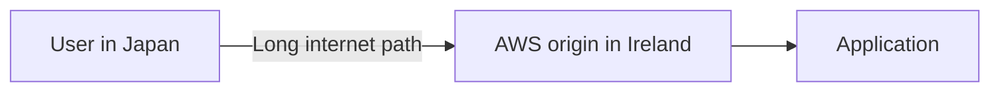

With a CDN:

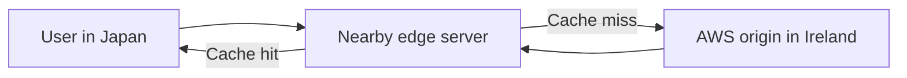

Typical content delivered by a CDN includes:

- HTML.
- CSS.
- JavaScript.
- Images.
- Fonts.
- Video segments.
- Software packages.
- Documents.
- Public API responses.
- Dynamically generated responses in some designs.

The original source of the content is called the **origin**.

## 2.2 What is an edge server?

An edge server is a server positioned close to internet users from a network perspective.

An edge server may:

- Terminate TLS.
- Inspect HTTP requests.
- Block attacks.
- Return cached content.
- Compress responses.
- Rewrite URLs.
- Add or remove headers.
- Execute lightweight code.
- Choose an origin.
- Record access and security events.

## 2.3 Cache hit and cache miss

A **cache hit** occurs when the edge already has a valid copy of the requested object:

```text
User → Edge cache → Response
```

The origin receives no request.

A **cache miss** occurs when the object is absent, expired, invalidated, or does not match the request's cache key:

```text
User → Edge → Origin → Edge → User
```

## 2.4 Origin offload

**Origin offload** is the percentage of traffic served without contacting the origin.

For example:

```text
1,000,000 viewer requests
900,000 served from edge cache
100,000 sent to origin

Request offload = 90%
```

High offload can reduce:

- Application load.
- Load-balancer traffic.
- EKS pod CPU and memory usage.
- Autoscaling events.
- Database pressure.
- Origin bandwidth.
- Cost.
- Exposure during traffic spikes.

However, a high hit ratio is valuable only when the correct content is returned. Incorrect caching can expose private data or produce stale business information.

## 2.5 CDN versus edge computing

A CDN primarily caches and delivers content.

**Edge computing** adds programmable logic at or near the edge. Examples include:

- Redirecting users by country.
- Validating a signed request.
- Normalizing headers.
- Performing A/B testing.
- Choosing an origin.
- Creating a response without reaching the origin.
- Applying device-specific behavior.

Akamai uses products such as **EdgeWorkers** and **EdgeKV** for edge applications. AWS provides **CloudFront Functions** and **Lambda@Edge** for CloudFront customization.

---

# 3. What Akamai actually is

Akamai is an independent cloud, edge, security, and content-delivery company. Its platform is not tied to one hyperscale cloud provider.

An Akamai edge configuration can front origins hosted in:

- AWS.
- Microsoft Azure.
- Google Cloud.
- Akamai Cloud.
- An on-premises data center.
- A colocation facility.
- A SaaS provider.
- Several environments simultaneously.

The public request path can look like this:

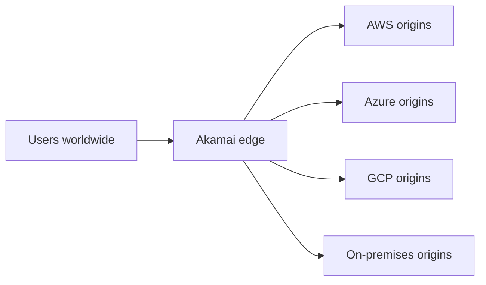

Akamai's portfolio includes capabilities in several categories.

### Delivery and acceleration

- Web and application delivery.
- API acceleration.
- Large-file download delivery.
- Video and streaming delivery.
- Dynamic-content acceleration.
- Tiered caching.
- Route optimization.

### Security

- Web Application Firewall.
- Application and API protection.
- Bot detection and mitigation.
- Layer 7 DDoS protection.
- Network-layer DDoS services.
- Account-abuse protection.
- API discovery and security.
- Client-side security.
- Zero-trust and segmentation products.

### DNS and traffic management

- Authoritative DNS with Edge DNS.
- Global server load balancing with Global Traffic Management.
- DNS-based health and performance routing.

### Edge compute and data

- EdgeWorkers.
- EdgeKV.
- Akamai Functions and other evolving distributed-compute services.

### Cloud computing

Akamai also operates cloud-computing services, including virtual machines, Kubernetes, storage, networking, and distributed compute. These cloud services are a broader topic than the CDN comparison, but they demonstrate why Akamai is now more than a traditional CDN vendor.

---

# 4. What Amazon CloudFront is

Amazon CloudFront is AWS's global content-delivery service. AWS describes it as a service that accelerates static and dynamic web content by delivering through a worldwide network of edge locations.

A CloudFront distribution can use origins such as:

- Amazon S3.
- Application Load Balancer.
- Network Load Balancer in supported designs.
- Amazon EC2 web servers.
- Amazon API Gateway.
- AWS Lambda function URLs.
- AWS Media services.
- Any accessible HTTP or HTTPS server.
- CloudFront VPC origins for supported private-origin architectures.

Typical flow:

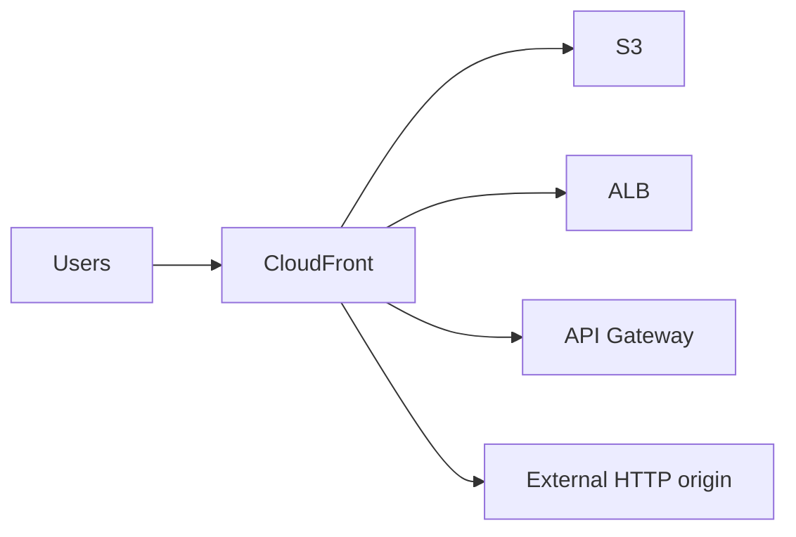

CloudFront provides the delivery layer, while other AWS services supply related capabilities:

- **AWS WAF** for Layer 7 request filtering.
- **AWS Shield** for DDoS protection.
- **AWS Certificate Manager** for viewer certificates.
- **Route 53** for DNS.
- **CloudFront Functions** and **Lambda@Edge** for edge code.
- **CloudWatch**, **S3**, **Kinesis Data Streams**, and **Amazon Data Firehose** for logs and metrics.
- **AWS Firewall Manager** for centralized policy management.
- **IAM**, **CloudFormation**, **CDK**, and APIs for governance and automation.

---

# 5. Why Akamai is not compared only with CloudFront

CloudFront is a service within AWS. Akamai is a portfolio of delivery, security, DNS, traffic-management, and compute products.

Therefore, saying:

```text
Akamai = CloudFront
```

is incomplete.

A more useful conceptual mapping is:

| Requirement | Akamai capability | AWS capability |
|---|---|---|
| CDN | Akamai delivery products and Property Manager | CloudFront |
| Edge rules | Property Manager rules and behaviors | Cache behaviors and policies |
| Lightweight edge code | EdgeWorkers | CloudFront Functions |
| More capable edge code | EdgeWorkers and broader edge services | Lambda@Edge |
| Edge key-value data | EdgeKV | CloudFront KeyValueStore for supported Functions use cases, or other AWS data services depending on design |
| WAF/WAAP | App & API Protector | AWS WAF plus managed rule groups and related services |
| Bot management | Bot Manager | AWS WAF Bot Control |
| DDoS | Akamai DDoS and WAAP products | Shield Standard, Shield Advanced, and AWS WAF |
| Authoritative DNS | Edge DNS | Route 53 |
| Global traffic steering | Global Traffic Management | Route 53 routing/health checks, Global Accelerator, or architecture-specific services |
| TLS lifecycle | Certificate Provisioning System | AWS Certificate Manager |
| Log streaming | DataStream 2 | CloudFront logs, Kinesis, Data Firehose, S3, CloudWatch |
| Cache purge | Fast Purge | CloudFront invalidations or versioned object names |
| Origin shielding | Tiered Distribution, Site Shield, related origin-protection features | Origin Shield, OAC, VPC origins, security groups, custom headers |

These are **conceptual** mappings. They are not exact one-to-one product equivalents.

---

# 6. How a request flows through Akamai

Assume the public application is:

```text
https://shop.example.com
```

The AWS origin is:

```text
origin-shop.example.com
    → Application Load Balancer
    → EKS ingress
    → Kubernetes service
    → application pods
```

## 6.1 DNS resolution

The public hostname is associated with an Akamai edge hostname, for example:

```text
shop.example.com
    CNAME
shop.example.com.edgekey.net
```

Akamai's DNS mapping system resolves the request toward an appropriate edge server.

Conceptually:

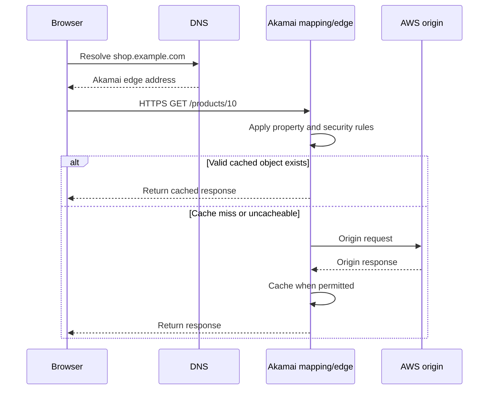

## 6.2 TLS termination

The client creates an HTTPS connection with Akamai. Akamai presents the certificate configured for the public hostname.

Akamai may then establish a separate HTTPS connection to the AWS origin:

```text
Client TLS session:
Browser ↔ Akamai

Origin TLS session:
Akamai ↔ AWS ALB
```

These are two independent secure connections.

## 6.3 Property selection

Akamai identifies the applicable property based on the incoming hostname and activated configuration.

The property contains a rule tree. The tree can evaluate conditions such as:

- Hostname.
- URL path.
- File extension.
- Query parameter.
- Request header.
- Cookie.
- HTTP method.
- Device characteristics.
- Geography.
- Request protocol.
- Variables created during processing.

## 6.4 Security inspection

Depending on the products enabled, Akamai can:

- Apply WAF detections.
- Evaluate API protections.
- Apply rate controls.
- Detect bots.
- Challenge or deny suspicious clients.
- Block malicious IPs or geographic regions.
- Detect credential-stuffing patterns.
- Apply Layer 7 DDoS defenses.

## 6.5 Cache lookup

Akamai calculates a cache key.

A simplified key might be:

```text
hostname + path + selected query parameters
```

For example:

```text
shop.example.com + /assets/app.js
```

A more complex key may include:

```text
shop.example.com
+ /catalog
+ language query parameter
+ Accept-Encoding
+ selected cookie
```

## 6.6 Forwarding to the origin

For a miss or uncacheable request, Akamai forwards to the origin according to the property's origin behavior.

It may control:

- Origin hostname.
- Origin Host header.
- TLS settings.
- Timeouts.
- Compression.
- Client-IP forwarding.
- Origin selection.
- Route optimization.
- Retry behavior.
- Tiered parent selection.

## 6.7 Response processing

Akamai can inspect and modify the response:

- Set or remove headers.
- Apply browser-cache settings.
- Compress content.
- Cache the response.
- Add security headers.
- Generate diagnostic data.
- Stream log fields to an external destination.

---

# 7. How a request flows through CloudFront

A CloudFront design follows the same basic reverse-proxy pattern.

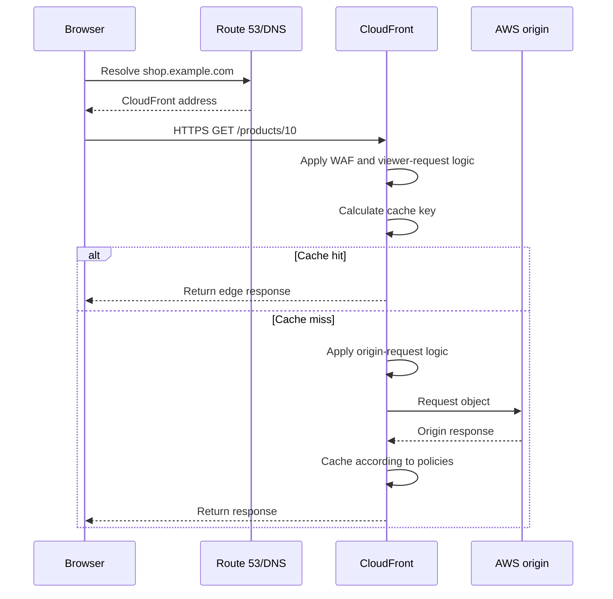

CloudFront configurations center on:

- A **distribution**.
- One or more **origins**.
- A default cache behavior.
- Optional ordered cache behaviors.
- Cache policies.
- Origin request policies.
- Response headers policies.
- Viewer certificates.
- AWS WAF association.
- Edge-function associations.
- Logging configuration.
- Optional Origin Shield.
- Optional origin groups for failover.

---

# 8. Core Akamai concepts and components

## 8.1 Akamai Control Center

Akamai Control Center is the main web interface for delivery, security, DNS, certificates, reporting, and account administration.

It is conceptually similar to using several AWS consoles together rather than one single AWS service console.

## 8.2 Contract

A contract defines the commercial relationship and the products or entitlements available to the customer.

Many objects are associated with:

```text
contract ID
group ID
product ID
```

This is important when using Akamai APIs or Terraform.

## 8.3 Group

A group organizes access and resources within an account.

Groups can help separate:

- Business units.
- Environments.
- Customers.
- Application teams.
- Administrative boundaries.

The concept is not identical to an AWS account, organizational unit, or resource group, although it may be used for comparable organizational purposes.

## 8.4 Product

When creating a property, the user selects an Akamai delivery product to which the contract is entitled.

The selected product influences:

- Available behaviors.
- Default rules.
- Delivery features.
- Commercial treatment.
- Compatible capabilities.

## 8.5 Property

A **property** is the central Akamai delivery configuration.

It defines how Akamai handles requests and responses for one or more property hostnames.

A property contains:

- Hostname associations.
- An origin definition.
- A rule tree.
- CP-code assignment.
- Delivery behaviors.
- Security-related delivery options.
- EdgeWorkers associations.
- Variables and advanced logic.

The nearest CloudFront concept is a distribution, but a property is not exactly the same.

## 8.6 Property version

Properties are versioned.

A common lifecycle is:

```text
Version 1 → active in production
Version 2 → edited
Version 2 → activated on staging
Version 2 → tested
Version 2 → activated on production
```

Versioning creates a controlled deployment process and allows the previous configuration to remain identifiable for rollback.

## 8.7 Rules, criteria, and behaviors

Akamai Property Manager uses a rule tree.

- A **criterion** determines when a rule applies.
- A **behavior** determines what Akamai does.
- A nested rule can inherit and override settings from parent rules.

Example:

```text
Default rule
├── Origin Server
├── CP Code
├── HTTPS behavior
├── Static assets rule
│   ├── Criteria: path matches /assets/*
│   ├── Cache for 24 hours
│   └── Enable compression
├── API rule
│   ├── Criteria: path matches /api/*
│   ├── Bypass cache
│   └── Forward selected headers
└── Login rule
    ├── Criteria: path equals /login
    └── Apply stricter request handling
```

This rule-tree model is one of the biggest conceptual differences for engineers coming from CloudFront.

CloudFront commonly uses ordered path-based cache behaviors plus separate policies and edge code. Akamai Property Manager can express a wider nested condition-and-behavior model directly in the property configuration.

## 8.8 Property hostname

The property hostname is the public name users request:

```text
www.example.com
api.example.com
shop.example.com
```

The incoming HTTP `Host` header helps Akamai select the property and rules.

## 8.9 Edge hostname

The edge hostname is an Akamai-generated DNS target associated with the property hostname.

Examples may use domains such as:

```text
edgekey.net
edgesuite.net
akamaized.net
```

The exact hostname and TLS model depend on the product and configuration.

The edge hostname enables Akamai's DNS-based mapping from the customer hostname to suitable edge servers.

## 8.10 Origin hostname

The origin hostname identifies the server from which Akamai retrieves content.

Examples:

```text
origin.example.com
internal-name-exposed-through-public-DNS.example.com
my-alb-123.eu-west-1.elb.amazonaws.com
```

A best practice is to use a dedicated origin hostname rather than pointing Akamai back to the same public hostname. Otherwise, a DNS loop can occur.

Bad:

```text
shop.example.com → Akamai
Akamai origin = shop.example.com
```

This can cause Akamai to resolve back to itself.

Better:

```text
shop.example.com → Akamai
origin-shop.example.com → AWS ALB
Akamai origin = origin-shop.example.com
```

## 8.11 CP code

A **Content Provider code**, or CP code, classifies Akamai traffic for:

- Billing.
- Reporting.
- Monitoring.
- Analytics.
- Operational separation.

All Akamai-delivered traffic needs an assigned CP code.

Possible segmentation:

```text
CP code 100001 → production website
CP code 100002 → public API
CP code 100003 → video traffic
CP code 100004 → development environment
```

A CP code is not an AWS cost-allocation tag, but it fulfills some comparable reporting and billing-classification purposes.

## 8.12 Certificate Provisioning System

Akamai's **Certificate Provisioning System**, or CPS, handles TLS-certificate lifecycle for secure delivery.

CPS supports activities such as:

- Requesting certificates.
- Managing domain validation.
- Renewing certificates.
- Modifying certificate enrollments.
- Managing TLS settings.
- Using Akamai-managed or third-party certificate workflows.

The nearest AWS service is AWS Certificate Manager, although the workflows and object models differ.

## 8.13 Tiered Distribution

Tiered Distribution creates an additional cache hierarchy.

Instead of every edge server contacting the origin independently, selected parent servers closer to the origin can cache content and serve other Akamai servers.

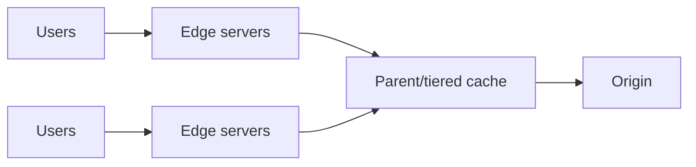

Benefits include:

- Fewer origin requests.
- Better origin offload.
- Reduced origin connection pressure.
- Better cache-fill efficiency.

It is primarily for cacheable content.

CloudFront's closest concept is **Origin Shield**, which adds another caching layer in front of the origin.

## 8.14 SureRoute

SureRoute is designed to optimize the route from Akamai edge servers to the origin.

It tests alternative paths and can select a better-performing route or maintain alternative routes for failures.

SureRoute is especially relevant for:

- Dynamic content.
- Uncacheable content.
- Low-TTL content.
- APIs that must reach the origin.
- Origins that are geographically distant from some edge locations.

It is important not to confuse:

```text
Tiered Distribution → cache hierarchy for cacheable content
SureRoute           → route optimization toward the origin
```

## 8.15 Site Shield

Site Shield helps restrict origin access to selected Akamai infrastructure.

The origin firewall or security controls allow only the address ranges associated with the Site Shield map.

Conceptually:

```text
Internet traffic             → blocked at origin
Akamai Site Shield traffic   → allowed at origin
```

This reduces direct-origin exposure, but the allowlist must be maintained as Akamai updates the applicable addresses.

AWS implementations may combine comparable goals using:

- CloudFront VPC origins where supported.
- S3 Origin Access Control.
- Security groups.
- Managed prefix lists where applicable.
- Custom secret headers.
- AWS WAF at the origin.
- Private connectivity patterns.

## 8.16 EdgeWorkers

EdgeWorkers runs JavaScript logic at Akamai's edge.

Use cases include:

- Redirects.
- URL rewrites.
- Header changes.
- A/B testing.
- Geolocation logic.
- Authentication decisions.
- Dynamic origin selection.
- Personalized response handling.
- Request normalization.

EdgeWorkers has execution stages associated with the request/response lifecycle. Engineers must understand product limits, supported APIs, CPU/runtime restrictions, and the effect of code on caching.

## 8.17 EdgeKV

EdgeKV is a distributed key-value store designed for EdgeWorkers applications that need fast reads and relatively infrequent writes.

Example data:

```json
{
  "experiment_checkout": {
    "enabled": true,
    "percentage": 10
  }
}
```

An EdgeWorker could read this value and place some users into an experiment without contacting the origin for every request.

EdgeKV should not be treated as a general relational database. It is an edge-oriented key-value capability for suitable access patterns.

## 8.18 DataStream 2

DataStream 2 streams Akamai delivery, performance, and security data to external destinations.

Supported destination categories include:

- Amazon S3.
- Azure Storage.
- Google Cloud Storage.
- Datadog.
- Dynatrace.
- Elasticsearch.
- New Relic.
- Splunk.
- Sumo Logic.
- S3-compatible storage.
- Custom HTTPS endpoints.

This enables centralized observability even when Akamai fronts AWS workloads.

For example:

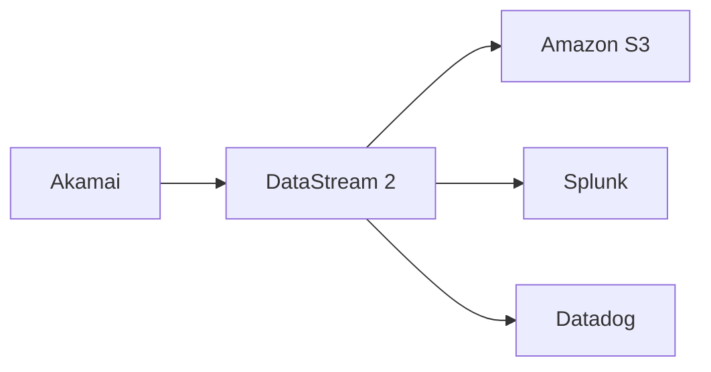

## 8.19 Edge DNS

Edge DNS is Akamai's authoritative DNS service.

It can be used as:

- Primary authoritative DNS.
- Secondary authoritative DNS.
- A globally distributed DNS layer.
- A DNSSEC-enabled service where contracted and configured.

The nearest AWS equivalent is Route 53 authoritative DNS.

## 8.20 Global Traffic Management

Akamai Global Traffic Management, or GTM, is a DNS-based global traffic-management service.

It can make routing decisions based on factors such as:

- Data-center health.
- Load.
- Geography.
- Performance.
- Business-continuity policies.
- Configured traffic-management rules.

It is conceptually related to combinations of Route 53 routing policies, health checks, and global traffic architectures, but implementation details differ.

## 8.21 App & API Protector

App & API Protector is Akamai's web application and API protection platform.

It can combine:

- Web Application Firewall.
- API-focused protections.
- Bot mitigation.
- Layer 7 DDoS protection.
- Rate controls.
- Adaptive detections.
- Security policy management.

This broader category is often called **WAAP**: Web Application and API Protection.

The closest AWS comparison is not only AWS WAF. A full comparison may include:

```text
AWS WAF
+ managed rules
+ Bot Control
+ rate-based rules
+ Shield
+ API-specific controls
+ Firewall Manager
+ security logging and operations
```

## 8.22 Bot Manager

Bot Manager distinguishes automated traffic from human traffic and lets an organization apply different actions to different bot categories.

Examples:

- Allow major search crawlers.
- Rate-limit price scrapers.
- Challenge suspicious automation.
- Block credential-stuffing clients.
- Monitor unknown bots before enforcing.
- Protect login, registration, checkout, and inventory endpoints.

Bot management is not equivalent to blocking all automation. Many legitimate systems are bots.

## 8.23 Fast Purge

Fast Purge refreshes or removes cached content.

Common purge dimensions include:

- URL.
- Akamai Resource Locator.
- CP code.
- Cache tag, where supported.

Akamai distinguishes **invalidate** and **delete** behavior. Operationally, invalidation is often safer because the object becomes stale and is refreshed according to request flow rather than being immediately removed in every possible situation.

CloudFront provides invalidations and increasingly supports tag-oriented invalidation capabilities in current service versions. Versioned file names remain a highly reliable deployment technique on both platforms.

---

# 9. Core CloudFront and AWS edge components

## 9.1 Distribution

A distribution is the main CloudFront configuration object.

It includes:

- Origins.
- Cache behaviors.
- Viewer protocol policy.
- Alternate domain names.
- TLS certificate.
- Logging.
- Error responses.
- Geographic restrictions.
- WAF association.
- Edge functions.
- Pricing and delivery settings.

## 9.2 Origin

An origin is the source of definitive content.

Examples:

```text
S3 bucket
Application Load Balancer
API Gateway endpoint
EC2 web server
Lambda function URL
External HTTPS endpoint
Supported VPC origin
```

## 9.3 Cache behavior

A cache behavior determines how CloudFront handles requests that match a path pattern.

Example:

```text
Default behavior: /*
Ordered behavior: /assets/*
Ordered behavior: /api/*
Ordered behavior: /admin/*
```

A behavior can define:

- Target origin.
- Allowed HTTP methods.
- Cache policy.
- Origin request policy.
- Response headers policy.
- Viewer protocol policy.
- Function associations.
- Signed URL or signed cookie requirements.

## 9.4 Cache policy

The cache policy determines:

- Which headers participate in the cache key.
- Which cookies participate in the cache key.
- Which query strings participate in the cache key.
- Minimum TTL.
- Default TTL.
- Maximum TTL.
- Compression-related cache-key behavior.

Values included in the cache key are also forwarded to the origin.

## 9.5 Origin request policy

An origin request policy forwards additional headers, cookies, or query strings to the origin **without necessarily including them in the cache key**.

This separation is important.

Example:

```text
Forward CloudFront-Viewer-Country to origin
but do not create one cached object per country
```

or:

```text
Forward an analytics header
but keep a shared cached object
```

## 9.6 Response headers policy

A response headers policy controls headers returned to viewers.

Typical uses:

- Strict-Transport-Security.
- Content-Security-Policy.
- X-Content-Type-Options.
- Referrer-Policy.
- CORS.
- Custom response headers.

## 9.7 Origin Shield

Origin Shield adds another cache layer in front of the origin.

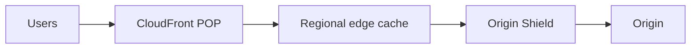

Benefits include:

- Higher effective cache-hit ratio.
- Fewer origin requests.
- Reduced origin load.
- Better request collapsing in some traffic patterns.

## 9.8 Origin Access Control

Origin Access Control, or OAC, lets CloudFront authenticate supported origin requests, particularly for S3.

A common secure static-site model is:

```text
User → CloudFront → private S3 bucket
```

The bucket does not need to be publicly readable.

## 9.9 VPC origins

CloudFront VPC origins support architectures where supported load balancers or origins can remain within a VPC-oriented access model instead of being exposed as a normal public internet origin.

The exact supported resources, limitations, account-sharing behavior, protocols, and deployment requirements must be checked in the current AWS documentation before implementation.

## 9.10 CloudFront Functions

CloudFront Functions runs lightweight JavaScript for high-scale, latency-sensitive viewer request and viewer response customization.

Suitable uses:

- Redirect HTTP-style paths.
- Normalize URLs.
- Modify headers.
- Basic authorization checks.
- Generate simple responses.
- Select or modify origins with supported helper methods.
- Use key-value data in supported designs.

It is designed for very short execution.

## 9.11 Lambda@Edge

Lambda@Edge provides more capable edge processing using supported Node.js or Python runtimes.

It is appropriate when the function needs capabilities beyond CloudFront Functions, such as:

- More execution time.
- More memory.
- Third-party libraries.
- Network access.
- Request-body access in supported trigger types.
- More complex application logic.

Lambda@Edge functions are created in `us-east-1` and replicated for association with CloudFront.

## 9.12 AWS WAF

AWS WAF evaluates Layer 7 web requests using a web ACL.

Rules can include:

- IP sets.
- Geographic match.
- Regex and string match.
- SQL-injection detection.
- Cross-site-scripting detection.
- Managed rule groups.
- Rate-based rules.
- Bot Control.
- CAPTCHA and challenge actions.
- Custom labels and rule logic.

## 9.13 AWS Shield

AWS Shield Standard is automatically available for AWS customers and protects against common network and transport-layer DDoS attacks.

Shield Advanced adds expanded protections, visibility, response support, and cost-protection features under its service terms.

CloudFront, Route 53, and Global Accelerator particularly benefit from AWS's globally distributed DDoS-mitigation infrastructure.

## 9.14 Route 53

Route 53 can point an application hostname to CloudFront using an alias record.

Unlike a standard CNAME, Route 53 alias records can be used at the zone apex:

```text
example.com → CloudFront
```

## 9.15 CloudFront logs

CloudFront can provide:

- Standard access logs.
- Real-time access logs.
- Function logs.
- Lambda@Edge logs and metrics.
- WAF logs through the WAF logging pipeline.
- Shield metrics for protected resources.

CloudFront real-time logs are delivered to Kinesis Data Streams and can be processed directly or forwarded with Amazon Data Firehose.

## 9.16 Invalidations

An invalidation tells CloudFront to remove cached objects before normal expiration.

Examples:

```text
/index.html
/assets/*
/catalog/product-10.json
```

For static assets, versioned file names are often better:

```text
app.41af77.js
styles.90be21.css
```

Versioned objects avoid large invalidations and make rollback predictable.

---

# 10. Detailed feature comparison

| Area | Akamai | Amazon CloudFront and AWS |
|---|---|---|
| Provider model | Independent edge, security, DNS, and cloud provider | Native AWS service |
| Typical origin scope | AWS, Azure, GCP, Akamai Cloud, SaaS, on-premises | AWS services or reachable HTTP(S) origins |
| Main delivery object | Property | Distribution |
| Rule model | Nested criteria and behaviors | Ordered cache behaviors, policies, and functions |
| Config versions | Explicit property versions | Distribution configuration revisions through AWS control plane and IaC |
| Preproduction edge test | Dedicated staging activation model | Continuous deployment/staging patterns, test distributions, headers, DNS, and account-specific workflows |
| Public hostname mapping | Property hostname → edge hostname | Alternate domain → distribution domain/Route 53 alias |
| TLS management | CPS | ACM |
| Traffic classification | CP codes and reporting groups | Tags, accounts, CUR dimensions, logs, distributions, cost allocation |
| Cache hierarchy | Edge cache plus Tiered Distribution | POP, regional edge caches, optional Origin Shield |
| Dynamic route optimization | SureRoute | AWS backbone/CloudFront architecture; no exact feature-name equivalent |
| Origin allowlisting | Site Shield and related controls | OAC, VPC origins, security groups, custom headers, WAF |
| WAF/WAAP | App & API Protector | AWS WAF and adjacent services |
| Bot management | Bot Manager | AWS WAF Bot Control |
| DDoS | Akamai security portfolio | Shield Standard and Shield Advanced |
| Edge JavaScript | EdgeWorkers | CloudFront Functions |
| More complex edge compute | EdgeWorkers and other Akamai edge offerings | Lambda@Edge |
| Edge key-value store | EdgeKV | CloudFront KeyValueStore for applicable Functions designs |
| Authoritative DNS | Edge DNS | Route 53 |
| Global DNS load balancing | GTM | Route 53 routing/health checks; sometimes Global Accelerator |
| Log streaming | DataStream 2 | Kinesis, Firehose, S3, CloudWatch ecosystem |
| Cache purge | Fast Purge | Invalidations and versioned assets |
| IaC | Official Akamai Terraform provider and APIs | CloudFormation, CDK, Terraform, APIs |
| Commercial model | Commonly contract/product/usage based for delivery and security | Pay-as-you-go, flat-rate plans, savings arrangements, custom pricing |
| Best organizational fit | Multicloud and enterprise edge/security operating model | AWS-centered operating model |

---

# 11. Caching in depth

## 11.1 The cache key

The cache key identifies a unique cached representation.

A simplified formula is:

```text
cache key =
hostname
+ path
+ selected query parameters
+ selected headers
+ selected cookies
+ encoding variation
```

Consider:

```text
/products?id=10
/products?id=20
```

If `id` changes the response, it must normally participate in the cache key.

Consider:

```text
/assets/logo.png?utm_source=newsletter
/assets/logo.png?utm_source=search
```

If `utm_source` does not change the image, including it in the cache key creates duplicate objects and reduces hit ratio.

## 11.2 Cache-key safety rule

Only include a request value in the cache key when it changes the response representation.

Ask:

> “Could two requests with different values safely receive the same cached response?”

If yes, the value may not need to be in the key.

If no, it must be included or caching must be disabled.

## 11.3 Personalized content

The following endpoints are usually dangerous to cache without careful design:

```text
/account
/profile
/cart
/orders
/payment
/admin
```

A request may contain:

```http
Authorization: Bearer eyJ...
Cookie: session=abc123
```

If the cache key does not isolate users correctly, one user's response could be returned to another user.

The safest initial pattern is:

```text
Authenticated or personalized endpoint
    → do not cache
```

Caching can be introduced later when:

- The response contract is understood.
- User identity is handled safely.
- Security testing is complete.
- Cache-control headers are correct.
- The business accepts staleness behavior.

## 11.4 Static assets

Versioned static assets are ideal CDN content:

```text
/assets/app.81c92.js
/assets/site.44a0f.css
/images/logo.10ac3.svg
```

Recommended pattern:

```http
Cache-Control: public, max-age=31536000, immutable
```

Because the filename changes with content, the old object can remain cached safely.

## 11.5 HTML

HTML often needs a shorter TTL than versioned assets.

Example:

```http
Cache-Control: public, max-age=60, s-maxage=300, stale-while-revalidate=30
```

The exact directives supported and honored must be tested with the selected product configuration.

## 11.6 API caching

Public GET APIs may be cacheable:

```text
GET /api/catalog
GET /api/countries
GET /api/public-rates
```

Possible design:

```text
TTL: 30 seconds
Cache key: path + meaningful query parameters
Do not include tracking parameters
Do not forward unnecessary cookies
```

Benefits:

- Reduces EKS/API load.
- Handles bursts.
- Improves global latency.
- Protects downstream databases.

Risks:

- Stale prices.
- Stale stock.
- Incorrect regional variation.
- Incorrect authorization behavior.
- Cache fragmentation.

## 11.7 TTL

TTL is the period for which an object remains fresh.

Long TTL:

- Higher hit ratio.
- Better performance.
- Lower origin load.
- Greater staleness risk.

Short TTL:

- Fresher content.
- More origin traffic.
- Lower cache efficiency.
- Greater origin exposure during spikes.

## 11.8 Stale content strategies

Some CDN designs can serve stale content during origin problems or while refreshing.

This can improve availability for:

- Product catalogs.
- News pages.
- Static site shells.
- Documentation.
- Public metadata.

It is unsuitable for some transactional or strongly consistent data.

## 11.9 Negative caching

CDNs may cache errors such as `404` or `500`.

Benefits:

- Protects the origin from repeated requests for missing objects.
- Reduces repeated expensive failures.

Risks:

- A corrected object may remain unavailable until error TTL expiration or purge.
- Long error caching can amplify incidents.

## 11.10 Purging versus versioning

Use **versioned file names** for build artifacts whenever possible.

Use purge or invalidation for:

- Emergency content correction.
- HTML entry points.
- API cache correction.
- Legal removal.
- Security incident.
- Incorrectly cached sensitive content.

## 11.11 Cache stampede

A cache stampede occurs when many requests reach the origin as an object expires or the cache key changes.

Causes include:

- Global cache-key modification.
- Purging a very popular object.
- Setting many objects to expire simultaneously.
- Deploying a new configuration that makes old cache entries unreachable.

Mitigations:

- Gradual cache-key changes.
- Versioned assets.
- Tiered caching or Origin Shield.
- Jittered TTLs where supported by application design.
- Prewarming selected content.
- Origin autoscaling.
- Request collapsing where the platform supports it.
- Careful change windows.

Akamai's documentation explicitly warns that large cache-key changes can create severe origin spikes.

---

# 12. Security in depth

## 12.1 The CDN as a reverse-proxy security layer

Akamai and CloudFront stand between users and origins.

```text
Internet
   ↓
Edge security and delivery layer
   ↓
Origin load balancer
   ↓
Application
```

The edge can block malicious traffic before it consumes:

- Load-balancer capacity.
- EKS ingress resources.
- Pod CPU.
- Database connections.
- Lambda concurrency.
- Application threads.

## 12.2 Layer 3/4 versus Layer 7

### Layer 3 and Layer 4

These attacks target network and transport capacity:

- Volumetric floods.
- UDP floods.
- SYN floods.
- Protocol abuse.

### Layer 7

These attacks resemble application requests:

- HTTP floods.
- Expensive-search abuse.
- Login attacks.
- Cart or checkout abuse.
- API scraping.
- Credential stuffing.
- Malicious payloads.

A full security design needs both infrastructure-layer and application-layer protection.

## 12.3 WAF controls

Typical WAF controls include:

- Managed common-threat rules.
- SQL injection detection.
- Cross-site scripting detection.
- IP allow and deny lists.
- Geographic controls.
- Request-size limits.
- Header validation.
- URI and method restrictions.
- Rate controls.
- Custom application rules.
- Bot actions.
- API schema and operation constraints where supported.

## 12.4 Detection mode before deny mode

A safe deployment often uses stages:

```text
1. Count or alert
2. Analyze false positives
3. Tune exclusions
4. Challenge selected traffic
5. Block with monitoring
```

Immediate global blocking can break:

- Mobile applications.
- Partner integrations.
- Search engines.
- Monitoring systems.
- Payment webhooks.
- Corporate proxies.
- Accessibility tools.
- Legitimate high-volume clients.

## 12.5 Bot management

Bots can be:

### Good

- Search engines.
- Uptime monitors.
- Approved partner integrations.
- Feed readers.
- Internal automation.

### Bad or unwanted

- Credential stuffing.
- Price scraping.
- Inventory hoarding.
- Account creation abuse.
- Scalping.
- Content theft.
- Vulnerability scanning.
- API abuse.

Actions can include:

- Allow.
- Monitor.
- Rate-limit.
- Challenge.
- Serve deception or alternate content in some strategies.
- Deny.

## 12.6 Rate limiting

Rate limits should be endpoint-aware.

Example:

```text
GET /assets/*       → very high threshold or no application rate limit
GET /api/catalog    → moderate threshold
POST /login         → strict threshold by multiple signals
POST /checkout      → strict and identity-aware protection
GET /health         → allow monitoring sources
```

A single global IP rate limit can punish many users behind a shared NAT, corporate proxy, or mobile carrier.

## 12.7 Origin bypass

A major architectural mistake is securing the edge but leaving the origin directly reachable.

Attackers may discover the origin through:

- Historical DNS.
- Certificate transparency.
- Response headers.
- Email records.
- Source-code references.
- Search engines.
- Cloud-provider hostnames.
- Misconfigured DNS records.
- Public load-balancer addresses.

Then they send requests directly to the origin and bypass the CDN WAF.

Origin protection should therefore be part of the design, not an optional afterthought.

## 12.8 Client IP

The origin sees the edge proxy as the network peer.

The real viewer IP is normally forwarded in a trusted header or product-specific mechanism.

Security rule:

> Trust the forwarded client-IP header only when the request definitely came from the approved edge layer.

Otherwise an attacker can connect directly and spoof the header.

## 12.9 TLS to the origin

Use HTTPS from edge to origin.

Validate:

- Origin certificate hostname.
- Supported TLS versions.
- Cipher compatibility.
- SNI.
- Origin Host header.
- Certificate renewal.
- Mutual TLS requirements where supported and designed.

## 12.10 Secret origin header

One origin-protection pattern is to have the CDN add a secret header:

```http
X-Origin-Verify: long-random-secret
```

The origin WAF or application load balancer allows only requests containing the expected value.

This is useful but not sufficient by itself because:

- Secrets need rotation.
- Logs must not expose the value.
- Application debugging can leak it.
- A header is not network isolation.
- Direct-origin traffic still reaches the public endpoint before being rejected.

Use it as one layer in defense in depth.

---

# 13. Origin protection and AWS networking

## 13.1 Public ALB origin

A common design is:

```text
Akamai or CloudFront
    → public Application Load Balancer
    → EKS
```

The ALB is publicly addressable, so protect it with layers such as:

- Restricted inbound source ranges where practical.
- Site Shield for Akamai designs.
- AWS WAF on the ALB as a second layer where justified.
- Secret origin header.
- Strict Host-header validation.
- TLS.
- No public DNS record exposing the origin to normal users.
- Monitoring for direct-origin traffic.

## 13.2 Private S3 origin with CloudFront

A strong AWS-native pattern is:

```text
CloudFront
    → Origin Access Control
    → private S3 bucket
```

The bucket policy grants access to CloudFront rather than the public internet.

## 13.3 Akamai to S3

Akamai can front cloud object-storage origins, but the authentication pattern differs from CloudFront OAC.

Akamai Cloud Access Manager supports management of credentials for supported cloud origins, including AWS use cases. The exact product entitlement and supported origin-authentication design must be validated with the current Akamai documentation and account team.

## 13.4 VPC origins with CloudFront

Where CloudFront VPC origins support the selected resource and architecture, they can reduce the need to expose a conventional public origin.

This can improve:

- Origin isolation.
- Security-group control.
- Network architecture.
- Reduction of public-origin bypass risk.

Check current limitations before deciding, especially for:

- Resource type.
- Region support.
- Protocol.
- Account and VPC ownership.
- Shared VPC.
- Network Load Balancer or ALB behavior.
- WebSocket or gRPC requirements.
- Client-IP preservation expectations.

## 13.5 Health checks

The edge layer may continue routing to an origin that is technically reachable but functionally unhealthy.

Health must reflect the user journey.

Weak health check:

```text
GET /health → 200
```

while the database is unavailable.

Better layered checks:

```text
/health/live   → process is alive
/health/ready  → app can receive traffic
/health/deep   → dependencies checked, carefully controlled
```

Do not make every external health check execute expensive database operations.

---

# 14. Akamai in front of EKS

## 14.1 Basic architecture

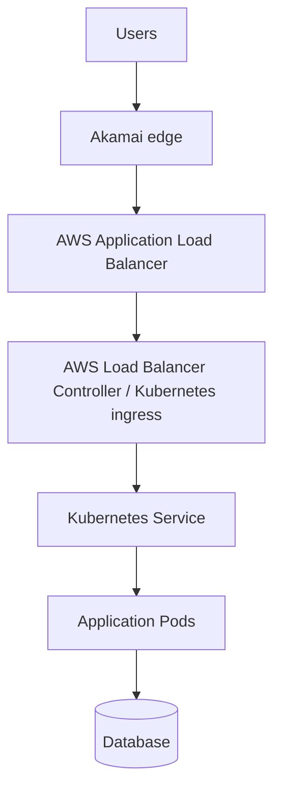

## 14.2 Suggested hostname model

```text
Public:
shop.example.com → Akamai edge hostname

Origin:
origin-shop.example.com → ALB
```

The application should accept the intended Host header.

Decide whether Akamai sends:

```http
Host: shop.example.com
```

or:

```http
Host: origin-shop.example.com
```

This choice affects:

- ALB listener rules.
- Kubernetes ingress host rules.
- Application virtual hosts.
- TLS certificate on the ALB.
- Redirect behavior.
- Absolute URL generation.

## 14.3 Example path policy

| Path | Cache | Security | Origin behavior |
|---|---|---|---|
| `/assets/*` | Long TTL | Basic WAF | Normal |
| `/images/*` | Long TTL | Basic WAF | Normal |
| `/` | Short TTL | WAF and bot visibility | Normal |
| `/api/catalog/*` | 30–120 seconds if safe | WAF and rate controls | Forward selected query values |
| `/api/cart/*` | Disabled | WAF | Forward authorization and cookies |
| `/login` | Disabled | Strong bot and rate controls | Normal |
| `/admin/*` | Disabled | Allowlist or zero-trust control | Restricted |
| `/health/*` | Disabled | Allow approved monitoring | Minimal |

## 14.4 Kubernetes-specific considerations

### Preserve request context

The application may need:

- Original scheme.
- Original host.
- Viewer IP.
- Request ID.
- Country.
- Edge trace or diagnostic headers.

Configure ingress and application frameworks to trust only known proxy layers.

### Timeouts

Align timeouts across:

```text
Client
Akamai
ALB
Ingress controller
Application server
Downstream dependency
```

A mismatch can create:

- 502.
- 503.
- 504.
- Broken uploads.
- Duplicate retries.
- Long-held connections.

### Autoscaling

The CDN can hide traffic from the origin due to caching. HPA metrics should represent actual origin work, not viewer request volume.

For example, a campaign may create ten million edge requests but only one million origin requests.

### Readiness

Ensure pods are ready before the ALB routes traffic.

Use:

- Readiness probes.
- PodDisruptionBudgets.
- Graceful shutdown.
- Target deregistration delay.
- Rolling-deployment settings.
- Sufficient surge capacity.

### WebSockets and streaming

Confirm that the selected Akamai product and property settings support the protocol and connection behavior.

Do not assume that settings appropriate for static content are correct for:

- WebSockets.
- Server-Sent Events.
- gRPC.
- Large uploads.
- Long polling.
- Live streaming.

## 14.5 Direct-origin protection

Possible layered design:

```text
Akamai Site Shield allowlist
+ secret origin header
+ AWS WAF on ALB
+ strict Host validation
+ no public origin hostname in frontend code
+ TLS
+ monitoring direct requests
```

---

# 15. CloudFront in front of EKS

## 15.1 Architecture

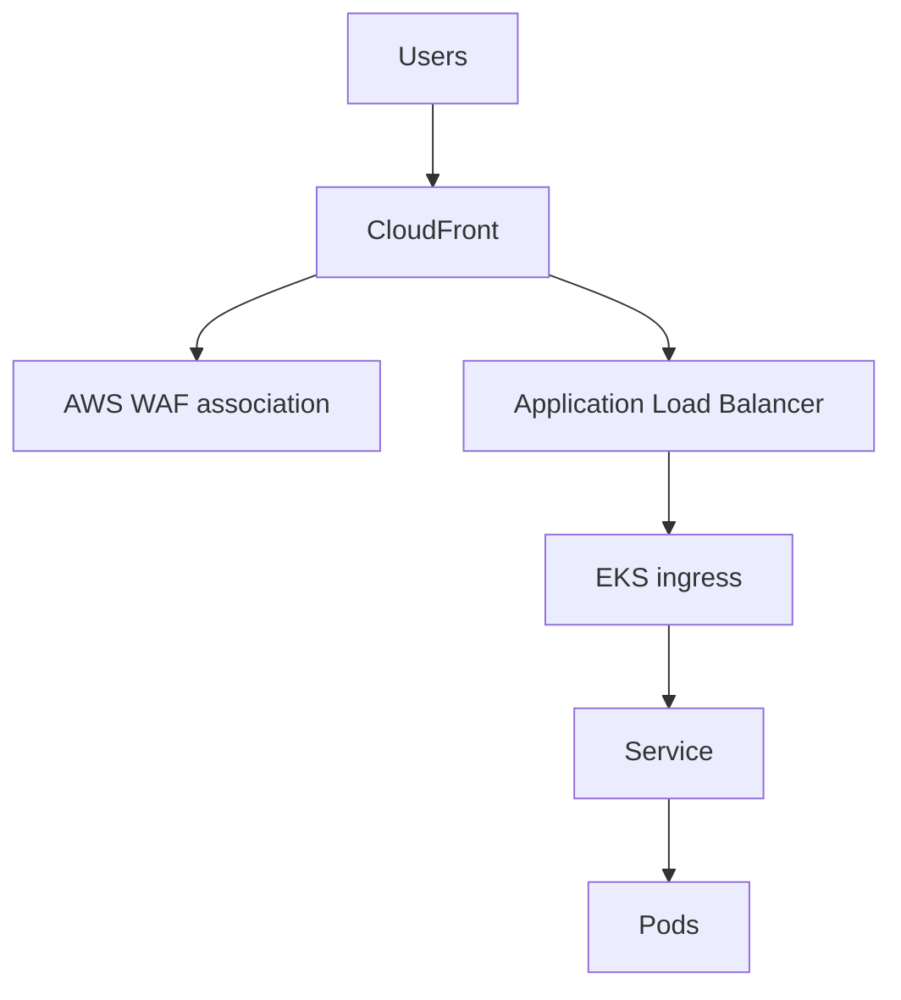

## 15.2 Cache behaviors

Example:

```text
/assets/*       → managed optimized cache policy
/api/public/*   → custom short-TTL policy
/api/private/*  → caching disabled policy
/*              → short HTML policy
```

## 15.3 Origin request policy

For public API traffic:

```text
Forward:
- required query parameters
- selected headers
- no unnecessary cookies
```

For private API traffic:

```text
Forward:
- Authorization
- required cookies
- required headers
Caching:
- disabled
```

## 15.4 Response headers policy

Apply:

- HSTS.
- Content Security Policy.
- X-Content-Type-Options.
- Referrer Policy.
- CORS rules.
- Custom diagnostic headers where appropriate.

## 15.5 Origin protection

Options include:

- VPC origins where supported.
- AWS WAF on ALB.
- Secret custom origin header.
- Strict security-group and network design.
- TLS to origin.
- Origin hostname not advertised publicly.

---

# 16. Practical use cases

## 16.1 Global e-commerce

Requirements:

- Fast product pages.
- Protected login.
- Bot mitigation.
- Checkout reliability.
- Global audience.
- Frequent promotions.

Akamai may be selected for advanced bot/security operations and multicloud reach.

CloudFront may be selected for tight AWS integration, direct S3/ALB support, and unified AWS governance.

## 16.2 Static website

Architecture:

```text
CloudFront → private S3
```

is usually extremely simple in AWS.

Akamai can also deliver static content, especially when the organization already standardizes on Akamai or requires one global edge policy across many clouds.

## 16.3 Public API

A CDN can cache safe GET responses and protect the API.

Example:

```text
GET /countries       → cache 1 hour
GET /catalog         → cache 60 seconds
POST /orders         → never cache
POST /login          → never cache, strong bot controls
```

## 16.4 Media streaming

Akamai has a long-established media-delivery portfolio for video and large-scale events.

CloudFront also supports media delivery and integrates with AWS media services.

Evaluate:

- Audience regions.
- Live versus on-demand.
- Bitrate and format.
- Token authentication.
- Log and analytics requirements.
- Existing media workflow.
- Contract economics.
- Origin shielding.
- Peak concurrency.

## 16.5 Software downloads

CDNs are valuable for:

- Large installers.
- Game patches.
- Container or package artifacts in applicable designs.
- Firmware.
- Operating-system images.
- Public data sets.

Important controls:

- Long TTL.
- Versioned names.
- Range requests.
- Checksum publication.
- Signed access where required.
- Origin shielding.
- Purge process for compromised artifacts.

## 16.6 Multicloud application

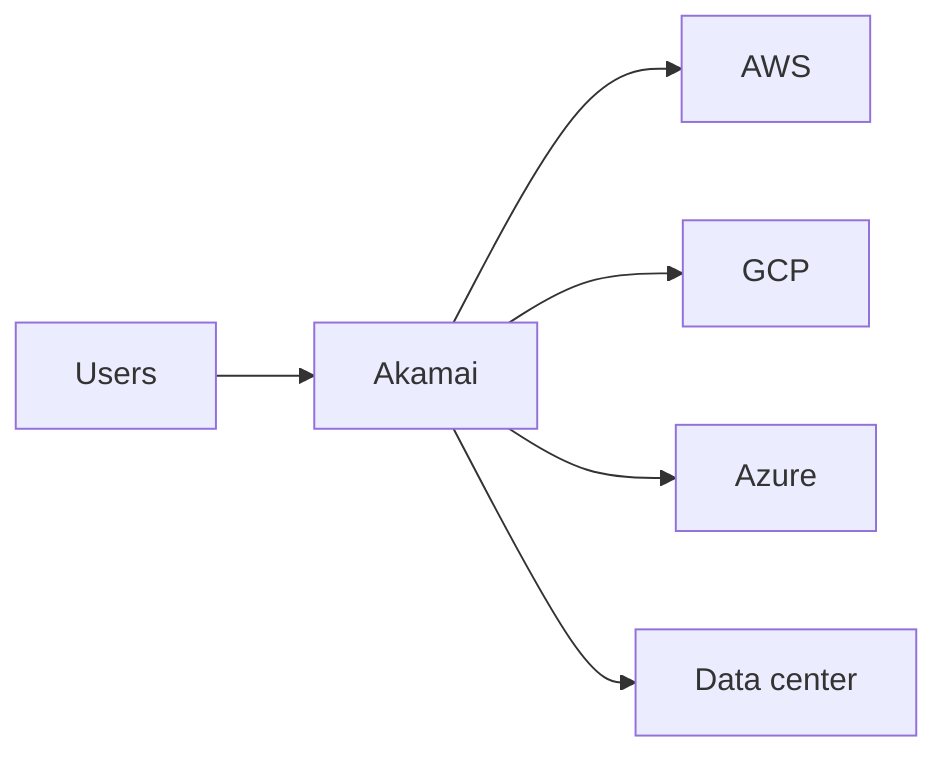

Akamai can provide one cloud-neutral front door.

CloudFront can also reach external HTTP origins, but the operating model remains AWS-centered.

## 16.7 SaaS platform with many customer domains

Requirements may include:

- Thousands of hostnames.
- Certificate automation.
- Tenant-specific WAF policy.
- Shared caching rules.
- Per-tenant reporting.
- Domain onboarding.
- Abuse isolation.

Both platforms have enterprise patterns for large hostname fleets. Compare current product capabilities, quotas, automation APIs, certificate workflows, pricing, and tenant isolation.

## 16.8 Protecting login and checkout

Use:

- No caching.
- WAF.
- Bot detection.
- Rate limiting.
- Device and behavioral signals.
- Account-protection controls.
- Request logging.
- Fraud-system integration.
- Careful false-positive monitoring.

---

# 17. Reference architectures

## 17.1 Akamai + AWS EKS + S3

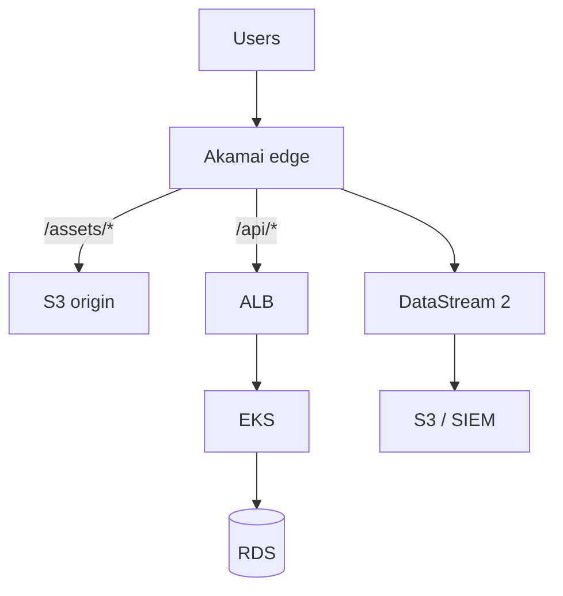

Design notes:

- Static assets receive long TTL.
- API endpoints are selectively cached.
- Authenticated traffic bypasses cache.
- Security policy applies before AWS.
- Logs go to the enterprise SIEM.
- The ALB accepts only approved origin traffic where feasible.

## 17.2 CloudFront + private S3 + EKS

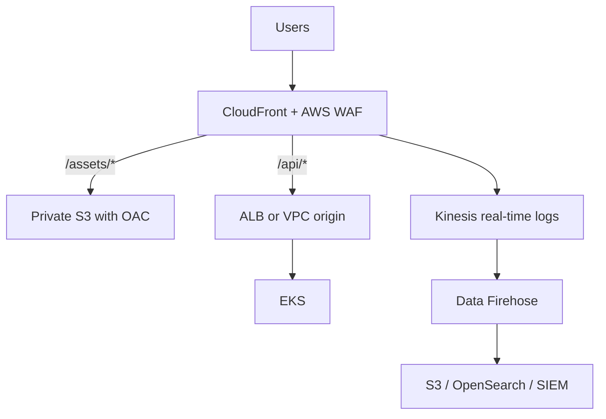

## 17.3 Active-passive origins

Akamai design may use origin-selection and traffic-management capabilities according to product configuration.

CloudFront can use an origin group:

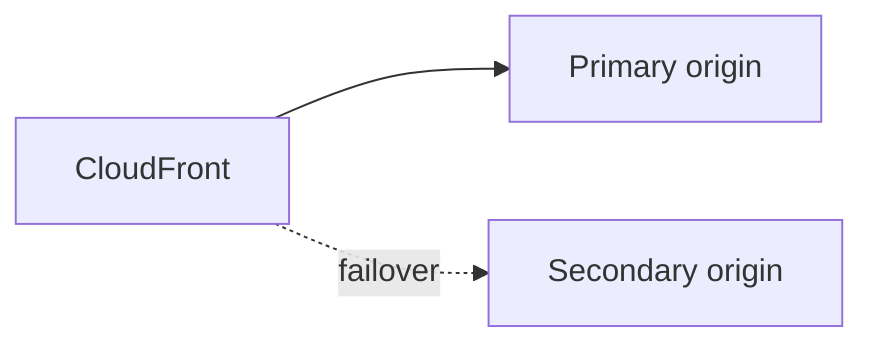

CloudFront origin failover switches from the primary to the secondary for configured failure status codes and supported methods.

## 17.4 Multi-CDN

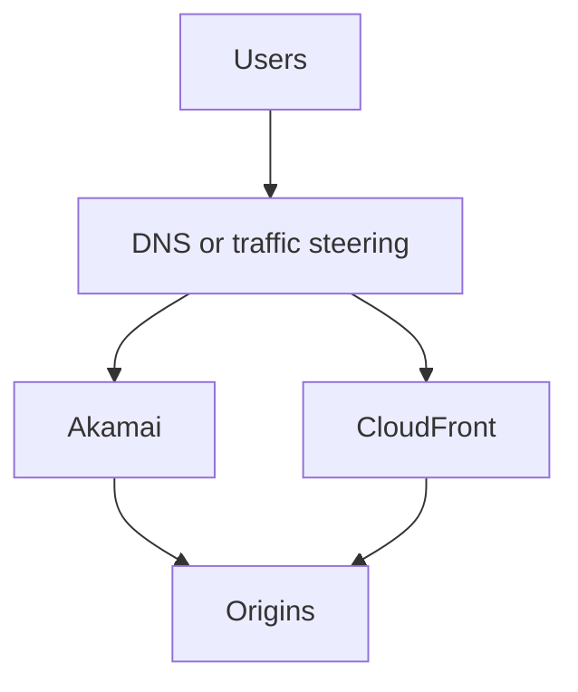

Operational complexity is significant. Both CDNs must agree on:

- Cache semantics.
- Security policy.
- Headers.
- TLS.
- Origin authentication.
- Logging fields.
- Purge.
- Release timing.
- Incident response.

---

# 18. Deployment workflow with Akamai

A typical onboarding process is:

## Phase 1: Discovery

Collect:

- Public hostnames.
- Origin hostnames.
- Traffic volume.
- Regions.
- Paths and methods.
- Current cache headers.
- Authentication model.
- Bot traffic.
- API definitions.
- TLS requirements.
- Compliance needs.
- Log destinations.
- Origin capacity.
- Rollback requirements.

## Phase 2: Account objects

Identify or create:

- Contract.
- Group.
- Product.
- CP code.
- Property.
- Certificate enrollment.
- Edge hostname.
- Security configuration.
- API credentials.
- Terraform state and pipeline.

## Phase 3: Property configuration

Configure:

- Origin.
- Host header.
- TLS to origin.
- Default cache.
- Path-specific rules.
- Compression.
- Redirects.
- Cache key.
- Tiered Distribution for cacheable content.
- SureRoute for appropriate dynamic traffic.
- EdgeWorkers where needed.
- DataStream 2.
- Diagnostic behavior.

## Phase 4: Security configuration

Configure:

- Protected hostnames.
- WAF policy.
- Rate controls.
- Bot policy.
- Network lists.
- Exceptions.
- API resources.
- Logging.
- Alerting.

Start with monitoring and controlled enforcement.

## Phase 5: Staging activation

Activate the property on Akamai staging.

Test:

- DNS override.
- TLS.
- Cache hit/miss.
- Headers.
- Redirects.
- Cookies.
- API authentication.
- Uploads.
- Error handling.
- Security false positives.
- Origin logs.
- Performance.

## Phase 6: Production activation

Activate the tested property version on production.

Production activation deploys the configuration but normal users do not reach it until DNS points the public hostname toward the Akamai edge hostname.

## Phase 7: DNS cutover

Before cutover:

- Reduce DNS TTL.
- Record existing values.
- Prepare rollback.
- Ensure certificate is active.
- Confirm origin capacity.
- Confirm observability.
- Notify operations.

Change DNS.

## Phase 8: Validation

Monitor:

- DNS propagation.
- TLS errors.
- 4xx and 5xx.
- Cache-hit ratio.
- Origin traffic.
- WAF detections.
- Bot actions.
- Latency.
- Geographic anomalies.
- Conversion or business metrics.

---

# 19. Deployment workflow with CloudFront

## Phase 1: Create origins

Examples:

- Private S3 with OAC.
- ALB.
- API Gateway.
- VPC origin where supported.
- External HTTPS origin.

## Phase 2: Create distribution

Configure:

- Origins.
- Default behavior.
- Ordered behaviors.
- Cache policies.
- Origin request policies.
- Response headers policies.
- HTTP methods.
- Compression.
- Error responses.
- Origin Shield if justified.

## Phase 3: TLS and domain

- Request or import a certificate into ACM in the required region for CloudFront.
- Add alternate domain names.
- Validate the certificate.
- Configure Route 53 alias or external DNS.

## Phase 4: Security

- Associate AWS WAF.
- Add managed rules.
- Configure rate-based rules.
- Configure Bot Control if needed.
- Review Shield requirements.
- Configure origin protection.
- Enable logs.

## Phase 5: Edge code

Attach:

- CloudFront Function for lightweight viewer logic.
- Lambda@Edge for more complex logic.

Test in a non-production distribution or controlled deployment path.

## Phase 6: Cutover

- Lower DNS TTL.
- Validate distribution domain.
- Prepare rollback.
- Change DNS.
- Monitor.

---

# 20. DNS, TLS, migration, and rollback

## 20.1 DNS migration principle

A CDN migration should not simultaneously change every application layer.

Avoid changing all of these in one step:

- CDN.
- DNS provider.
- Origin.
- TLS certificate.
- WAF policy.
- Application release.
- Cache model.
- Host header.
- Authentication system.

Separate changes to reduce troubleshooting ambiguity.

## 20.2 Lower TTL in advance

If the current DNS TTL is 24 hours, lowering it five minutes before migration does not make existing cached answers disappear.

Lower it at least one old TTL period before the planned cutover.

Example:

```text
Current TTL: 86400 seconds
Planned cutover: Friday 20:00
Lower TTL: no later than Thursday 20:00
```

## 20.3 Certificate readiness

Before DNS cutover, confirm:

- Certificate is issued.
- Correct SANs are present.
- Certificate is deployed.
- SNI works.
- TLS versions are accepted.
- Full chain is returned.
- Expiration monitoring is configured.

## 20.4 Test before DNS

Possible methods:

- Local hosts-file override.
- `curl --resolve`.
- Akamai staging tools and debug headers.
- CloudFront distribution domain.
- Temporary test hostname.
- Synthetic monitoring.
- Controlled canary clients.

Example:

```bash
curl --resolve shop.example.com:443:203.0.113.10 \
  https://shop.example.com/ -I
```

The IP must be the appropriate test endpoint for the selected platform and environment.

## 20.5 Rollback

Rollback plan should identify:

- Previous DNS value.
- Previous property/distribution version.
- Previous WAF policy.
- Cache implications.
- Certificate state.
- Maximum DNS recovery time.
- Owner authorized to execute rollback.
- Conditions that trigger rollback.

Rollback is not only “change DNS back.” Cached DNS, persistent connections, cached responses, and security-state changes may continue to affect some users.

---

# 21. Infrastructure as code and automation

## 21.1 Akamai Terraform provider

Akamai provides an official Terraform provider for configuring many Akamai products.

A basic provider structure resembles:

```hcl
terraform {
  required_providers {
    akamai = {
      source  = "akamai/akamai"
      version = "~> 10.2"
    }
  }

  required_version = ">= 1.6"
}

provider "akamai" {
  edgerc         = "~/.edgerc"
  config_section = "default"
}
```

> Provider versions and supported Terraform ranges change. Pin and test the version used by your organization.

A simplified property skeleton:

```hcl
resource "akamai_property" "shop" {
  name        = "shop-production"
  product_id  = var.product_id
  contract_id = var.contract_id
  group_id    = var.group_id
  rule_format = var.rule_format
  rules       = data.akamai_property_rules_builder.shop.json
}
```

A CP code:

```hcl
resource "akamai_cp_code" "shop" {
  name        = "shop-production"
  contract_id = var.contract_id
  group_id    = var.group_id
  product_id  = var.product_id
}
```

A conceptual rules-builder fragment:

```hcl
data "akamai_property_rules_builder" "shop" {
  rules_v2026_06_09 {
    name = "default"

    behavior {
      origin {
        origin_type = "CUSTOMER"
        hostname    = var.origin_hostname
      }
    }

    behavior {
      cp_code {
        value {
          id = akamai_cp_code.shop.id
        }
      }
    }

    children = [
      data.akamai_property_rules_builder.static_assets.json,
      data.akamai_property_rules_builder.api.json
    ]
  }
}
```

The exact rule schema depends on the selected rule format and provider version.

A complete Akamai deployment may also need Terraform resources or automation for:

- Edge hostname.
- Property hostname association.
- CPS certificate.
- Security configuration.
- Network lists.
- Bot policy.
- EdgeWorkers.
- DataStream 2.
- Staging activation.
- Production activation.
- DNS outside Akamai.

## 21.2 Authentication with `.edgerc`

Akamai API clients commonly use EdgeGrid credentials stored in an `.edgerc` file.

Treat this file as a secret.

Do not:

- Commit it to Git.
- Put it in a container image.
- Print it in CI logs.
- Share one credential across every team.

Use:

- Least privilege.
- Separate credentials by automation purpose.
- Secret manager integration.
- Rotation.
- Audit.
- Protected CI runners.

## 21.3 CloudFront with Terraform

A simplified CloudFront structure:

```hcl
resource "aws_cloudfront_distribution" "shop" {
  enabled         = true
  is_ipv6_enabled = true
  aliases         = ["shop.example.com"]

  origin {
    domain_name = aws_lb.shop.dns_name
    origin_id   = "shop-alb"

    custom_origin_config {
      http_port              = 80
      https_port             = 443
      origin_protocol_policy = "https-only"
      origin_ssl_protocols   = ["TLSv1.2"]
    }

    custom_header {
      name  = "X-Origin-Verify"
      value = var.origin_secret
    }
  }

  default_cache_behavior {
    target_origin_id       = "shop-alb"
    viewer_protocol_policy = "redirect-to-https"
    allowed_methods        = ["GET", "HEAD", "OPTIONS", "PUT", "POST", "PATCH", "DELETE"]
    cached_methods         = ["GET", "HEAD", "OPTIONS"]

    cache_policy_id          = aws_cloudfront_cache_policy.default.id
    origin_request_policy_id = aws_cloudfront_origin_request_policy.default.id

    function_association {
      event_type   = "viewer-request"
      function_arn = aws_cloudfront_function.normalize.arn
    }
  }

  ordered_cache_behavior {
    path_pattern           = "/assets/*"
    target_origin_id       = "shop-alb"
    viewer_protocol_policy = "redirect-to-https"
    allowed_methods        = ["GET", "HEAD", "OPTIONS"]
    cached_methods         = ["GET", "HEAD", "OPTIONS"]
    cache_policy_id        = data.aws_cloudfront_cache_policy.caching_optimized.id
  }

  viewer_certificate {
    acm_certificate_arn      = aws_acm_certificate.shop.arn
    ssl_support_method       = "sni-only"
    minimum_protocol_version = "TLSv1.2_2021"
  }

  restrictions {
    geo_restriction {
      restriction_type = "none"
    }
  }

  web_acl_id = aws_wafv2_web_acl.shop.arn
}
```

This is a learning example, not a universal production configuration.

## 21.4 CI/CD pipeline

A safe edge-configuration pipeline should include:

```text
Format
→ static validation
→ policy checks
→ Terraform plan
→ peer review
→ staging deployment
→ synthetic tests
→ security tests
→ production approval
→ production activation
→ post-deployment checks
```

For Akamai:

```text
Property version
→ staging activation
→ tests
→ production activation
→ DNS/cutover when onboarding
```

For CloudFront:

```text
Distribution change
→ deployment propagation
→ controlled test
→ DNS/canary deployment
```

## 21.5 State and drift

Akamai configuration can be changed through:

- Control Center.
- APIs.
- Terraform.
- CLI.
- Professional-services workflows.

CloudFront can be changed through:

- AWS console.
- CLI.
- SDK.
- CloudFormation.
- CDK.
- Terraform.

If IaC is the source of truth, manual changes cause drift.

Controls:

- Restrict production write access.
- Import existing objects.
- Run scheduled plans.
- Alert on configuration changes.
- Record activation identities.
- Require review.
- Maintain emergency procedures that are later reconciled into code.

---

# 22. Edge-compute examples

## 22.1 Redirect HTTP-style legacy path

### Conceptual EdgeWorkers logic

```javascript
export function onClientRequest(request) {
  if (request.path.startsWith("/old-products/")) {
    const newPath = request.path.replace("/old-products/", "/products/");

    request.respondWith(
      301,
      { Location: [`https://shop.example.com${newPath}`] },
      ""
    );
  }
}
```

The exact EdgeWorkers API and response syntax must match the current runtime documentation.

### CloudFront Function example

```javascript
function handler(event) {
  var request = event.request;

  if (request.uri.startsWith('/old-products/')) {
    var newUri = request.uri.replace('/old-products/', '/products/');

    return {
      statusCode: 301,
      statusDescription: 'Moved Permanently',
      headers: {
        location: {
          value: 'https://shop.example.com' + newUri
        }
      }
    };
  }

  return request;
}
```

## 22.2 Add a security header

CloudFront response function:

```javascript
function handler(event) {
  var response = event.response;
  var headers = response.headers;

  headers['x-content-type-options'] = { value: 'nosniff' };
  headers['referrer-policy'] = { value: 'strict-origin-when-cross-origin' };

  return response;
}
```

A response headers policy may be preferable when code is unnecessary.

## 22.3 A/B testing

Conceptual flow:

```text
1. Read existing experiment cookie.
2. If absent, select variant.
3. Add variant to cache key only when content differs.
4. Route or rewrite to variant.
5. Set cookie.
6. Preserve analytics.
```

Danger:

If variant changes the content but is absent from the cache key, users can receive the wrong variant.

If a random value is included in the key, caching may become useless.

## 22.4 Authentication at the edge

Edge authentication can reject invalid requests early.

Suitable checks may include:

- Signed URL.
- Signed cookie.
- HMAC.
- Token format.
- JWT signature and claims when supported and safely implemented.
- Path entitlement.

Do not move sensitive authorization to edge code without considering:

- Key rotation.
- Clock skew.
- Revocation.
- Claim validation.
- Library availability.
- Runtime limits.
- Logging of tokens.
- Error behavior.
- Security ownership.

---

# 23. Observability and logging

## 23.1 What to monitor

### Delivery

- Requests per second.
- Bytes delivered.
- Cache-hit ratio.
- Origin offload.
- Edge response time.
- Origin response time.
- 2xx, 3xx, 4xx, and 5xx.
- TLS failures.
- Geographic distribution.
- Top paths.
- Top user agents.

### Security

- WAF matches.
- Block and challenge counts.
- Bot categories.
- Rate-limit actions.
- DDoS events.
- Top attacking IPs and networks.
- False-positive indicators.
- API-operation abuse.
- Direct-origin traffic.

### Origin

- ALB target response time.
- ALB 5xx.
- EKS ingress errors.
- Pod CPU and memory.
- HPA activity.
- Pending pods.
- Database connections.
- Dependency latency.
- Origin bandwidth.
- Connection resets.

### Business

- Login success.
- Checkout conversion.
- Payment success.
- Search success.
- API partner errors.
- Video startup time.
- Download completion.

A technically successful WAF change that reduces checkout conversion is not operationally successful.

## 23.2 Request IDs

Preserve correlation IDs across:

```text
Viewer
→ edge
→ load balancer
→ ingress
→ service
→ downstream services
```

Possible fields:

- Edge request ID.
- `traceparent`.
- Application request ID.
- ALB trace ID.
- Kubernetes correlation ID.

Avoid creating unrelated IDs at every layer without forwarding the previous context.

## 23.3 Akamai DataStream 2 pipeline

Example:

```text
Akamai DataStream 2
→ Amazon S3
→ Glue catalog
→ Athena
→ dashboards and incident analysis
```

or:

```text
Akamai DataStream 2
→ Splunk HEC
→ security operations
```

## 23.4 CloudFront real-time logging pipeline

```text
CloudFront real-time logs
→ Kinesis Data Streams
→ Data Firehose
→ S3/OpenSearch/third-party destination
```

Real-time logs have additional cost and operational overhead. Use sampling and field selection intentionally.

## 23.5 Useful log fields

- Timestamp.
- Viewer IP.
- Method.
- Host.
- URI.
- Query string.
- Status.
- Bytes.
- Referer.
- User-Agent.
- Cache status.
- Edge location.
- Origin response time.
- TLS protocol.
- WAF action.
- Bot category.
- Request ID.
- Country.
- Forwarded-host information.

Do not log secrets, full authorization tokens, session cookies, or sensitive personal data.

---

# 24. Troubleshooting playbook

## 24.1 502 Bad Gateway

Possible causes:

- Origin DNS failure.
- TLS handshake failure.
- Certificate hostname mismatch.
- Unsupported TLS version.
- Origin connection refusal.
- Invalid response.
- Load balancer target failure.
- Edge function error.
- Incorrect origin port.

Checks:

```bash
dig origin-shop.example.com
curl -vk https://origin-shop.example.com/
openssl s_client -connect origin-shop.example.com:443 \
  -servername origin-shop.example.com
```

Compare:

- Direct origin response.
- Edge response.
- Host header.
- SNI.
- Certificate.
- Origin logs.
- ALB logs.
- Edge diagnostic headers.

## 24.2 503 Service Unavailable

Possible causes:

- Origin overload.
- No healthy ALB targets.
- Kubernetes pods not ready.
- WAF or edge protection action.
- Rate limit.
- Deployment capacity shortage.
- Origin failover exhausted.
- Edge service issue.

## 24.3 504 Gateway Timeout

Possible causes:

- Application response too slow.
- Database timeout.
- Edge-to-origin timeout shorter than application execution.
- ALB idle timeout.
- Ingress timeout.
- Network path failure.
- Long-running request not suitable for synchronous HTTP.

Map the complete timeout chain.

## 24.4 Wrong content returned

Possible causes:

- Incorrect cache key.
- Missing language/country/device variation.
- Personalized content cached.
- Query parameters ignored.
- Cookie not included.
- Hostname collision.
- A/B-test variant absent from cache key.
- Stale object.
- Unexpected origin redirect.

Immediate actions:

- Disable caching for affected path if sensitive.
- Purge or invalidate.
- Preserve evidence.
- Inspect cache status and key logic.
- Check whether private data was exposed.
- Follow incident-response procedures.

## 24.5 Cache always misses

Possible causes:

- `Cache-Control: no-store`, `private`, or low TTL.
- `Set-Cookie` behavior.
- `Vary` behavior.
- Unique query strings.
- All cookies in cache key.
- Authorization handling.
- Frequent invalidations.
- Large number of hostnames.
- Object not requested enough at each location.
- Edge code modifying the key.
- Configuration explicitly bypasses cache.

## 24.6 Cache serves stale content

Possible causes:

- TTL too long.
- Browser cache rather than CDN cache.
- Purge did not match the real cache key.
- Multiple hostnames.
- Query-string variation.
- Service worker.
- Intermediate corporate proxy.
- Origin sends unexpected cache headers.
- Different CDN in multi-CDN architecture.

Use response headers and a clean client to distinguish:

```text
browser cache
service worker
corporate cache
CDN edge cache
tiered cache
origin
```

## 24.7 Redirect loop

Common loop:

```text
Edge sends HTTP to origin
Origin redirects HTTP to HTTPS
Edge repeats origin request unexpectedly
```

or:

```text
Origin does not trust forwarded protocol
Application thinks request is HTTP
Application redirects to HTTPS forever
```

Check:

- Viewer protocol.
- Origin protocol policy.
- `X-Forwarded-Proto` or equivalent.
- Framework trusted-proxy configuration.
- Host header.
- Canonical-domain redirects.

## 24.8 WAF false positive

Process:

1. Identify exact rule.
2. Capture sanitized request evidence.
3. Verify whether traffic is legitimate.
4. Create narrow exception.
5. Avoid disabling the entire managed rule group.
6. Test.
7. Monitor.
8. Document business owner and expiration.

## 24.9 Origin sees edge IP instead of client IP

This is expected at the TCP layer.

Use the trusted viewer-IP header supplied by the edge platform.

Configure the application to trust that header only from approved proxies.

## 24.10 Changes not visible

Possible causes:

- Property version not activated.
- Activated on staging, not production.
- CloudFront distribution still deploying.
- DNS still points to old CDN.
- Local DNS cache.
- Browser cache.
- Object remains fresh.
- Wrong hostname.
- Different account or property.
- Security configuration activation separate from delivery activation.
- Edge function version not associated.

---

# 25. Performance testing and cost evaluation

## 25.1 Do not compare only one laptop test

A single test from the office measures:

- One ISP.
- One city.
- One device.
- One resolver.
- One time.
- One object.
- One cache state.

Use:

- Real-user monitoring.
- Synthetic tests from many regions.
- Warm and cold-cache tests.
- Static and dynamic paths.
- Mobile and fixed networks.
- Peak tests.
- Origin telemetry.
- Business metrics.

## 25.2 Performance metrics

Measure:

- DNS time.
- TCP connection time.
- TLS handshake.
- Time to first byte.
- Content download time.
- Largest Contentful Paint.
- Interaction metrics.
- API latency percentiles.
- Cache-hit ratio.
- Origin response time.
- Error rate.

## 25.3 Cost components

### Akamai

Depending on contract and products:

- Data delivered.
- Requests.
- Regions.
- Delivery product.
- Security product.
- Bot-management service.
- DNS.
- Logging.
- Edge compute.
- Professional services.
- Support.
- Commitment and contract terms.

Akamai delivery and security pricing is commonly sales- and contract-driven. Do not assume publicly listed Akamai cloud-compute prices represent the CDN/security contract.

### CloudFront

Possible cost dimensions include:

- Data transfer.
- HTTP/HTTPS requests.
- Invalidations beyond included allowances.
- Real-time logs.
- CloudFront Functions.
- Lambda@Edge.
- Origin Shield.
- AWS WAF.
- Bot Control.
- Shield Advanced.
- Route 53.
- Kinesis and Data Firehose.
- Log storage and analytics.

AWS currently offers pay-as-you-go and flat-rate CloudFront plans. As of the verification date, AWS documents flat-rate plans that bundle CloudFront with selected WAF, DDoS, DNS, bot, logging, and edge capabilities. Always check the current plan features, allowances, exclusions, and regional details.

## 25.4 Total cost of ownership

TCO includes:

```text
Platform charges
+ engineering time
+ security operations
+ incident cost
+ observability
+ support
+ migration
+ training
+ origin infrastructure saved through offload
+ business impact of performance
```

A CDN with a higher direct price may reduce application infrastructure or fraud losses. A lower-price CDN may be preferable when the requirements are simple and the team already operates the surrounding services.

---

# 26. When to choose Akamai

Akamai is often a strong candidate when:

- The application is multicloud or hybrid.
- The organization wants a cloud-neutral edge layer.
- Advanced bot management is central.
- Application and API security is a major buying driver.
- The company already operates Akamai globally.
- Media delivery is a major workload.
- Complex property rules are required.
- The enterprise needs one edge-security standard across many origin providers.
- The security operations team has Akamai expertise.
- Commercial terms are favorable at the organization's scale.
- The business requires Akamai-specific capabilities or managed services.

Akamai is not automatically better for every global application. Validate the actual application and audience.

---

# 27. When to choose CloudFront

CloudFront is often a strong candidate when:

- Workloads are primarily in AWS.
- Origins are S3, ALB, API Gateway, or other AWS services.
- The team uses IAM, CloudFormation, CDK, CloudWatch, and AWS Organizations.
- A private S3 origin with OAC is needed.
- The organization wants one AWS bill and support path.
- The edge requirements are straightforward.
- AWS WAF and Shield meet the security requirements.
- The team wants self-service public pricing options.
- CloudFront VPC origins fit the origin-isolation requirement.
- Existing AWS skills reduce operational complexity.

CloudFront can also front non-AWS HTTP origins, but its main operational advantage appears in AWS-centered architectures.

---

# 28. Multi-CDN architecture

## 28.1 Why organizations use multiple CDNs

- Provider resilience.
- Geographic performance optimization.
- Capacity for major live events.
- Commercial optimization.
- Migration.
- Regulatory constraints.
- Avoidance of single-provider dependency.

## 28.2 Traffic steering

Possible approaches:

- DNS weighting.
- Performance-based DNS.
- Geographic routing.
- External multi-CDN controller.
- Application-level selection.
- Real-user-measurement-based steering.

## 28.3 Complexity

Every CDN may differ in:

- Cache key.
- TTL interpretation.
- Purge API.
- WAF rules.
- Bot detection.
- Header names.
- Logs.
- TLS.
- Error handling.
- Edge code.
- Origin authentication.

The organization must create a portable behavioral contract.

Example:

```yaml
path: /assets/*
cache:
  ttl: 86400
  query_parameters: ignore
security:
  waf: baseline
origin:
  timeout_seconds: 10
headers:
  add:
    X-Content-Type-Options: nosniff
```

Then implement equivalent behavior on both platforms.

## 28.4 Avoid accidental CDN chaining

This is usually undesirable without a specific reason:

```text
User → Akamai → CloudFront → ALB
```

Problems:

- Double caching.
- Confusing cache keys.
- Duplicate headers.
- More TLS connections.
- Harder client-IP handling.
- More difficult purging.
- Additional cost.
- Ambiguous errors.
- WAF duplication.
- More latency.

A parallel multi-CDN architecture is generally cleaner than an accidental chain.

---

# 29. Common mistakes

1. **Calling Akamai only a CDN.**  
   It also provides security, DNS, traffic management, edge compute, and cloud services.

2. **Treating Akamai Property Manager exactly like a CloudFront distribution.**  
   The rule-tree and contract/product model differs.

3. **Caching authenticated content by accident.**

4. **Forwarding every cookie, header, and query parameter.**  
   This destroys cache efficiency.

5. **Changing the global cache key in one production step.**  
   It can cause an origin traffic spike.

6. **Leaving the origin publicly bypassable.**

7. **Trusting viewer-IP headers from arbitrary internet clients.**

8. **Activating WAF blocking without observation and tuning.**

9. **Forgetting that delivery and security configurations may have separate activation lifecycles.**

10. **Using the public hostname as the origin hostname and creating a loop.**

11. **Ignoring browser and service-worker caches during troubleshooting.**

12. **Purging instead of using versioned assets.**

13. **Comparing providers only by number of PoPs.**  
    Providers count and describe infrastructure differently.

14. **Comparing only list price.**

15. **Deploying a multi-CDN architecture without unified logs and behavior specifications.**

16. **Failing to test uploads, WebSockets, gRPC, or long-running requests.**

17. **Not preparing DNS rollback.**

18. **Logging tokens and sensitive cookies.**

19. **Assuming the CDN replaces application security.**  
    Secure code, authentication, authorization, dependency management, and origin controls remain necessary.

20. **Assuming CDN cache equals database consistency.**

---

# 30. Hands-on learning lab

This lab can be performed conceptually with Akamai trial or enterprise access. Akamai account entitlements vary, so some steps may require an account team.

## Lab A: CloudFront reference implementation

### Goal

Deploy:

```text
Route 53
→ CloudFront
→ private S3 for static assets
→ ALB/EKS for API
→ AWS WAF
→ logs
```

### Steps

1. Create a private S3 bucket.
2. Upload versioned static files.
3. Configure OAC.
4. Create an ALB-backed test application or EKS ingress.
5. Create CloudFront origins.
6. Add `/assets/*` behavior to S3.
7. Add `/api/*` behavior to ALB.
8. Disable caching for private API paths.
9. Add a short cache for a public API endpoint.
10. Add ACM certificate.
11. Add Route 53 alias.
12. Associate AWS WAF in count mode.
13. Add a rate rule for `/login`.
14. Add response security headers.
15. Enable standard logs.
16. Test real-time logs optionally.
17. Create an invalidation.
18. Deploy a CloudFront Function redirect.
19. Measure origin requests before and after caching.
20. Document rollback.

### Validation commands

```bash
curl -I https://shop.example.com/assets/app.123.js
curl -I https://shop.example.com/api/public/catalog
curl -I https://shop.example.com/api/private/profile
```

Check:

- Cache status.
- Age.
- Security headers.
- Request ID.
- Origin traffic.
- WAF log.

## Lab B: Akamai property design

### Goal

Model:

```text
Akamai property
→ AWS ALB
→ EKS sample application
```

### Steps

1. Identify contract, group, and product.
2. Create a CP code.
3. Create a property.
4. Configure a dedicated origin hostname.
5. Create or assign edge hostname.
6. Provision certificate in CPS.
7. Add public property hostname.
8. Add a long-cache static rule.
9. Add a no-cache private API rule.
10. Add a short-cache public API rule.
11. Configure query-parameter cache key.
12. Enable Tiered Distribution for cacheable content.
13. Evaluate SureRoute for dynamic traffic.
14. Configure DataStream 2 to S3 or SIEM.
15. Add an EdgeWorker redirect.
16. Activate on staging.
17. Test with staging resolution and debug tooling.
18. Activate on production.
19. Change a test DNS hostname.
20. Monitor and roll back the property version if necessary.

## Lab C: Cache-key experiment

Create an endpoint:

```text
GET /api/greeting?language=en&utm_source=test
```

The response changes only with `language`.

Correct cache key:

```text
path + language
```

Incorrect:

```text
path + all query parameters
```

Test:

```bash
curl -I 'https://example.com/api/greeting?language=en&utm_source=a'
curl -I 'https://example.com/api/greeting?language=en&utm_source=b'
curl -I 'https://example.com/api/greeting?language=es&utm_source=a'
```

Expected:

- The two English requests can share a cached representation.
- The Spanish request needs a different representation.
- `utm_source` should be forwarded only if required for analytics, not included in the key.

---

# 31. Interview questions and answers

## Q1. What is Akamai?

Akamai is an independent distributed cloud, edge delivery, DNS, traffic-management, and cybersecurity platform. It can accelerate and protect applications hosted in AWS, other clouds, or on-premises.

## Q2. Is Akamai the same as CloudFront?

No. Their CDN functions overlap, but Akamai is a broader independent product portfolio. A complete AWS comparison commonly includes CloudFront, WAF, Shield, Route 53, edge functions, logging, and related services.

## Q3. What is an Akamai property?

A property is a versioned delivery configuration containing hostnames, origins, rules, criteria, and behaviors that tell Akamai edge servers how to process requests, responses, and cached content.

## Q4. What is a CP code?

A CP code classifies a subset of Akamai traffic for billing, reporting, monitoring, and analytics.

## Q5. What is the difference between Tiered Distribution and SureRoute?

Tiered Distribution creates a cache hierarchy for cacheable content and reduces origin requests. SureRoute optimizes paths from the edge toward the origin, especially for dynamic or uncacheable traffic.

## Q6. What is Site Shield?

Site Shield helps restrict the origin so that selected Akamai infrastructure can contact it, reducing direct-origin exposure.

## Q7. What are the CloudFront equivalents of EdgeWorkers?

CloudFront Functions is the closer match for lightweight JavaScript at the viewer edge. Lambda@Edge is used for more capable logic requiring more runtime features.

## Q8. Why is the cache key important?

It determines which requests share a cached object. A key that is too broad can return incorrect or private data. A key that is too specific causes fragmentation and low hit ratio.

## Q9. How would you put Akamai in front of EKS?

Point the public hostname to an Akamai edge hostname, configure a dedicated ALB origin hostname, set Host/TLS behavior, define caching and security rules, protect the origin, test on staging, activate on production, then change DNS.

## Q10. Why should the origin not use the public CDN hostname?

Because the origin lookup may resolve back to the CDN and create a routing loop. Use a dedicated origin hostname.

## Q11. How does CloudFront protect S3?

CloudFront Origin Access Control can sign requests to a private S3 bucket so the content does not need to be publicly accessible.

## Q12. How do you prevent CDN bypass?

Use private origins where supported, Site Shield or source allowlists, OAC, VPC origins, security groups, secret headers, strict Host validation, TLS, WAF, and direct-origin monitoring.

## Q13. When would you choose Akamai over CloudFront?

Common reasons include multicloud independence, existing Akamai standardization, advanced bot and WAAP requirements, media delivery, and complex global edge policies.

## Q14. When would you choose CloudFront?

When the stack is AWS-centered and benefits from native integration with S3, ALB, IAM, WAF, Shield, Route 53, ACM, CloudWatch, CloudFormation, and AWS billing.

## Q15. Is multi-CDN always more available?

No. It can improve provider resilience, but it also adds DNS, cache, security, logging, purge, and operational complexity. Poorly implemented multi-CDN can reduce reliability.

---

# 32. Decision checklist

Use this before selecting a platform.

## Workload

- [ ] Static website.
- [ ] Dynamic web application.
- [ ] Public API.
- [ ] Private/authenticated API.
- [ ] Streaming media.
- [ ] Large downloads.
- [ ] WebSockets.
- [ ] gRPC.
- [ ] Large uploads.
- [ ] Long-lived connections.

## Origins

- [ ] S3.
- [ ] ALB.
- [ ] API Gateway.
- [ ] EKS.
- [ ] EC2.
- [ ] Azure.
- [ ] GCP.
- [ ] On-premises.
- [ ] Multiple origins.
- [ ] Active-passive.
- [ ] Active-active.

## Performance

- [ ] Main user regions identified.
- [ ] Real-user monitoring available.
- [ ] Cacheable percentage estimated.
- [ ] Origin offload goal defined.
- [ ] Dynamic-route performance measured.
- [ ] Peak concurrency known.

## Security

- [ ] WAF requirement.
- [ ] Bot-management requirement.
- [ ] API security.
- [ ] Layer 7 DDoS.
- [ ] Network DDoS.
- [ ] Account abuse.
- [ ] Origin isolation.
- [ ] Client-IP trust model.
- [ ] Compliance.
- [ ] Security log destination.

## Operations

- [ ] Existing team expertise.
- [ ] IaC requirement.
- [ ] Staging workflow.
- [ ] Emergency purge.
- [ ] Rollback.
- [ ] 24/7 support.
- [ ] SIEM integration.
- [ ] Change governance.
- [ ] Multi-account or multitenant management.

## Commercial

- [ ] Data-transfer forecast.
- [ ] Request forecast.
- [ ] Security product cost.
- [ ] Logging cost.
- [ ] Edge-compute cost.
- [ ] Support cost.
- [ ] Contract commitment.
- [ ] Engineering and migration cost.
- [ ] Origin savings from offload.
- [ ] Fraud and availability impact.

---

# 33. Glossary

**Akamai Control Center**  
Web interface for managing Akamai products and account resources.

**ALB**  
AWS Application Load Balancer.

**Cache behavior**  
CloudFront path-based configuration that selects an origin and policies.

**Cache hit**  
The CDN returns a valid cached object.

**Cache key**  
The identifier used to distinguish cached representations.

**Cache miss**  
The CDN needs another cache tier or the origin to obtain the object.

**CDN**  
Content Delivery Network.

**CloudFront distribution**  
The primary Amazon CloudFront configuration object.

**CP code**  
Akamai identifier for billing, reporting, and monitoring a traffic subset.

**CPS**  
Akamai Certificate Provisioning System.

**DataStream 2**  
Akamai low-latency log-streaming service.

**Edge**  
Distributed infrastructure close to users from a network perspective.

**Edge hostname**  
Akamai hostname used to map a customer property hostname onto the Akamai edge platform.

**EdgeKV**  
Akamai distributed key-value data service for EdgeWorkers applications.

**EdgeWorkers**  
Akamai JavaScript edge-compute service.

**GTM**  
Akamai Global Traffic Management.

**Invalidation**  
Removal or expiration of CDN-cached content before its normal TTL.

**Lambda@Edge**  
AWS Lambda-based processing associated with CloudFront request or response events.

**OAC**  
CloudFront Origin Access Control.

**Origin**  
The authoritative source from which the CDN retrieves content.

**Origin offload**  
The proportion of delivery handled without origin traffic.

**Origin request policy**  
CloudFront policy for forwarding values to the origin without necessarily including them in the cache key.

**Origin Shield**  
Additional CloudFront caching layer in front of the origin.

**PoP**  
Point of Presence.

**Property**  
Akamai's versioned rule configuration for delivery behavior.

**Property hostname**  
The public customer hostname associated with an Akamai property.

**Site Shield**  
Akamai origin-protection capability using selected Akamai source infrastructure.

**SureRoute**  
Akamai route-optimization feature between edge and origin.

**Tiered Distribution**  
Akamai hierarchical caching feature that reduces origin requests.

**TTL**  
Time to live.

**WAAP**  
Web Application and API Protection.

**WAF**  
Web Application Firewall.

---

# 34. Official references

The following primary sources were used to verify and expand this guide.

## Akamai

1. [Akamai — Content Delivery Network solutions](https://www.akamai.com/content-delivery-network)
2. [Akamai TechDocs — Welcome to Property Manager](https://techdocs.akamai.com/property-mgr/docs/welcome-prop-manager)
3. [Akamai TechDocs — Property Manager key concepts and terms](https://techdocs.akamai.com/property-mgr/docs/key-concepts-terms)
4. [Akamai TechDocs — Create a property](https://techdocs.akamai.com/property-mgr/docs/create-new-prop)
5. [Akamai TechDocs — Activate a property](https://techdocs.akamai.com/property-mgr/docs/activate-prop)
6. [Akamai TechDocs — How activation works](https://techdocs.akamai.com/property-mgr/docs/how-activation-works)
7. [Akamai TechDocs — About CP codes](https://techdocs.akamai.com/cp-codes/docs/about-cp-codes)
8. [Akamai TechDocs — Certificate Provisioning System](https://techdocs.akamai.com/cps/docs/welcome-cert-prov-system)
9. [Akamai TechDocs — Learn about caching](https://techdocs.akamai.com/property-mgr/docs/know-caching)
10. [Akamai TechDocs — Cache ID Modification](https://techdocs.akamai.com/property-mgr/docs/cache-id-modification)
11. [Akamai TechDocs — Cache Key Query Parameters](https://techdocs.akamai.com/property-mgr/docs/cache-key-query-param)
12. [Akamai TechDocs — Tiered Distribution](https://techdocs.akamai.com/property-mgr/docs/tiered-dist)
13. [Akamai TechDocs — SureRoute](https://techdocs.akamai.com/property-mgr/docs/sureroute-beh)
14. [Akamai TechDocs — Site Shield](https://techdocs.akamai.com/property-mgr/docs/siteshield-beh)
15. [Akamai TechDocs — Welcome to EdgeWorkers](https://techdocs.akamai.com/edgeworkers/docs/welcome-to-edgeworkers)
16. [Akamai TechDocs — Welcome to EdgeKV](https://techdocs.akamai.com/edgekv/docs/welcome-to-edgekv)
17. [Akamai TechDocs — Welcome to DataStream 2](https://techdocs.akamai.com/datastream2/docs/welcome-datastream2)
18. [Akamai TechDocs — DataStream 2 destinations](https://techdocs.akamai.com/datastream2/reference/destinations)
19. [Akamai TechDocs — App & API Protector](https://techdocs.akamai.com/cloud-security/docs/app-api-protector)
20. [Akamai TechDocs — About bots](https://techdocs.akamai.com/cloud-security/docs/about-bots)
21. [Akamai TechDocs — Welcome to Edge DNS](https://techdocs.akamai.com/edge-dns/docs/welcome-edge-dns)
22. [Akamai TechDocs — Global Traffic Management](https://techdocs.akamai.com/gtm/docs/welcome-to-global-traffic-management)
23. [Akamai TechDocs — Fast Purge API](https://techdocs.akamai.com/purge-cache/reference/api)
24. [Akamai TechDocs — Purge mechanisms](https://techdocs.akamai.com/purge-cache/docs/purge-mechanisms)
25. [Akamai TechDocs — Terraform overview](https://techdocs.akamai.com/terraform/docs/overview)
26. [Akamai TechDocs — Terraform property provisioning](https://techdocs.akamai.com/terraform/docs/set-up-property-provisioning)
27. [Akamai TechDocs — Cloud Access Manager](https://techdocs.akamai.com/terraform/docs/set-up-cam)
28. [Akamai — App & API Protector product page](https://www.akamai.com/products/app-and-api-protector)
29. [Akamai — Global infrastructure](https://www.akamai.com/why-akamai/global-infrastructure)
30. [Akamai — Contact sales](https://www.akamai.com/why-akamai/contact-us/contact-sales)

## AWS

31. [AWS — What is Amazon CloudFront?](https://docs.aws.amazon.com/AmazonCloudFront/latest/DeveloperGuide/Introduction.html)
32. [AWS — How CloudFront delivers content](https://docs.aws.amazon.com/AmazonCloudFront/latest/DeveloperGuide/HowCloudFrontWorks.html)
33. [AWS — CloudFront cache behavior settings](https://docs.aws.amazon.com/AmazonCloudFront/latest/DeveloperGuide/DownloadDistValuesCacheBehavior.html)
34. [AWS — Understand cache policies](https://docs.aws.amazon.com/AmazonCloudFront/latest/DeveloperGuide/cache-key-understand-cache-policy.html)
35. [AWS — Control origin requests with a policy](https://docs.aws.amazon.com/AmazonCloudFront/latest/DeveloperGuide/controlling-origin-requests.html)
36. [AWS — CloudFront Origin Shield](https://docs.aws.amazon.com/AmazonCloudFront/latest/DeveloperGuide/origin-shield.html)
37. [AWS — Restrict S3 origin access with OAC](https://docs.aws.amazon.com/AmazonCloudFront/latest/DeveloperGuide/private-content-restricting-access-to-s3.html)
38. [AWS — CloudFront VPC origins](https://docs.aws.amazon.com/AmazonCloudFront/latest/DeveloperGuide/private-content-vpc-origins.html)
39. [AWS — Customize at the edge](https://docs.aws.amazon.com/AmazonCloudFront/latest/DeveloperGuide/edge-functions.html)
40. [AWS — CloudFront Functions and Lambda@Edge differences](https://docs.aws.amazon.com/AmazonCloudFront/latest/DeveloperGuide/edge-functions-choosing.html)
41. [AWS — CloudFront Functions](https://docs.aws.amazon.com/AmazonCloudFront/latest/DeveloperGuide/cloudfront-functions.html)
42. [AWS — Lambda@Edge](https://docs.aws.amazon.com/AmazonCloudFront/latest/DeveloperGuide/lambda-at-the-edge.html)
43. [AWS — Using AWS WAF with CloudFront](https://docs.aws.amazon.com/waf/latest/developerguide/cloudfront-features.html)
44. [AWS — AWS WAF Bot Control](https://docs.aws.amazon.com/waf/latest/developerguide/waf-bot-control.html)
45. [AWS — WAF rate-based rules](https://docs.aws.amazon.com/waf/latest/developerguide/waf-rule-statement-type-rate-based.html)
46. [AWS — Shield Standard overview](https://docs.aws.amazon.com/waf/latest/developerguide/ddos-standard-summary.html)
47. [AWS — Route 53 alias to CloudFront](https://docs.aws.amazon.com/Route53/latest/DeveloperGuide/routing-to-cloudfront-distribution.html)
48. [AWS — CloudFront origin failover](https://docs.aws.amazon.com/AmazonCloudFront/latest/DeveloperGuide/high_availability_origin_failover.html)
49. [AWS — CloudFront real-time logs](https://docs.aws.amazon.com/AmazonCloudFront/latest/DeveloperGuide/real-time-logs.html)
50. [AWS — CloudFront pricing](https://aws.amazon.com/cloudfront/pricing/)
51. [AWS — CloudFront flat-rate plans](https://docs.aws.amazon.com/AmazonCloudFront/latest/DeveloperGuide/flat-rate-pricing-plan.html)
52. [AWS — Manage object expiration](https://docs.aws.amazon.com/AmazonCloudFront/latest/DeveloperGuide/Expiration.html)

---

## Final mental model

```text
Akamai
    Independent global edge platform
    Delivery + acceleration + WAAP + bots + DNS
    + traffic management + edge compute + cloud services

CloudFront
    AWS-native CDN and edge service
    Extended through WAF + Shield + Route 53 + ACM
    + Functions/Lambda@Edge + AWS logging and governance
```

For an AWS solutions architect, the important skill is not memorizing which platform is “best.” It is being able to design, secure, automate, monitor, troubleshoot, and justify either architecture:

```text
Internet → Akamai → AWS origin
```

or:

```text
Internet → CloudFront → AWS origin
```

while correctly handling DNS, TLS, cache keys, origin isolation, WAF policy, client IP, observability, deployment safety, and rollback.
