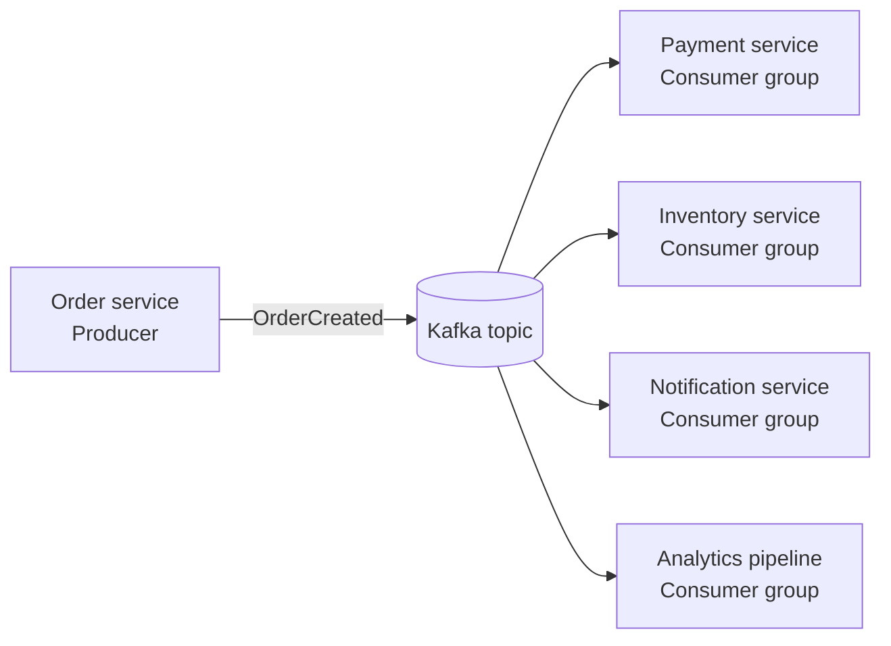
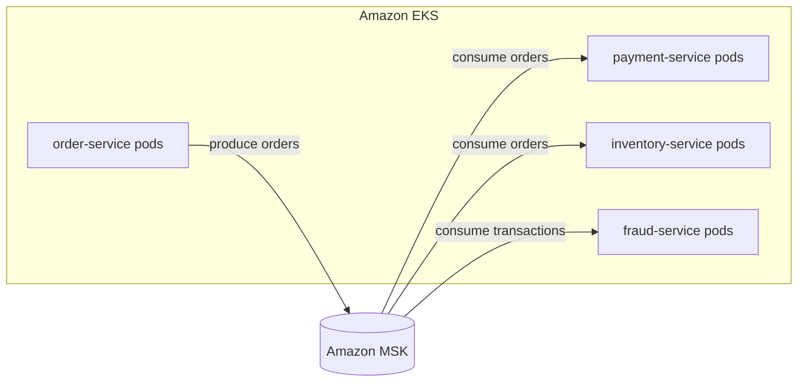
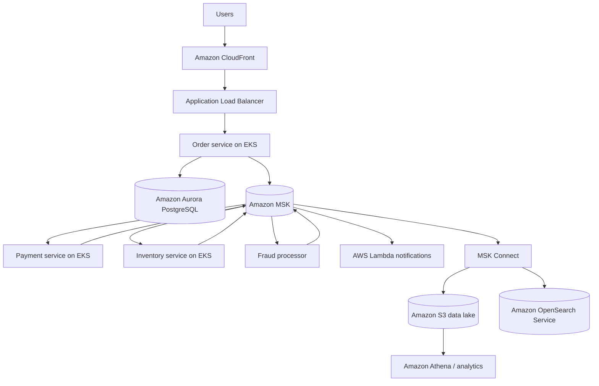
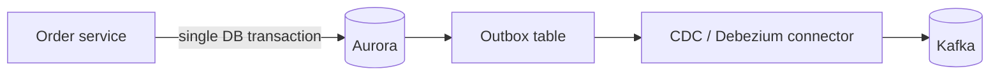

# Apache Kafka on AWS: Complete Study Guide

> **Purpose:** A practical, detailed guide to understanding Apache Kafka, how applications interact with it, when it should be used, and how to design a production solution with Amazon MSK and Amazon EKS.
>
> **Last reviewed:** 18 July 2026  
> **Primary references:** Apache Kafka 4.3 documentation and current AWS documentation.

---

## Table of contents

1. [Executive summary](#1-executive-summary)
2. [What problem Kafka solves](#2-what-problem-kafka-solves)
3. [What an event is](#3-what-an-event-is)
4. [The correct mental model](#4-the-correct-mental-model)
5. [Kafka architecture and components](#5-kafka-architecture-and-components)
6. [How a message moves through Kafka](#6-how-a-message-moves-through-kafka)
7. [Partitions, ordering, keys, and parallelism](#7-partitions-ordering-keys-and-parallelism)
8. [Consumer groups, offsets, and lag](#8-consumer-groups-offsets-and-lag)
9. [Replication, leaders, ISR, and availability](#9-replication-leaders-isr-and-availability)
10. [Retention, replay, and log compaction](#10-retention-replay-and-log-compaction)
11. [Delivery and processing guarantees](#11-delivery-and-processing-guarantees)
12. [Schemas, serialization, and event contracts](#12-schemas-serialization-and-event-contracts)
13. [Kafka Connect and Kafka Streams](#13-kafka-connect-and-kafka-streams)
14. [How Kafka interacts with you](#14-how-kafka-interacts-with-you)
15. [Kafka compared with databases and AWS messaging services](#15-kafka-compared-with-databases-and-aws-messaging-services)
16. [When Kafka is appropriate—and when it is not](#16-when-kafka-is-appropriateand-when-it-is-not)
17. [Amazon MSK](#17-amazon-msk)
18. [Amazon MSK networking and security](#18-amazon-msk-networking-and-security)
19. [Amazon EKS applications connecting to MSK](#19-amazon-eks-applications-connecting-to-msk)
20. [Complete AWS e-commerce architecture](#20-complete-aws-e-commerce-architecture)
21. [Database consistency and the transactional outbox](#21-database-consistency-and-the-transactional-outbox)
22. [Failure handling, retries, and dead-letter topics](#22-failure-handling-retries-and-dead-letter-topics)
23. [Production monitoring and operations](#23-production-monitoring-and-operations)
24. [Security and governance checklist](#24-security-and-governance-checklist)
25. [Topic and event design best practices](#25-topic-and-event-design-best-practices)
26. [Common mistakes and troubleshooting](#26-common-mistakes-and-troubleshooting)
27. [Practical commands and configuration examples](#27-practical-commands-and-configuration-examples)
28. [Hands-on learning path](#28-hands-on-learning-path)
29. [Architecture decision checklist](#29-architecture-decision-checklist)
30. [Glossary](#30-glossary)
31. [Official references](#31-official-references)

---

# 1. Executive summary

**Apache Kafka is a distributed event-streaming platform.**

It receives events from applications, stores them in ordered logs, replicates them for availability, and lets one or many independent applications process them immediately or later.

A simple architecture looks like this:



The central idea is not merely “send a message from application A to application B.” Kafka records a durable history of business or technical events and gives different consumers independent access to that history.

Kafka is especially useful when a system needs:

- High-throughput event ingestion.
- Several independent consumers of the same events.
- Ordering for related events.
- Durable retention and replay.
- Asynchronous integration between services.
- Real-time stream processing.
- Change data capture and data pipelines.
- Portability across environments that support the Kafka protocol and ecosystem.

In AWS, organizations commonly use **Amazon Managed Streaming for Apache Kafka (Amazon MSK)** instead of operating brokers themselves. Applications running in Amazon EKS, Amazon EC2, AWS Lambda, or other environments use normal Kafka client libraries to produce and consume records.

---

# 2. What problem Kafka solves

Consider an order service that must coordinate with payment, inventory, fraud detection, notifications, shipping, and analytics.

Without an event platform, the order service may call every downstream service directly:

```text
Order service
 ├── HTTP request to payment
 ├── HTTP request to inventory
 ├── HTTP request to fraud
 ├── HTTP request to notification
 └── HTTP request to analytics
```

This creates several forms of coupling:

- **Location coupling:** the order service must know every destination.
- **Availability coupling:** a slow or unavailable dependency can affect the order request.
- **Deployment coupling:** adding a new consumer requires changing integration logic.
- **Traffic coupling:** a spike in orders immediately becomes a spike for every dependency.
- **Retry coupling:** the producer must understand how to retry each downstream API.
- **Ownership coupling:** one team may need to coordinate releases with many other teams.

With Kafka:

```text
Order service → publishes OrderCreated once → Kafka
                                              ├── Payment consumes it
                                              ├── Inventory consumes it
                                              ├── Fraud consumes it
                                              ├── Notifications consume it
                                              └── Analytics consumes it
```

The order service publishes a fact. It does not need to know every current or future consumer.

Kafka also acts as a buffer. If the analytics consumer is unavailable for thirty minutes, producers can continue writing, assuming the Kafka cluster has sufficient capacity and the retained records remain available. When analytics recovers, it resumes from its last committed position.

This is why Kafka is often used as the central event backbone of an event-driven architecture.

---

# 3. What an event is

An **event** is a record representing something that happened.

Examples:

- `CustomerRegistered`
- `OrderCreated`
- `PaymentAuthorized`
- `InventoryReserved`
- `ShipmentDispatched`
- `PageViewed`
- `TemperatureMeasured`
- `FileUploaded`
- `DatabaseRowChanged`
- `SecurityAlertDetected`

A well-designed event usually includes:

```json
{
  "eventId": "7e858f8f-9337-44d1-91fb-9038d56653a6",
  "eventType": "OrderCreated",
  "eventVersion": 1,
  "occurredAt": "2026-07-18T09:30:00Z",
  "producer": "order-service",
  "correlationId": "checkout-79b21",
  "data": {
    "orderId": "ORD-7842",
    "customerId": "CUST-52",
    "total": 149.99,
    "currency": "EUR"
  }
}
```

Important fields include:

- **eventId:** unique identifier used for deduplication and audit.
- **eventType:** identifies what happened.
- **eventVersion:** identifies the event contract version.
- **occurredAt:** the business event time.
- **producer:** system that created the event.
- **correlationId:** connects events belonging to one workflow.
- **data:** event-specific payload.

An event should normally describe a fact in the past tense. `OrderCreated` is generally clearer than a vague topic full of commands such as `ProcessOrder`.

## Event versus command

A **command** asks a specific component to do something:

```json
{
  "commandType": "ReserveInventory",
  "orderId": "ORD-7842"
}
```

An **event** announces that something already happened:

```json
{
  "eventType": "InventoryReserved",
  "orderId": "ORD-7842"
}
```

Kafka can carry either, but mixing commands and events without a clear convention creates confusing ownership and retry semantics.

---

# 4. The correct mental model

The best beginner mental model is an **append-only distributed log**.

Imagine a notebook:

```text
Offset 0: CustomerRegistered
Offset 1: OrderCreated
Offset 2: PaymentRequested
Offset 3: PaymentAuthorized
Offset 4: InventoryReserved
Offset 5: ShipmentCreated
```

New records are appended. Consumers remember where they are in the notebook.

Different applications can maintain different positions:

```text
payment-service:      read through offset 5
analytics-service:    read through offset 3
notification-service: read through offset 4
```

Reading a record does not normally delete it. Kafka retains it according to topic configuration.

This differs from the simplest queue model, where a worker receives a message and removes it from the queue after successful processing.

A useful one-sentence model is:

> Kafka is a distributed, durable, partitioned log that applications use to publish, retain, consume, and replay event streams.

---

# 5. Kafka architecture and components

## 5.1 Producer

A **producer** publishes records to Kafka topics.

Examples:

- An EKS order-service pod publishes `OrderCreated`.
- A payment service publishes `PaymentApproved`.
- A database connector publishes row changes.
- A website tracking library publishes click events.
- An IoT gateway publishes device telemetry.

A producer record contains:

```text
topic
partition, optional
key, optional but important
value
headers, optional
timestamp
```

Conceptually:

```python
producer.send(
    topic="order-events",
    key="ORD-7842",
    value={
        "eventType": "OrderCreated",
        "orderId": "ORD-7842"
    }
)
```

Producers normally connect using a list of **bootstrap brokers**. This is only an initial list. The client retrieves cluster metadata and learns which broker leads each partition.

Producer behavior is influenced by configurations such as:

- `acks`
- `enable.idempotence`
- `retries`
- `delivery.timeout.ms`
- `request.timeout.ms`
- `batch.size`
- `linger.ms`
- `compression.type`
- `max.in.flight.requests.per.connection`

The producer batches records for efficiency. Larger batches often improve throughput but may add a small amount of latency.

---

## 5.2 Topic

A **topic** is a named stream of records.

Examples:

```text
orders.v1
payments.v1
inventory-events.v1
customer-activity.v1
application-logs.v1
fraud-alerts.v1
```

A topic defines:

- Number of partitions.
- Replication factor.
- Retention by time or size.
- Cleanup policy.
- Maximum record size.
- Compression behavior at the broker level.
- Other operational limits.

A topic is not a single file on one server. It is divided into partitions distributed across brokers.

---

## 5.3 Partition

A **partition** is an ordered subsection of a topic.

```text
Topic: order-events

Partition 0:
  offset 0 → event A
  offset 1 → event D
  offset 2 → event G

Partition 1:
  offset 0 → event B
  offset 1 → event E
  offset 2 → event H

Partition 2:
  offset 0 → event C
  offset 1 → event F
  offset 2 → event I
```

Partitions provide:

1. **Parallelism:** different consumers can process different partitions.
2. **Scalability:** reads and writes are distributed across brokers.
3. **Ordering boundaries:** records are ordered within one partition.

Kafka does **not** provide a simple total ordering across every partition in a topic. If total ordering is mandatory, a single partition provides it, but a single partition also limits parallelism and throughput.

---

## 5.4 Record key

The record key normally determines the partition.

For example:

```text
key = orderId
```

All events for `ORD-7842` are normally mapped to the same partition:

```text
OrderCreated
PaymentAuthorized
InventoryReserved
ShipmentCreated
```

This preserves order for that order ID.

Keys also matter for log-compacted topics because compaction keeps the latest value for each key.

Choosing a key is an architectural decision. Common keys are:

- `orderId`
- `customerId`
- `accountId`
- `deviceId`
- `shipmentId`
- `tenantId`

A poor key can cause **partition skew**. For example, using a country code where 80% of traffic is from one country may overload one partition.

---

## 5.5 Offset

An **offset** is the sequential position of a record within one partition.

```text
Partition 2

offset 18423 → OrderCreated
offset 18424 → PaymentAuthorized
offset 18425 → InventoryReserved
```

Offsets are local to a partition. `partition 0, offset 100` is a different position from `partition 1, offset 100`.

Consumers use offsets to track progress.

Offsets make it possible to:

- Resume after a restart.
- Retry records.
- Reprocess historical events.
- Rebuild a search index.
- Recreate a materialized view.
- Run a new consumer against old retained data.
- Audit what a consumer has processed.

---

## 5.6 Broker

A **broker** is a Kafka server.

A Kafka cluster contains multiple brokers:

```text
Broker 1: leaders and replicas for several partitions
Broker 2: leaders and replicas for several partitions
Broker 3: leaders and replicas for several partitions
```

Brokers:

- Accept produce requests.
- Store partition log segments.
- Serve fetch requests.
- Replicate data.
- Participate in leader election.
- Expose metadata to clients.
- Enforce quotas, authentication, and authorization.

---

## 5.7 Cluster controller and KRaft

Kafka requires a metadata and control plane that tracks brokers, topics, partitions, leadership, and cluster state.

Older Kafka deployments used **Apache ZooKeeper** for this coordination.

Modern Kafka uses **KRaft**, Kafka's built-in Raft-based metadata mode. Kafka 4.x is KRaft-based; legacy command options that depended on ZooKeeper have been removed from current administration tooling.

Amazon MSK documentation may refer to both KRaft controllers and ZooKeeper nodes because MSK supports different Kafka generations and cluster modes. For a new design, use the current MSK-supported Kafka version and metadata mode recommended by AWS instead of building around ZooKeeper.

---

## 5.8 Consumer

A **consumer** reads records from Kafka.

Conceptually:

```python
consumer.subscribe(["order-events"])

while True:
    records = consumer.poll()
    for record in records:
        process(record)
    consumer.commit()
```

A consumer usually:

1. Joins a consumer group.
2. Receives one or more partition assignments.
3. Polls batches of records.
4. Deserializes the key and value.
5. Executes business processing.
6. Commits progress.
7. Handles retries or failures.

---

## 5.9 Consumer group

A **consumer group** is a set of consumer instances cooperating as one logical application.

Suppose a topic has six partitions and an inventory service has three replicas:

```text
inventory-service group

Pod A → partitions 0 and 3
Pod B → partitions 1 and 4
Pod C → partitions 2 and 5
```

Within a group, one partition is actively assigned to one consumer at a time.

If the deployment scales to six pods, each may receive one partition. If it scales to ten pods while the topic still has six partitions, at least four pods will be idle from the perspective of that topic.

Different consumer groups independently process the same records:

```text
order-events
 ├── group: payment-service
 ├── group: inventory-service
 ├── group: fraud-service
 ├── group: notifications-service
 └── group: analytics-pipeline
```

Each group has its own offsets.

---

## 5.10 Replicas, leader, followers, and ISR

Each partition has:

- One **leader replica**.
- Zero or more **follower replicas**.
- An **in-sync replica set**, commonly called ISR.

The leader handles partition reads and writes. Followers copy the leader's log.

Example:

```text
order-events partition 2

Broker 1 → leader
Broker 2 → follower, in sync
Broker 3 → follower, in sync
```

If Broker 1 fails, an eligible in-sync replica can become leader.

---

# 6. How a message moves through Kafka

Consider an EKS order service publishing an order event.

## Step 1: The producer starts

The pod loads:

- Bootstrap broker addresses.
- TLS settings.
- Authentication settings.
- Key and value serializers.
- Retry and timeout configuration.

## Step 2: The producer obtains metadata

The client contacts a bootstrap broker and asks:

- Which topics and partitions exist?
- Which broker is leader for each partition?
- What metadata epoch is current?

## Step 3: The application creates a record

```json
{
  "eventType": "OrderCreated",
  "orderId": "ORD-7842",
  "total": 149.99
}
```

Key:

```text
ORD-7842
```

Topic:

```text
order-events
```

## Step 4: Serialization

Kafka transports bytes. The application serializes the key and value.

Common formats:

- JSON
- Apache Avro
- Protocol Buffers
- JSON Schema
- Plain strings
- Custom binary formats

## Step 5: Partition selection

The producer partitioner hashes the key and maps it to a partition.

```text
hash("ORD-7842") → partition 2
```

## Step 6: Batching and compression

The producer may accumulate multiple records for partition 2 into a batch.

Possible compression codecs include gzip, Snappy, LZ4, and Zstandard, depending on client and broker support.

## Step 7: Produce request

The producer sends the batch to the broker leading partition 2.

## Step 8: Broker append and replication

The leader appends the batch to its log. Followers fetch and replicate it.

The producer's `acks` configuration determines what acknowledgement level it waits for.

## Step 9: Acknowledgement

The broker returns success and record metadata, including partition and offset.

```text
topic=order-events
partition=2
offset=18423
```

## Step 10: Consumer fetch

A consumer assigned to partition 2 requests records from an offset.

## Step 11: Processing

The consumer deserializes the event and performs business work.

## Step 12: Offset commit

After successful processing, the consumer group records its progress.

The exact point at which it commits affects whether failures produce potential loss or duplicate processing.

---

# 7. Partitions, ordering, keys, and parallelism

## 7.1 Ordering guarantee

Kafka guarantees ordering **within a partition**.

It does not guarantee that:

```text
partition 0 offset 100
```

occurred globally before:

```text
partition 1 offset 95
```

even if timestamps appear close.

Therefore, place records that need relative ordering under a common key.

## 7.2 Partition count controls consumer parallelism

For one consumer group:

```text
maximum active consumers for a topic ≈ number of partitions
```

This is simplified because one application may consume multiple topics, but it is a useful planning rule.

## 7.3 More partitions are not free

Increasing partition count can improve parallelism, but it also increases:

- Broker metadata.
- Open files.
- Replication work.
- Recovery work.
- Consumer assignment complexity.
- Network connections.
- Memory and page-cache pressure.
- Operational overhead.

Kafka does not support simply reducing a topic's partition count. Correcting excessive partitioning often means creating a replacement topic and migrating.

## 7.4 Adding partitions can affect key mapping

When the number of partitions changes, the same key may map to a different partition for future records, depending on the partitioner.

This does not reorder records already written, but it may break the assumption that all historical and future records for a key are in one partition.

Plan partition count with expected growth in mind.

## 7.5 Hot partitions

A partition becomes hot when it receives disproportionately high traffic.

Causes include:

- Low-cardinality keys.
- A dominant tenant.
- A timestamp bucket used as a key.
- Null keys with a partitioner that does not distribute as expected.
- One exceptionally active account or device.

Mitigations include:

- Better key design.
- Composite keys.
- Salting keys where strict per-entity ordering is unnecessary.
- Separating high-volume tenants.
- Increasing partitions, with awareness of mapping changes.
- Rate limits and quotas.

---

# 8. Consumer groups, offsets, and lag

## 8.1 Group coordination

Consumers join a group using a `group.id`.

The group coordinator assigns partitions among active members. When membership or subscriptions change, Kafka may rebalance the group.

Rebalances can be caused by:

- A pod starting.
- A pod stopping.
- A pod crashing.
- A consumer failing to poll within configured limits.
- Topic partition changes.
- Deployment scaling.
- Network interruptions.

Frequent rebalances reduce throughput and can temporarily pause processing.

## 8.2 Offset commit

The consumer group stores the next position to process for each partition.

Suppose the last successfully processed record was offset 18425. The committed next offset is normally 18426.

## 8.3 Automatic versus manual commits

**Automatic commits** are easier but can commit progress at a time that does not align with business completion.

**Manual commits** provide control but require careful handling.

A common at-least-once sequence is:

```text
1. Poll records.
2. Process records.
3. Persist side effects.
4. Commit offsets.
```

If the application crashes after step 3 but before step 4, it will process some records again. The business operation therefore needs idempotency.

## 8.4 Consumer lag

Lag is approximately:

```text
latest available offset - consumer group's committed offset
```

Lag means the consumer is behind.

Lag can rise because:

- Producers are publishing faster than consumers process.
- Too few partitions or consumers exist.
- Downstream databases or APIs are slow.
- A poison record causes repeated retries.
- The consumer is rebalancing repeatedly.
- CPU or memory is insufficient.
- Garbage collection is pausing the process.
- Network connectivity is unstable.
- A consumer is not running.

Lag is not automatically an error. A batch analytics consumer may intentionally process with delay. The important question is whether lag violates the application's recovery-time or freshness objective.

## 8.5 Scaling consumers in Kubernetes

An EKS deployment can scale consumer pods. However:

- Scaling beyond the partition count gives no additional per-topic parallelism.
- Scaling causes rebalances.
- Stateful processing may require time to restore local state.
- Autoscaling solely on CPU may miss growing lag.
- A Kafka-aware metric such as lag is often a better scaling input.

---

# 9. Replication, leaders, ISR, and availability

## 9.1 Replication factor

The replication factor is the number of replicas for each partition.

Example:

```text
replication.factor = 3
```

There are three copies distributed across brokers.

Replication factor is not a backup. It protects against broker or infrastructure failure, not every operational accident.

## 9.2 Minimum in-sync replicas

`min.insync.replicas` defines how many in-sync replicas must be available for a write to succeed when the producer uses `acks=all`.

A typical highly available pattern is:

```text
replication factor = 3
minimum in-sync replicas = 2
producer acks = all
```

This can tolerate one replica being unavailable while still accepting durable writes.

AWS recommends three Availability Zones and a replication factor of at least three for highly available MSK Provisioned Standard clusters. AWS also recommends keeping `minISR` no greater than `RF - 1`, so maintenance of one broker does not prevent writes.

## 9.3 Under-replicated partitions

An under-replicated partition has fewer in-sync replicas than expected.

This may happen during:

- Broker failure.
- Network degradation.
- Disk saturation.
- Broker overload.
- Rolling maintenance.
- Slow replica fetch.
- Partition reassignment.

Persistent under-replication is a serious operational signal.

## 9.4 Unclean leader election

An unclean leader election can allow an out-of-sync replica to become leader. This may restore availability at the cost of potential data loss.

Production settings should be selected according to business durability requirements. Do not enable risky availability shortcuts without understanding the data-loss trade-off.

## 9.5 Multi-AZ design

In AWS, distribute brokers and replicas across Availability Zones.

The application clients must also be resilient:

- Provide multiple bootstrap brokers.
- Use reconnect and retry behavior.
- Avoid assuming one broker endpoint is permanently available.
- Handle leader changes.
- Distribute EKS workloads across zones.
- Configure PodDisruptionBudgets and topology spread where appropriate.

---

# 10. Retention, replay, and log compaction

Kafka keeps records based on topic cleanup policies.

## 10.1 Time-based retention

Example:

```text
retention.ms = 604800000
```

This represents seven days.

Records older than the configured period become eligible for deletion as log segments are cleaned.

## 10.2 Size-based retention

Example:

```text
retention.bytes = 107374182400
```

Kafka keeps data until the partition reaches the configured limit, after which older segments become eligible for deletion.

Retention is evaluated by partition.

## 10.3 Delete cleanup policy

```text
cleanup.policy = delete
```

Old log segments are removed according to time or size retention.

This is common for transient event streams, logs, and clickstreams.

## 10.4 Compact cleanup policy

```text
cleanup.policy = compact
```

Kafka eventually retains at least the latest value for each key.

Example history:

```text
customer-52 → bronze
customer-52 → silver
customer-52 → gold
```

After compaction, the latest value can remain:

```text
customer-52 → gold
```

Compaction is asynchronous and does not mean duplicates disappear immediately.

A record with a key and a null value is commonly called a **tombstone** and represents deletion for compacted topics.

Compacted topics are useful for:

- Current customer state.
- Configuration state.
- Entity changelogs.
- Rebuilding caches.
- Kafka Streams state-store changelogs.

## 10.5 Combined cleanup

A topic can use:

```text
cleanup.policy = compact,delete
```

This combines key-based compaction with time or size deletion.

## 10.6 Replay

Replay means resetting or starting offsets at an earlier position.

Use cases:

- Fixing a consumer bug.
- Rebuilding an OpenSearch index.
- Recalculating analytics.
- Testing a new consumer.
- Recovering missed processing.
- Reconstructing materialized state.

Replay is powerful but can repeat external side effects. A replay-safe consumer must be idempotent or use a controlled reprocessing strategy.

---

# 11. Delivery and processing guarantees

Terms such as “exactly once” are frequently misunderstood. Separate these questions:

1. Was the record written once to Kafka?
2. Was the record read one or more times?
3. Was the business effect executed once?
4. Was an output record written atomically with consumed offsets?
5. Does an external database or payment provider participate in the same transaction?

## 11.1 At-most-once

A simplified sequence:

```text
commit offset → process record
```

If processing fails, the consumer may skip the record.

Result:

```text
zero or one processing attempt
```

Use only when occasional loss is acceptable.

## 11.2 At-least-once

A simplified sequence:

```text
process record → commit offset
```

If processing succeeds but the commit fails, Kafka may deliver the record again.

Result:

```text
one or more processing attempts
```

This is common and practical when consumers are idempotent.

## 11.3 Idempotent producer

Kafka's idempotent producer prevents duplicate log entries caused by producer retries within the supported producer session and configuration model.

A strong baseline is normally:

```properties
acks=all
enable.idempotence=true
```

Modern Kafka clients enable safe related defaults when idempotence is enabled, but teams should still understand the effective configuration.

Producer idempotence does **not** automatically make an external payment charge exactly once.

## 11.4 Kafka transactions

Kafka transactions can atomically write records to multiple partitions and coordinate consumed offsets with produced output in Kafka-to-Kafka processing.

A transaction can support this pattern:

```text
read input records
produce output records
commit input offsets
```

as one Kafka transaction.

Consumers reading transactional output use an appropriate isolation level, such as `read_committed`, when they must avoid seeing aborted transactional records.

## 11.5 Exactly-once processing boundaries

Kafka can provide exactly-once semantics for supported Kafka processing flows, especially where inputs, outputs, and offsets are all within Kafka.

External systems still require patterns such as:

- Idempotency keys.
- Unique constraints.
- Transactional outbox.
- Inbox/deduplication table.
- Conditional writes.
- Payment-provider idempotency tokens.
- Saga compensation.
- Two-phase coordination only where truly justified.

A good rule is:

> “Exactly once” is an end-to-end system property, not a magic producer or consumer switch.

---

# 12. Schemas, serialization, and event contracts

Kafka stores bytes, so producers and consumers need a shared contract.

## 12.1 JSON

Advantages:

- Human-readable.
- Easy to debug.
- Broad language support.

Disadvantages:

- Larger payloads.
- Weak typing without validation.
- Easy to introduce incompatible field changes.
- Numeric and date conventions can become inconsistent.

## 12.2 Avro

Advantages:

- Compact binary encoding.
- Explicit schema.
- Strong schema-evolution ecosystem.
- Common in Kafka platforms.

## 12.3 Protocol Buffers

Advantages:

- Compact.
- Strongly typed.
- Good multi-language code generation.
- Explicit field numbering.

## 12.4 JSON Schema

Advantages:

- Retains JSON representation.
- Adds formal validation.
- Easier transition for JSON-oriented teams.

## 12.5 Schema registry

A schema registry stores and governs schemas.

AWS Glue Schema Registry can centrally manage data-stream schemas and integrate producers and consumers with Amazon MSK or Apache Kafka.

A registry can enforce compatibility modes so a new producer version does not unexpectedly break consumers.

## 12.6 Compatibility concepts

**Backward compatibility:** a new consumer can read data written with an older schema.

**Forward compatibility:** an old consumer can read data written with a newer schema.

**Full compatibility:** both directions are supported under the selected rules.

Safe evolution often includes:

- Adding optional fields with defaults.
- Avoiding field-type changes.
- Avoiding reusing removed field identifiers.
- Keeping semantic meaning stable.
- Versioning events when meaning changes fundamentally.

## 12.7 Event envelope

A common envelope standardizes metadata:

```json
{
  "eventId": "uuid",
  "eventType": "OrderCreated",
  "eventVersion": 2,
  "occurredAt": "2026-07-18T09:30:00Z",
  "traceId": "trace-123",
  "correlationId": "checkout-456",
  "source": "order-service",
  "tenantId": "tenant-a",
  "data": {}
}
```

This supports tracing, auditing, schema routing, tenant controls, and deduplication.

---

# 13. Kafka Connect and Kafka Streams

Kafka includes more than producers and consumers.

## 13.1 Kafka Connect

Kafka Connect is a standardized framework for moving data between Kafka and external systems.

A **source connector** moves data into Kafka:

```text
PostgreSQL changes → Kafka
MySQL changes      → Kafka
Application logs   → Kafka
SaaS events        → Kafka
```

A **sink connector** moves data out:

```text
Kafka → Amazon S3
Kafka → OpenSearch
Kafka → data warehouse
Kafka → external database
```

Connect manages:

- Connector configuration.
- Worker scaling.
- Task distribution.
- Offset management.
- Status.
- Restart behavior.
- Converter and serialization integration.

**Amazon MSK Connect** is AWS's managed Kafka Connect capability. It can run compatible connectors, including third-party connectors such as Debezium, and can scale workers based on load.

## 13.2 Change data capture

Change data capture, or CDC, converts database changes into a stream.

Example:

```text
Aurora PostgreSQL write-ahead log
              ↓
         Debezium connector
              ↓
           Kafka topic
```

CDC can power:

- Search indexing.
- Cache updates.
- Data-lake ingestion.
- Audit trails.
- Microservice migrations.
- The transactional outbox pattern.

## 13.3 Kafka Streams

Kafka Streams is a Java/Scala client library for continuous processing.

It supports:

- `map`
- `filter`
- `branch`
- `groupBy`
- `count`
- `reduce`
- `aggregate`
- joins
- windows
- state stores

Example:

```text
transactions topic
        ↓
filter suspicious amounts
        ↓
group by account
        ↓
count transactions in 5-minute window
        ↓
fraud-signals topic
```

Kafka Streams applications are normal deployable applications. They can run as containers in EKS.

## 13.4 Kafka versus Apache Flink

Kafka Streams is a library embedded in an application and is tightly integrated with Kafka.

Apache Flink is a broader distributed stream-processing engine with advanced event-time, state, and processing capabilities. On AWS, Amazon Managed Service for Apache Flink can consume from MSK.

Use the simplest tool that satisfies the state, windowing, event-time, scaling, and operational requirements.

---

# 14. How Kafka interacts with you

## 14.1 As an end user

You normally do not see Kafka.

You perform an action:

```text
Click "Place order"
```

Behind the scenes:

```text
API → order service → Kafka → payment/inventory/notifications/analytics
```

## 14.2 As an application developer

You:

- Add a Kafka client dependency.
- Configure brokers and security.
- Define serializers and schemas.
- Publish or subscribe.
- Handle retries and duplicates.
- Define consumer group IDs.
- Design event contracts.
- Test failure cases.
- Instrument metrics and traces.

## 14.3 As a platform or cloud engineer

You:

- Provision and upgrade clusters.
- Configure VPC connectivity.
- Control IAM permissions or Kafka ACLs.
- Manage certificates or secrets where needed.
- Define topic standards.
- Set partition and replication policies.
- Monitor brokers, storage, throughput, lag, and replication.
- Plan disaster recovery.
- Support connectors and stream processors.
- Control cost and capacity.

## 14.4 As an operations team

You answer questions such as:

- Is the cluster healthy?
- Are partitions balanced?
- Are consumers behind?
- Is a broker near CPU or storage limits?
- Are records failing schema validation?
- Is a consumer retrying one poison event?
- Did a deployment trigger continuous rebalances?
- Can the platform tolerate an AZ or broker failure?
- Can data be replayed safely?

---

# 15. Kafka compared with databases and AWS messaging services

## 15.1 Kafka versus PostgreSQL/MySQL/Aurora

| Characteristic | Kafka | Relational database |
|---|---|---|
| Primary model | Partitioned event log | Tables, rows, constraints |
| Main write pattern | Append records | Insert/update/delete rows |
| Query model | Sequential consumption by offset | SQL and indexes |
| Retention | Configured stream retention | Persistent application state |
| Replay | Native | Requires history/change log |
| Ordering | Per partition | Transaction/query semantics |
| Multiple independent readers | Core design | Possible, different model |
| Joins | Via stream processors | Native SQL |
| Constraints | Limited at stream layer | Strong constraints |
| Typical purpose | Events and integration | Source of current business state |

Most architectures use both:

```text
Aurora/PostgreSQL → authoritative current state
Kafka             → event history and integration
S3                → long-term analytical history
OpenSearch        → search
Redshift/Athena   → analytics
```

## 15.2 Kafka versus Amazon SQS

| Requirement | Kafka/MSK | SQS |
|---|---|---|
| Primary pattern | Event stream | Work queue |
| Replay retained history | Native by offset | Not Kafka-style replay |
| Multiple independent consumers | Consumer groups read independently | Usually separate queues/fan-out |
| Ordering | Per partition | FIFO queues offer ordering constraints |
| Operations | More complex | Simpler managed queue |
| Ecosystem portability | Kafka ecosystem | AWS-native |
| Best fit | Streaming platform | Decoupled task processing |

Use SQS when the core statement is:

> One worker should process this job reliably.

Use Kafka when the core statement is:

> This event belongs to a durable stream that multiple systems may process independently now or later.

## 15.3 Kafka versus Amazon SNS

SNS is push-based pub/sub and fan-out. Kafka is a retained partitioned log consumed by offsets.

SNS commonly fans events to SQS, Lambda, HTTP endpoints, or other subscribers. It is simpler when long replayable history and Kafka compatibility are not requirements.

## 15.4 Kafka versus Amazon EventBridge

EventBridge is an AWS event bus focused on routing, filtering, SaaS/AWS integration, and event-driven application connectivity.

Kafka is stronger when you need:

- High-volume retained streams.
- Partition-based ordering.
- Consumer-controlled replay.
- Kafka protocols and tooling.
- Stream-processing ecosystems.

EventBridge is often stronger when you need:

- Rule-based event routing.
- Native AWS/SaaS integrations.
- Minimal broker management.
- Event buses across accounts.
- Event-driven automation.

They can be combined.

## 15.5 Kafka versus Kinesis Data Streams

Both provide retained, partitioned streaming.

Choose MSK when:

- Existing Kafka applications or skills matter.
- Kafka protocol compatibility is required.
- Kafka Connect or Kafka Streams is central.
- Portability to other Kafka environments matters.

Choose Kinesis Data Streams when:

- An AWS-native API is acceptable.
- You prefer AWS-managed shard/on-demand concepts.
- Deep native AWS integration outweighs Kafka ecosystem compatibility.

## 15.6 Kafka versus RabbitMQ/Amazon MQ

RabbitMQ is a message broker with routing patterns, exchanges, queues, and acknowledgements.

Kafka is an event log optimized for retained streams, replay, and high throughput.

RabbitMQ/Amazon MQ can be a better fit for traditional messaging protocols, complex routing semantics, or migration of existing broker applications.

---

# 16. When Kafka is appropriate—and when it is not

## Good Kafka use cases

- Event-driven microservices.
- E-commerce orders and payments.
- Financial transaction streams.
- Fraud detection.
- Clickstream analytics.
- Log and security-event pipelines.
- IoT telemetry.
- Database CDC.
- Search-index synchronization.
- Data-lake ingestion.
- Real-time personalization.
- Metrics and observability pipelines.
- Event sourcing, with careful domain design.
- Machine-learning feature streams.
- Multi-stage stream transformations.

## Kafka may be excessive when

- One small application needs a simple background queue.
- Traffic is low and replay is unnecessary.
- Direct synchronous calls are sufficient.
- There is only one consumer and no retained history requirement.
- The team lacks Kafka operational skills.
- Ordering and high throughput are not important.
- EventBridge, SQS, SNS, or Kinesis directly fits the use case.
- The system cannot tolerate the additional complexity of schemas, retries, offsets, and asynchronous workflows.

## Strong Kafka selection criteria

A good Kafka requirement sounds like:

> We need a durable, high-throughput, ordered-by-key event stream that several independently scalable systems consume, and we need to replay retained events.

A weak requirement sounds like:

> We want asynchronous communication.

“Asynchronous” alone does not justify Kafka.

---

# 17. Amazon MSK

Amazon MSK is a fully managed AWS service for building applications with open-source Apache Kafka.

AWS manages control-plane and infrastructure tasks such as cluster creation, broker replacement, and service integration. Your applications still use Kafka data-plane APIs to create topics, produce records, and consume records.

## 17.1 Deployment options

### MSK Provisioned with Standard brokers

You choose and manage major capacity dimensions such as:

- Broker instance family and size.
- Broker count.
- Storage capacity and related options.
- Kafka version.
- Topic partitioning.
- Cluster configuration.

Standard brokers provide the most configuration flexibility.

### MSK Provisioned with Express brokers

Express brokers are a provisioned option designed to reduce storage and resilience management. AWS manages elastic storage and applies more built-in guardrails.

They are useful for high-performance workloads where teams want Kafka control with less storage planning.

### MSK Serverless

MSK Serverless automatically provisions and scales cluster capacity and uses throughput-based charging.

It is useful for:

- Variable workloads.
- Teams that do not want to size brokers.
- Development and initial adoption.
- Workloads that fit Serverless quotas and supported features.

MSK Serverless requires IAM access control.

## 17.2 MSK is managed, not fully hands-off

Even with MSK, teams still own:

- Topic design.
- Partition counts.
- Keys.
- Retention.
- Schemas.
- Producer/consumer correctness.
- Consumer lag.
- Application retries.
- IAM policy design.
- Networking.
- Cost controls.
- Recovery objectives.
- Connectors and processing logic.

A managed broker does not remove application architecture responsibilities.

## 17.3 Related MSK capabilities

- **MSK Connect:** managed Kafka Connect workers and connectors.
- **MSK Replicator:** managed replication between supported MSK Provisioned clusters.
- **CloudWatch integration:** cluster metrics and alarms.
- **Prometheus-compatible monitoring:** additional Kafka metrics for supported configurations.
- **IAM access control:** AWS identity-based Kafka authentication and authorization.
- **Multi-VPC private connectivity:** AWS PrivateLink-based client connectivity across VPCs/accounts in supported configurations.

---

# 18. Amazon MSK networking and security

## 18.1 Private networking

MSK clusters are normally deployed into VPC subnets.

Clients require network paths to broker endpoints:

- Same VPC.
- VPC peering.
- Transit Gateway.
- Supported multi-VPC private connectivity.
- Other approved private networking patterns.
- Public access only where explicitly supported, required, and secured.

Security groups and routing must allow the required client-to-broker traffic.

## 18.2 Bootstrap brokers

Retrieve broker connection strings using:

```bash
aws kafka get-bootstrap-brokers \
  --cluster-arn "$CLUSTER_ARN"
```

For IAM-enabled private access, the response includes a field such as:

```text
BootstrapBrokerStringSaslIam
```

Do not hard-code only one broker. Use the provided bootstrap list.

## 18.3 Authentication options

Depending on cluster type and configuration, MSK supports options such as:

- IAM access control.
- SASL/SCRAM with credentials protected in AWS Secrets Manager.
- Mutual TLS using certificates.
- Unauthenticated access only in specifically configured private scenarios, generally not recommended for production.

IAM access control combines authentication and Kafka data-plane authorization.

## 18.4 Encryption

Use:

- TLS for client-to-broker traffic.
- Encryption at rest using AWS-managed or customer-managed KMS keys as appropriate.
- Secrets Manager for SCRAM credentials.
- Private networking to reduce public exposure.

## 18.5 Least-privilege IAM

Separate producer and consumer permissions.

A producer may need:

```json
{
  "Effect": "Allow",
  "Action": [
    "kafka-cluster:Connect"
  ],
  "Resource": "arn:aws:kafka:REGION:ACCOUNT_ID:cluster/CLUSTER_NAME/CLUSTER_UUID"
}
```

and topic permissions:

```json
{
  "Effect": "Allow",
  "Action": [
    "kafka-cluster:DescribeTopic",
    "kafka-cluster:WriteData"
  ],
  "Resource": "arn:aws:kafka:REGION:ACCOUNT_ID:topic/CLUSTER_NAME/CLUSTER_UUID/orders.v1"
}
```

A consumer additionally needs read and group permissions:

```json
{
  "Effect": "Allow",
  "Action": [
    "kafka-cluster:DescribeTopic",
    "kafka-cluster:ReadData"
  ],
  "Resource": "arn:aws:kafka:REGION:ACCOUNT_ID:topic/CLUSTER_NAME/CLUSTER_UUID/orders.v1"
}
```

```json
{
  "Effect": "Allow",
  "Action": [
    "kafka-cluster:DescribeGroup",
    "kafka-cluster:AlterGroup"
  ],
  "Resource": "arn:aws:kafka:REGION:ACCOUNT_ID:group/CLUSTER_NAME/CLUSTER_UUID/payment-service"
}
```

The exact actions and ARN patterns must be validated against the current AWS MSK IAM action documentation and your cluster identifiers.

## 18.6 Control plane versus data plane

AWS uses different action namespaces:

- `kafka:*` actions manage the MSK service control plane, such as describing a cluster.
- `kafka-cluster:*` actions authorize Kafka data-plane operations, such as connecting, reading, or writing.

Confusing these namespaces is a common IAM problem.

---

# 19. Amazon EKS applications connecting to MSK

A common architecture is:



## 19.1 Identity for pods

Do not store long-lived AWS access keys in:

- Container images.
- Kubernetes Secrets when avoidable.
- ConfigMaps.
- Environment variables committed to Git.
- CI/CD logs.

Amazon EKS supports:

- **EKS Pod Identity**
- **IAM roles for service accounts (IRSA)**

Both let a Kubernetes service account map to an IAM role and provide temporary AWS credentials to the workload.

For new designs, review current EKS guidance and choose the supported mechanism that best matches the cluster and organization.

## 19.2 Service account separation

Use a separate Kubernetes service account per application permission boundary.

Example:

```yaml
apiVersion: v1
kind: ServiceAccount
metadata:
  name: order-service
  namespace: commerce
```

The order service role may write only to `orders.v1`.

The payment service role may read `orders.v1`, use group `payment-service`, and write `payments.v1`.

## 19.3 Pod Identity association example

Conceptually:

```bash
aws eks create-pod-identity-association \
  --cluster-name platform-prod \
  --namespace commerce \
  --service-account order-service \
  --role-arn arn:aws:iam::123456789012:role/eks-order-service-msk
```

The precise trust policy and agent prerequisites must follow current EKS Pod Identity documentation.

## 19.4 Network requirements

Check:

- EKS worker-node or pod subnet routes.
- MSK subnet placement.
- Security-group inbound rules on MSK.
- Security-group outbound rules from EKS.
- Network ACLs.
- DNS resolution.
- Cross-VPC routing or PrivateLink configuration.
- Correct broker port for the chosen authentication method.

## 19.5 Kubernetes deployment example

```yaml
apiVersion: apps/v1
kind: Deployment
metadata:
  name: payment-service
  namespace: commerce
spec:
  replicas: 3
  selector:
    matchLabels:
      app: payment-service
  template:
    metadata:
      labels:
        app: payment-service
    spec:
      serviceAccountName: payment-service
      containers:
        - name: payment-service
          image: 123456789012.dkr.ecr.eu-west-1.amazonaws.com/payment-service:1.4.0
          env:
            - name: KAFKA_BOOTSTRAP_SERVERS
              valueFrom:
                secretKeyRef:
                  name: kafka-runtime
                  key: bootstrapServers
            - name: KAFKA_INPUT_TOPIC
              value: orders.v1
            - name: KAFKA_OUTPUT_TOPIC
              value: payments.v1
            - name: KAFKA_GROUP_ID
              value: payment-service-v1
            - name: AWS_REGION
              value: eu-west-1
          resources:
            requests:
              cpu: "250m"
              memory: "512Mi"
            limits:
              cpu: "1"
              memory: "1Gi"
          readinessProbe:
            httpGet:
              path: /ready
              port: 8080
          livenessProbe:
            httpGet:
              path: /health
              port: 8080
```

Do not put sensitive static credentials into the `kafka-runtime` secret. The bootstrap addresses are not passwords, but configuration should still be managed consistently.

## 19.6 Client authentication

AWS documents IAM client configuration using:

- `SASL_OAUTHBEARER` for supported Java and non-Java clients.
- The custom `AWS_MSK_IAM` mechanism for Java clients.

Language-specific signer libraries generate short-lived IAM authentication tokens.

## 19.7 Health endpoints

A consumer pod should not necessarily become unready just because one poll briefly fails.

Design health checks to distinguish:

- Process is alive.
- Configuration loaded.
- Kafka authentication works.
- Broker connectivity exists.
- Consumer is assigned partitions.
- Processing is making progress.
- Downstream dependencies work.

Overly aggressive liveness probes can restart consumers repeatedly and cause rebalance storms.

---

# 20. Complete AWS e-commerce architecture

## 20.1 Business requirements

An online commerce platform must:

- Receive orders.
- Authorize payments.
- Reserve stock.
- evaluate fraud.
- Notify customers.
- Arrange shipping.
- Populate analytics and a data lake.
- Tolerate temporary consumer failures.
- Replay events after bug fixes.
- Maintain auditability.
- Scale individual functions independently.

## 20.2 Reference architecture



## 20.3 Topics

```text
orders.v1
payments.v1
inventory.v1
fraud-decisions.v1
shipments.v1
notifications.v1
order-status.v1
commerce-dlq.v1
```

## 20.4 Order workflow

### 1. Customer submits an order

```http
POST /orders
```

### 2. Order service writes business state

Aurora:

```text
ORD-7842 → PENDING
```

### 3. Order service publishes

Topic:

```text
orders.v1
```

Key:

```text
ORD-7842
```

Value:

```json
{
  "eventId": "evt-31c97",
  "eventType": "OrderCreated",
  "eventVersion": 1,
  "occurredAt": "2026-07-18T09:30:00Z",
  "correlationId": "checkout-8a91",
  "data": {
    "orderId": "ORD-7842",
    "customerId": "CUST-52",
    "total": 149.99,
    "currency": "EUR"
  }
}
```

### 4. Payment consumer processes it

Consumer group:

```text
payment-service-v1
```

On success it publishes:

```json
{
  "eventType": "PaymentAuthorized",
  "data": {
    "orderId": "ORD-7842",
    "paymentId": "PAY-991"
  }
}
```

### 5. Inventory consumer reserves stock

Consumer group:

```text
inventory-service-v1
```

It publishes:

```json
{
  "eventType": "InventoryReserved",
  "data": {
    "orderId": "ORD-7842"
  }
}
```

### 6. Fraud processor enriches and evaluates

It may combine:

- Order amount.
- Customer history.
- Device information.
- Login risk.
- Payment signals.
- Address changes.

It publishes a fraud decision.

### 7. Workflow coordinator advances state

A saga coordinator or stream processor observes required events and determines whether the order can proceed.

### 8. Notification Lambda

AWS Lambda can consume from an MSK topic through an event source mapping. Lambda requires appropriate cluster networking, execution-role permissions, and event-source configuration.

### 9. Data lake

MSK Connect or another managed delivery component exports events to S3 for:

- Audit.
- Historical analytics.
- Machine learning.
- Compliance.
- Batch reprocessing.

## 20.5 Why Kafka is justified here

This solution needs:

- Many independent consumers.
- High event volume.
- Ordering by `orderId`.
- Durable buffering.
- Replay.
- Audit history.
- Stream transformations.
- Decoupled teams.

A simple queue could handle one background task, but it would not naturally provide the same reusable retained event stream for payment, fraud, inventory, notifications, and analytics.

---

# 21. Database consistency and the transactional outbox

A major event-driven architecture problem is the **dual write**.

## 21.1 Unsafe sequence

```text
1. INSERT order into Aurora.
2. Publish OrderCreated to Kafka.
```

If step 1 succeeds and step 2 fails:

```text
Database says the order exists.
Kafka has no event.
Downstream processing never starts.
```

Reversing the order creates the opposite inconsistency.

## 21.2 Transactional outbox pattern

Write the business row and an outbox row in one database transaction:

```sql
BEGIN;

INSERT INTO orders (
    order_id,
    customer_id,
    status,
    total
) VALUES (
    'ORD-7842',
    'CUST-52',
    'PENDING',
    149.99
);

INSERT INTO outbox_events (
    event_id,
    aggregate_type,
    aggregate_id,
    event_type,
    payload,
    created_at
) VALUES (
    'evt-31c97',
    'Order',
    'ORD-7842',
    'OrderCreated',
    '{"orderId":"ORD-7842","total":149.99}',
    CURRENT_TIMESTAMP
);

COMMIT;
```

A CDC connector reads committed outbox rows and publishes them to Kafka.



## 21.3 Why duplicates still matter

CDC and connector retries may deliver an event more than once.

Consumers should deduplicate using `eventId` or make operations idempotent.

## 21.4 Consumer inbox pattern

A consumer can store processed event IDs:

```sql
BEGIN;

INSERT INTO processed_events (consumer_name, event_id)
VALUES ('payment-service', 'evt-31c97')
ON CONFLICT DO NOTHING;

-- Execute business change only if the insert was new.

COMMIT;
```

Use a unique constraint on `(consumer_name, event_id)`.

## 21.5 Idempotency examples

Good:

```text
Set order ORD-7842 payment status to AUTHORIZED.
```

Risky:

```text
Increment authorized payments by €149.99.
```

Good payment integration:

```text
provider idempotency key = eventId or orderId + payment attempt
```

---

# 22. Failure handling, retries, and dead-letter topics

## 22.1 Transient failure

Examples:

- Temporary database timeout.
- Brief network failure.
- Rate limit.
- Downstream service returns 503.

Use bounded retries with exponential backoff and jitter.

## 22.2 Permanent or poison record

Examples:

- Invalid schema.
- Required field missing.
- Unsupported business value.
- Corrupt serialization.
- Event incompatible with consumer version.

Repeatedly retrying forever blocks partition progress.

## 22.3 Retry-topic pattern

```text
orders.v1
   ↓ failure
orders.retry.1m
   ↓
orders.retry.10m
   ↓
orders.retry.1h
   ↓
orders.dlq.v1
```

The implementation must preserve:

- Original topic.
- Original partition and offset.
- Event ID.
- Error category.
- Exception summary.
- Retry count.
- First failure time.
- Last failure time.
- Consumer name.
- Schema version.

## 22.4 Dead-letter topic

A dead-letter topic is a quarantine, not a complete solution.

You still need:

- Alerting.
- Ownership.
- Investigation procedure.
- Corrective action.
- Safe replay process.
- Data retention.
- Access control for sensitive payloads.

## 22.5 Preserve partition progress carefully

One bad record can block every later record in the same partition if ordering must be maintained.

Options include:

- Stop and alert.
- Retry with delay.
- Move the record to a retry topic.
- Send it to a DLQ and continue.
- Repair the event and replay.
- Use a parking-lot workflow.

The correct strategy depends on whether later records are valid without the failed one.

---

# 23. Production monitoring and operations

## 23.1 Broker-level signals

Monitor:

- CPU user and system.
- Disk usage and disk throughput.
- Network in and out.
- Request latency.
- Request error rates.
- Connection counts.
- Partition count.
- Leader count.
- Under-replicated partitions.
- Offline partitions.
- ISR changes.
- Controller health.
- Produce/fetch throughput.
- Throttling.

AWS recommends keeping Standard broker `CPU User + CPU System` below 60% to preserve headroom for broker loss, patching, upgrades, and leader movement.

## 23.2 Consumer signals

Monitor:

- Consumer lag by group/topic/partition.
- Records processed per second.
- Processing latency.
- Poll duration.
- Commit failures.
- Rebalance count and duration.
- Failed records.
- Retry-topic volume.
- DLQ volume.
- Time since last successful event.

## 23.3 Producer signals

Monitor:

- Record send rate.
- Error rate.
- Retry rate.
- Request latency.
- Record queue time.
- Batch size.
- Compression ratio.
- Buffer exhaustion.
- Authentication errors.
- Timeout errors.

## 23.4 Application-level SLOs

Infrastructure health is not enough.

Examples:

- 99% of order events begin payment processing within 10 seconds.
- Consumer lag remains below 30 seconds during normal load.
- No accepted order lacks an outbox event.
- DLQ receives fewer than 0.01% of records.
- A single-broker failure causes no business outage.
- Replay of one day of events completes within four hours.

## 23.5 CloudWatch

Amazon MSK publishes metrics to Amazon CloudWatch. Use:

- Dashboards.
- Alarms.
- Metric math.
- Logs where enabled.
- Integration with incident-notification systems.

MSK Serverless and MSK Provisioned expose different metric sets, so build dashboards for the selected deployment model.

## 23.6 Prometheus and Kubernetes

For EKS applications:

- Expose application and Kafka-client metrics.
- Scrape with Prometheus or Amazon Managed Service for Prometheus.
- Visualize with Grafana or Amazon Managed Grafana.
- Scale consumers from lag using an approved autoscaling adapter or KEDA where suitable.

## 23.7 Capacity planning

Estimate:

```text
incoming bytes/second
records/second
average and maximum record size
retention duration
replication factor
consumer read amplification
partition count
peak-to-average ratio
growth rate
replay throughput
connector throughput
```

Approximate raw replicated storage:

```text
ingress bytes/second
× retention seconds
× replication factor
```

Then account for compression, indexes, log segments, operational headroom, and workload behavior.

## 23.8 Disaster recovery

Define:

- Recovery Point Objective (RPO).
- Recovery Time Objective (RTO).
- Region-failure strategy.
- Replication strategy.
- Topic configuration parity.
- Schema registry recovery.
- IAM and networking recovery.
- Consumer offset strategy.
- DNS/configuration failover.
- Runbooks and test frequency.

Replication is not equivalent to immutable backup. Consider long-term delivery to S3 where business requirements justify it.

---

# 24. Security and governance checklist

- Use TLS in transit.
- Encrypt data at rest.
- Prefer private networking.
- Use temporary workload credentials.
- Apply least-privilege IAM or Kafka ACLs.
- Separate producer, consumer, connector, and admin roles.
- Restrict topic creation in production.
- Restrict wildcard topic access.
- Protect schema-registry administration.
- Store secrets in Secrets Manager.
- Rotate credentials and certificates.
- Do not place confidential values in record keys, which may appear in logs and metrics.
- Classify topic data.
- Apply retention aligned with privacy requirements.
- Avoid uncontrolled PII replication into analytics topics.
- Audit administrative changes.
- Control connector plugins and supply-chain risk.
- Scan connector artifacts.
- Use KMS key policies carefully.
- Control cross-account connectivity with cluster policies.
- Document data owners and consumers.
- Define deletion workflows for regulated data.
- Test authorization failures before production.

---

# 25. Topic and event design best practices

## 25.1 Naming

Use a documented convention, for example:

```text
domain.entity-event.version
commerce.orders.v1
commerce.payments.v1
security.fraud-alerts.v1
```

Avoid names tied to temporary implementation details.

## 25.2 Topic granularity

Too broad:

```text
all-company-events
```

Problems:

- Difficult permissions.
- Mixed retention.
- Mixed schemas.
- Large blast radius.
- Consumer filtering overhead.

Too narrow:

```text
order-created-eu-west-blue-v3-internal
```

Problems:

- Topic explosion.
- High operational overhead.
- Tight coupling.

Choose topics around domain ownership, access boundary, retention needs, throughput, and consumer patterns.

## 25.3 Event facts, not database dumps

Events should communicate domain meaning.

Better:

```json
{
  "eventType": "PaymentAuthorized",
  "orderId": "ORD-7842",
  "authorizedAmount": 149.99
}
```

Less useful:

```json
{
  "table": "payments",
  "operation": "UPDATE",
  "columns": {}
}
```

Raw CDC is still valuable, but domain events and CDC solve different problems.

## 25.4 Keep event meaning immutable

Once published, do not reinterpret an existing field.

If `amount` originally meant gross total, do not later redefine it as net total. Add a new explicit field or version the event.

## 25.5 Include identifiers

Useful identifiers:

- Event ID.
- Aggregate/entity ID.
- Correlation ID.
- Causation ID.
- Tenant ID.
- Trace ID.
- Schema/event version.

## 25.6 Avoid oversized messages

Large records:

- Increase latency.
- Consume broker memory and network.
- Make retries expensive.
- Require matching producer, broker, and consumer limits.
- Can destabilize workloads.

Store large objects in S3 and publish an event containing the S3 object reference, checksum, size, and metadata where appropriate.

## 25.7 Treat keys as contracts

Changing the key can alter:

- Ordering.
- Partition distribution.
- Compaction semantics.
- Consumer behavior.
- Hotspot risk.

Document the key for every topic.

---

# 26. Common mistakes and troubleshooting

## 26.1 “Kafka connection timed out”

Check:

1. Correct bootstrap string for authentication type.
2. DNS resolution from the pod.
3. Security-group paths.
4. Route tables.
5. Network ACLs.
6. Correct broker port.
7. TLS trust.
8. IAM/SCRAM/mTLS configuration.
9. Cross-VPC connectivity.
10. Client clock synchronization for signed IAM tokens.

## 26.2 Authentication works but authorization fails

Check:

- `kafka-cluster:Connect`.
- Topic ARN format.
- Group ARN format.
- Required dependent actions.
- Actual group ID.
- Actual topic name.
- Cluster UUID.
- IAM role assumed by the pod.
- Resource policy for cross-account access.
- Distinction between `kafka:*` and `kafka-cluster:*`.

## 26.3 Consumers continuously rebalance

Possible causes:

- Liveness probes restart pods.
- Processing exceeds `max.poll.interval.ms`.
- Long stop-the-world garbage collection.
- Deployment replicas constantly change.
- Network instability.
- Session timeout too aggressive.
- Consumer process blocks the poll loop.
- Kubernetes evictions.
- Unique group instance configuration is incorrect.

## 26.4 Lag grows despite adding pods

Possible causes:

- Partition count is lower than pod count.
- One hot partition dominates.
- Downstream database is bottlenecked.
- CPU limits throttle pods.
- Retries block processing.
- Consumer is single-threaded per assigned partition.
- Serialization is expensive.
- One partition contains unusually large records.
- Scaling triggered repeated rebalances.

## 26.5 Duplicate business operations

Likely cause:

- At-least-once processing without idempotency.
- Commit occurred after side effect and failed.
- Retry-topic replay.
- Connector duplicate delivery.
- Producer application retried at a higher business layer.

Fix with:

- Idempotency keys.
- Unique constraints.
- Inbox table.
- Conditional writes.
- Transactional Kafka processing where applicable.

## 26.6 Records appear out of order

Check:

- Do related records use the same key?
- Did partition count change?
- Did the producer explicitly choose partitions inconsistently?
- Are timestamps being confused with log order?
- Are multiple topics involved?
- Is the consumer processing records concurrently after polling?
- Is retry processing creating a different path?

## 26.7 Disk usage grows unexpectedly

Check:

- `retention.ms`.
- `retention.bytes`.
- `cleanup.policy`.
- Segment cleanup delay.
- Compaction backlog.
- Increased ingress.
- Replication factor.
- Large messages.
- Topics accidentally configured with infinite retention.
- Tiered-storage settings where applicable.

## 26.8 Under-replicated partitions persist

Check:

- Broker CPU.
- Disk throughput and capacity.
- Network.
- Replica fetch metrics.
- Broker health.
- Partition skew.
- Ongoing reassignments.
- Maintenance events.
- Insufficient capacity headroom.

## 26.9 “Exactly once” still charged a card twice

Kafka transactions do not automatically include an external payment provider.

Use the payment provider's idempotency-key capability and persist the relationship between event, order, payment attempt, and provider response.

---

# 27. Practical commands and configuration examples

The commands below are learning templates. Adapt paths, authentication properties, versions, and bootstrap endpoints to your environment.

## 27.1 Create a topic

```bash
bin/kafka-topics.sh \
  --bootstrap-server "$BOOTSTRAP_SERVERS" \
  --command-config client.properties \
  --create \
  --topic orders.v1 \
  --partitions 12 \
  --replication-factor 3 \
  --config min.insync.replicas=2 \
  --config cleanup.policy=delete \
  --config retention.ms=604800000
```

## 27.2 Describe a topic

```bash
bin/kafka-topics.sh \
  --bootstrap-server "$BOOTSTRAP_SERVERS" \
  --command-config client.properties \
  --describe \
  --topic orders.v1
```

## 27.3 List topics

```bash
bin/kafka-topics.sh \
  --bootstrap-server "$BOOTSTRAP_SERVERS" \
  --command-config client.properties \
  --list
```

## 27.4 Produce test records

```bash
bin/kafka-console-producer.sh \
  --bootstrap-server "$BOOTSTRAP_SERVERS" \
  --producer.config client.properties \
  --topic orders.v1 \
  --property parse.key=true \
  --property key.separator=:
```

Input:

```text
ORD-7842:{"eventType":"OrderCreated","orderId":"ORD-7842"}
```

## 27.5 Consume test records

```bash
bin/kafka-console-consumer.sh \
  --bootstrap-server "$BOOTSTRAP_SERVERS" \
  --consumer.config client.properties \
  --topic orders.v1 \
  --group learning-consumer \
  --from-beginning \
  --property print.key=true \
  --property print.partition=true \
  --property print.offset=true
```

## 27.6 Describe consumer group lag

```bash
bin/kafka-consumer-groups.sh \
  --bootstrap-server "$BOOTSTRAP_SERVERS" \
  --command-config client.properties \
  --describe \
  --group payment-service-v1
```

## 27.7 Reset offsets

First stop active consumers for the target group. Preview:

```bash
bin/kafka-consumer-groups.sh \
  --bootstrap-server "$BOOTSTRAP_SERVERS" \
  --command-config client.properties \
  --group payment-service-replay \
  --topic orders.v1 \
  --reset-offsets \
  --to-earliest \
  --dry-run
```

Execute only after reviewing:

```bash
bin/kafka-consumer-groups.sh \
  --bootstrap-server "$BOOTSTRAP_SERVERS" \
  --command-config client.properties \
  --group payment-service-replay \
  --topic orders.v1 \
  --reset-offsets \
  --to-earliest \
  --execute
```

Never reset production consumer offsets casually. It can repeat side effects.

## 27.8 Baseline producer properties

```properties
bootstrap.servers=broker-a:9098,broker-b:9098,broker-c:9098

acks=all
enable.idempotence=true
compression.type=zstd

delivery.timeout.ms=120000
request.timeout.ms=30000
linger.ms=5

key.serializer=org.apache.kafka.common.serialization.StringSerializer
value.serializer=org.apache.kafka.common.serialization.ByteArraySerializer
```

Tune using load tests, not copied values alone.

## 27.9 Baseline consumer properties

```properties
bootstrap.servers=broker-a:9098,broker-b:9098,broker-c:9098

group.id=payment-service-v1
enable.auto.commit=false
auto.offset.reset=earliest

key.deserializer=org.apache.kafka.common.serialization.StringDeserializer
value.deserializer=org.apache.kafka.common.serialization.ByteArrayDeserializer

max.poll.records=500
```

Set `auto.offset.reset` intentionally:

- `earliest`: start from earliest retained record when no valid committed offset exists.
- `latest`: start from new records when no valid committed offset exists.
- Other current client options should be reviewed in the version-specific documentation.

## 27.10 IAM client concepts

Java clients can use AWS's IAM authentication library and properties such as:

```properties
security.protocol=SASL_SSL
sasl.mechanism=AWS_MSK_IAM
sasl.jaas.config=software.amazon.msk.auth.iam.IAMLoginModule required;
sasl.client.callback.handler.class=software.amazon.msk.auth.iam.IAMClientCallbackHandler
```

Non-Java clients can use supported `SASL_OAUTHBEARER` token-provider libraries.

Always follow the current AWS language-specific documentation because library names and versions can change.

## 27.11 Get MSK brokers

```bash
CLUSTER_ARN="$(
  aws kafka list-clusters-v2 \
    --query 'ClusterInfoList[?ClusterName==`commerce-prod`].ClusterArn | [0]' \
    --output text
)"

aws kafka get-bootstrap-brokers \
  --cluster-arn "$CLUSTER_ARN"
```

## 27.12 Sample Kubernetes ConfigMap for non-secret settings

```yaml
apiVersion: v1
kind: ConfigMap
metadata:
  name: payment-kafka-config
  namespace: commerce
data:
  KAFKA_INPUT_TOPIC: orders.v1
  KAFKA_OUTPUT_TOPIC: payments.v1
  KAFKA_GROUP_ID: payment-service-v1
  KAFKA_SECURITY_PROTOCOL: SASL_SSL
  KAFKA_SASL_MECHANISM: OAUTHBEARER
```

Use a deployment system, external secret mechanism, or approved runtime configuration source for values that should not be committed.

---

# 28. Hands-on learning path

## Lab 1: Local fundamentals

Objective:

- Start Kafka locally.
- Create one topic with three partitions.
- Produce keyed records.
- Consume them.
- Observe partition and offset.

Tasks:

1. Follow the official Kafka quickstart for the current version.
2. Create `orders.v1`.
3. Produce ten events using three order IDs as keys.
4. Consume while printing key, partition, and offset.
5. Confirm that each order ID remains on one partition.

## Lab 2: Consumer groups

1. Start one consumer in group `inventory`.
2. Start a second consumer in the same group.
3. Observe partition reassignment.
4. Start a consumer in group `analytics`.
5. Confirm that `analytics` independently receives the records.

## Lab 3: Failure and replay

1. Consume records and store offsets.
2. Stop the consumer.
3. Produce more records.
4. Restart the consumer.
5. Verify it resumes.
6. Create a new replay group and consume from the beginning.

## Lab 4: Retention and compaction

1. Create a delete-retention topic.
2. Create a compacted topic.
3. Publish several values for the same key.
4. Explain why compaction is eventual.
5. Publish a tombstone.

## Lab 5: Application producer and consumer

Build:

- A producer API.
- A consumer worker.
- JSON or Avro serialization.
- Manual offset commits.
- Idempotent database write.
- Metrics for success/failure/lag.

## Lab 6: Amazon MSK

1. Choose MSK Serverless for a low-administration lab or MSK Provisioned for infrastructure practice.
2. Create VPC/subnets/security groups.
3. Enable IAM access control.
4. Retrieve bootstrap brokers.
5. Launch an approved client environment with network connectivity.
6. Create a topic.
7. Produce and consume test records.
8. Inspect CloudWatch metrics.

Remember to delete lab resources to avoid ongoing charges.

## Lab 7: EKS to MSK

1. Create namespace `commerce`.
2. Create producer and consumer service accounts.
3. Create least-privilege IAM roles.
4. Associate roles using EKS Pod Identity or IRSA.
5. Deploy producer and consumer pods.
6. Confirm IAM-authenticated connectivity.
7. Verify denied access to unauthorized topics.
8. Observe consumer group behavior while scaling replicas.

## Lab 8: Outbox and CDC

1. Create an Aurora/PostgreSQL database.
2. Create `orders` and `outbox_events`.
3. Write both in one transaction.
4. Configure a CDC connector.
5. Publish outbox rows to Kafka.
6. Deduplicate events in a consumer.

## Lab 9: S3 sink

Use MSK Connect with a supported S3 sink connector:

```text
Kafka topic → MSK Connect → S3
```

Validate:

- IAM execution role.
- VPC connectivity.
- Connector worker status.
- Object format.
- Partitioning in S3.
- Retry and error behavior.

## Lab 10: Operations game day

Simulate:

- Consumer crash.
- Slow downstream database.
- Invalid event.
- Pod rescheduling.
- Broker maintenance.
- Rising lag.
- Replay.

Write a runbook for each incident.

---

# 29. Architecture decision checklist

Before choosing Kafka, answer:

## Workload

- Expected records per second?
- Peak records per second?
- Average and maximum record size?
- Retention duration?
- Number of consumers?
- Required replay window?
- Required ordering scope?
- Latency objective?
- Growth forecast?

## Reliability

- Acceptable duplicate rate?
- Acceptable loss?
- Required RPO and RTO?
- Multi-AZ requirement?
- Cross-Region recovery?
- Can consumers safely replay?
- How are poison records handled?

## Application design

- What is the key?
- What is the schema format?
- Who owns each topic?
- How are schemas evolved?
- Are consumers idempotent?
- Is an outbox required?
- Are transactions required?
- How is tracing propagated?

## AWS platform

- MSK Provisioned Standard, Express, or Serverless?
- VPC and subnet design?
- Authentication mechanism?
- EKS Pod Identity or IRSA?
- Cross-account clients?
- Lambda integration?
- MSK Connect?
- S3 long-term storage?
- CloudWatch alarms?
- Cost allocation tags?

## Operations

- Who can create topics?
- Who handles lag alerts?
- Who owns DLQ records?
- How are partitions increased?
- How are upgrades tested?
- How are replays approved?
- How is capacity tested?
- How often is disaster recovery tested?

If these questions have no owners or answers, the platform is not ready for production.

---

# 30. Glossary

**Acknowledgement (`acks`)**  
Producer setting controlling how much broker confirmation is required.

**Broker**  
Kafka server that stores and serves partitions.

**Bootstrap brokers**  
Initial broker endpoints a client uses to discover the cluster.

**CDC**  
Change data capture: streaming database changes into another system.

**Compaction**  
Cleanup policy retaining the latest record value per key over time.

**Consumer**  
Application that reads Kafka records.

**Consumer group**  
Consumers cooperating to divide partition work.

**Consumer lag**  
Distance between latest available offsets and a group's committed offsets.

**Controller**  
Kafka control-plane role managing cluster metadata and leadership.

**Dead-letter topic**  
Topic holding records that could not be processed successfully.

**Event**  
Record describing something that happened.

**Exactly-once semantics**  
Processing property requiring careful definition of the transactional boundary.

**Follower**  
Replica copying a partition leader.

**Idempotency**  
Property where repeating an operation has the same final effect as executing it once.

**In-sync replica (ISR)**  
Replica sufficiently caught up with the leader to be considered synchronized.

**Key**  
Record field used for partition selection and compaction semantics.

**KRaft**  
Kafka's built-in Raft-based metadata mode replacing ZooKeeper.

**Leader**  
Replica handling reads and writes for a partition.

**Log segment**  
Physical segment file containing part of a partition log.

**Offset**  
Record position within a partition.

**Outbox pattern**  
Pattern that writes business state and an event record in one database transaction, then publishes the event asynchronously.

**Partition**  
Ordered subdivision of a topic and primary unit of parallelism.

**Producer**  
Application that writes records.

**Rebalance**  
Redistribution of partitions among consumer-group members.

**Record**  
Kafka key/value item with metadata.

**Replication factor**  
Number of replicas maintained for each partition.

**Schema registry**  
System that stores and governs event schemas.

**Serializer/deserializer**  
Components converting application objects to bytes and bytes back to objects.

**Sink connector**  
Connector moving records from Kafka to another system.

**Source connector**  
Connector moving records from another system into Kafka.

**Stream processing**  
Continuous computation over event streams.

**Topic**  
Named stream divided into partitions.

**Tombstone**  
A keyed record with a null value used to represent deletion in compacted topics.

**Transactional outbox**  
See outbox pattern.

---

# 31. Official references

The guide above is based primarily on the following first-party documentation.

## Apache Kafka

1. [Apache Kafka documentation and introduction](https://kafka.apache.org/documentation/)
2. [Apache Kafka 4.3 documentation](https://kafka.apache.org/43/)
3. [Kafka design: partitions, consumer position, replication, and guarantees](https://kafka.apache.org/43/design/design/)
4. [Kafka basic operations](https://kafka.apache.org/43/operations/basic-kafka-operations/)
5. [Kafka producer configuration](https://kafka.apache.org/43/configuration/producer-configs/)
6. [Kafka topic configuration and cleanup policies](https://kafka.apache.org/43/configuration/topic-configs/)
7. [Kafka Connect overview](https://kafka.apache.org/43/kafka-connect/overview/)
8. [Kafka Streams developer guide](https://kafka.apache.org/43/streams/developer-guide/)
9. [Kafka security overview](https://kafka.apache.org/43/security/security-overview/)
10. [Kafka monitoring](https://kafka.apache.org/43/operations/monitoring/)
11. [Kafka quickstart](https://kafka.apache.org/43/getting-started/quickstart/)

## Amazon Web Services

12. [What is Amazon MSK?](https://docs.aws.amazon.com/msk/latest/developerguide/what-is-msk.html)
13. [MSK broker types: Standard and Express](https://docs.aws.amazon.com/msk/latest/developerguide/broker-instance-types.html)
14. [What is MSK Serverless?](https://docs.aws.amazon.com/msk/latest/developerguide/serverless.html)
15. [IAM access control for Amazon MSK](https://docs.aws.amazon.com/msk/latest/developerguide/iam-access-control.html)
16. [MSK IAM authorization actions and resource semantics](https://docs.aws.amazon.com/msk/latest/developerguide/kafka-actions.html)
17. [Configure Kafka clients for MSK IAM access](https://docs.aws.amazon.com/msk/latest/developerguide/configure-clients-for-iam-access-control.html)
18. [Get Amazon MSK bootstrap brokers](https://docs.aws.amazon.com/msk/latest/developerguide/msk-get-bootstrap-brokers.html)
19. [Amazon MSK security](https://docs.aws.amazon.com/msk/latest/developerguide/security.html)
20. [MSK Provisioned monitoring](https://docs.aws.amazon.com/msk/latest/developerguide/monitoring.html)
21. [MSK Standard broker best practices](https://docs.aws.amazon.com/msk/latest/developerguide/bestpractices.html)
22. [MSK Apache Kafka client best practices](https://docs.aws.amazon.com/msk/latest/developerguide/bestpractices-kafka-client.html)
23. [MSK Connect](https://docs.aws.amazon.com/msk/latest/developerguide/msk-connect.html)
24. [MSK Connect S3 tutorial](https://docs.aws.amazon.com/msk/latest/developerguide/msk-connect-getting-started.html)
25. [Using AWS Lambda with Amazon MSK](https://docs.aws.amazon.com/lambda/latest/dg/with-msk.html)
26. [AWS Glue Schema Registry](https://docs.aws.amazon.com/glue/latest/dg/schema-registry.html)
27. [EKS workload access with Kubernetes service accounts](https://docs.aws.amazon.com/eks/latest/userguide/service-accounts.html)
28. [How EKS Pod Identity works](https://docs.aws.amazon.com/eks/latest/userguide/pod-id-how-it-works.html)
29. [AWS application integration decision guide](https://docs.aws.amazon.com/decision-guides/latest/application-integration-on-aws-how-to-choose/application-integration-on-aws-how-to-choose.html)
30. [AWS modern data-streaming architectures](https://docs.aws.amazon.com/whitepapers/latest/build-modern-data-streaming-analytics-architectures/build-modern-data-streaming-analytics-architectures.html)

---

## Final takeaway

Kafka is not simply another queue.

It is a distributed event log that gives systems a shared, durable history of what happened. Producers append events, topics organize them, partitions provide ordering and parallelism, brokers replicate them, consumer groups process them independently, and offsets make recovery and replay possible.

In AWS, Amazon MSK provides managed Kafka infrastructure, while EKS applications interact with it through standard Kafka clients and secure AWS workload identity. The difficult parts are usually not creating the cluster. The difficult parts are designing keys, partitions, schemas, retries, idempotency, database consistency, security, monitoring, and ownership correctly.

A production-quality Kafka architecture therefore combines:

```text
Correct event design
+ appropriate partitioning
+ durable replication
+ safe producer settings
+ idempotent consumers
+ schema governance
+ secure workload identity
+ private networking
+ lag and broker monitoring
+ tested replay and recovery procedures
```
