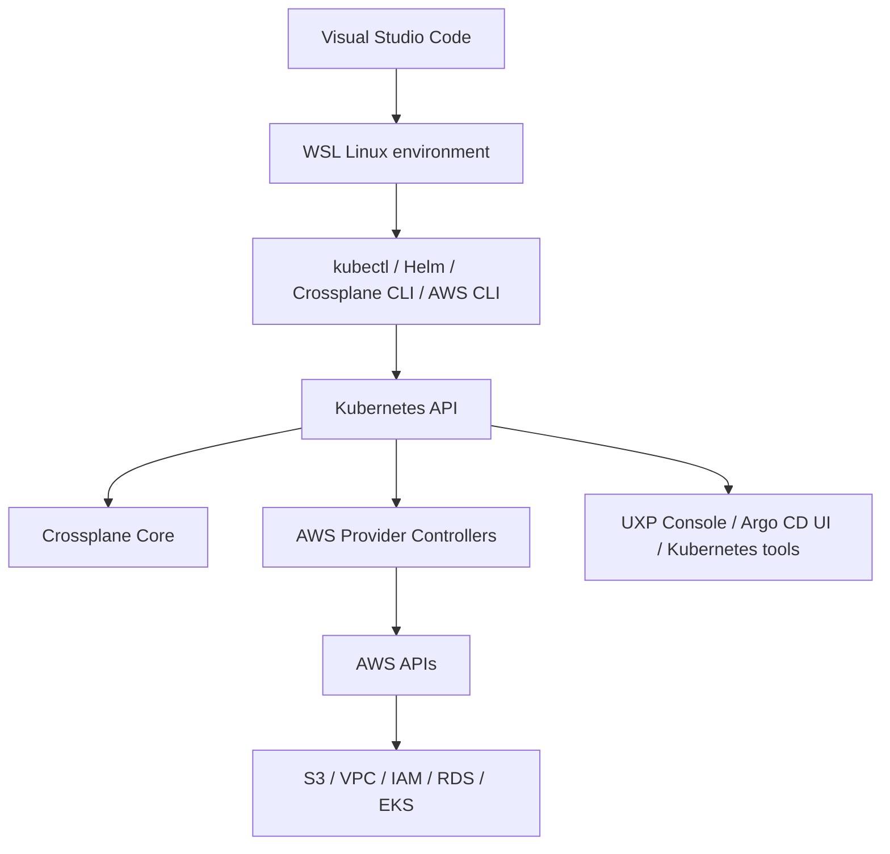
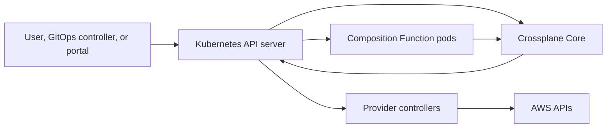
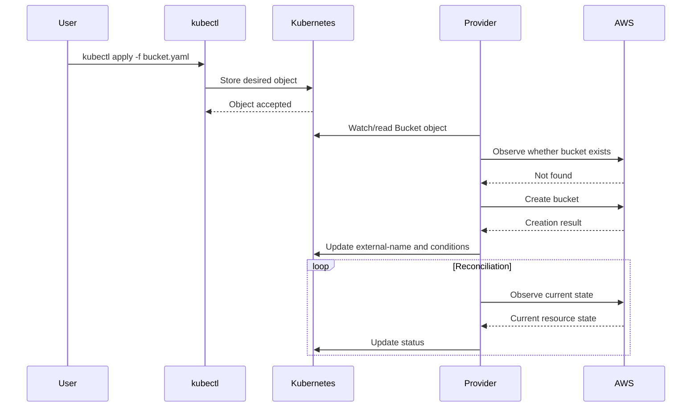
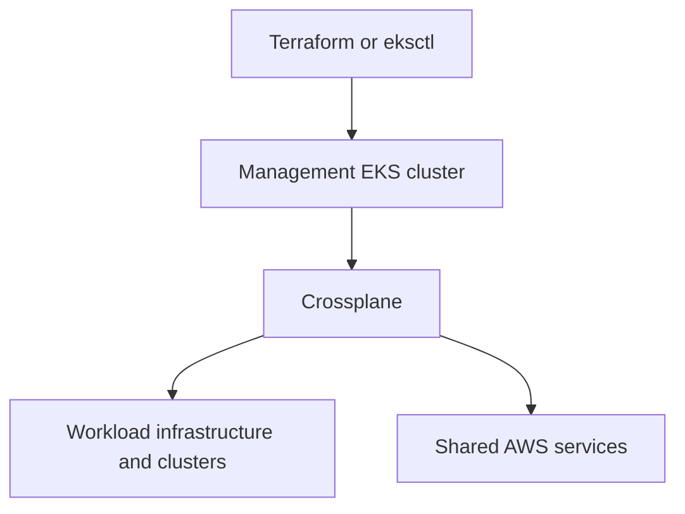
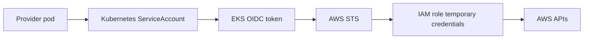
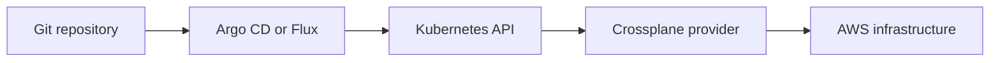
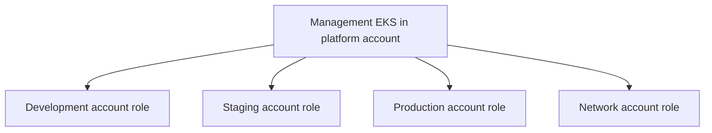

# Crossplane on Kubernetes and AWS
## Complete Study Guide: Crossplane, Upbound, Upjet, Terraform Comparison, AWS Labs, GitOps, Security, and Troubleshooting

> **Last reviewed:** 18 July 2026
> **Audience:** Cloud, DevOps, Kubernetes, AWS, and platform-engineering learners
> **Environment assumed:** Windows + WSL 2 + Visual Studio Code + Docker Desktop + AWS CLI + Kubernetes
> **Version note:** The official Crossplane core documentation currently presents Crossplane **v2.3** as the latest core release. Provider and CLI versions have independent release cycles. Always pin package versions and verify their schemas before using examples in production.

---

## Table of contents

1. [Executive summary](#1-executive-summary)
2. [The correct mental model](#2-the-correct-mental-model)
3. [Crossplane, Upbound, UXP, Marketplace, and Upjet](#3-crossplane-upbound-uxp-marketplace-and-upjet)
4. [How Crossplane fits with VS Code, WSL, AWS CLI, and Kubernetes](#4-how-crossplane-fits-with-vs-code-wsl-aws-cli-and-kubernetes)
5. [Crossplane architecture](#5-crossplane-architecture)
6. [The reconciliation loop](#6-the-reconciliation-loop)
7. [Core Crossplane concepts](#7-core-crossplane-concepts)
8. [Desired state, observed state, status, and lifecycle](#8-desired-state-observed-state-status-and-lifecycle)
9. [Crossplane versus Terraform](#9-crossplane-versus-terraform)
10. [Is Crossplane faster than Terraform?](#10-is-crossplane-faster-than-terraform)
11. [Drift correction, governance, and compliance](#11-drift-correction-governance-and-compliance)
12. [How Crossplane communicates with AWS](#12-how-crossplane-communicates-with-aws)
13. [AWS authentication models](#13-aws-authentication-models)
14. [Recommended local development environment](#14-recommended-local-development-environment)
15. [Lab 1: deploy an AWS S3 bucket from a local Kubernetes cluster](#15-lab-1-deploy-an-aws-s3-bucket-from-a-local-kubernetes-cluster)
16. [Lab 2: create your own platform API with Composition](#16-lab-2-create-your-own-platform-api-with-composition)
17. [Testing, rendering, and development workflow](#17-testing-rendering-and-development-workflow)
18. [GitOps with Argo CD or Flux](#18-gitops-with-argo-cd-or-flux)
19. [Crossplane on Amazon EKS](#19-crossplane-on-amazon-eks)
20. [Production architecture and best practices](#20-production-architecture-and-best-practices)
21. [Troubleshooting guide](#21-troubleshooting-guide)
22. [Monitoring and operations](#22-monitoring-and-operations)
23. [Common misconceptions](#23-common-misconceptions)
24. [Recommended learning path](#24-recommended-learning-path)
25. [Videos and graphical learning resources](#25-videos-and-graphical-learning-resources)
26. [Official documentation and code references](#26-official-documentation-and-code-references)
27. [Glossary](#27-glossary)
28. [Final checklist](#28-final-checklist)

---

# 1. Executive summary

Crossplane is an open-source framework that turns a Kubernetes cluster into a **control plane for other systems**.

A normal Kubernetes cluster manages resources such as:

- Pods
- Deployments
- Services
- ConfigMaps
- Secrets
- PersistentVolumes
- Ingresses

After installing Crossplane and an AWS provider, the same Kubernetes API can also manage resources such as:

- Amazon S3 buckets
- VPCs
- Subnets
- Security groups
- IAM roles
- RDS databases
- EKS clusters and node groups
- Route tables
- Load balancers
- Other AWS services supported by the installed providers

The simplest mental model is:

```text
Kubernetes normally manages applications.

Crossplane extends Kubernetes so that it can also manage
cloud infrastructure and other external APIs.
```

Crossplane is **not merely Terraform rewritten in YAML**. Both tools can create infrastructure, but their operating models differ:

```text
Terraform:
configuration + state + plan/apply execution

Crossplane:
Kubernetes APIs + continuously running controllers + reconciliation
```

Crossplane's most important capability is not the ability to write an S3 bucket in YAML. Its major value is that a platform team can create a custom API such as:

```yaml
apiVersion: platform.example.com/v1alpha1
kind: ApplicationEnvironment
metadata:
  name: payments-production
  namespace: payments
spec:
  region: eu-west-1
  size: medium
  database:
    engine: postgres
    highlyAvailable: true
```

Crossplane can translate that small request into a standardized environment containing networking, IAM, databases, Kubernetes workloads, policies, and other resources.

That makes Crossplane especially useful for:

- Internal developer platforms
- Platform engineering
- Self-service infrastructure
- Multi-account or multi-cloud control planes
- GitOps-based infrastructure delivery
- Long-running infrastructure reconciliation
- Standardized, policy-controlled platform products

---

# 2. The correct mental model

## 2.1 Crossplane is a framework, not a desktop application

Crossplane runs **inside Kubernetes**.

When installed, it deploys controllers and extends the Kubernetes API with Custom Resource Definitions, or equivalent managed-resource definitions in Crossplane v2.

You interact with it using the normal Kubernetes workflow:

```bash
kubectl apply -f resource.yaml
kubectl get ...
kubectl describe ...
kubectl logs ...
```

Crossplane itself is not:

- A desktop graphical designer
- An AWS Console replacement
- A shell wrapper around the AWS CLI
- A CI/CD pipeline
- A configuration language by itself
- A complete security or compliance product

It is a control-plane framework.

## 2.2 What is a control plane?

A control plane is software that accepts a desired state and continuously works to make the real system match that desired state.

For example, Kubernetes accepts:

```yaml
spec:
  replicas: 3
```

The Deployment controller attempts to maintain three replicas.

Crossplane applies the same pattern to external systems:

```yaml
spec:
  forProvider:
    region: eu-west-1
```

The AWS provider attempts to ensure the corresponding AWS resource exists in the specified region and matches the declared configuration.

## 2.3 Crossplane has two levels of use

### Level 1: direct managed resources

You create individual resources:

```yaml
apiVersion: s3.aws.m.upbound.io/v1beta1
kind: Bucket
metadata:
  name: example-bucket
  namespace: default
spec:
  forProvider:
    region: eu-west-1
```

This is useful for learning and for teams that want Kubernetes-native management of external resources.

### Level 2: platform APIs

You create your own API:

```yaml
apiVersion: platform.example.com/v1alpha1
kind: SecureBucket
metadata:
  name: application-data
  namespace: payments
spec:
  region: eu-west-1
  dataClassification: confidential
```

The platform implementation can automatically add:

- Block-public-access configuration
- Encryption
- Versioning
- Lifecycle policies
- Required tags
- Logging
- Backup or replication settings
- IAM permissions
- Deletion protection

This second level is where Crossplane becomes a platform-engineering framework rather than only another infrastructure provisioning tool.

---

# 3. Crossplane, Upbound, UXP, Marketplace, and Upjet

The Crossplane ecosystem uses several similar names. They are related, but they are not the same thing.

## 3.1 Crossplane

**Crossplane** is the open-source CNCF project.

It provides:

- Core controllers
- Package management
- Composite Resource Definitions
- Compositions
- Composition Functions
- Managed-resource lifecycle machinery
- Operations
- CLI development and troubleshooting commands

Crossplane can be installed and used without buying an Upbound product.

Official website:

- https://www.crossplane.io/
- https://docs.crossplane.io/latest/

## 3.2 Upbound

**Upbound** is the company that originally created and open-sourced Crossplane.

Upbound offers commercial and community products around Crossplane, including:

- A Crossplane distribution
- Official provider packages
- Platform tooling
- Hosted and self-hosted control-plane products
- A web console
- The `up` CLI
- The Upbound Marketplace
- Support and enterprise capabilities

The relationship is similar to this:

```text
Crossplane = open-source project and framework
Upbound    = company and product ecosystem around Crossplane
```

Using an Upbound provider does not mean that Crossplane itself has stopped being open source.

## 3.3 Upbound Crossplane / UXP

You may see the terms:

- Upbound Crossplane
- Universal Crossplane
- UXP
- Upbound distribution

These refer to Upbound's distribution and product experience around Crossplane.

Depending on the product edition, it may add:

- A graphical web console
- Project scaffolding
- Local development workflows
- Package management assistance
- Enterprise support
- Hosted control planes
- Governance or operational features

You do **not** need UXP to learn basic open-source Crossplane. It can, however, provide a friendlier visual experience.

## 3.4 Upbound Marketplace

The **Upbound Marketplace** is the closest equivalent to the Terraform Registry for Crossplane packages.

You can browse:

- Providers
- Managed resource schemas
- Functions
- Configuration packages
- Add-ons
- Examples
- Package versions
- Provenance information
- Vulnerability information

For AWS S3:

- https://marketplace.upbound.io/providers/upbound/provider-aws-s3

For every resource, verify:

1. Provider package
2. Package version
3. API group
4. API version
5. Scope: namespaced or cluster-scoped
6. Required fields
7. Example manifests
8. Authentication expectations

This is essential because older videos often use API groups such as:

```yaml
apiVersion: s3.aws.upbound.io/v1beta1
```

Current namespaced v2 resources generally look like:

```yaml
apiVersion: s3.aws.m.upbound.io/v1beta1
```

The `.m.` is significant: it indicates the namespaced managed-resource API.

## 3.5 Upjet

**Upjet** is a code-generation framework and Kubernetes controller runtime that transforms Terraform providers into Crossplane providers.

You normally do not install Upjet as a user-facing library in your infrastructure project.

Upjet is used by provider developers to generate:

- Kubernetes APIs
- CRDs or managed-resource definitions
- Controllers
- Example manifests
- API conversions
- Terraform state-handling logic
- Resource lifecycle operations

The architecture is approximately:

```text
Terraform provider implementation and schema
                    |
                    v
                  Upjet
                    |
       generates Crossplane provider APIs
                    |
                    v
    Kubernetes managed resources and controllers
                    |
                    v
              Cloud provider APIs
```

Upjet can use multiple Terraform execution modes, including direct plugin-library or protocol communication. Therefore, an Upjet-based Crossplane provider is not simply executing your local `terraform apply`, even though it reuses Terraform provider knowledge internally.

Official Upjet repository:

- https://github.com/crossplane/upjet

## 3.6 Upbound Official Providers versus community providers

You may see both:

```text
xpkg.upbound.io/upbound/provider-aws-s3
```

and:

```text
xpkg.crossplane.io/crossplane-contrib/provider-aws-s3
```

The first is an Upbound Official Provider. The second is from the Crossplane community organization.

Both may be valid choices. Consider:

- Support expectations
- Release cadence
- Security maintenance
- Resource coverage
- Licensing
- Organization policy
- Compatibility with your Crossplane version
- Migration requirements
- Existing examples and experience

Do not mix examples from different provider families without checking the API group and schema.

---

# 4. How Crossplane fits with VS Code, WSL, AWS CLI, and Kubernetes

Assuming “VC” means Visual Studio Code, your complete workflow is:



## 4.1 Visual Studio Code

Use VS Code to:

- Edit YAML
- Maintain your Git repository
- Write XRDs and Compositions
- Develop Composition Functions
- Inspect Kubernetes resources
- Run commands in an integrated WSL terminal
- Review pull requests and diffs
- Validate schemas with YAML language tooling

Useful categories of extensions include:

- Remote Development / WSL
- Kubernetes
- YAML
- Git tooling
- Docker
- KCL, Go, or Python support, depending on the function language

VS Code does not run the Crossplane controllers. It is your editor and development interface.

## 4.2 WSL 2

WSL gives you a Linux environment on Windows.

A typical structure is:

```text
Windows
├── Visual Studio Code
├── Docker Desktop
└── WSL 2: Ubuntu
    ├── aws
    ├── kubectl
    ├── helm
    ├── kind
    ├── eksctl
    ├── crossplane
    ├── git
    └── project files
```

WSL is not required by Crossplane, but it is convenient because most Kubernetes and cloud-native tools have excellent Linux support.

## 4.3 AWS CLI

The AWS CLI is useful for:

- Configuring profiles
- Confirming your identity
- Creating bootstrap resources
- Updating EKS kubeconfig
- Verifying AWS resources created by Crossplane
- Inspecting tags and drift
- Troubleshooting IAM permissions
- Cleaning up resources if a control plane is unavailable

The AWS CLI and Crossplane are separate AWS clients.

This command:

```bash
aws s3api create-bucket ...
```

causes your local CLI to call AWS.

This command:

```bash
kubectl apply -f bucket.yaml
```

sends YAML to Kubernetes. The Crossplane provider pod later calls AWS.

## 4.4 kubectl

`kubectl` communicates with the Kubernetes API, not directly with AWS.

You use it for:

```bash
kubectl apply -f provider.yaml
kubectl apply -f provider-config.yaml
kubectl apply -f bucket.yaml

kubectl get providers
kubectl get functions
kubectl get managed
kubectl describe bucket.s3.aws.m.upbound.io my-bucket
kubectl get events --sort-by=.lastTimestamp
```

## 4.5 Helm

Helm is the standard installation method for Crossplane core:

```bash
helm repo add crossplane-stable https://charts.crossplane.io/stable
helm repo update

helm install crossplane \
  --namespace crossplane-system \
  --create-namespace \
  crossplane-stable/crossplane
```

## 4.6 Kind and Docker Desktop

Kind runs Kubernetes nodes as Docker containers. It is useful for:

- Local Crossplane installation
- Provider experiments
- Composition development
- Function rendering
- Disposable labs
- Testing before EKS

Crossplane running in Kind can still manage real AWS resources, provided its provider has valid AWS credentials and network access.

---

# 5. Crossplane architecture

## 5.1 Main components



### Kubernetes API server

Stores the desired state and status of:

- Providers
- ProviderConfigs
- Managed Resources
- XRDs
- XRs
- Compositions
- Functions
- Operations
- Other Kubernetes resources

### Crossplane core

Crossplane core is responsible for core Crossplane machinery, including:

- Composite resources
- Compositions
- Package lifecycle
- Function pipelines
- Operations
- Reconciliation of Crossplane-owned abstractions

### Providers

Providers reconcile managed resources.

For example, the AWS S3 provider reconciles S3 resource kinds. The core Crossplane pod does not directly implement the AWS S3 API.

### Composition Functions

Functions receive the observed state and requested desired state and return the resources Crossplane should create or update.

A function may be implemented using:

- Patch and Transform
- Go templating
- KCL
- CUE
- Python
- Go
- Custom logic

### External APIs

The provider authenticates and calls AWS, Azure, Google Cloud, GitHub, Kubernetes, Helm, Terraform/OpenTofu integrations, or other supported systems.

## 5.2 Packages

Crossplane components are distributed as OCI packages.

Important package types are:

- **Provider packages:** controllers and resource APIs
- **Function packages:** Composition Function implementations
- **Configuration packages:** XRDs, Compositions, and dependencies bundled into a portable platform package

A provider installation looks like:

```yaml
apiVersion: pkg.crossplane.io/v1
kind: Provider
metadata:
  name: provider-aws-s3
spec:
  package: xpkg.upbound.io/upbound/provider-aws-s3:v2.6.1
```

A function installation looks like:

```yaml
apiVersion: pkg.crossplane.io/v1
kind: Function
metadata:
  name: function-patch-and-transform
spec:
  package: xpkg.crossplane.io/crossplane-contrib/function-patch-and-transform:v0.8.2
```

---

# 6. The reconciliation loop

Reconciliation is the central idea in both Kubernetes and Crossplane.

## 6.1 Example: S3 bucket creation

You apply:

```yaml
apiVersion: s3.aws.m.upbound.io/v1beta1
kind: Bucket
metadata:
  name: company-lab-bucket
  namespace: default
spec:
  forProvider:
    region: eu-west-1
```

The lifecycle is:



## 6.2 It is asynchronous

`kubectl apply` returning successfully does not mean the AWS resource is ready.

It means Kubernetes accepted the object.

Watch status:

```bash
kubectl get buckets.s3.aws.m.upbound.io -n default -w
```

Common columns:

```text
NAME                  SYNCED   READY   EXTERNAL-NAME
company-lab-bucket    True     True    company-lab-bucket
```

## 6.3 Watches and polling

Crossplane and providers use Kubernetes watches to react to Kubernetes object changes.

For external systems such as AWS, providers also poll to observe current state. Polling intervals affect:

- Drift-detection latency
- AWS API call volume
- Controller load
- Rate-limit exposure
- Cost in APIs that charge per request

Reducing a polling interval is not automatically an improvement.

## 6.4 Desired state and observed state

Desired configuration is usually under:

```yaml
spec:
  forProvider:
```

Observed provider information is usually under:

```yaml
status:
  atProvider:
```

Conditions explain reconciliation state:

```yaml
status:
  conditions:
```

---

# 7. Core Crossplane concepts

## 7.1 Provider

A Provider extends Crossplane with support for an external API.

Examples:

- AWS
- Azure
- Google Cloud
- Kubernetes
- Helm
- GitHub
- Vault
- Terraform/OpenTofu integrations

Installing a provider adds new API types and starts controller pods.

## 7.2 ProviderConfig and ClusterProviderConfig

A provider needs configuration describing how to authenticate and communicate with the external service.

Crossplane v2 AWS providers can expose:

### Namespaced ProviderConfig

```yaml
apiVersion: aws.m.upbound.io/v1beta1
kind: ProviderConfig
metadata:
  name: default
  namespace: payments
spec:
  credentials:
    source: Secret
    secretRef:
      namespace: payments
      name: aws-secret
      key: creds
```

This configuration applies to managed resources in the same namespace.

### ClusterProviderConfig

```yaml
apiVersion: aws.m.upbound.io/v1beta1
kind: ClusterProviderConfig
metadata:
  name: default
spec:
  credentials:
    source: Secret
    secretRef:
      namespace: crossplane-system
      name: aws-secret
      key: creds
```

This is cluster-wide.

A managed resource can explicitly reference either:

```yaml
providerConfigRef:
  name: default
  kind: ClusterProviderConfig
```

or:

```yaml
providerConfigRef:
  name: default
  kind: ProviderConfig
```

If omitted, the current AWS providers generally default to a `ClusterProviderConfig` named `default`. Explicit references are clearer in production.

## 7.3 Managed Resource

A Managed Resource, or MR, represents a resource managed through an external provider.

Examples:

- `Bucket`
- `VPC`
- `Subnet`
- `SecurityGroup`
- `Role`
- `Instance`
- `Cluster`
- `NodeGroup`

Typical structure:

```yaml
apiVersion: service.provider-domain/v1beta1
kind: ResourceKind
metadata:
  name: resource-name
  namespace: namespace-name
spec:
  forProvider:
    # External system settings
  providerConfigRef:
    name: provider-config-name
    kind: ProviderConfig
  managementPolicies:
    - "*"
status:
  atProvider:
    # Observed external state
  conditions:
    # Reconciliation state
```

## 7.4 Composite Resource Definition

A Composite Resource Definition, or XRD, defines a custom platform API.

Example:

```yaml
apiVersion: apiextensions.crossplane.io/v2
kind: CompositeResourceDefinition
metadata:
  name: securebuckets.platform.example.com
spec:
  scope: Namespaced
  group: platform.example.com
  names:
    kind: SecureBucket
    plural: securebuckets
  versions:
    - name: v1alpha1
      served: true
      referenceable: true
      schema:
        openAPIV3Schema:
          type: object
          properties:
            spec:
              type: object
              properties:
                region:
                  type: string
                  enum:
                    - eu-west-1
                    - eu-central-1
              required:
                - region
```

The XRD controls what the user is allowed to request.

## 7.5 Composite Resource

A Composite Resource, or XR, is an instance of an API defined by an XRD.

```yaml
apiVersion: platform.example.com/v1alpha1
kind: SecureBucket
metadata:
  name: payments-data
  namespace: payments
spec:
  region: eu-west-1
```

## 7.6 Composition

A Composition defines how an XR is implemented.

```text
SecureBucket XR
├── S3 Bucket
├── BucketPublicAccessBlock
├── BucketVersioning
├── Encryption configuration
└── Optional policy or logging resources
```

A Composition is now implemented as a pipeline of functions.

## 7.7 Composition Function

A Composition Function contains logic that converts an XR into desired resources.

A function can:

- Copy fields
- Apply defaults
- Generate multiple resources
- Loop over arrays
- Add conditions
- Select environments
- Read observed state
- Set status
- Perform conditional resource creation

Functions should remain deterministic and should not become a hidden replacement for every other automation system.

## 7.8 Configuration Package

A Configuration Package bundles platform definitions as a reusable OCI package.

It can contain:

- XRDs
- Compositions
- Provider dependencies
- Function dependencies
- Metadata

This enables versioned platform releases:

```text
platform-storage:v1.0.0
platform-storage:v1.1.0
platform-database:v2.0.0
```

## 7.9 Operations

Crossplane v2 adds Operations for tasks that do not fit permanent reconciliation.

Examples:

- One-time validation
- Maintenance
- Backup workflows
- Certificate rotation
- Scheduled tasks
- Reactive tasks following resource changes

Related types include:

- Operation
- CronOperation
- WatchOperation

---

# 8. Desired state, observed state, status, and lifecycle

## 8.1 `spec.forProvider`

`forProvider` is the desired configuration sent to the external provider.

```yaml
spec:
  forProvider:
    region: eu-west-1
    tags:
      Environment: lab
      ManagedBy: crossplane
```

## 8.2 `spec.initProvider`

Some Upjet-based resources support `initProvider`.

Use it for values needed during creation but not intended to be continuously enforced afterward.

This is useful when another controller should later own a field, such as an autoscaler.

Do not use `initProvider` without understanding field ownership. It changes reconciliation semantics.

## 8.3 `status.atProvider`

This contains observed external state, such as:

- AWS identifier
- ARN
- Endpoint
- Current settings
- Provider-generated values
- Runtime status

Do not edit status manually.

## 8.4 Conditions

Important common conditions include:

- `Ready`
- `Synced`

Examples:

```text
Ready=True, Synced=True
```

means that the resource is generally available and the last reconciliation succeeded.

```text
Ready=False, Reason=Creating
```

means creation is in progress.

```text
Synced=False, Reason=ReconcileError
```

means the provider encountered an error.

Upjet providers may also expose asynchronous-operation conditions.

## 8.5 External name

The annotation:

```yaml
metadata:
  annotations:
    crossplane.io/external-name: real-external-identifier
```

maps the Kubernetes resource to the real external object.

For AWS resources, this could be:

- Bucket name
- VPC ID
- RDS identifier
- ARN or provider-specific identifier

This mapping is critical.

## 8.6 Creation annotations and leaked-resource protection

Providers may record timestamps such as:

- `crossplane.io/external-create-pending`
- `crossplane.io/external-create-succeeded`
- `crossplane.io/external-create-failed`

These help avoid duplicate external resources if the provider loses connectivity after creating something but before storing its external identifier.

If you see:

```text
cannot determine creation result
```

inspect AWS before removing annotations or retrying. A resource may have been created even though Kubernetes never received the final identity update.

## 8.7 Finalizers

Crossplane adds finalizers to managed resources.

When you delete a Kubernetes resource:

1. Kubernetes marks it for deletion.
2. The provider deletes the external resource, if allowed.
3. The provider waits for deletion to complete.
4. The finalizer is removed.
5. Kubernetes removes the object.

Never remove a finalizer just to “unstick” deletion without understanding whether the external resource will be orphaned.

## 8.8 Management policies

Management policies control what Crossplane is allowed to do.

Common actions include:

- Observe
- Create
- Update
- Delete
- LateInitialize

Default full control can be represented by:

```yaml
managementPolicies:
  - "*"
```

Observe-only:

```yaml
managementPolicies:
  - Observe
```

A useful pattern that prevents external deletion may omit `Delete`, depending on provider support and your intended lifecycle.

Always test management policies with the exact provider version.

## 8.9 Pausing reconciliation

A managed resource can be paused:

```yaml
metadata:
  annotations:
    crossplane.io/paused: "true"
```

Use this for controlled migrations or troubleshooting, not as a permanent lifecycle strategy.

---

# 9. Crossplane versus Terraform

## 9.1 Comparison table

| Area | Terraform | Crossplane |
|---|---|---|
| Primary model | Execution-oriented IaC | Continuously running control plane |
| Configuration | HCL, JSON | Kubernetes APIs, usually YAML plus functions |
| Runtime | CLI, CI runner, HCP Terraform, agents | Kubernetes controllers |
| State | Terraform state backend | Kubernetes objects/status plus provider runtime state machinery |
| Change preview | Strong plan workflow | No identical native plan for normal reconciliation |
| Apply | Explicit command or pipeline | Reconciliation begins after resource acceptance |
| Drift handling | Detected during refresh/plan/apply | Continuously observed and often corrected |
| User interface | Terraform modules and variables | Kubernetes APIs and custom platform APIs |
| Self-service | Modules, pipelines, portals | Namespaced APIs, RBAC, GitOps, portals |
| Bootstrapping | Excellent | Requires an existing Kubernetes control plane |
| Long-running platform | Possible with automation | Core design goal |
| Kubernetes requirement | No | Yes |
| Deletion | Explicit apply/destroy lifecycle | Kubernetes deletion + finalizers |
| Multi-team isolation | Workspaces, projects, policy | Namespaces, RBAC, ProviderConfigs, platform APIs |
| Learning curve | HCL, providers, modules, state | Kubernetes controllers, CRDs, providers, functions |

## 9.2 Terraform workflow

```text
Write HCL
   |
terraform init
   |
terraform plan
   |
review and approve
   |
terraform apply
   |
state updated
```

Terraform must maintain state mapping configuration objects to real infrastructure.

## 9.3 Crossplane workflow

```text
Create Kubernetes resource
   |
Kubernetes stores desired state
   |
provider observes external system
   |
provider creates or updates resource
   |
provider writes status
   |
loop continues
```

## 9.4 Crossplane is not “state-free”

It is incorrect to say that Crossplane has no state.

The Kubernetes API stores:

- Desired resource definitions
- Status
- External identifiers
- Conditions
- Ownership references
- Finalizers
- Composition references
- Connection details
- Package state

Upjet providers may also use internal Terraform state-handling logic.

The operational difference is that users do not normally manage a `terraform.tfstate` file for every Crossplane stack.

This makes Kubernetes control-plane durability extremely important.

## 9.5 Crossplane does not have Terraform's exact plan experience

Terraform's plan is a major safety mechanism.

Crossplane normally begins reconciliation after the API object is accepted. You can still introduce controls through:

- Pull-request reviews
- GitOps
- Admission policies
- XRD validation
- Composition rendering
- Staging environments
- Provider permissions
- Manual composition revision policies
- Change logs
- Approval workflows around Git

But these are not identical to `terraform plan`.

## 9.6 When Terraform is usually a better fit

Terraform may be preferable when:

- You do not want to operate Kubernetes
- Infrastructure is provisioned infrequently
- Explicit plan approval is mandatory
- The team is small
- You need a very broad provider ecosystem immediately
- You are bootstrapping the first management cluster
- Existing Terraform modules are mature and stable
- A permanent reconciliation system adds unnecessary complexity

## 9.7 When Crossplane is usually a better fit

Crossplane may be preferable when:

- You are building an internal developer platform
- Kubernetes is already an operational foundation
- Developers need self-service APIs
- You need continuous reconciliation
- Infrastructure and applications should be composed together
- Namespace isolation is useful
- GitOps is a standard delivery model
- You need standardized product-like infrastructure abstractions
- Platform teams want to hide provider complexity behind stable APIs

## 9.8 A practical combined architecture

A common pattern is:



Terraform bootstraps the management cluster. Crossplane then operates platform resources continuously.

Do not migrate all working Terraform resources just because Crossplane exists. Choose ownership boundaries deliberately.

---

# 10. Is Crossplane faster than Terraform?

The phrase “Crossplane is faster” can mean several different things.

## 10.1 Cloud provisioning speed

An RDS instance, NAT Gateway, or EKS cluster takes time inside AWS.

Crossplane and Terraform both eventually request AWS to perform the work.

Therefore:

> Crossplane is not inherently guaranteed to make AWS create the physical resource faster.

It may even take additional reconciliation cycles before status becomes ready.

## 10.2 Developer delivery speed

Crossplane can be faster when a reusable platform API already exists.

Terraform request:

```text
Create or modify module
configure variables
run validation
run plan
review plan
approve
apply
```

Crossplane platform request:

```text
Create a small ApplicationEnvironment object
```

The platform implementation is already running.

## 10.3 Repeated standardized requests

Crossplane's advantage grows when the organization repeatedly creates similar environments.

For example, a platform team can implement:

```text
SmallDatabase
MediumDatabase
ProductionDatabase
ApplicationEnvironment
SecureBucket
WorkloadCluster
```

Developers consume these APIs without reimplementing low-level AWS resources.

## 10.4 Controller concurrency

Providers can reconcile many resources concurrently. This can improve throughput, but it also creates risks:

- AWS API throttling
- Reconciliation storms
- Provider CPU and memory pressure
- Too many pending operations
- Difficult debugging if too much infrastructure changes simultaneously

“Faster” must not mean “less controlled.”

---

# 11. Drift correction, governance, and compliance

## 11.1 Drift correction

Suppose the desired state contains:

```yaml
tags:
  ManagedBy: crossplane
```

Someone changes it in AWS to:

```text
ManagedBy=manual
```

During a future observation, the provider may restore:

```text
ManagedBy=crossplane
```

This is active reconciliation.

## 11.2 Reconciliation is not complete compliance

Crossplane does not automatically know your organizational rules.

It does not inherently know that:

- Production databases must be encrypted
- Public access must be blocked
- Only approved AWS regions are allowed
- Every resource needs cost tags
- RDS public access is prohibited
- Backups require 30-day retention
- Deletion protection is mandatory

You implement those rules through:

- XRD schema validation
- Composition defaults
- Restricted enums
- Kubernetes RBAC
- Kyverno or OPA Gatekeeper
- Git review
- IAM policies
- AWS Organizations and SCPs
- AWS Config
- Security Hub
- Service Control Policies
- Approved ProviderConfigs
- Restricted provider packages

## 11.3 Preventing invalid requests at the API layer

Example XRD restriction:

```yaml
region:
  type: string
  enum:
    - eu-west-1
    - eu-central-1
```

The user cannot request `us-east-1` through that API.

Example size restriction:

```yaml
databaseSize:
  type: string
  enum:
    - db.t4g.micro
    - db.t4g.small
    - db.t4g.medium
```

## 11.4 Enforcing implementation details

The user requests:

```yaml
kind: SecureBucket
spec:
  region: eu-west-1
```

The Composition always generates:

- Encryption
- Public access block
- Required tags
- Versioning
- Logging
- Lifecycle policy

The developer cannot accidentally remove those implementation details because they are not exposed as user-editable parameters.

## 11.5 Defense in depth

Crossplane should not be the only security control.

A production design uses multiple layers:

```text
XRD validation
      +
Composition defaults
      +
Admission policy
      +
Kubernetes RBAC
      +
Provider IAM least privilege
      +
AWS SCP and AWS Config
      +
Audit logs and monitoring
```

---

# 12. How Crossplane communicates with AWS

## 12.1 What `kubectl apply` actually does

```bash
kubectl apply -f bucket.yaml
```

does not call S3.

It sends the resource to the Kubernetes API.

The AWS provider controller:

1. Reads the Kubernetes object
2. Loads its ProviderConfig
3. Obtains AWS credentials
4. Observes AWS
5. Creates, updates, or deletes the resource
6. Writes status back to Kubernetes

## 12.2 Upjet-based provider path

An Upjet provider roughly follows:

```text
Managed Resource
      |
Upjet-generated controller
      |
Terraform provider implementation/runtime
      |
AWS SDK and AWS API
```

Upjet can use:

- Terraform CLI execution
- Direct Terraform Plugin SDK integration
- Terraform Plugin Framework protocol communication

Therefore, “Crossplane directly attacks the AWS API” is an oversimplification.

The provider ultimately reaches AWS APIs, but implementation layers may reuse Terraform provider logic.

## 12.3 API calls and permissions

The provider IAM role or credentials need the actions used by the resource lifecycle.

These may include:

- Create
- Read
- Update
- Delete
- Tagging
- Listing
- Dependency lookup

A policy that only includes `CreateBucket` may be insufficient because reconciliation also needs read operations.

---

# 13. AWS authentication models

## 13.1 Static access keys

Static keys are easy for a temporary local Kind lab.

Flow:

```text
Kubernetes Secret
      |
ProviderConfig
      |
AWS provider pod
      |
AWS APIs
```

Risks:

- Long-lived credentials
- Secret leakage
- Git accidents
- Difficult rotation
- Broad permissions
- Credential copying across environments

Use static keys only for a temporary isolated lab. Never commit them.

## 13.2 IRSA

IAM Roles for Service Accounts uses:

- EKS OIDC issuer
- IAM OIDC provider
- IAM role trust policy
- Kubernetes ServiceAccount
- Web identity token
- STS `AssumeRoleWithWebIdentity`

Flow:



Advantages:

- Temporary credentials
- Least privilege per ServiceAccount
- Better isolation than node-role credentials
- CloudTrail auditability

## 13.3 EKS Pod Identity

EKS Pod Identity associates an IAM role with a Kubernetes ServiceAccount through EKS.

AWS currently recommends EKS Pod Identity whenever possible for EKS workloads.

Advantages include:

- No IAM OIDC provider required for each cluster
- Simplified role reuse
- Temporary credentials
- Session tags containing cluster, namespace, and ServiceAccount information
- Easier EKS-native administration

It requires:

- EKS Pod Identity Agent
- An IAM role trust relationship for `pods.eks.amazonaws.com`
- A Pod Identity association
- Supported provider/AWS SDK credential behavior

## 13.4 Which should you use?

| Environment | Recommended model |
|---|---|
| Temporary Kind lab | Temporary access keys in a Kubernetes Secret |
| EKS production | EKS Pod Identity when compatible and appropriate |
| EKS requiring IRSA-specific features | IRSA |
| Multi-account | AssumeRole chains from a base role |
| Upbound hosted control planes | Follow the relevant Upbound OIDC/provider authentication guide |

## 13.5 Separate roles by provider capability

Prefer:

```text
provider-aws-s3 ServiceAccount
└── S3 platform role

provider-aws-ec2 ServiceAccount
└── Network platform role

provider-aws-rds ServiceAccount
└── Database platform role
```

instead of:

```text
one provider role
└── AdministratorAccess
```

## 13.6 Multi-account ProviderConfigs

You can define different ProviderConfigs:

```text
development-account
staging-account
production-account
shared-network-account
security-account
```

A managed resource or Composition selects the correct ProviderConfig.

Do not allow application users to choose arbitrary production credentials unless that is an explicit security design.

---

# 14. Recommended local development environment

## 14.1 Required tools

Inside WSL:

```bash
aws --version
kubectl version --client
helm version
kind version
docker version
git --version
```

Optional but valuable:

```bash
crossplane --help
jq --version
yq --version
```

## 14.2 Suggested repository structure

```text
crossplane-learning/
├── README.md
├── .gitignore
├── docs/
│   ├── architecture.md
│   ├── troubleshooting.md
│   └── decisions.md
├── bootstrap/
│   ├── crossplane-values.yaml
│   └── providers/
├── provider-configs/
├── managed-resources/
│   └── s3/
├── platform/
│   ├── xrds/
│   ├── compositions/
│   ├── functions/
│   └── examples/
├── policies/
├── scripts/
└── tests/
```

## 14.3 `.gitignore`

```gitignore
# Credentials
*.pem
*.key
aws-credentials.ini
aws-credentials.txt
.env
.env.*

# Kubernetes
kubeconfig
*.kubeconfig

# Generated files
.rendered/
dist/
_build/

# IDE
.vscode/settings.json
.idea/

# OS
.DS_Store
Thumbs.db
```

Do not ignore all `.vscode` files automatically if you want to share recommended extensions or schema settings.

---

# 15. Lab 1: deploy an AWS S3 bucket from a local Kubernetes cluster

This is a low-cost learning lab.

## 15.1 Learning objectives

You will learn how to:

- Create a local Kubernetes cluster
- Install Crossplane
- Install an AWS S3 provider
- Configure AWS authentication
- Create a real S3 bucket
- Observe reconciliation
- Introduce drift
- Inspect status and events
- Clean up safely

## 15.2 Safety requirements

Use:

- A sandbox AWS account
- A unique bucket name
- Least-privilege credentials
- No production data
- No production account
- No credentials committed to Git

Verify identity:

```bash
aws sts get-caller-identity
```

Set a region:

```bash
export AWS_REGION=eu-west-1
```

## 15.3 Create a Kind cluster

```bash
kind create cluster --name crossplane-lab

kubectl cluster-info
kubectl get nodes
```

## 15.4 Install Crossplane

```bash
helm repo add crossplane-stable https://charts.crossplane.io/stable
helm repo update

helm install crossplane \
  --namespace crossplane-system \
  --create-namespace \
  crossplane-stable/crossplane
```

Wait for readiness:

```bash
kubectl get pods -n crossplane-system -w
```

Verify CRDs and core deployment:

```bash
kubectl get deployment -n crossplane-system
kubectl get crds | grep crossplane
```

## 15.5 Install the Upbound S3 provider

Create `provider-aws-s3.yaml`:

```yaml
apiVersion: pkg.crossplane.io/v1
kind: Provider
metadata:
  name: provider-aws-s3
spec:
  package: xpkg.upbound.io/upbound/provider-aws-s3:v2.6.1
  packagePullPolicy: IfNotPresent
  revisionActivationPolicy: Automatic
  revisionHistoryLimit: 1
```

Apply:

```bash
kubectl apply -f provider-aws-s3.yaml
```

Observe package installation:

```bash
kubectl get providers.pkg.crossplane.io -w
```

Expected:

```text
INSTALLED=True
HEALTHY=True
```

The first service provider in an AWS provider family may install an additional family provider that owns common AWS authentication APIs.

Inspect provider pods:

```bash
kubectl get pods -n crossplane-system
```

## 15.6 Create temporary credentials for the local lab

Create `aws-credentials.ini`:

```ini
[default]
aws_access_key_id = REPLACE_WITH_TEMPORARY_LAB_KEY
aws_secret_access_key = REPLACE_WITH_TEMPORARY_LAB_SECRET
```

Protect it:

```bash
chmod 600 aws-credentials.ini
```

Create the Secret:

```bash
kubectl create secret generic aws-secret \
  --namespace=crossplane-system \
  --from-file=creds=./aws-credentials.ini
```

Confirm the Secret exists without printing its contents:

```bash
kubectl get secret aws-secret -n crossplane-system
```

## 15.7 Create a ClusterProviderConfig

Create `provider-config.yaml`:

```yaml
apiVersion: aws.m.upbound.io/v1beta1
kind: ClusterProviderConfig
metadata:
  name: default
spec:
  credentials:
    source: Secret
    secretRef:
      namespace: crossplane-system
      name: aws-secret
      key: creds
```

Apply:

```bash
kubectl apply -f provider-config.yaml
```

## 15.8 Generate a globally unique bucket name

```bash
export AWS_ACCOUNT_ID="$(aws sts get-caller-identity --query Account --output text)"
export BUCKET_NAME="xp-lab-${AWS_ACCOUNT_ID}-$(date +%s)"

echo "$BUCKET_NAME"
```

S3 bucket names must be globally unique.

## 15.9 Create the bucket manifest

```bash
cat > bucket.yaml <<EOF
apiVersion: s3.aws.m.upbound.io/v1beta1
kind: Bucket
metadata:
  name: ${BUCKET_NAME}
  namespace: default
  labels:
    app.kubernetes.io/managed-by: crossplane
    platform.example.com/environment: lab
spec:
  forProvider:
    region: ${AWS_REGION}
    tags:
      Environment: lab
      ManagedBy: crossplane
      Project: crossplane-learning
  providerConfigRef:
    name: default
    kind: ClusterProviderConfig
  managementPolicies:
    - "*"
EOF
```

Validate against the installed Kubernetes schema:

```bash
kubectl apply --dry-run=server -f bucket.yaml
```

Apply:

```bash
kubectl apply -f bucket.yaml
```

## 15.10 Observe reconciliation

```bash
kubectl get buckets.s3.aws.m.upbound.io -n default -w
```

Inspect full details:

```bash
kubectl describe bucket.s3.aws.m.upbound.io \
  "$BUCKET_NAME" \
  -n default
```

Inspect YAML:

```bash
kubectl get bucket.s3.aws.m.upbound.io \
  "$BUCKET_NAME" \
  -n default \
  -o yaml
```

Useful values:

- `status.conditions`
- `status.atProvider`
- `crossplane.io/external-name`
- creation annotations
- events

Verify in AWS:

```bash
aws s3api head-bucket --bucket "$BUCKET_NAME"
aws s3api get-bucket-tagging --bucket "$BUCKET_NAME"
```

You can also open the AWS Console and inspect the bucket.

## 15.11 Add public-access blocking

The Upbound S3 provider exposes a separate `BucketPublicAccessBlock` resource.

Create `bucket-public-access.yaml`:

```bash
cat > bucket-public-access.yaml <<EOF
apiVersion: s3.aws.m.upbound.io/v1beta1
kind: BucketPublicAccessBlock
metadata:
  name: ${BUCKET_NAME}-public-access
  namespace: default
spec:
  forProvider:
    region: ${AWS_REGION}
    bucketRef:
      name: ${BUCKET_NAME}
    blockPublicAcls: true
    blockPublicPolicy: true
    ignorePublicAcls: true
    restrictPublicBuckets: true
  providerConfigRef:
    name: default
    kind: ClusterProviderConfig
  managementPolicies:
    - "*"
EOF
```

Validate:

```bash
kubectl apply --dry-run=server -f bucket-public-access.yaml
```

Apply:

```bash
kubectl apply -f bucket-public-access.yaml
```

Observe:

```bash
kubectl get bucketpublicaccessblocks.s3.aws.m.upbound.io -n default
```

Verify in AWS:

```bash
aws s3api get-public-access-block --bucket "$BUCKET_NAME"
```

## 15.12 Discover schemas with `kubectl explain`

Provider fields change over time. Always inspect the installed schema:

```bash
kubectl explain bucket.s3.aws.m.upbound.io
kubectl explain bucket.s3.aws.m.upbound.io.spec
kubectl explain bucket.s3.aws.m.upbound.io.spec.forProvider
```

For versioning:

```bash
kubectl explain bucketversioning.s3.aws.m.upbound.io.spec.forProvider
kubectl explain \
  bucketversioning.s3.aws.m.upbound.io.spec.forProvider.versioningConfiguration
```

Then compare with the current Marketplace page before writing the manifest.

This is the Crossplane equivalent of checking a Terraform resource's provider documentation for the exact installed version.

## 15.13 Test drift correction

First inspect tags:

```bash
aws s3api get-bucket-tagging --bucket "$BUCKET_NAME"
```

Change them manually:

```bash
aws s3api put-bucket-tagging \
  --bucket "$BUCKET_NAME" \
  --tagging 'TagSet=[{Key=ManagedBy,Value=manual-change},{Key=Environment,Value=lab}]'
```

Confirm drift:

```bash
aws s3api get-bucket-tagging --bucket "$BUCKET_NAME"
```

Request an immediate reconciliation:

```bash
kubectl annotate \
  bucket.s3.aws.m.upbound.io \
  "$BUCKET_NAME" \
  -n default \
  crossplane.io/reconcile-requested-at="$(date +%s)" \
  --overwrite
```

Inspect tags again:

```bash
aws s3api get-bucket-tagging --bucket "$BUCKET_NAME"
```

The provider should restore fields that it owns and supports reconciling.

If it does not, inspect:

```bash
kubectl describe bucket.s3.aws.m.upbound.io "$BUCKET_NAME" -n default
kubectl get events -n default --sort-by=.lastTimestamp
```

Do not assume every AWS-computed or provider-optional field is continuously overwritten.

## 15.14 Change desired state

Edit the YAML:

```yaml
tags:
  Environment: development
```

Reapply:

```bash
kubectl apply -f bucket.yaml
```

Verify:

```bash
aws s3api get-bucket-tagging --bucket "$BUCKET_NAME"
```

## 15.15 Inspect provider logs

Find provider pods:

```bash
kubectl get pods -n crossplane-system
```

View logs:

```bash
kubectl logs -n crossplane-system \
  -l pkg.crossplane.io/provider=provider-aws-s3 \
  --tail=200
```

Events are often more useful than default logs:

```bash
kubectl get events -A --sort-by=.lastTimestamp
```

## 15.16 Clean up safely

Delete dependent resources first:

```bash
kubectl delete -f bucket-public-access.yaml
```

Delete the bucket:

```bash
kubectl delete -f bucket.yaml
```

Watch until the managed resource disappears:

```bash
kubectl get buckets.s3.aws.m.upbound.io -n default -w
```

Confirm AWS deletion:

```bash
aws s3api head-bucket --bucket "$BUCKET_NAME"
```

A failure is expected after the bucket is deleted.

Only then delete the local cluster:

```bash
kind delete cluster --name crossplane-lab
```

Remove the credential file:

```bash
shred -u aws-credentials.ini 2>/dev/null || rm -f aws-credentials.ini
```

### Important cleanup rule

Do not delete the Kind or EKS management cluster before Crossplane has deleted the external resources, unless you intentionally want to orphan them.

---

# 16. Lab 2: create your own platform API with Composition

Lab 1 proves that Crossplane can manage an AWS resource. Lab 2 teaches the more important platform-engineering capability.

This lab can use ordinary Kubernetes resources and does not need AWS.

## 16.1 Goal

Create a custom API:

```yaml
apiVersion: platform.example.com/v1alpha1
kind: WebApplication
metadata:
  name: demo
  namespace: default
spec:
  image: nginx:stable-alpine
  replicas: 2
```

Crossplane creates:

- Deployment
- Service

## 16.2 XRD

Create `webapplication-xrd.yaml`:

```yaml
apiVersion: apiextensions.crossplane.io/v2
kind: CompositeResourceDefinition
metadata:
  name: webapplications.platform.example.com
spec:
  scope: Namespaced
  group: platform.example.com
  names:
    kind: WebApplication
    plural: webapplications
  versions:
    - name: v1alpha1
      served: true
      referenceable: true
      schema:
        openAPIV3Schema:
          type: object
          properties:
            spec:
              type: object
              properties:
                image:
                  type: string
                replicas:
                  type: integer
                  minimum: 1
                  maximum: 5
                  default: 1
              required:
                - image
```

Apply:

```bash
kubectl apply -f webapplication-xrd.yaml
kubectl get xrds
```

Wait for `ESTABLISHED=True`.

## 16.3 Install Patch and Transform Function

Create `function.yaml`:

```yaml
apiVersion: pkg.crossplane.io/v1
kind: Function
metadata:
  name: function-patch-and-transform
spec:
  package: xpkg.crossplane.io/crossplane-contrib/function-patch-and-transform:v0.8.2
```

Apply:

```bash
kubectl apply -f function.yaml
kubectl get functions -w
```

Pin a version that is compatible with your Crossplane release. Verify the current Marketplace and official documentation before production use.

## 16.4 Composition

Create `webapplication-composition.yaml`:

```yaml
apiVersion: apiextensions.crossplane.io/v1
kind: Composition
metadata:
  name: webapplication-basic
spec:
  compositeTypeRef:
    apiVersion: platform.example.com/v1alpha1
    kind: WebApplication
  mode: Pipeline
  pipeline:
    - step: create-resources
      functionRef:
        name: function-patch-and-transform
      input:
        apiVersion: pt.fn.crossplane.io/v1beta1
        kind: Resources
        resources:
          - name: deployment
            base:
              apiVersion: apps/v1
              kind: Deployment
              metadata:
                namespace: default
              spec:
                selector:
                  matchLabels:
                    app: placeholder
                template:
                  metadata:
                    labels:
                      app: placeholder
                  spec:
                    containers:
                      - name: application
                        image: nginx:stable-alpine
                        ports:
                          - containerPort: 80
            patches:
              - type: FromCompositeFieldPath
                fromFieldPath: metadata.name
                toFieldPath: metadata.name
              - type: FromCompositeFieldPath
                fromFieldPath: metadata.namespace
                toFieldPath: metadata.namespace
              - type: FromCompositeFieldPath
                fromFieldPath: metadata.name
                toFieldPath: spec.selector.matchLabels.app
              - type: FromCompositeFieldPath
                fromFieldPath: metadata.name
                toFieldPath: spec.template.metadata.labels.app
              - type: FromCompositeFieldPath
                fromFieldPath: spec.image
                toFieldPath: spec.template.spec.containers[0].image
              - type: FromCompositeFieldPath
                fromFieldPath: spec.replicas
                toFieldPath: spec.replicas

          - name: service
            base:
              apiVersion: v1
              kind: Service
              metadata:
                namespace: default
              spec:
                selector:
                  app: placeholder
                ports:
                  - name: http
                    port: 80
                    targetPort: 80
            patches:
              - type: FromCompositeFieldPath
                fromFieldPath: metadata.name
                toFieldPath: metadata.name
                transforms:
                  - type: string
                    string:
                      type: Format
                      fmt: "%s-service"
              - type: FromCompositeFieldPath
                fromFieldPath: metadata.namespace
                toFieldPath: metadata.namespace
              - type: FromCompositeFieldPath
                fromFieldPath: metadata.name
                toFieldPath: spec.selector.app
```

Apply:

```bash
kubectl apply -f webapplication-composition.yaml
```

## 16.5 Create an XR

Create `webapplication.yaml`:

```yaml
apiVersion: platform.example.com/v1alpha1
kind: WebApplication
metadata:
  name: demo
  namespace: default
spec:
  image: nginx:stable-alpine
  replicas: 2
```

Apply:

```bash
kubectl apply -f webapplication.yaml
```

Inspect:

```bash
kubectl get webapplications -n default
kubectl get deployments -n default
kubectl get services -n default
kubectl get pods -n default
```

## 16.6 What this demonstrates

The end user asks for:

```yaml
kind: WebApplication
spec:
  image: nginx:stable-alpine
  replicas: 2
```

The platform team owns:

- Deployment details
- Labels
- Service ports
- Maximum replicas
- Resource defaults
- Security contexts
- Policies
- Networking choices

The same idea can be expanded to AWS:

```text
ApplicationEnvironment
├── VPC
├── Subnets
├── SecurityGroup
├── IAM Role
├── RDS
├── Kubernetes Deployment
└── Service
```

## 16.7 Validate examples against the installed version

Composition APIs and function schemas evolve.

Before applying:

```bash
kubectl apply --dry-run=server -f webapplication-xrd.yaml
kubectl apply --dry-run=server -f webapplication-composition.yaml
```

For production, use `crossplane composition render` and automated tests.

---

# 17. Testing, rendering, and development workflow

## 17.1 Install the Crossplane CLI

```bash
curl -sfL "https://cli.crossplane.io/install.sh" | sh
sudo mv crossplane /usr/local/bin/
```

Verify:

```bash
crossplane version
```

Pin a version in reproducible environments.

## 17.2 Render a Composition locally

Typical command:

```bash
crossplane composition render \
  xr.yaml \
  composition.yaml \
  functions.yaml
```

This shows the resources a Composition would create or mutate.

Rendering is valuable because it:

- Catches templating errors
- Shows generated resources
- Reduces trial and error against AWS
- Supports CI validation
- Improves reviewability

It is not a complete replacement for testing against real provider APIs.

## 17.3 Test layers

Use multiple layers:

### Schema validation

```bash
kubectl apply --dry-run=server -f manifest.yaml
```

### YAML and policy linting

Examples:

- yamllint
- kubeconform
- kube-linter
- conftest
- Kyverno CLI

### Composition rendering

```bash
crossplane composition render ...
```

### Local integration

- Kind
- Local functions
- Mocked or non-cloud Kubernetes resources

### Sandbox cloud integration

- Dedicated AWS account
- Limited IAM role
- Cost budgets
- Automated cleanup

### Promotion

- Pull request
- CI validation
- Staging control plane
- Production control plane

## 17.4 Recommended development loop

```text
Edit XRD / Composition / Function
              |
Schema and lint validation
              |
Local composition render
              |
Kind integration test
              |
Sandbox AWS test
              |
Pull request
              |
GitOps promotion
```

---

# 18. GitOps with Argo CD or Flux

Crossplane and GitOps solve different parts of the workflow.

```text
GitOps controller:
ensures Kubernetes manifests in the cluster match Git

Crossplane:
ensures external resources match Kubernetes desired state
```

Combined:



## 18.1 Responsibilities

### Argo CD or Flux

- Pulls manifests from Git
- Applies them to Kubernetes
- Reports Git synchronization
- Supports pull-request workflows
- Manages deployment ordering and health rules

### Crossplane

- Reads managed resources and XRs
- Calls external APIs
- Reconciles drift
- Writes readiness and status

## 18.2 Suggested repository layers

```text
clusters/
  management/
    crossplane/
    providers/
    provider-configs/
    platform-apis/

infrastructure/
  development/
  staging/
  production/
```

Separate:

- Crossplane core installation
- Provider installation
- Provider authentication
- Platform API definitions
- User-facing XR instances

## 18.3 Ordering

A common dependency order is:

1. Crossplane core
2. Providers and Functions
3. ProviderConfigs
4. XRDs
5. Compositions
6. Composite resources or managed resources

GitOps health checks should wait for:

- Provider `HEALTHY=True`
- Function `HEALTHY=True`
- XRD `ESTABLISHED=True`

## 18.4 Argo CD considerations

Crossplane creates generated resources such as ProviderConfigUsage and composed resources. Configure Argo CD tracking and exclusions according to the official Crossplane Argo CD guide.

Do not configure GitOps to delete or fight dynamically generated resources unintentionally.

---

# 19. Crossplane on Amazon EKS

## 19.1 The bootstrap problem

Crossplane requires Kubernetes before it can run.

Therefore, something must create the first management cluster.

Common bootstrap tools:

- Terraform
- eksctl
- CloudFormation
- AWS CDK
- Existing enterprise landing-zone tooling

Then:

```text
Bootstrap tool
    |
Management EKS cluster
    |
Crossplane
    |
Workload infrastructure
```

## 19.2 Management cluster role

A management EKS cluster may contain:

- Crossplane
- AWS providers
- Composition Functions
- Argo CD or Flux
- Kyverno or Gatekeeper
- External Secrets
- Prometheus
- Grafana
- Policy and audit tooling

Avoid running ordinary customer workloads on a critical management control plane unless you have explicitly designed for it.

## 19.3 Creating workload EKS clusters

Once Crossplane is installed, it can manage:

- VPC
- Subnets
- Route tables
- IAM roles
- EKS control plane
- Managed node groups
- Add-ons
- Kubernetes objects in workload clusters

This requires careful ownership and credential design.

## 19.4 Multi-account architecture



Use:

- Dedicated assume-role permissions
- External IDs or appropriate trust controls
- Session tags
- Least privilege
- Separate ProviderConfigs
- Namespace and RBAC boundaries

## 19.5 EKS Pod Identity recommendation

AWS recommends EKS Pod Identity for granting AWS access to pods whenever possible.

For Crossplane providers, verify that:

- The provider image and AWS SDK support the credential chain
- The provider uses the intended ServiceAccount
- The Pod Identity association is correct
- Node metadata access is restricted appropriately
- CloudTrail shows the expected role sessions

---

# 20. Production architecture and best practices

## 20.1 Treat Crossplane as a critical control plane

If Crossplane can create and delete production infrastructure, the management cluster is highly privileged.

Protect:

- Kubernetes API access
- etcd/data backups
- ProviderConfigs
- Secrets
- Git repositories
- Package registries
- ServiceAccounts
- IAM roles
- Admission policies

## 20.2 Pin versions

Pin:

- Crossplane Helm chart
- Providers
- Functions
- Configuration packages
- Kubernetes versions
- AWS provider schemas

Do not use floating tags such as `latest` in production.

## 20.3 Test upgrades

Provider upgrades can include:

- New schemas
- Changed defaults
- Underlying Terraform provider changes
- Deprecations
- API conversions
- Behavioral changes
- Security fixes

Use:

1. Development control plane
2. Staging control plane
3. Controlled production promotion

Keep revision history limited but sufficient for rollback planning.

## 20.4 Limit installed resources

Large providers can install many APIs and consume substantial memory.

Crossplane v2 supports managed-resource definitions and activation policies to reduce cluster overhead by activating only required resource APIs.

Prefer service-specific providers where practical.

## 20.5 Least-privilege IAM

A provider's IAM permissions define its maximum AWS impact.

Do not rely only on Kubernetes RBAC.

Use:

- Per-service roles
- Per-environment roles
- Permission boundaries
- SCPs
- CloudTrail
- Access Analyzer
- Session tags
- Explicit deny guardrails

## 20.6 Use namespaced APIs

Crossplane v2 makes namespaced XRs and managed resources the recommended model.

Benefits:

- Standard Kubernetes RBAC
- Better tenant isolation
- Namespace-scoped ProviderConfigs
- Easier ownership
- Reduced cluster-wide access

Cluster-scoped resources still exist for compatibility and specific use cases but should not be the default without reason.

## 20.7 Design stable platform APIs

A good platform API exposes intent, not every cloud-provider field.

Poor API:

```yaml
spec:
  everyPossibleRDSField: ...
```

Better API:

```yaml
spec:
  tier: production
  size: medium
  region: eu-west-1
```

The platform chooses:

- Engine version
- Encryption
- Backup retention
- Instance family
- Network placement
- Logging
- Parameter groups
- Maintenance windows

## 20.8 Separate API from implementation

The XRD is the contract.

The Composition and Functions are the implementation.

You should be able to improve implementation without forcing every user to understand AWS internals.

## 20.9 Protect deletion

For critical resources:

- Use management policies
- Use Crossplane Usage resources where appropriate
- Use admission policies
- Use AWS deletion protection
- Require review for destructive changes
- Test finalizer behavior
- Maintain break-glass procedures

## 20.10 Back up the control plane

Back up:

- XRDs
- Compositions
- Provider and Function objects
- ProviderConfigs, excluding or securely handling secrets
- Managed resources
- XRs
- Connection Secrets
- Git repositories
- Package versions
- IAM configuration
- etcd or managed-cluster state through supported EKS backup strategy

Recovery plans must address external-name mappings.

## 20.11 Avoid two active owners

Do not let Terraform and Crossplane both actively manage the same field of the same AWS resource.

Possible patterns:

- Terraform creates; Crossplane observes only
- Terraform imports/migrates ownership to Crossplane
- Crossplane creates; Terraform data sources only
- Clear resource boundaries between tools

Dual ownership causes reconciliation conflicts.

---

# 21. Troubleshooting guide

## 21.1 Start with status and events

```bash
kubectl describe <resource-kind> <name> -n <namespace>
kubectl get events -n <namespace> --sort-by=.lastTimestamp
```

Events often reveal:

- Missing ProviderConfig
- IAM denial
- Invalid field
- Dependency not ready
- Resource already exists
- Region mismatch
- AWS quota failure
- Authentication failure

## 21.2 Provider installation issues

```bash
kubectl get providers
kubectl get providerrevisions
kubectl describe provider provider-aws-s3
kubectl describe providerrevision <revision-name>
```

Look for:

- Package pull failure
- Dependency resolution failure
- Incompatible package
- Registry authentication
- Unhealthy provider deployment
- CRD or MRD activation problems

## 21.3 Provider pod logs

```bash
kubectl get pods -n crossplane-system
kubectl logs -n crossplane-system <provider-pod>
```

Default logs may be minimal. Enable debug only temporarily.

## 21.4 Crossplane core logs

```bash
kubectl logs -n crossplane-system \
  -l app=crossplane \
  --tail=200
```

Core logs are especially relevant for:

- Composition failures
- Function calls
- Package management
- XRD/XR issues

## 21.5 Authentication failure

Symptoms:

```text
AccessDenied
InvalidClientTokenId
ExpiredToken
NoCredentialProviders
AssumeRoleWithWebIdentity failure
```

Check:

```bash
aws sts get-caller-identity
kubectl get providerconfig -A
kubectl get clusterproviderconfig
kubectl describe providerconfig <name> -n <namespace>
```

For EKS:

- ServiceAccount name
- Pod Identity association
- IRSA annotation
- IAM trust policy
- OIDC provider
- Provider pod environment
- CloudTrail assume-role events

## 21.6 Wrong API version or kind

Symptoms:

```text
no matches for kind
the server could not find the requested resource
```

Check:

```bash
kubectl api-resources | grep -i bucket
kubectl get crds | grep s3
kubectl explain bucket.s3.aws.m.upbound.io
```

Update the Crossplane CLI if a CLI command is using outdated API assumptions.

## 21.7 `READY=False`, `SYNCED=False`

```bash
kubectl describe <resource>
```

Read:

- `Reason`
- `Message`
- `Events`
- `Last Transition Time`

Do not debug only from the short `kubectl get` table.

## 21.8 Resource stuck deleting

Check:

```bash
kubectl get <resource> <name> -o yaml
```

Inspect:

- `metadata.finalizers`
- deletion timestamp
- events
- provider logs
- AWS resource status
- dependency resources

Common causes:

- AWS resource not empty
- AWS deletion protection
- Dependency still attached
- Missing IAM delete permission
- Provider unavailable
- ProviderConfig removed too early
- Network failure

Do not immediately remove the finalizer. First decide whether orphaning the AWS resource is acceptable.

## 21.9 Potential leaked resource

If the provider reports:

```text
cannot determine creation result
```

1. Inspect creation annotations.
2. Search AWS for resources created around the pending timestamp.
3. Verify whether a real resource exists.
4. Delete or import it safely.
5. Only then clear the pending annotation if appropriate.

## 21.10 Reference resolution failure

Example:

```yaml
bucketRef:
  name: my-bucket
```

Check:

- Same namespace
- Correct resource name
- Correct API group
- Resource is ready
- Selector labels
- ProviderConfig compatibility
- Namespaced versus cluster-scoped resource mismatch

## 21.11 Composition failure

Inspect:

```bash
kubectl describe <xr-kind> <xr-name> -n <namespace>
kubectl get compositions
kubectl get compositionrevisions
kubectl get functions
kubectl logs -n crossplane-system deployment/<function-deployment>
```

Render locally:

```bash
crossplane composition render xr.yaml composition.yaml functions.yaml
```

## 21.12 Pause during incident response

Pause a single resource:

```bash
kubectl annotate <resource> <name> \
  crossplane.io/paused="true" \
  --overwrite
```

Pause Crossplane core:

```bash
kubectl scale deployment/crossplane \
  -n crossplane-system \
  --replicas=0
```

Pause a provider using a DeploymentRuntimeConfig or controlled scaling.

Understand that pausing stops reconciliation and may leave incomplete operations.

---

# 22. Monitoring and operations

## 22.1 Metrics

Crossplane provides Prometheus-style metrics.

Enable metrics through Helm values according to the installed chart version:

```yaml
metrics:
  enabled: true
```

Monitor:

- Function request latency and errors
- Reconciliation failures
- Provider health
- Workqueue depth
- API throttling
- Circuit-breaker events
- Resource readiness
- Package health

## 22.2 Alerts

Useful alerts include:

- Provider unhealthy
- Function unhealthy
- Sustained `Synced=False`
- Critical XR not ready
- Reconciliation error rate
- AWS API throttling
- Package pull failure
- Stuck deletion
- Excessive reconcile loops
- Management cluster capacity pressure

## 22.3 Change logs

Crossplane has an alpha change-log feature for supported providers.

It helps record provider create, update, and delete activity, including autonomous drift correction.

Because it is alpha and provider-dependent, use it in addition to:

- CloudTrail
- Kubernetes audit logs
- Git history
- Argo CD/Flux history
- Admission logs
- AWS Config

## 22.4 Operations

Crossplane v2 Operations can support:

- Scheduled backups
- Certificate rotation
- Validation after updates
- Alerting on resource failures
- Maintenance tasks

Operations are not a replacement for every workflow engine. Use the simplest appropriate tool.

---

# 23. Common misconceptions

## “Crossplane is Terraform in YAML”

Incomplete. Crossplane is a Kubernetes-based control-plane framework. It can use providers generated from Terraform providers, but its runtime and platform model are different.

## “Crossplane only checks drift”

Incorrect. It can create, observe, update, delete, compose, package, and operate resources.

## “Crossplane is automatically compliant”

Incorrect. Reconciliation enforces declared state. Your team must define the compliant desired state and guardrails.

## “kubectl calls AWS”

Incorrect. `kubectl` calls Kubernetes. The provider pod calls AWS.

## “Crossplane has no state”

Incorrect. State and identity are stored in Kubernetes resources/status and provider runtime mechanisms rather than a user-managed Terraform state file.

## “Crossplane is always faster”

Incorrect. AWS controls resource provisioning time. Crossplane may improve developer delivery speed and repeated self-service workflows.

## “Upbound and Crossplane are identical”

Incorrect. Crossplane is the open-source project. Upbound is the company and product ecosystem created around it.

## “Upjet is a library I must add to my YAML”

Incorrect. Upjet is mainly provider-development infrastructure used to generate and run Crossplane providers from Terraform providers.

## “Crossplane replaces Terraform everywhere”

Incorrect. They can coexist. Terraform is often excellent for bootstrap and plan-driven infrastructure. Crossplane is strong for permanent platform APIs and reconciliation.

## “Deleting the Kubernetes cluster deletes all AWS resources”

Incorrect. If the provider is no longer running, it cannot process finalizers or clean up external resources.

---

# 24. Recommended learning path

## Stage 1: prerequisites

Learn:

- Kubernetes API objects
- CRDs
- Controllers
- Reconciliation
- Namespaces
- RBAC
- ServiceAccounts
- Finalizers
- Owner references
- Status and conditions

## Stage 2: direct managed resources

Complete:

- Crossplane installation
- Provider installation
- ProviderConfig
- S3 bucket
- Drift test
- Cleanup

## Stage 3: resource lifecycle

Learn:

- `forProvider`
- `initProvider`
- `status.atProvider`
- external name
- management policies
- finalizers
- import
- observe-only mode

## Stage 4: Composition

Learn:

- XRD
- XR
- Composition
- Function pipeline
- Patch and Transform
- Rendering
- Composition revisions
- Connection details

## Stage 5: AWS production authentication

Learn:

- EKS Pod Identity
- IRSA
- OIDC
- AssumeRole
- Multi-account patterns
- Least privilege

## Stage 6: GitOps

Learn:

- Argo CD or Flux
- Sync order
- Health checks
- Package promotion
- Pull-request workflow

## Stage 7: governance and reliability

Learn:

- Kyverno or Gatekeeper
- AWS SCPs
- AWS Config
- Metrics
- Alerts
- Backups
- Upgrade strategy
- Disaster recovery

## Stage 8: internal developer platform

Build an API such as:

```text
ApplicationEnvironment
├── VPC
├── Subnets
├── Security groups
├── RDS
├── IAM role
├── Namespace
├── Deployment
└── Service
```

Then expose it through:

- Git
- Backstage
- A custom portal
- CI/CD
- Direct Kubernetes API access

---

# 25. Videos and graphical learning resources

Videos age quickly. Use them to understand concepts, then verify every command and API against current v2 documentation and the installed provider schema.

## 25.1 Crossplane v2 concepts

**Crossplane v2: Simplified Compositions, Namespace-Scoped Resources**

- https://www.youtube.com/watch?v=jw8mMslpqOI

Useful for understanding:

- Namespaced XRs
- Namespaced managed resources
- Composing ordinary Kubernetes resources
- Differences from old v1 tutorials

## 25.2 Beginner overview

**An Introduction to Crossplane: From Managed Services to Claims / Beginner Guide**

- https://www.youtube.com/watch?v=-GczeD5lUIk

Verify old “claims” content carefully because Crossplane v2 defaults to namespaced XRs and no longer needs claims for the new v2 API model.

## 25.3 Terraform comparison

**Crossplane Introduction: Animated Guide and Terraform Comparison**

- https://www.youtube.com/watch?v=tbMCWp7rsk8

Useful for forming the initial mental model.

## 25.4 AWS-specific control

**Crossplane Ep2: AWS Resource Control**

- Search/URL: https://www.youtube.com/results?search_query=Crossplane+Ep2+AWS+Resource+Control

This type of walkthrough is useful for:

- AWS provider installation
- Authentication
- VPC resources
- Drift correction

Verify the provider version shown in the video.

## 25.5 Composition

**Crossplane Ep3: Stop Making Developers Learn AWS Internals**

- https://www.youtube.com/watch?v=2c-M5Us84V8

Useful for understanding why Compositions matter.

## 25.6 Composition Functions

**Crossplane Composition Functions Step by Step**

- https://www.youtube.com/watch?v=ZWdaQ4lH8ec

Useful after you understand XRDs and XRs.

## 25.7 AWS official architecture session

**Crossplane on Amazon EKS**

- https://www.youtube.com/watch?v=aWRWKnniqeM

This is useful architecturally, but it is older. Treat API syntax as historical and verify it against current Crossplane v2 and provider documentation.

## 25.8 Graphical Crossplane experience

The official Upbound platform tutorial uses the UXP Console to show:

- Composite resources
- Resource relationship graphs
- Composed-resource trees
- Synchronization status
- Provider health

Tutorial:

- https://docs.upbound.io/getstarted/platform-tutorial/

Typical commands shown by the tutorial include:

```bash
up uxp web-ui enable

kubectl port-forward \
  -n crossplane-system \
  svc/webui \
  8080:80
```

Then open:

```text
http://localhost:8080
```

UXP is an Upbound experience around Crossplane, not a requirement for open-source Crossplane.

## 25.9 Other graphical tools

### AWS Console

Use it to inspect the real resources and observe drift correction.

### Argo CD UI

Use it to inspect Git synchronization and Kubernetes objects.

### Headlamp, Lens, or other Kubernetes UIs

These can show CRDs and status but are not Crossplane-specific platform relationship consoles.

---

# 26. Official documentation and code references

## Crossplane core

- Home: https://docs.crossplane.io/latest/
- What is new in v2: https://docs.crossplane.io/latest/whats-new/
- Installation: https://docs.crossplane.io/latest/get-started/install/
- Managed-resource tutorial: https://docs.crossplane.io/latest/get-started/get-started-with-managed-resources/
- Composition tutorial: https://docs.crossplane.io/latest/get-started/get-started-with-composition/
- Managed Resources: https://docs.crossplane.io/latest/managed-resources/managed-resources/
- Providers: https://docs.crossplane.io/latest/packages/providers/
- Compositions: https://docs.crossplane.io/latest/composition/compositions/
- Composite Resources: https://docs.crossplane.io/latest/composition/composite-resources/
- XRDs: https://docs.crossplane.io/latest/composition/composite-resource-definitions/
- Configuration packages: https://docs.crossplane.io/latest/packages/configurations/
- Operations: https://docs.crossplane.io/latest/operations/operation/
- Troubleshooting: https://docs.crossplane.io/latest/guides/troubleshoot-crossplane/
- Metrics: https://docs.crossplane.io/latest/guides/metrics/
- Argo CD integration: https://docs.crossplane.io/latest/guides/crossplane-with-argo-cd/
- CLI: https://docs.crossplane.io/cli/latest/
- CLI command reference: https://docs.crossplane.io/cli/latest/command-reference/

## Upbound

- Documentation: https://docs.upbound.io/
- Platform tutorial: https://docs.upbound.io/getstarted/platform-tutorial/
- Provider authentication: https://docs.upbound.io/manuals/packages/providers/authentication/
- AWS access-key authentication: https://docs.upbound.io/manuals/packages/providers/aws-auth/aws-access-keys/
- AWS IRSA authentication: https://docs.upbound.io/manuals/packages/providers/aws-auth/aws-irsa/
- Marketplace: https://marketplace.upbound.io/
- AWS S3 provider: https://marketplace.upbound.io/providers/upbound/provider-aws-s3
- AWS provider family: https://marketplace.upbound.io/providers/upbound/provider-family-aws

## Upjet

- Repository: https://github.com/crossplane/upjet
- Documentation directory: https://github.com/crossplane/upjet/tree/main/docs

## AWS

- EKS workload IAM overview: https://docs.aws.amazon.com/eks/latest/userguide/service-accounts.html
- EKS Pod Identity: https://docs.aws.amazon.com/eks/latest/userguide/pod-identities.html
- Pod Identity Agent: https://docs.aws.amazon.com/eks/latest/userguide/pod-id-agent-setup.html
- IRSA: https://docs.aws.amazon.com/eks/latest/userguide/iam-roles-for-service-accounts.html
- EKS identity best practices: https://docs.aws.amazon.com/eks/latest/best-practices/identity-and-access-management.html

## Terraform official comparison references

- Terraform CLI: https://developer.hashicorp.com/terraform/cli/commands
- Terraform init: https://developer.hashicorp.com/terraform/cli/commands/init
- Terraform plan: https://developer.hashicorp.com/terraform/cli/commands/plan
- Terraform apply: https://developer.hashicorp.com/terraform/cli/commands/apply
- Terraform state: https://developer.hashicorp.com/terraform/language/state
- State purpose: https://developer.hashicorp.com/terraform/language/state/purpose

---

# 27. Glossary

| Term | Meaning |
|---|---|
| API server | Kubernetes component that accepts and stores API objects |
| Composition | Implementation template that converts an XR into composed resources |
| Composition Function | Logic called by Crossplane to calculate desired composed resources |
| Configuration Package | OCI package containing XRDs, Compositions, and dependencies |
| Control plane | Software that continuously drives a system toward desired state |
| CRD | Kubernetes Custom Resource Definition |
| Drift | Difference between declared desired state and real state |
| External name | Annotation mapping a Kubernetes object to an external resource identifier |
| Finalizer | Kubernetes mechanism delaying object deletion until cleanup finishes |
| GitOps | Reconciliation of cluster state from a Git repository |
| Kind | Local Kubernetes distribution running nodes in Docker containers |
| Managed Resource | Kubernetes representation of an external resource |
| MR | Managed Resource |
| MRD | Managed Resource Definition in Crossplane v2 |
| Provider | Package containing controllers and APIs for an external system |
| ProviderConfig | Namespaced provider authentication/configuration |
| ClusterProviderConfig | Cluster-wide provider authentication/configuration |
| Reconciliation | Repeated comparison and correction of desired and observed state |
| Status condition | Structured resource readiness or error information |
| Upbound | Company and product ecosystem around Crossplane |
| Upjet | Framework/runtime that turns Terraform providers into Crossplane providers |
| UXP | Upbound Crossplane distribution/product experience |
| XRD | Composite Resource Definition |
| XR | Composite Resource |
| WSL | Windows Subsystem for Linux |

---

# 28. Final checklist

## Conceptual understanding

- [ ] I can explain that Crossplane runs inside Kubernetes.
- [ ] I understand that `kubectl` does not directly call AWS.
- [ ] I can explain Provider versus ProviderConfig.
- [ ] I understand Managed Resource, XRD, XR, Composition, and Function.
- [ ] I understand the difference between reconciliation and compliance.
- [ ] I understand why Crossplane is not simply Terraform in YAML.
- [ ] I understand the role of Upbound and Upjet.
- [ ] I understand that Crossplane still has critical state in Kubernetes.

## Local lab

- [ ] I installed Kind.
- [ ] I installed Crossplane.
- [ ] I installed an AWS provider.
- [ ] The provider reported `HEALTHY=True`.
- [ ] I created a ProviderConfig.
- [ ] I created an S3 bucket.
- [ ] The bucket reported `READY=True` and `SYNCED=True`.
- [ ] I verified the bucket through AWS CLI.
- [ ] I tested a manual drift change.
- [ ] I inspected events and logs.
- [ ] I deleted the AWS resources before deleting the cluster.
- [ ] I removed temporary credentials.

## Platform API

- [ ] I created an XRD.
- [ ] I created a Composition.
- [ ] I installed a Function.
- [ ] I rendered or validated the Composition.
- [ ] I created an XR.
- [ ] Crossplane created composed resources.
- [ ] I understand which fields belong to the user and which belong to the platform team.

## Production readiness

- [ ] Provider and Function versions are pinned.
- [ ] Provider IAM is least privilege.
- [ ] Static credentials are not used.
- [ ] EKS Pod Identity or IRSA is configured.
- [ ] GitOps order and health checks are defined.
- [ ] Admission policies are enabled.
- [ ] Metrics and alerts are configured.
- [ ] Backups and recovery procedures exist.
- [ ] Upgrade procedures are tested.
- [ ] Resource deletion protections are defined.
- [ ] Terraform and Crossplane ownership boundaries are documented.

---

# Closing mental model

```text
Terraform is primarily a tool that calculates and executes
infrastructure changes.

Crossplane is primarily a framework for building permanent,
Kubernetes-based control planes and platform APIs.
```

```text
Upbound is the company and product ecosystem around Crossplane.

Upjet is provider-development technology that reuses Terraform
provider implementations to generate Crossplane providers.

The Upbound Marketplace is the resource catalogue most similar
to the Terraform Registry.
```

The best first milestone is not “replace Terraform.” It is:

1. Install Crossplane locally.
2. Create one safe AWS resource.
3. Observe reconciliation and drift correction.
4. Build one small custom API.
5. Move the design to EKS with temporary identity credentials.
6. Add GitOps, policy, monitoring, and lifecycle controls.
