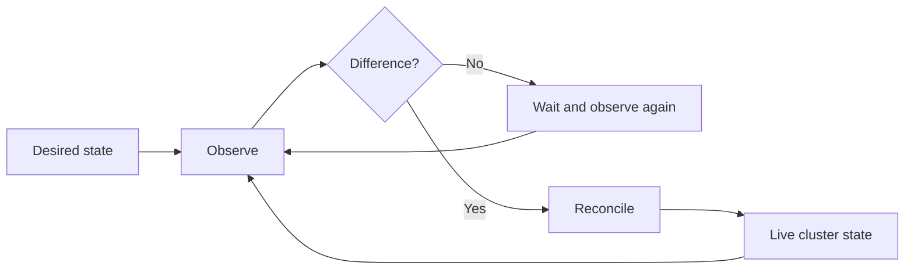
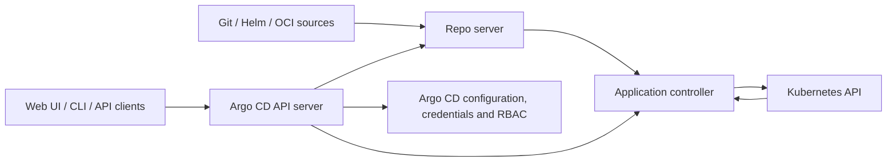
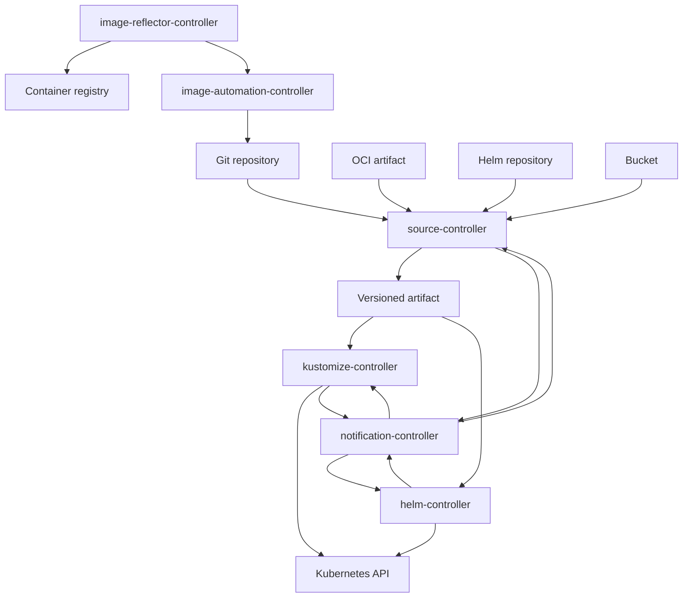
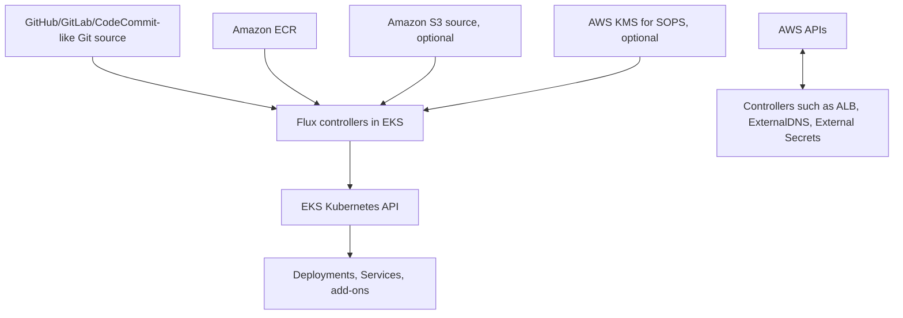

# GitOps with Argo CD and Flux

> A detailed comparison and a Flux-focused practical guide for Kubernetes platform engineering
> Updated: July 2026

---

## Table of contents

1. [Purpose of this guide](#1-purpose-of-this-guide)
2. [What GitOps actually means](#2-what-gitops-actually-means)
3. [The shared GitOps reconciliation model](#3-the-shared-gitops-reconciliation-model)
4. [Argo CD architecture and operating model](#4-argo-cd-architecture-and-operating-model)
5. [Flux architecture and operating model](#5-flux-architecture-and-operating-model)
6. [Flux controllers in detail](#6-flux-controllers-in-detail)
7. [Flux reconciliation from commit to running workload](#7-flux-reconciliation-from-commit-to-running-workload)
8. [Argo CD versus Flux: detailed comparison](#8-argo-cd-versus-flux-detailed-comparison)
9. [Concept mapping for an Argo CD user](#9-concept-mapping-for-an-argo-cd-user)
10. [How Argo CD and Flux can coexist](#10-how-argo-cd-and-flux-can-coexist)
11. [Flux repository design](#11-flux-repository-design)
12. [Flux practical manifests](#12-flux-practical-manifests)
13. [Helm with Flux](#13-helm-with-flux)
14. [Flux image automation](#14-flux-image-automation)
15. [Notifications and webhooks](#15-notifications-and-webhooks)
16. [Security, secrets and multi-tenancy](#16-security-secrets-and-multi-tenancy)
17. [Flux on AWS EKS](#17-flux-on-aws-eks)
18. [Multi-cluster patterns](#18-multi-cluster-patterns)
19. [Observability and troubleshooting](#19-observability-and-troubleshooting)
20. [Migration from Argo CD to Flux](#20-migration-from-argo-cd-to-flux)
21. [Hands-on Flux laboratory](#21-hands-on-flux-laboratory)
22. [Production recommendations](#22-production-recommendations)
23. [Decision guide](#23-decision-guide)
24. [Learning checklist](#24-learning-checklist)
25. [Glossary](#25-glossary)
26. [Official references](#26-official-references)

---

# 1. Purpose of this guide

Argo CD and Flux solve the same general problem:

> Continuously deliver Kubernetes configuration from a declarative source and keep the live cluster aligned with the declared desired state.

However, they present the problem differently.

- **Argo CD is centered on the concept of an application.**
- **Flux is centered on sources, artifacts and specialized reconciliation controllers.**

For an engineer who already knows Argo CD, Flux may initially look fragmented because there is no single object equivalent to an Argo CD `Application` that contains every important setting. Flux deliberately separates responsibilities into several Kubernetes custom resources.

For example, an Argo CD `Application` may define:

- The Git repository.
- The Git revision.
- The repository path.
- The destination cluster.
- The destination namespace.
- Automated synchronization.
- Pruning.
- Self-healing.
- Helm values or Kustomize options.

A comparable Flux deployment commonly uses at least two objects:

- A `GitRepository`, which retrieves and packages the source.
- A `Kustomization`, which builds and applies configuration from that source.

A Helm deployment commonly uses:

- A `HelmRepository`, `OCIRepository` or `GitRepository`.
- A `HelmRelease`.

This separation is not accidental. It is the foundation of Flux’s composable controller model.

---

# 2. What GitOps actually means

GitOps is not merely “running `kubectl apply` from a CI pipeline.”

OpenGitOps defines GitOps around four main principles:

1. **Declarative**
   The desired state of the system is described declaratively.

2. **Versioned and immutable**
   Desired state is stored in a versioned system that preserves history and supports rollback.

3. **Pulled automatically**
   Software agents obtain the declared state automatically rather than depending exclusively on an external pipeline pushing changes.

4. **Continuously reconciled**
   Agents continuously compare actual state with desired state and act to remove differences.

Git is the most common source because it provides commits, branches, pull requests, reviews and audit history. Modern Flux can also consume OCI artifacts and other sources, but the same principles remain.

## 2.1 GitOps is different from traditional CI/CD

A traditional push-based deployment may look like this:

```text
Developer
   |
   v
Git push
   |
   v
CI runner
   |
   +-- build
   +-- test
   +-- authenticate to cluster
   +-- kubectl apply / helm upgrade
   |
   v
Kubernetes API
```

The CI runner needs credentials that allow it to modify the cluster. If a resource is changed manually after the pipeline finishes, the pipeline usually does not notice until it runs again.

A pull-based GitOps deployment looks like this:

```text
Developer
   |
   v
Git push
   |
   v
Git repository
   ^
   |
In-cluster GitOps controller
   |
   +-- fetch desired state
   +-- compare/reconcile
   +-- apply changes
   +-- detect later drift
   |
   v
Kubernetes API
```

The GitOps controller runs continuously. It does not deploy only once; it keeps checking.

## 2.2 CI and GitOps are complementary

GitOps does not replace CI.

A common design is:

```text
Application repository
   |
   +-- CI: test source code
   +-- CI: build container
   +-- CI: scan image
   +-- CI: push image to registry
   +-- CI or image automation: update desired image version in configuration repository
                                          |
                                          v
                                  GitOps repository
                                          |
                                          v
                                Argo CD or Flux
                                          |
                                          v
                                    Kubernetes
```

A useful separation of concerns is:

| Responsibility | Typical owner |
|---|---|
| Compile code | CI |
| Run unit and integration tests | CI |
| Build a container image | CI |
| Scan the image | CI/security pipeline |
| Publish the image | CI |
| Select a release version | Human review, automation or release process |
| Declare the desired version | GitOps repository |
| Reconcile it into Kubernetes | Argo CD or Flux |
| Detect drift | Argo CD or Flux |

---

# 3. The shared GitOps reconciliation model

Both tools implement a control loop.



The general logic is:

1. Read desired configuration.
2. Observe live resources.
3. Determine whether the actual state matches the desired state.
4. Create, update or delete resources as required.
5. Report status and events.
6. Repeat.

This repeated operation is called **reconciliation**.

## 3.1 Desired-state drift

Drift occurs when the live cluster differs from the declared state.

Examples:

- An operator manually changes a Deployment replica count.
- A ConfigMap is edited directly with `kubectl edit`.
- A resource is deleted manually.
- A mutating webhook changes a field.
- Another controller owns or modifies the same field.
- A Helm release is changed outside the GitOps workflow.
- A cloud controller adds runtime-generated data.

Not every live difference should be treated as an error. Kubernetes controllers and admission webhooks legitimately mutate resources. Production GitOps therefore requires an understanding of:

- Field ownership.
- Server-side apply.
- Defaulted fields.
- Generated fields.
- Ignore or exclusion rules.
- Controller interactions.
- Resource ownership boundaries.

## 3.2 Pruning

Pruning means deleting a live resource when it is removed from the desired configuration.

Example:

```text
Commit A:
  deployment.yaml
  service.yaml

Commit B:
  deployment.yaml
```

With pruning enabled, the GitOps controller removes the Service after Commit B becomes the desired state.

Pruning is powerful and potentially destructive. It should be enabled intentionally, with repository protections, reviews and tested deletion behavior.

## 3.3 Self-healing

Self-healing means reverting an unauthorized or accidental live-cluster change.

Example:

```bash
kubectl scale deployment demo-api --replicas=10
```

Git declares:

```yaml
spec:
  replicas: 3
```

A self-healing reconciler eventually returns the Deployment to three replicas.

In Argo CD, self-healing is explicitly configured as part of automated sync behavior. In Flux, continuous reconciliation is the normal operating model for managed objects; controller-specific options determine exactly how resources are reapplied and drift is handled.

---

# 4. Argo CD architecture and operating model

Argo CD is a declarative continuous-delivery platform implemented as Kubernetes controllers and services.

Its user experience is organized around the `Application` custom resource.

## 4.1 Simplified architecture



## 4.2 Important Argo CD components

### API server

The API server exposes the interfaces used by:

- The Argo CD web UI.
- The `argocd` CLI.
- REST or gRPC clients.
- CI/CD integrations.
- SSO and authentication flows.
- Repository and cluster administration.
- Application operations.

This gives Argo CD a centralized platform experience.

### Repository server

The repository server retrieves sources and generates Kubernetes manifests.

It can work with:

- Plain YAML.
- Kustomize.
- Helm.
- Jsonnet.
- Config Management Plugins.

For Helm, Argo CD generally uses Helm as a manifest generator. Argo CD renders the chart and manages the resulting Kubernetes resources through Argo CD synchronization semantics.

### Application controller

The application controller:

- Reads the desired manifests.
- Observes target clusters.
- Compares desired and live states.
- Calculates synchronization and health status.
- Performs synchronization.
- Prunes resources.
- Self-heals when configured.
- Updates application status.

### ApplicationSet controller

The ApplicationSet controller generates multiple Argo CD `Application` resources.

Common generator inputs include:

- Git directories.
- Git files.
- Registered clusters.
- Lists.
- Pull requests.
- Matrix or merge combinations.

ApplicationSet is especially useful for:

- Deploying one application to many clusters.
- Discovering environment directories in a monorepo.
- Generating applications for tenant repositories.
- Bootstrapping clusters.

## 4.3 The Argo CD Application object

Example:

```yaml
apiVersion: argoproj.io/v1alpha1
kind: Application
metadata:
  name: payments-api
  namespace: argocd
spec:
  project: platform

  source:
    repoURL: https://github.com/example/platform-gitops.git
    targetRevision: main
    path: applications/payments/overlays/production

  destination:
    server: https://kubernetes.default.svc
    namespace: payments

  syncPolicy:
    automated:
      enabled: true
      prune: true
      selfHeal: true
    syncOptions:
      - CreateNamespace=true
```

This resource is a high-level application contract:

```text
Application
├── source
├── revision
├── path/chart
├── rendering options
├── destination cluster
├── destination namespace
├── project
├── sync policy
├── retry behavior
└── ignore/sync options
```

## 4.4 Argo CD strengths

Argo CD is particularly strong when an organization wants:

- A built-in application dashboard.
- Visual resource topology.
- Visual desired-versus-live diffs.
- Manual sync and rollback operations.
- Centralized multi-cluster management.
- Application-specific health and synchronization status.
- SSO and an Argo-specific RBAC layer.
- Projects that constrain repositories, clusters and namespaces.
- ApplicationSet-based fleet generation.
- An operational portal that application teams can use.

## 4.5 Argo CD trade-offs

Potential trade-offs include:

- The central Argo CD control plane can become an important shared dependency.
- Argo-specific API, RBAC and operational concepts must be administered in addition to Kubernetes RBAC.
- Very large installations need deliberate scaling, caching and sharding design.
- Helm is normally used to generate manifests rather than to preserve Helm as the release lifecycle owner.
- Teams may become dependent on UI-driven operations instead of Git-only workflows.
- A central instance that can reach many clusters has a large security scope and must be protected accordingly.

---

# 5. Flux architecture and operating model

Flux is a family of Kubernetes controllers and APIs collectively called the **GitOps Toolkit**.

Rather than placing all delivery configuration into one application object, Flux separates the pipeline into explicit resources.

## 5.1 Simplified architecture



## 5.2 Flux’s central concept: source to artifact to reconciler

The most important Flux mental model is:

```text
Source
  |
  v
Artifact
  |
  v
Reconciler
  |
  v
Kubernetes resources
```

### Source

A Source custom resource declares where configuration comes from.

Examples:

- `GitRepository`
- `OCIRepository`
- `HelmRepository`
- `HelmChart`
- `Bucket`
- `ExternalArtifact`
- `ArtifactGenerator`

### Artifact

The source controller resolves a specific version and produces an immutable artifact representation for other controllers to consume.

For Git, the artifact is associated with a resolved revision.

### Reconciler

A specialized controller consumes the artifact.

Examples:

- `kustomize-controller` consumes an artifact through a Flux `Kustomization`.
- `helm-controller` reconciles a Helm release through a `HelmRelease`.

## 5.3 Why Flux separates these objects

This design provides several benefits.

### Reuse

One `GitRepository` can be consumed by multiple `Kustomization` resources.

```text
GitRepository: platform-config
├── Kustomization: cluster-foundation
├── Kustomization: infrastructure
├── Kustomization: observability
└── Kustomization: applications
```

The repository is retrieved once as a source artifact and used by several reconciliation pipelines.

### Independent intervals

The source and the consumers can have different reconciliation intervals.

```yaml
GitRepository:
  interval: 1m

Kustomization:
  interval: 10m
```

The source checks for new revisions every minute. The Kustomization also reconciles based on its own triggers and interval.

### Explicit dependencies

Infrastructure can be reconciled before applications:

```text
CRDs
  ↓
operators
  ↓
platform services
  ↓
applications
```

Flux models this with `dependsOn`, health checks and readiness.

### Kubernetes-native extensibility

Flux resources are Kubernetes API objects. They can be:

- Created with YAML.
- Validated with admission policies.
- Controlled with Kubernetes RBAC.
- Queried with `kubectl`.
- Monitored with Prometheus.
- Generated by other Kubernetes controllers.
- Organized by namespaces.
- Reconciled by standard controller-runtime patterns.

---

# 6. Flux controllers in detail

A default Flux installation commonly includes:

- `source-controller`
- `kustomize-controller`
- `helm-controller`
- `notification-controller`

The minimum bootstrap components are source-controller and kustomize-controller. Image automation controllers are optional.

---

## 6.1 source-controller

The source-controller retrieves external content and turns it into artifacts.

### Common source types

| Resource | Purpose |
|---|---|
| `GitRepository` | Fetch a Git repository revision |
| `OCIRepository` | Fetch a versioned OCI artifact |
| `HelmRepository` | Read an HTTP/S Helm repository index |
| `HelmChart` | Build or obtain a chart artifact |
| `Bucket` | Fetch content from an object-storage bucket |
| `ExternalArtifact` | Reference an artifact exposed by another controller |
| `ArtifactGenerator` | Generate artifacts from source content |

### GitRepository example

```yaml
apiVersion: source.toolkit.fluxcd.io/v1
kind: GitRepository
metadata:
  name: platform-config
  namespace: flux-system
spec:
  interval: 1m
  url: https://github.com/example/platform-gitops.git
  ref:
    branch: main
```

The controller:

1. Resolves the configured reference.
2. Fetches repository content.
3. Creates an artifact.
4. Records the resolved revision and artifact status.
5. Repeats according to the interval or an event trigger.

### Revision selection

A Git source can be configured around a:

- Branch.
- Tag.
- Semantic-version selection.
- Named ref.
- Commit.

Using a commit provides maximum immutability. Using a branch is convenient for environment state that advances over time.

### Authentication

A `GitRepository` can use a Secret for credentials. Depending on the provider and configuration, authentication may use:

- SSH deploy key.
- HTTPS token.
- Basic authentication.
- GitHub App credentials.
- Cloud workload identity for supported integrations.

Avoid broad personal tokens when a narrowly scoped deploy key or application identity is sufficient.

### Failure behavior

If the repository cannot be fetched, the `GitRepository` reports a failed condition. Existing successfully produced artifacts may continue to be available depending on controller storage and lifecycle, but new revisions cannot be delivered until source reconciliation succeeds.

The debugging question is:

> Is the source ready, and which revision did it resolve?

Useful commands:

```bash
flux get sources git -A
kubectl describe gitrepository platform-config -n flux-system
flux reconcile source git platform-config -n flux-system
```

---

## 6.2 kustomize-controller

The kustomize-controller applies Kubernetes manifests from a source artifact.

Its API object is:

```yaml
apiVersion: kustomize.toolkit.fluxcd.io/v1
kind: Kustomization
```

### Important naming warning

There are two different objects with similar names.

#### Native Kustomize file

```yaml
apiVersion: kustomize.config.k8s.io/v1beta1
kind: Kustomization
```

This file describes a Kustomize build.

Typical filename:

```text
kustomization.yaml
```

#### Flux Kustomization custom resource

```yaml
apiVersion: kustomize.toolkit.fluxcd.io/v1
kind: Kustomization
```

This object tells Flux:

- Which source to consume.
- Which path to build.
- How often to reconcile.
- Whether to prune.
- Whether to wait for readiness.
- Which dependencies must be ready.
- Which ServiceAccount to impersonate.
- Whether to decrypt SOPS content.
- Whether to target a remote cluster.

### Basic Flux Kustomization

```yaml
apiVersion: kustomize.toolkit.fluxcd.io/v1
kind: Kustomization
metadata:
  name: applications
  namespace: flux-system
spec:
  interval: 10m
  path: ./clusters/production/applications
  prune: true
  wait: true
  timeout: 5m

  sourceRef:
    kind: GitRepository
    name: platform-config
```

### What it does

1. Reads the artifact produced by `platform-config`.
2. Selects `./clusters/production/applications`.
3. Runs a Kustomize build.
4. Validates and applies the generated resources.
5. Tracks its inventory.
6. Optionally removes no-longer-declared objects.
7. Optionally waits for health.
8. Reports conditions, events and revision data.

### Plain YAML support

A directory does not always need a hand-written native `kustomization.yaml`. Flux can generate one for a directory of YAML resources in common use cases. Nevertheless, explicitly maintained Kustomize files are usually clearer in production repositories.

### Server-side apply

Flux kustomize-controller uses Kubernetes apply semantics and tracks field ownership. This matters when other controllers also mutate resources. Do not assume that every difference means Flux will overwrite every field; ownership and Kubernetes API behavior affect the result.

### Dependencies

```yaml
apiVersion: kustomize.toolkit.fluxcd.io/v1
kind: Kustomization
metadata:
  name: applications
  namespace: flux-system
spec:
  dependsOn:
    - name: infrastructure
  interval: 10m
  path: ./applications/production
  prune: true
  wait: true
  sourceRef:
    kind: GitRepository
    name: platform-config
```

`applications` is reconciled only after `infrastructure` reports ready.

Common dependency chains:

```text
namespaces
   ↓
CRDs
   ↓
operators/controllers
   ↓
operator custom resources
   ↓
applications
```

Avoid circular dependencies. A cycle leaves all involved Kustomizations waiting forever.

### Health behavior

`wait: true` tells Flux to assess the health of all reconciled resources before marking the Kustomization ready.

Alternatively, explicit `healthChecks` can target selected resources.

Health checks make dependencies useful. Without readiness, “applied” may only mean that the API accepted the objects, not that the controller or workload is operational.

### Pruning

```yaml
spec:
  prune: true
```

Flux tracks resources in the Kustomization inventory. If a tracked resource is removed from the built desired state, Flux garbage-collects it when pruning is enabled.

Separate unrelated systems into separate Kustomizations. This reduces accidental deletion scope and creates clearer ownership.

### Target namespace

```yaml
spec:
  targetNamespace: payments
```

This can set the namespace for namespaced resources. The namespace must exist unless the configuration also creates it in a safe ordering model.

### Patches and images

Flux Kustomization supports transformations such as patches and image overrides. However, for maintainability, consider keeping reusable transformations inside native Kustomize overlays unless the change is specifically environment-controller configuration.

### SOPS decryption

```yaml
spec:
  decryption:
    provider: sops
    secretRef:
      name: sops-age
```

Flux decrypts encrypted Kubernetes Secrets immediately before applying them. Plaintext secrets should not be committed to Git, and base64 is not encryption.

---

## 6.3 helm-controller

The helm-controller declaratively manages Helm releases through `HelmRelease`.

This is a major difference from the standard Argo CD Helm model.

### Flux Helm model

```text
Helm/OCI/Git source
        |
        v
Chart artifact
        |
        v
HelmRelease
        |
        v
helm-controller
        |
        +-- install
        +-- upgrade
        +-- test
        +-- rollback/remediate
        +-- uninstall
        +-- drift detection
```

Flux treats the Helm release lifecycle as an operational object.

### Basic HelmRelease

```yaml
apiVersion: helm.toolkit.fluxcd.io/v2
kind: HelmRelease
metadata:
  name: ingress-nginx
  namespace: ingress-nginx
spec:
  interval: 15m

  chart:
    spec:
      chart: ingress-nginx
      version: "4.x"
      sourceRef:
        kind: HelmRepository
        name: ingress-nginx
        namespace: flux-system

  values:
    controller:
      replicaCount: 2
```

### HelmRelease capabilities

A HelmRelease can configure:

- Chart source and version.
- Release name.
- Target namespace.
- Values.
- Values from Secrets or ConfigMaps.
- Install settings.
- Upgrade settings.
- Rollback/remediation strategy.
- Test behavior.
- Timeouts.
- Dependencies.
- Drift detection.
- Post-renderers.
- CRD handling.
- Suspend/resume behavior.

### Drift detection

Flux Helm drift detection compares the stored Helm release manifest with the live cluster.

Modes include behavior such as:

- Detect and correct drift.
- Warn about drift.

This is useful when an object managed by Helm is manually changed after installation.

### Remediation

Example:

```yaml
spec:
  install:
    remediation:
      retries: 3

  upgrade:
    remediation:
      retries: 3
      remediateLastFailure: true
```

Remediation behavior should be tested carefully. Automatic rollback or retry may be desirable for platform add-ons but can hide a repeated configuration problem unless monitoring alerts on failures.

---

## 6.4 notification-controller

The notification-controller handles:

- Incoming events through `Receiver`.
- Outgoing events through `Provider` and `Alert`.

### Inbound path

```text
Git provider webhook
        |
        v
Receiver endpoint
        |
        v
notification-controller
        |
        v
Immediate source reconciliation
```

Polling remains important as a fallback. A webhook reduces reaction time; it does not remove the periodic reconciliation safety net.

### Outbound path

```text
Flux controller event
        |
        v
Alert filter
        |
        v
Provider
        |
        +-- Slack
        +-- Microsoft Teams
        +-- generic webhook
        +-- Datadog
        +-- other supported services
```

### Main resources

| Resource | Role |
|---|---|
| `Receiver` | Accept an inbound webhook and trigger selected Flux objects |
| `Provider` | Define where and how notifications are sent |
| `Alert` | Select events, severity and provider |

---

## 6.5 Image automation controllers

Flux image automation uses two controllers:

- `image-reflector-controller`
- `image-automation-controller`

And three main APIs:

- `ImageRepository`
- `ImagePolicy`
- `ImageUpdateAutomation`

The process is:

```text
Container registry
        |
        v
ImageRepository scans tags
        |
        v
ImagePolicy selects the desired tag
        |
        v
ImageUpdateAutomation edits Git files
        |
        v
Commit is pushed to Git
        |
        v
Normal Flux reconciliation deploys the change
```

An important property is that the desired image version is written back to Git. The cluster is not silently changed without changing the source of truth.

---

# 7. Flux reconciliation from commit to running workload

Consider this setup:

```text
GitRepository: platform-config
Kustomization: production-apps
```

## 7.1 Initial state

Git contains:

```yaml
apiVersion: apps/v1
kind: Deployment
metadata:
  name: demo-api
  namespace: demo
spec:
  replicas: 3
```

The `GitRepository` polls `main`.

The `Kustomization` consumes the resulting artifact.

## 7.2 A developer merges a change

The replica count becomes:

```yaml
spec:
  replicas: 5
```

## 7.3 Source reconciliation

The source-controller:

1. Resolves the new `main` commit.
2. Fetches content.
3. Produces a new artifact.
4. Updates the `GitRepository` status with the new revision.
5. Emits an event.

## 7.4 Kustomization reconciliation

The kustomize-controller observes the changed artifact revision:

1. Retrieves the artifact.
2. Builds the configured path.
3. Applies the Deployment update.
4. Waits for health if configured.
5. Records the applied revision.
6. Emits events and metrics.

## 7.5 Kubernetes rollout

The Kubernetes Deployment controller creates the required new Pods and handles the rollout.

Flux does not replace Kubernetes workload controllers. Flux changes the desired Kubernetes objects; native controllers perform workload-specific convergence.

## 7.6 Drift test

Someone runs:

```bash
kubectl scale deployment demo-api -n demo --replicas=1
```

Flux later reconciles the Kustomization and returns the desired count to five, assuming Flux owns the relevant field and no conflicting controller is intended to manage replicas.

### Important HPA example

If a HorizontalPodAutoscaler manages replicas, committing a fixed `spec.replicas` can produce ownership conflicts or repeated changes. Design the manifest so that autoscaling and GitOps have unambiguous ownership.

---

# 8. Argo CD versus Flux: detailed comparison

| Area | Argo CD | Flux |
|---|---|---|
| Primary abstraction | `Application` | Sources plus specialized reconcilers |
| Product experience | Central CD platform | Kubernetes-native toolkit |
| Built-in UI | Yes | Core Flux is API/CLI driven; ecosystem UIs are available |
| Desired-state object | Application-oriented | Resource/controller-oriented |
| Source separation | Usually embedded in Application | First-class Source CRDs produce artifacts |
| Kustomize delivery | Argo renders and syncs | kustomize-controller builds and applies |
| Helm delivery | Helm commonly renders; Argo owns lifecycle | helm-controller manages Helm release lifecycle |
| Synchronization | Manual or automated policies | Continuous reconciliation is the standard model |
| Drift visibility | Strong visual diff | Conditions, events, CLI, metrics and ecosystem UIs |
| Pruning | Application sync policy | `Kustomization.spec.prune` or Helm lifecycle behavior |
| Ordering | Hooks, phases and sync waves | `dependsOn`, health checks and readiness |
| Multi-tenancy | AppProjects plus Argo RBAC and SSO | Namespaces, ServiceAccounts, Kubernetes RBAC and controller lockdown |
| Multi-cluster | Common central hub model | Common per-cluster model; remote reconciliation is supported |
| App generation | ApplicationSet | Kustomize/Helm generation, repository composition and toolkit/ecosystem patterns |
| Notifications | Argo CD Notifications | notification-controller |
| Image updates | Argo CD Image Updater project | Optional Flux image controllers |
| Secrets | External integrations/plugins/tools | Native Kustomization SOPS decryption plus external tools |
| Operational interaction | UI, CLI and API | `kubectl`, Flux CLI, Git, metrics and optional UIs |
| Extensibility | Plugins and Argo ecosystem | Composable controller APIs and GitOps Toolkit |
| Typical fit | Developer-facing app delivery portal | Platform-engineering control plane and Kubernetes-native automation |

## 8.1 Application-centric versus pipeline-centric

Argo CD asks:

> What is this application, where is its source, where is its destination and what is its synchronization status?

Flux asks:

> What source produced this artifact, and which controller is responsible for reconciling it?

Neither approach is inherently superior. They optimize for different operational experiences.

## 8.2 UI and operational workflow

Argo CD’s UI is one of its strongest advantages.

It provides:

- Application list.
- Sync status.
- Health status.
- Resource tree.
- Live manifests.
- Desired manifests.
- Diff.
- Sync operation controls.
- History and rollback context.
- Logs and actions depending on permissions.

Flux’s core workflow is closer to Kubernetes administration:

```bash
flux get all -A
kubectl get fluxcd -A
kubectl describe kustomization ...
flux logs ...
```

Current Flux ecosystems provide UI options, including Flux Operator-related interfaces and other integrations. Nevertheless, the core mental model remains Kubernetes API first.

## 8.3 Helm difference

This is one of the most important distinctions.

### Argo CD

```text
Helm chart
   |
   v
helm template
   |
   v
Rendered YAML
   |
   v
Argo CD manages resources
```

Argo CD owns application synchronization semantics.

### Flux

```text
Helm chart
   |
   v
HelmRelease
   |
   v
helm-controller
   |
   v
Helm install/upgrade/test/rollback/uninstall
```

Flux manages a real declarative Helm release lifecycle.

Use Flux’s Helm model when:

- Helm release state matters operationally.
- You want install and upgrade remediation.
- You want declarative tests.
- You want Helm drift detection.
- Your platform team already models add-ons as Helm releases.

## 8.4 Ordering difference

### Argo CD

Resources can be ordered with:

- Sync phases.
- Hooks.
- Sync waves.
- Kind/name ordering behavior.

Example annotation:

```yaml
metadata:
  annotations:
    argocd.argoproj.io/sync-wave: "10"
```

### Flux

Ordering is usually modeled at a higher pipeline level:

```yaml
spec:
  dependsOn:
    - name: cert-manager
```

Then readiness and health checks determine when the dependent object proceeds.

A practical mapping is:

```text
Argo sync wave -10: CRDs
Argo sync wave 0: operator
Argo sync wave 10: custom resources
```

becomes:

```text
Flux Kustomization: crds
        ↓
Flux Kustomization: operator
        ↓
Flux Kustomization: custom-resources
```

The Flux model often produces clearer ownership and failure boundaries because each stage has independent status.

## 8.5 Multi-cluster difference

Argo CD is frequently installed in a management cluster and given credentials for many target clusters.

```text
Argo CD hub
├── development cluster
├── staging cluster
└── production cluster
```

Flux is frequently installed in every cluster.

```text
development cluster -> local Flux
staging cluster     -> local Flux
production cluster  -> local Flux
```

The per-cluster pattern reduces dependence on a central delivery service and keeps reconciliation local.

However, these are common patterns, not hard limitations:

- Argo CD can manage only its local cluster.
- Flux can reconcile remote clusters through kubeconfig or supported cloud identity patterns.
- Flux can also operate in hub-and-spoke designs.
- Argo CD can be deployed separately per cluster.

Choose the topology based on security domains, failure isolation, connectivity and operational ownership.

## 8.6 Multi-tenancy difference

### Argo CD

Argo CD provides its own authorization layer around:

- Applications.
- Projects.
- Repositories.
- Clusters.
- Sync operations.
- Logs.
- Exec and resource actions.

`AppProject` can restrict:

- Allowed source repositories.
- Allowed destination clusters and namespaces.
- Allowed or denied Kubernetes resource kinds.
- Project roles.

### Flux

Flux generally uses Kubernetes-native controls:

- Namespace boundaries.
- ServiceAccounts.
- Roles and RoleBindings.
- Controller impersonation.
- Cross-namespace reference restrictions.
- Admission policies.
- Source permissions.

A Flux `Kustomization` or `HelmRelease` can use a restricted ServiceAccount. The controller performs operations with that identity rather than with unrestricted cluster-admin permissions.

This fits platform designs where teams already receive Kubernetes namespaces and RBAC roles.

---

# 9. Concept mapping for an Argo CD user

| Argo CD | Flux equivalent or closest model |
|---|---|
| `Application` | Usually `GitRepository` + `Kustomization` |
| Helm `Application` | Source + `HelmRelease` |
| `Application.spec.source.repoURL` | Source resource `.spec.url` |
| `targetRevision` | Source `.spec.ref` or chart version |
| `path` | `Kustomization.spec.path` |
| `destination.namespace` | Resource namespace and/or `targetNamespace` |
| `destination.server` | Local cluster or `kubeConfig` for remote target |
| Automated sync | Reconciliation loop |
| `prune: true` | `Kustomization.spec.prune: true` |
| `selfHeal: true` | Continuous reconciliation and controller drift behavior |
| Sync wave | `dependsOn` plus health/readiness |
| Hook | Kubernetes Job or workflow modeled in reconciliation stages |
| App of Apps | Root Kustomization that applies child Flux objects |
| ApplicationSet | Generated Flux resources using repository/Kustomize/Helm/toolkit patterns |
| AppProject | Namespace + ServiceAccount + Kubernetes RBAC + policy |
| Argo CD Notifications | Flux `Provider` + `Alert` + `Receiver` |
| Argo CD Image Updater | Flux image reflector and automation APIs |
| Argo app status | Kustomization/HelmRelease conditions and inventory |
| Refresh | Source reconcile |
| Sync | Kustomization or HelmRelease reconcile |
| Pause auto-sync | Suspend the Flux resource |
| Resource tree | `flux tree`, Kubernetes ownership, optional UI |
| Diff | `flux diff`, local Kustomize/Helm rendering and policy tools |

## 9.1 The biggest mindset changes

### Change 1: there may be no single “application” object

A business application can be represented by:

```text
GitRepository
├── Kustomization: namespace
├── Kustomization: database-operator-resources
├── HelmRelease: application chart
└── Alert: deployment notifications
```

The logical application is an architecture composed from multiple APIs.

### Change 2: inspect the pipeline from left to right

When Flux fails, troubleshoot in this order:

```text
Source
  ↓
Artifact
  ↓
Kustomization or HelmRelease
  ↓
Generated Kubernetes object
  ↓
Workload status
```

An Argo CD user may begin by looking for an application diff. In Flux, begin by identifying which resource in the chain is not ready.

### Change 3: Kubernetes RBAC matters even more

Flux resources live in the Kubernetes API and can be namespaced. Their permissions and cross-namespace behavior are therefore a central part of platform design.

---

# 10. How Argo CD and Flux can coexist

Argo CD and Flux normally do not directly call one another. They are alternative reconciliation systems.

## 10.1 The most important rule

> A Kubernetes resource should have one GitOps reconciliation owner.

Do not configure both tools to manage the same Deployment, Service, ConfigMap, Helm release or CRD instance.

## 10.2 What can go wrong

Suppose Git repository A, managed by Argo CD, declares:

```yaml
replicas: 3
```

Git repository B, managed by Flux, declares:

```yaml
replicas: 5
```

Both controllers continuously reconcile.

The result may be:

```text
Argo CD sets replicas to 3
Flux sets replicas to 5
Argo CD sets replicas to 3
Flux sets replicas to 5
...
```

This produces:

- Reconciliation loops.
- Excessive API traffic.
- Confusing status.
- Unstable workloads.
- Unclear audit ownership.
- Potential field-manager conflicts.

## 10.3 Safe coexistence patterns

### Pattern A: namespace ownership

```text
Argo CD owns:
  app-team-a
  app-team-b

Flux owns:
  cert-manager
  external-secrets
  monitoring
```

### Pattern B: cluster ownership

```text
Cluster A -> Argo CD
Cluster B -> Flux
```

### Pattern C: workload-category ownership

```text
Argo CD -> product applications
Flux    -> cluster infrastructure add-ons
```

This is safe only when dependencies and shared resources are clearly documented.

### Pattern D: migration ownership

```text
App 1 -> Argo CD
App 2 -> Flux
App 3 -> Argo CD, scheduled for migration
```

Move one application boundary at a time.

### Pattern E: Flux image automation with Argo CD deployment

A technically valid design is:

```text
Flux image controllers
        |
        v
Commit image update to Git
        |
        v
Argo CD observes the Git commit
        |
        v
Argo CD deploys the application
```

In this model:

- Flux owns only registry scanning, policy and Git write-back.
- Argo CD owns Kubernetes deployment.
- Flux kustomize-controller must not also deploy the same objects.

This is an inferred composition of the two systems, not a mandatory or privileged integration. It adds operational complexity and should be used only when the benefit is clear.

## 10.4 Ownership documentation

Maintain a table such as:

| Resource boundary | Reconciler | Source repository | Team |
|---|---|---|---|
| `cert-manager` namespace | Flux | platform-infra | Platform |
| `payments` namespace | Argo CD | payments-gitops | Payments |
| ClusterRoles prefixed `security-` | Flux | security-platform | Security |
| Shared IngressClass | Flux | platform-infra | Platform |

Also consider labels that identify ownership:

```yaml
metadata:
  labels:
    platform.example.com/gitops-owner: flux
```

Labels do not enforce ownership by themselves, but admission policy can use them to prevent overlap.

---

# 11. Flux repository design

Repository structure is a platform architecture decision. It affects:

- Access control.
- Review flow.
- Blast radius.
- Promotion.
- Reuse.
- Secret boundaries.
- Automation.
- Troubleshooting.

## 11.1 Monorepo example

```text
platform-gitops/
├── apps/
│   ├── base/
│   │   ├── payments/
│   │   └── orders/
│   ├── development/
│   ├── staging/
│   └── production/
├── infrastructure/
│   ├── base/
│   │   ├── ingress-nginx/
│   │   ├── cert-manager/
│   │   ├── external-secrets/
│   │   └── monitoring/
│   ├── development/
│   ├── staging/
│   └── production/
└── clusters/
    ├── development/
    │   ├── infrastructure.yaml
    │   └── applications.yaml
    ├── staging/
    │   ├── infrastructure.yaml
    │   └── applications.yaml
    └── production/
        ├── infrastructure.yaml
        └── applications.yaml
```

Advantages:

- One repository presents complete cluster state.
- Changes spanning infrastructure and apps can be reviewed together.
- Reuse through base and overlays is straightforward.
- Bootstrap is easy to understand.

Trade-offs:

- Repository access may become too broad.
- A single change can have a large blast radius.
- Pull-request traffic can become noisy.
- Different teams may need more separation.

## 11.2 Repository per team

```text
platform-foundation.git
observability.git
security-platform.git
team-payments-gitops.git
team-orders-gitops.git
```

A cluster bootstrap repository can create Flux Sources and Kustomizations for each permitted team repository.

Advantages:

- Clear ownership and access.
- Independent release pace.
- Smaller repositories.
- Reduced cross-team conflicts.

Trade-offs:

- More credentials and sources.
- More dependency management.
- Harder global visibility.
- Cross-repository changes need coordination.

## 11.3 Repository per environment

```text
gitops-development.git
gitops-staging.git
gitops-production.git
```

Advantages:

- Strong environment access boundaries.
- Production can have stricter approvals.
- Environment rollback and audit are isolated.

Trade-offs:

- Promotion often means copying or merging changes across repositories.
- Reuse can become difficult.
- Drift between repositories may increase.

## 11.4 Recommended starting model

For a small or medium platform team:

```text
One platform GitOps repository
├── cluster directories
├── infrastructure base/overlays
└── application base/overlays
```

As team autonomy grows, delegate application configuration to separate repositories while retaining a small platform bootstrap repository.

## 11.5 Separate reconciliation units

Do not put the entire cluster into one giant Flux Kustomization.

Prefer:

```text
cluster-foundation
cluster-crds
cluster-operators
cluster-observability
cluster-security
applications-team-a
applications-team-b
```

Benefits:

- Smaller failure domains.
- Independent status.
- Clear dependency graph.
- More precise alerting.
- Safer pruning.
- Easier suspension during incidents.

---

# 12. Flux practical manifests

## 12.1 Git source

```yaml
apiVersion: source.toolkit.fluxcd.io/v1
kind: GitRepository
metadata:
  name: platform-config
  namespace: flux-system
spec:
  interval: 1m
  url: ssh://git@github.com/example/platform-gitops
  ref:
    branch: main
  secretRef:
    name: platform-config-auth
```

## 12.2 Infrastructure Kustomization

```yaml
apiVersion: kustomize.toolkit.fluxcd.io/v1
kind: Kustomization
metadata:
  name: infrastructure
  namespace: flux-system
spec:
  interval: 10m
  retryInterval: 1m
  timeout: 10m
  path: ./infrastructure/production
  prune: true
  wait: true

  sourceRef:
    kind: GitRepository
    name: platform-config
```

## 12.3 Application Kustomization with dependency

```yaml
apiVersion: kustomize.toolkit.fluxcd.io/v1
kind: Kustomization
metadata:
  name: applications
  namespace: flux-system
spec:
  dependsOn:
    - name: infrastructure

  interval: 10m
  retryInterval: 1m
  timeout: 10m
  path: ./applications/production
  prune: true
  wait: true

  sourceRef:
    kind: GitRepository
    name: platform-config
```

## 12.4 Tenant-restricted Kustomization

```yaml
apiVersion: kustomize.toolkit.fluxcd.io/v1
kind: Kustomization
metadata:
  name: payments
  namespace: payments-gitops
spec:
  serviceAccountName: payments-reconciler
  interval: 5m
  path: ./environments/production
  targetNamespace: payments
  prune: true
  wait: true

  sourceRef:
    kind: GitRepository
    name: payments-config
```

The `payments-reconciler` ServiceAccount should receive only the permissions required for the team’s namespace and approved resource kinds.

## 12.5 SOPS decryption

```yaml
apiVersion: kustomize.toolkit.fluxcd.io/v1
kind: Kustomization
metadata:
  name: payments
  namespace: payments-gitops
spec:
  interval: 5m
  path: ./environments/production
  prune: true
  wait: true

  decryption:
    provider: sops
    secretRef:
      name: sops-age

  sourceRef:
    kind: GitRepository
    name: payments-config
```

With cloud KMS, use workload identity where supported so that long-lived cloud credentials are not stored in Kubernetes Secrets.

## 12.6 Suspend and resume

Suspend:

```bash
flux suspend kustomization applications -n flux-system
```

Resume:

```bash
flux resume kustomization applications -n flux-system
```

Suspension is useful during:

- Incident investigation.
- Controlled maintenance.
- Migration.
- Destructive operation review.

Do not leave critical reconciliation suspended without monitoring and an explicit owner.

## 12.7 Force a reconciliation

```bash
flux reconcile source git platform-config -n flux-system
flux reconcile kustomization applications -n flux-system --with-source
```

Manual reconciliation is useful for testing and incident response. It should not become the normal deployment mechanism; commits and automated reconciliation should remain the primary flow.

---

# 13. Helm with Flux

## 13.1 HelmRepository

```yaml
apiVersion: source.toolkit.fluxcd.io/v1
kind: HelmRepository
metadata:
  name: ingress-nginx
  namespace: flux-system
spec:
  interval: 1h
  url: https://kubernetes.github.io/ingress-nginx
```

## 13.2 HelmRelease

```yaml
apiVersion: helm.toolkit.fluxcd.io/v2
kind: HelmRelease
metadata:
  name: ingress-nginx
  namespace: ingress-nginx
spec:
  interval: 15m
  timeout: 10m

  chart:
    spec:
      chart: ingress-nginx
      version: "4.x"
      sourceRef:
        kind: HelmRepository
        name: ingress-nginx
        namespace: flux-system

  install:
    remediation:
      retries: 3

  upgrade:
    remediation:
      retries: 3
      remediateLastFailure: true

  driftDetection:
    mode: enabled

  values:
    controller:
      replicaCount: 2
      service:
        externalTrafficPolicy: Local
```

## 13.3 Values from ConfigMap or Secret

```yaml
spec:
  valuesFrom:
    - kind: ConfigMap
      name: ingress-nginx-values
      valuesKey: values.yaml
    - kind: Secret
      name: ingress-nginx-sensitive-values
      valuesKey: values.yaml
```

Remember:

- A ConfigMap is appropriate for non-sensitive configuration.
- A Secret is only a Kubernetes storage type; it does not solve Git encryption by itself.
- Encrypt sensitive content before storing it in Git.
- Limit cross-namespace references in multi-tenant clusters.

## 13.4 HelmRelease dependency

A release can depend on another release where appropriate.

Conceptual example:

```text
cert-manager
   ↓
external-secrets
   ↓
application chart
```

Do not use dependency ordering as a substitute for proper Kubernetes readiness. The dependency should report ready only when the capability is genuinely usable.

## 13.5 When to use HelmRelease versus Kustomization

Use `HelmRelease` when:

- The upstream product is distributed as a Helm chart.
- You need Helm lifecycle operations.
- You need Helm tests or remediation.
- You want chart-version management.
- You want Helm drift detection.

Use `Kustomization` when:

- You manage plain manifests.
- You use Kustomize bases and overlays.
- You want full manifest ownership.
- You are applying CRDs and operators in explicit stages.
- The component does not need Helm release semantics.

A Kustomization may also deploy HelmRelease objects. This is a common pattern:

```text
GitRepository
   |
   v
Kustomization applies HelmRepository + HelmRelease
   |
   v
helm-controller manages the chart
```

---

# 14. Flux image automation

Image automation can remove the manual step of updating image tags in Git.

## 14.1 ImageRepository

```yaml
apiVersion: image.toolkit.fluxcd.io/v1
kind: ImageRepository
metadata:
  name: demo-api
  namespace: flux-system
spec:
  image: ghcr.io/example/demo-api
  interval: 5m
```

This scans the image repository and records available tags.

## 14.2 ImagePolicy

```yaml
apiVersion: image.toolkit.fluxcd.io/v1
kind: ImagePolicy
metadata:
  name: demo-api
  namespace: flux-system
spec:
  imageRepositoryRef:
    name: demo-api

  filterTags:
    pattern: '^v(?P<version>[0-9]+\.[0-9]+\.[0-9]+)$'
    extract: '$version'

  policy:
    semver:
      range: '>=1.0.0 <2.0.0'
```

The policy selects the newest acceptable tag in the configured range.

## 14.3 Mark the field to update

```yaml
apiVersion: apps/v1
kind: Deployment
metadata:
  name: demo-api
  namespace: demo
spec:
  template:
    spec:
      containers:
        - name: demo-api
          image: ghcr.io/example/demo-api:v1.4.2 # {"$imagepolicy": "flux-system:demo-api"}
```

## 14.4 ImageUpdateAutomation

```yaml
apiVersion: image.toolkit.fluxcd.io/v1
kind: ImageUpdateAutomation
metadata:
  name: demo-api
  namespace: flux-system
spec:
  interval: 10m

  sourceRef:
    kind: GitRepository
    name: platform-config

  git:
    checkout:
      ref:
        branch: main
    commit:
      author:
        name: flux-image-automation
        email: flux@example.com
      messageTemplate: |
        chore(images): update automated image references

        Automation: {{ .AutomationObject }}
    push:
      branch: main

  update:
    path: ./applications/demo-api
    strategy: Setters
```

## 14.5 Production controls

Directly pushing to a protected production branch may be inappropriate.

Possible controls:

- Write to an environment branch and open a pull request.
- Use separate automation for development and production.
- Allow automatic patch updates but require review for minor/major updates.
- Require signed commits.
- Run policy and security checks on update pull requests.
- Pin production images by digest.
- Use registry signing and admission verification.
- Limit the automation identity to one repository and branch.

## 14.6 Flux versus Argo CD Image Updater

Argo CD Image Updater is a related project that can update Argo CD application parameters or write changes back to Git, including pull-request-oriented workflows in current versions.

Flux’s image automation is implemented as GitOps Toolkit APIs:

```text
ImageRepository
ImagePolicy
ImageUpdateAutomation
```

Flux therefore exposes the image process as Kubernetes resources that can be composed, monitored and authorized like the rest of the Flux pipeline.

---

# 15. Notifications and webhooks

## 15.1 Outgoing notification model

### Provider

```yaml
apiVersion: notification.toolkit.fluxcd.io/v1beta3
kind: Provider
metadata:
  name: platform-notifications
  namespace: flux-system
spec:
  type: slack
  channel: platform-alerts
  secretRef:
    name: slack-webhook
```

### Alert

```yaml
apiVersion: notification.toolkit.fluxcd.io/v1beta3
kind: Alert
metadata:
  name: platform-errors
  namespace: flux-system
spec:
  providerRef:
    name: platform-notifications
  eventSeverity: error
  eventSources:
    - kind: GitRepository
      name: '*'
    - kind: Kustomization
      name: '*'
    - kind: HelmRelease
      name: '*'
```

Use namespace and object scoping deliberately. Do not send every informational event to a shared channel unless the team can process the volume.

## 15.2 Incoming Receiver model

```yaml
apiVersion: notification.toolkit.fluxcd.io/v1
kind: Receiver
metadata:
  name: platform-git
  namespace: flux-system
spec:
  type: github
  events:
    - ping
    - push
  secretRef:
    name: webhook-token
  resources:
    - kind: GitRepository
      name: platform-config
```

The receiver endpoint must be exposed safely if the Git provider needs to reach it.

Security controls include:

- TLS.
- Secret token validation.
- Network policy.
- Ingress restrictions where possible.
- Provider event filtering.
- Rate limiting.
- Monitoring failed validations.

## 15.3 Polling plus webhook

Use both:

```text
Webhook -> fast reaction
Interval -> recovery and eventual consistency
```

If a webhook is lost, periodic source reconciliation still discovers the change.

---

# 16. Security, secrets and multi-tenancy

GitOps controllers have powerful cluster permissions. A compromised repository or credential can become a cluster compromise.

## 16.1 Threat model

Consider:

- Malicious Git commit.
- Stolen repository token.
- Compromised developer account.
- Malicious Helm chart.
- Mutable or compromised OCI artifact.
- Cross-namespace reference to another tenant’s Secret.
- A Flux controller running with excessive permissions.
- A tenant creating cluster-scoped resources.
- A repository path escaping intended ownership.
- Unreviewed automated image updates.
- Secret plaintext committed to Git.
- Supply-chain compromise of controller images.

## 16.2 Protect the source

Recommended controls:

- Branch protection.
- Required pull-request reviews.
- CODEOWNERS.
- Signed commits where appropriate.
- Mandatory CI validation.
- Secret scanning.
- Policy checks.
- Restrict force pushes.
- Separate production permissions.
- Short-lived or application-based credentials.
- Audit Git provider events.

## 16.3 Protect Flux credentials

Prefer, in order of suitability:

- Workload identity.
- GitHub App or provider application credentials.
- Repository-scoped deploy keys.
- Narrowly scoped tokens.
- Avoid broad personal access tokens.

Rotate credentials and alert on authentication failures.

## 16.4 Kubernetes RBAC

In a multi-tenant cluster:

- Place tenant Flux objects in tenant namespaces.
- Give each team a specific reconciliation ServiceAccount.
- Limit namespaced permissions.
- Restrict cluster-scoped objects.
- Disable or restrict cross-namespace references.
- Enforce default impersonation where appropriate.
- Use admission policy to restrict dangerous manifests.
- Prevent privilege escalation through Roles, bindings, webhooks and Pods.

Example conceptual boundary:

```text
Namespace: payments-gitops
  GitRepository: payments-config
  Kustomization: payments
  ServiceAccount: payments-reconciler
       |
       v
Allowed only in namespace: payments
```

## 16.5 SOPS

Flux kustomize-controller supports on-demand SOPS decryption.

The Git repository stores encrypted data:

```yaml
apiVersion: v1
kind: Secret
metadata:
  name: database
  namespace: payments
stringData:
  password: ENC[AES256_GCM,...]
sops:
  ...
```

At reconciliation:

```text
Encrypted file in source artifact
        |
        v
Flux decrypts in memory/process context
        |
        v
Plain Kubernetes Secret sent to API
        |
        v
Stored in etcd according to cluster encryption configuration
```

SOPS protects the Git copy. It does not eliminate the need for:

- Kubernetes etcd encryption at rest.
- RBAC on Secrets.
- Secret rotation.
- Pod-level least privilege.
- KMS key protection.
- Audit logging.

## 16.6 External secret operators

An alternative is to commit only a reference:

```yaml
apiVersion: external-secrets.io/v1
kind: ExternalSecret
...
```

The external-secrets controller obtains the value from:

- AWS Secrets Manager.
- AWS Systems Manager Parameter Store.
- Vault.
- Other supported backends.

This keeps secret values out of Git and can fit AWS environments well. Flux then manages the ExternalSecret object, not the plaintext value.

## 16.7 Supply-chain controls

Consider:

- Verify Flux release signatures and provenance.
- Pin controller versions.
- Pin Helm charts or OCI artifacts.
- Verify image signatures with admission policy.
- Use immutable digests for production.
- Restrict egress from controller namespaces.
- Scan rendered manifests.
- Deny privileged Pods unless explicitly approved.
- Audit changes to Flux CRDs and credentials.

---

# 17. Flux on AWS EKS

Flux runs inside EKS like other Kubernetes controllers.

## 17.1 Common EKS architecture



## 17.2 Authentication to AWS

For AWS services, avoid storing long-lived IAM user access keys in Flux Secrets.

Use supported EKS workload identity patterns, commonly IAM roles for service accounts or the relevant current workload-identity integration.

Potential use cases:

- Read private ECR repositories for image scanning or OCI artifacts.
- Read S3 bucket sources.
- Use AWS KMS to decrypt SOPS content.
- Authenticate to a remote EKS cluster in a hub-and-spoke pattern.

Scope IAM permissions to the specific controller and resource.

Example separation:

```text
source-controller role:
  read selected S3 buckets
  read selected OCI/ECR repositories

image-reflector-controller role:
  list/read selected ECR repository metadata

kustomize-controller role:
  use selected KMS key for SOPS decrypt
```

Do not attach one unrestricted role to every Flux controller.

## 17.3 Private EKS clusters

For a private cluster, ensure the controllers can reach:

- The Git provider.
- OCI and Helm registries.
- ECR endpoints.
- S3/KMS endpoints if used.
- Notification endpoints.
- DNS and certificate services.

Possible solutions:

- NAT gateway or controlled egress.
- VPC endpoints for AWS services.
- Internal Git/OCI mirrors.
- HTTP/S proxy configuration.
- Air-gapped artifact mirroring.

## 17.4 EKS add-on ordering

A practical sequence is:

```text
1. Namespaces and cluster RBAC
2. CRDs
3. AWS Load Balancer Controller / ExternalDNS / CSI drivers
4. cert-manager / External Secrets / policy engines
5. Observability stack
6. Application namespaces
7. Applications
```

Represent these as separate Kustomizations and HelmReleases with dependencies.

## 17.5 Example cluster directory

```text
clusters/eks-production/
├── flux-system/
│   ├── gotk-components.yaml
│   ├── gotk-sync.yaml
│   └── kustomization.yaml
├── sources/
├── foundation.yaml
├── aws-controllers.yaml
├── security.yaml
├── observability.yaml
└── applications.yaml
```

## 17.6 EKS operational recommendations

- Run Flux controllers on reliable nodes.
- Give controllers PodDisruptionBudgets where appropriate.
- Monitor controller memory and work queues.
- Use topology spread or anti-affinity for HA deployments.
- Protect the `flux-system` namespace.
- Back up Git and critical cluster configuration.
- Store no unrecoverable state only inside controller Pods.
- Use persistent artifact storage only when justified by scale/design.
- Validate AWS IAM and Kubernetes RBAC separately.
- Test cluster rebuild from bootstrap repository.

---

# 18. Multi-cluster patterns

## 18.1 Flux in every cluster

```text
Git
├── cluster/dev
├── cluster/staging
└── cluster/prod

dev Flux     -> cluster/dev
staging Flux -> cluster/staging
prod Flux    -> cluster/prod
```

Advantages:

- Local reconciliation.
- Strong failure isolation.
- A central controller outage does not stop every cluster.
- Cluster credentials do not need to be stored in a central Argo-style hub.
- Each cluster can follow its own path or revision.

Trade-offs:

- More controller installations.
- Fleet-wide visibility needs aggregation.
- Upgrades must be coordinated.
- Git and notification credentials exist per cluster or identity.

## 18.2 Flux hub and remote clusters

Flux Kustomizations can target remote clusters through kubeconfig references or supported cloud identity configuration.

```text
Management cluster Flux
├── reconcile cluster A
├── reconcile cluster B
└── reconcile cluster C
```

Use this when:

- Cluster API creates clusters.
- A platform hub owns spoke lifecycle.
- Centralized policy is required.
- Network and identity are designed for it.

Protect remote-cluster credentials carefully.

## 18.3 Argo CD hub pattern

Argo CD naturally presents a central view:

```text
Argo CD
├── AppProject A
│   ├── apps in cluster 1
│   └── apps in cluster 2
└── AppProject B
    └── apps in cluster 3
```

This is compelling when operators need one portal and centralized authorization.

## 18.4 Failure-domain questions

Before choosing a topology, ask:

- What happens if the management cluster is unavailable?
- Can target clusters still reconcile?
- Where are cluster credentials stored?
- Can the controller reach private APIs?
- Which team owns controller upgrades?
- How are global rollouts limited?
- How do we observe fleet state?
- Can a compromised hub modify every cluster?
- How do we rebuild a cluster from Git?

---

# 19. Observability and troubleshooting

Flux exposes Kubernetes conditions, events, logs and Prometheus metrics.

## 19.1 Basic health commands

```bash
flux check

flux get all -A

flux get all -A --status-selector ready=false

kubectl get fluxcd -A

kubectl get events -n flux-system --field-selector type=Warning
```

## 19.2 Inspect sources

```bash
flux get sources all -A
flux get sources git -A
flux get sources helm -A

kubectl describe gitrepository platform-config -n flux-system
```

Questions:

- Is `Ready=True`?
- Is the source suspended?
- Which revision was resolved?
- Is authentication failing?
- Is TLS validation failing?
- Is the repository path or branch correct?
- Can the controller reach the source?

## 19.3 Inspect Kustomizations

```bash
flux get kustomizations -A
kubectl describe kustomization applications -n flux-system
flux tree kustomization applications -n flux-system
```

Questions:

- Is the source artifact available?
- Does the path exist?
- Does Kustomize build successfully?
- Is a dependency not ready?
- Did server-side apply fail?
- Did a health check time out?
- Did pruning fail?
- Is SOPS decryption failing?
- Does the ServiceAccount have permission?

## 19.4 Inspect Helm releases

```bash
flux get helmreleases -A
kubectl describe helmrelease ingress-nginx -n ingress-nginx
```

Questions:

- Is the chart source ready?
- Is the chart version resolvable?
- Did install or upgrade fail?
- Is a hook failing?
- Did a test fail?
- Is remediation repeating?
- Is drift detection reporting changes?
- Are values references present and valid?

## 19.5 Controller logs

```bash
flux logs --all-namespaces --level=error

kubectl logs -n flux-system deployment/source-controller
kubectl logs -n flux-system deployment/kustomize-controller
kubectl logs -n flux-system deployment/helm-controller
kubectl logs -n flux-system deployment/notification-controller
```

Filter by resource where supported to reduce noise.

## 19.6 Force reconciliation

```bash
flux reconcile source git platform-config \
  --namespace flux-system

flux reconcile kustomization applications \
  --namespace flux-system \
  --with-source

flux reconcile helmrelease ingress-nginx \
  --namespace ingress-nginx \
  --with-source
```

## 19.7 Local validation

Before merging:

```bash
kustomize build ./applications/production

kubectl apply --dry-run=server -f rendered.yaml

helm template my-release my-chart -f values.yaml

flux build kustomization applications \
  --path ./applications/production
```

Add schema validation and policy checks in CI.

## 19.8 Common failures

### Source authentication failure

Symptoms:

- `GitRepository Ready=False`.
- Authentication or authorization errors.
- No new artifact revision.

Actions:

- Verify Secret name and namespace.
- Test deploy key/token permissions.
- Confirm known-host/TLS configuration.
- Confirm repository URL format.
- Check credential expiration.

### Kustomize build failure

Symptoms:

- `BuildFailed`.
- Missing file or resource path.
- Invalid patch target.
- Duplicate object.

Actions:

- Run `kustomize build` locally.
- Confirm path case.
- Verify base references.
- Avoid remote bases in restricted environments.
- Validate generated manifests.

### Apply permission failure

Symptoms:

- Forbidden errors.
- Kustomization remains not ready.

Actions:

- Identify the ServiceAccount used.
- Run `kubectl auth can-i`.
- Check namespace and cluster scope.
- Confirm tenant policy.

### Dependency not ready

Symptoms:

- `DependencyNotReady`.
- Downstream Kustomization does not apply.

Actions:

- Inspect the upstream dependency.
- Confirm no circular dependency.
- Verify health checks.
- Check whether readiness criteria are too strict.

### Health timeout

Symptoms:

- Resources applied but Kustomization not ready.
- `HealthCheckFailed` or timeout.

Actions:

- Inspect Deployment, StatefulSet or Job.
- Check image pull, scheduling and probes.
- Increase timeout only after identifying the actual cause.
- Avoid masking a broken rollout with large timeouts.

### Prune failure

Symptoms:

- Old resources remain.
- Deletion forbidden or blocked by finalizer.

Actions:

- Check RBAC.
- Inspect finalizers.
- Confirm resource ownership.
- Verify whether another controller recreates the object.

### Helm remediation loop

Symptoms:

- Repeated install/upgrade attempts.
- Rollback and retry events.

Actions:

- Inspect HelmRelease conditions.
- Render chart locally.
- Validate values.
- Inspect hooks and tests.
- Pause the release if repeated retries worsen the incident.

## 19.9 Metrics

Flux controllers export Prometheus metrics. Monitor at least:

- Reconciliation failures.
- Reconciliation duration.
- Ready condition by resource.
- Suspended critical resources.
- Source artifact age.
- Work queue pressure.
- Controller restarts.
- CPU and memory.
- Notification delivery failures.

Alert on a sustained failure, not a single transient retry, unless the resource is critical.

---

# 20. Migration from Argo CD to Flux

A migration should change ownership safely without allowing two reconcilers to fight.

## 20.1 Inventory the Argo CD application

For every Application, record:

- Repository.
- Revision.
- Path or chart.
- Destination cluster.
- Destination namespace.
- Helm values.
- Kustomize settings.
- Sync options.
- Prune and self-heal behavior.
- Ignore differences.
- Hooks and waves.
- Project restrictions.
- Notifications.
- Image updater behavior.
- Secret integrations.
- Resource list.
- Shared resources.

## 20.2 Translate the source

### Argo CD

```yaml
source:
  repoURL: https://github.com/example/platform-gitops.git
  targetRevision: main
  path: applications/payments
```

### Flux

```yaml
apiVersion: source.toolkit.fluxcd.io/v1
kind: GitRepository
metadata:
  name: payments-config
  namespace: flux-system
spec:
  interval: 1m
  url: https://github.com/example/platform-gitops.git
  ref:
    branch: main
---
apiVersion: kustomize.toolkit.fluxcd.io/v1
kind: Kustomization
metadata:
  name: payments
  namespace: flux-system
spec:
  interval: 5m
  path: ./applications/payments
  prune: true
  wait: true
  sourceRef:
    kind: GitRepository
    name: payments-config
```

## 20.3 Translate ordering

Convert sync waves into separate stages where useful.

### Before

```text
wave -10: namespace and CRDs
wave 0: operator
wave 10: custom resources
wave 20: application
```

### After

```text
Kustomization: foundation
        ↓
Kustomization: operator
        ↓
Kustomization: operator-resources
        ↓
Kustomization: application
```

## 20.4 Translate Helm

Decide whether to:

- Continue rendering chart manifests through a Kustomize-oriented workflow, or
- Adopt a Flux `HelmRelease`.

For most upstream platform add-ons, HelmRelease is the natural Flux-native choice.

Validate:

- Release name.
- Namespace.
- CRD policy.
- Hook behavior.
- Values precedence.
- Upgrade behavior.
- Rollback/remediation.
- Drift behavior.

Argo CD and Helm hooks do not always behave exactly like helm-controller release actions, so test the migration.

## 20.5 Translate security

### Argo model

```text
AppProject
+ Argo RBAC
+ registered cluster
+ repository credentials
```

### Flux model

```text
Namespace
+ ServiceAccount
+ Kubernetes Role/ClusterRole
+ RoleBinding
+ source credential/workload identity
+ controller lockdown
```

Do not simply give Flux cluster-admin because Argo CD previously had broad access. Redesign permissions around the actual resource scope.

## 20.6 Transfer ownership

A safe sequence:

1. Create Flux source and reconciliation resources in suspended state, or point them at a non-production test target.
2. Validate rendering.
3. Compare the expected resource inventory.
4. Disable Argo CD automated sync for the application.
5. Ensure no active Argo operation is running.
6. Configure resource preservation carefully if deleting the Argo Application.
7. Remove Argo ownership without deleting live resources.
8. Enable Flux reconciliation.
9. Verify Flux inventory and health.
10. Test a Git change.
11. Test drift correction.
12. Monitor for controller conflicts.

The exact preservation process depends on how the Argo Application finalizer and cascade behavior are configured. Never delete an Application casually during migration.

## 20.7 Rollback plan

Before migration, define:

- How to suspend Flux.
- How to restore the Argo Application.
- Whether Argo can adopt the existing resources.
- Which commit represents the last known-good state.
- Who approves rollback.
- How secrets and credentials are restored.

## 20.8 Migrate incrementally

Good migration unit:

```text
One independent application or platform component
```

Poor migration unit:

```text
Every cluster and every application in one change
```

Start with a non-critical component that exercises:

- Source authentication.
- Kustomize or Helm.
- Pruning.
- Health.
- Notifications.
- RBAC.

---

# 21. Hands-on Flux laboratory

This lab uses a test Kubernetes cluster and a Git repository.

## 21.1 Prerequisites

Install:

- `kubectl`
- `git`
- `flux`
- A local cluster tool such as `kind`, or access to a non-production EKS cluster
- A GitHub or GitLab repository
- Credentials that can create repository deploy configuration

Check:

```bash
kubectl cluster-info
flux check --pre
```

## 21.2 Create a kind cluster

```bash
kind create cluster --name flux-lab
kubectl cluster-info --context kind-flux-lab
```

## 21.3 Bootstrap Flux

Example for a personal GitHub repository:

```bash
export GITHUB_TOKEN="<token>"

flux bootstrap github \
  --owner="<github-user>" \
  --repository="flux-lab-gitops" \
  --branch="main" \
  --path="clusters/flux-lab" \
  --personal
```

Bootstrap:

1. Installs Flux controllers and CRDs.
2. Commits Flux installation manifests.
3. Creates the initial Git source.
4. Creates the initial synchronization Kustomization.
5. Configures Flux to manage its own installation from Git.

Verify:

```bash
flux check
flux get all -A
```

## 21.4 Repository structure

Create:

```text
flux-lab-gitops/
├── clusters/
│   └── flux-lab/
│       ├── flux-system/
│       ├── infrastructure.yaml
│       └── applications.yaml
├── infrastructure/
│   └── flux-lab/
│       └── kustomization.yaml
└── applications/
    └── flux-lab/
        ├── namespace.yaml
        ├── deployment.yaml
        ├── service.yaml
        └── kustomization.yaml
```

## 21.5 Application manifests

`applications/flux-lab/namespace.yaml`:

```yaml
apiVersion: v1
kind: Namespace
metadata:
  name: demo
```

`applications/flux-lab/deployment.yaml`:

```yaml
apiVersion: apps/v1
kind: Deployment
metadata:
  name: podinfo
  namespace: demo
spec:
  replicas: 2
  selector:
    matchLabels:
      app: podinfo
  template:
    metadata:
      labels:
        app: podinfo
    spec:
      containers:
        - name: podinfo
          image: ghcr.io/stefanprodan/podinfo:6.9.1
          ports:
            - name: http
              containerPort: 9898
          readinessProbe:
            httpGet:
              path: /readyz
              port: http
          resources:
            requests:
              cpu: 20m
              memory: 32Mi
            limits:
              memory: 128Mi
```

`applications/flux-lab/service.yaml`:

```yaml
apiVersion: v1
kind: Service
metadata:
  name: podinfo
  namespace: demo
spec:
  selector:
    app: podinfo
  ports:
    - name: http
      port: 80
      targetPort: http
```

`applications/flux-lab/kustomization.yaml`:

```yaml
apiVersion: kustomize.config.k8s.io/v1beta1
kind: Kustomization
resources:
  - namespace.yaml
  - deployment.yaml
  - service.yaml
```

## 21.6 Flux application reconciliation

`clusters/flux-lab/applications.yaml`:

```yaml
apiVersion: kustomize.toolkit.fluxcd.io/v1
kind: Kustomization
metadata:
  name: applications
  namespace: flux-system
spec:
  interval: 5m
  path: ./applications/flux-lab
  prune: true
  wait: true
  timeout: 5m
  sourceRef:
    kind: GitRepository
    name: flux-system
```

Commit and push:

```bash
git add .
git commit -m "feat: deploy podinfo with Flux"
git push
```

Force a test reconciliation:

```bash
flux reconcile kustomization applications \
  --namespace flux-system \
  --with-source
```

Verify:

```bash
flux get kustomizations -A
kubectl get all -n demo
```

## 21.7 Test drift correction

Change the live Deployment:

```bash
kubectl scale deployment podinfo -n demo --replicas=5
```

Observe:

```bash
kubectl get deployment podinfo -n demo --watch
```

Flux should return the declared replica count after reconciliation, subject to field ownership and interval.

Trigger immediately:

```bash
flux reconcile kustomization applications \
  -n flux-system
```

## 21.8 Test Git deployment

Change Git:

```yaml
spec:
  replicas: 3
```

Commit:

```bash
git add applications/flux-lab/deployment.yaml
git commit -m "feat: scale podinfo to three replicas"
git push
```

Observe:

```bash
flux get kustomizations -A
kubectl rollout status deployment/podinfo -n demo
```

## 21.9 Test pruning

Remove `service.yaml` from the native Kustomize resources list and delete the file.

Commit and push.

With `prune: true`, Flux removes the Service.

Verify:

```bash
kubectl get service -n demo
```

Understand this behavior before enabling pruning on critical shared resources.

## 21.10 Add a HelmRelease

Create a `HelmRepository` and `HelmRelease` for a small test chart, or use a platform component in a dedicated namespace.

Then inspect:

```bash
flux get sources helm -A
flux get helmreleases -A
```

Test:

- Invalid version.
- Invalid values.
- Recovery after fixing Git.
- Suspend and resume.
- Drift detection if enabled.

## 21.11 Break the source deliberately

Temporarily configure a non-existent branch or invalid path.

Observe:

```bash
flux get all -A --status-selector ready=false
kubectl get events -n flux-system --field-selector type=Warning
flux logs --all-namespaces --level=error
```

Fix Git and confirm automatic recovery.

## 21.12 Lab completion criteria

You should be able to explain and demonstrate:

- Bootstrap.
- Source artifact creation.
- Kustomization reconciliation.
- Health checks.
- Drift correction.
- Git-driven rollout.
- Pruning.
- Suspend/resume.
- Forced reconciliation.
- Source failure diagnosis.
- Kustomize failure diagnosis.
- Basic HelmRelease operation.

---

# 22. Production recommendations

## 22.1 Keep Git authoritative

Avoid normalizing direct cluster edits.

Emergency changes may be necessary, but follow them with a Git commit immediately or expect reconciliation to revert them.

## 22.2 Use immutable references where practical

For production:

- Pin container images by digest.
- Pin chart versions.
- Use immutable OCI artifacts.
- Use protected branches or release tags.
- Avoid uncontrolled `latest` tags.

## 22.3 Separate infrastructure and applications

Use independent reconciliation objects and dependencies.

```text
foundation
  ↓
infrastructure
  ↓
security
  ↓
observability
  ↓
applications
```

## 22.4 Avoid one enormous Kustomization

Large objects have:

- Larger blast radius.
- Slower builds.
- Less precise status.
- More dangerous pruning.
- Harder troubleshooting.

## 22.5 Validate before merge

CI should run:

- YAML parsing.
- Kustomize build.
- Helm template/lint.
- Kubernetes schema validation.
- Policy checks.
- Secret scanning.
- Container/image reference checks.
- Optional server-side dry run against a test API.

## 22.6 Monitor reconciliation, not only Pods

A cluster may have healthy Pods while GitOps is broken and no future changes can deploy.

Alert on:

- Source not ready.
- Kustomization not ready.
- HelmRelease not ready.
- Controller crash loops.
- Stale artifact revision.
- Suspended critical reconciliation.
- Notification failures.

## 22.7 Design credential rotation

Document:

- Git deploy key rotation.
- GitHub App key rotation.
- Webhook token rotation.
- SOPS age/KMS key rotation.
- Cloud workload identity changes.
- Emergency credential revocation.

## 22.8 Test disaster recovery

A strong GitOps platform should rebuild a cluster from:

- Cluster infrastructure code.
- Bootstrap command/configuration.
- GitOps repository.
- External secret systems.
- Backups for stateful data.

GitOps rebuilds configuration. It does not automatically restore application data.

## 22.9 Control automation promotion

Use different policies by environment.

Example:

| Environment | Image updates |
|---|---|
| Development | Automatic patch/minor |
| Staging | Automatic after tests |
| Production | Pull request and approval |
| Critical production | Signed release digest and change approval |

## 22.10 Make ownership explicit

Every shared resource should have:

- One source repository.
- One reconciliation object.
- One responsible team.
- One documented escalation path.

---

# 23. Decision guide

## Choose Argo CD when

- Developers and operators need a strong built-in UI.
- Visual diff and resource topology are central requirements.
- You want a centralized multi-cluster application portal.
- AppProjects and Argo-specific RBAC fit your organization.
- Manual sync windows and UI approvals are common.
- ApplicationSet is a major part of fleet generation.
- Application-level operational visibility matters more than toolkit composability.

## Choose Flux when

- You want Kubernetes-native delivery APIs.
- Platform engineers prefer controllers and CRDs over a centralized portal.
- Helm release lifecycle management is important.
- You want source objects and artifacts as reusable building blocks.
- You want image automation expressed as Kubernetes APIs.
- Namespace and ServiceAccount tenancy fits your platform.
- Per-cluster pull reconciliation is preferred.
- You want to build an internal platform from composable GitOps controllers.
- OCI-based configuration delivery is important.

## Use both only when

- Ownership boundaries are explicit.
- The additional operational complexity has a specific benefit.
- Admission and monitoring can detect overlap.
- Teams understand which tool owns each resource.
- Migration or specialized automation justifies coexistence.

## Practical recommendation for an Argo CD user

Learn Flux in this order:

1. `GitRepository`
2. Artifact and revision status
3. Flux `Kustomization`
4. Native Kustomize versus Flux Kustomization
5. `dependsOn`, `wait`, health and prune
6. `HelmRepository` and `HelmRelease`
7. Reconciliation debugging
8. Notification controller
9. Image automation
10. Multi-tenancy and workload identity

The core sentence to remember is:

> A Flux Source produces an artifact, and a Flux reconciler consumes that artifact to continuously drive a target toward the declared state.

---

# 24. Learning checklist

## GitOps fundamentals

- [ ] I can explain declarative desired state.
- [ ] I can explain pull-based reconciliation.
- [ ] I can distinguish CI from GitOps CD.
- [ ] I understand drift, self-healing and pruning.
- [ ] I understand why Git history is not the same as data backup.

## Argo CD

- [ ] I understand the API server, repository server and application controller.
- [ ] I can read an `Application`.
- [ ] I understand automated sync, prune and self-heal.
- [ ] I understand sync waves and hooks.
- [ ] I understand AppProjects.
- [ ] I understand ApplicationSet.
- [ ] I understand Argo CD’s Helm rendering model.

## Flux core

- [ ] I can explain source -> artifact -> reconciler.
- [ ] I can create a `GitRepository`.
- [ ] I can inspect source readiness and revision.
- [ ] I can create a Flux `Kustomization`.
- [ ] I know the difference between the two Kustomization types.
- [ ] I understand `path`, `interval`, `prune`, `wait` and `timeout`.
- [ ] I can model `dependsOn`.
- [ ] I can suspend, resume and manually reconcile.

## Flux Helm

- [ ] I can create a `HelmRepository`.
- [ ] I can create a `HelmRelease`.
- [ ] I understand values and valuesFrom.
- [ ] I understand remediation and drift detection.
- [ ] I can troubleshoot failed Helm releases.

## Flux automation

- [ ] I understand `Receiver`, `Provider` and `Alert`.
- [ ] I understand `ImageRepository`.
- [ ] I understand `ImagePolicy`.
- [ ] I understand `ImageUpdateAutomation`.
- [ ] I can explain why image automation writes back to Git.

## Security and production

- [ ] I can design repository branch protection.
- [ ] I understand ServiceAccount impersonation.
- [ ] I understand cross-namespace reference risk.
- [ ] I know that base64 is not encryption.
- [ ] I can explain SOPS and external secret operators.
- [ ] I can use AWS workload identity instead of long-lived keys.
- [ ] I can identify a resource’s single reconciliation owner.
- [ ] I can design alerts for stale or failed reconciliation.
- [ ] I can describe a cluster rebuild process.

---

# 25. Glossary

**Actual state**
The resources and field values currently present in the cluster.

**Application**
In Argo CD, a first-class custom resource defining source, destination and sync behavior. In Flux, “application” is often a logical grouping of several toolkit resources rather than one mandatory object.

**Artifact**
A versioned package produced by a Flux Source and consumed by another controller.

**Bootstrap**
The process of installing a GitOps system and configuring it to manage its own installation from the declared source.

**Continuous delivery**
A practice in which software remains deployable and delivery is automated to an agreed boundary.

**Controller**
A process that watches API state and repeatedly works to move actual state toward desired state.

**Desired state**
The state declared in Git, OCI or another accepted source.

**Drift**
A difference between live state and desired state.

**Garbage collection / pruning**
Deleting resources that were previously managed but are no longer declared.

**GitOps Toolkit**
The collection of Flux controllers and APIs.

**Health check**
An assessment that a reconciled resource is operational or ready, not merely accepted by the API.

**HelmRelease**
A Flux custom resource describing a Helm release and its lifecycle.

**Kustomization — native**
A Kustomize build definition using `kustomize.config.k8s.io`.

**Kustomization — Flux**
A reconciliation object using `kustomize.toolkit.fluxcd.io`.

**Reconciliation**
The repeated process of observing, comparing and acting to reduce differences.

**Remediation**
Controller action after a failed installation or upgrade, such as retry or rollback.

**Source**
A Flux custom resource that retrieves and exposes versioned content.

**Suspend**
Pause reconciliation of a Flux resource.

**Workload identity**
A method for a Kubernetes ServiceAccount or workload to obtain cloud permissions without static long-lived access keys.

---

# 26. Official references

## GitOps principles

- [OpenGitOps](https://opengitops.dev/)
- [OpenGitOps project information](https://opengitops.dev/about/)

## Argo CD

- [Argo CD documentation](https://argo-cd.readthedocs.io/en/stable/)
- [Argo CD architecture](https://argo-cd.readthedocs.io/en/stable/operator-manual/architecture/)
- [Automated sync policy](https://argo-cd.readthedocs.io/en/stable/user-guide/auto_sync/)
- [Application specification](https://argo-cd.readthedocs.io/en/stable/user-guide/application-specification/)
- [Helm with Argo CD](https://argo-cd.readthedocs.io/en/latest/user-guide/helm/)
- [Sync phases and waves](https://argo-cd.readthedocs.io/en/stable/user-guide/sync-waves/)
- [ApplicationSet](https://argo-cd.readthedocs.io/en/stable/operator-manual/applicationset/)
- [Argo CD Projects](https://argo-cd.readthedocs.io/en/stable/user-guide/projects/)
- [Argo CD RBAC](https://argo-cd.readthedocs.io/en/stable/operator-manual/rbac/)
- [Argo CD cluster management](https://argo-cd.readthedocs.io/en/stable/operator-manual/cluster-management/)
- [Argo CD Image Updater update methods](https://argocd-image-updater.readthedocs.io/en/latest/basics/update-methods/)

## Flux core

- [Flux documentation](https://fluxcd.io/flux/)
- [Flux core concepts](https://fluxcd.io/flux/concepts/)
- [GitOps Toolkit components](https://fluxcd.io/flux/components/)
- [Flux end-to-end explanation](https://fluxcd.io/flux/flux-e2e/)
- [Flux installation](https://fluxcd.io/flux/installation/)
- [Flux bootstrap command](https://fluxcd.io/flux/cmd/flux_bootstrap/)
- [Flux repository structures](https://fluxcd.io/flux/guides/repository-structure/)

## Flux sources and reconciliation

- [GitRepository](https://fluxcd.io/flux/components/source/gitrepositories/)
- [OCIRepository](https://fluxcd.io/flux/components/source/ocirepositories/)
- [Kustomize controller](https://fluxcd.io/flux/components/kustomize/)
- [Flux Kustomization](https://fluxcd.io/flux/components/kustomize/kustomizations/)
- [Helm controller](https://fluxcd.io/flux/components/helm/)
- [HelmRelease](https://fluxcd.io/flux/components/helm/helmreleases/)
- [Manage Helm releases](https://fluxcd.io/flux/guides/helmreleases/)

## Flux image automation and notifications

- [Flux image controllers](https://fluxcd.io/flux/components/image/)
- [ImageRepository](https://fluxcd.io/flux/components/image/imagerepositories/)
- [ImagePolicy](https://fluxcd.io/flux/components/image/imagepolicies/)
- [ImageUpdateAutomation](https://fluxcd.io/flux/components/image/imageupdateautomations/)
- [Notification controller](https://fluxcd.io/flux/components/notification/)
- [Receiver](https://fluxcd.io/flux/components/notification/receivers/)
- [Provider](https://fluxcd.io/flux/components/notification/providers/)
- [Alert](https://fluxcd.io/flux/components/notification/alerts/)
- [Webhook receiver guide](https://fluxcd.io/flux/guides/webhook-receivers/)

## Flux security, EKS and operations

- [Flux security documentation](https://fluxcd.io/flux/security/)
- [Flux security best practices](https://fluxcd.io/flux/security/best-practices/)
- [Flux secrets management](https://fluxcd.io/flux/security/secrets-management/)
- [Flux multi-tenancy](https://fluxcd.io/flux/installation/configuration/multitenancy/)
- [Flux workload identity](https://fluxcd.io/flux/installation/configuration/workload-identity/)
- [Flux monitoring](https://fluxcd.io/flux/monitoring/)
- [Flux Prometheus metrics](https://fluxcd.io/flux/monitoring/metrics/)
- [Flux troubleshooting cheatsheet](https://fluxcd.io/flux/cheatsheets/troubleshooting/)

---

## Final summary

Argo CD and Flux are both mature GitOps solutions, but they optimize for different operating models.

Argo CD gives an organization an application-centered continuous-delivery platform with a strong built-in UI, central API, visual diff, projects and ApplicationSet.

Flux gives a platform team a composable Kubernetes-native toolkit in which Sources produce artifacts and specialized controllers reconcile Kustomizations, Helm releases, notifications and image updates.

For an engineer moving from Argo CD to Flux, the most important transition is not learning a new command. It is changing the architecture in your mind:

```text
Argo CD:
Application -> desired resources -> target cluster

Flux:
Source -> artifact -> specialized reconciler -> target resources
```

Once that model is clear, Flux’s multiple controllers stop looking fragmented. They become explicit building blocks for constructing a Kubernetes delivery platform.
