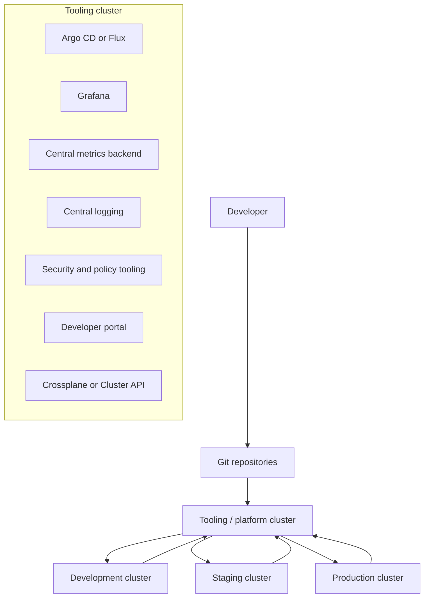
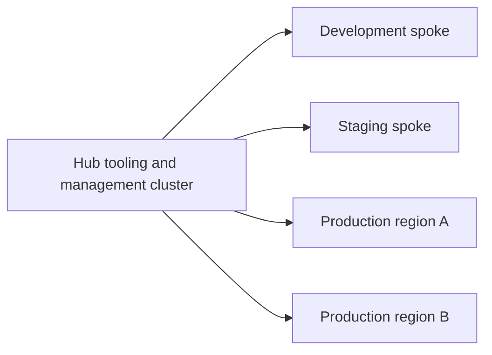
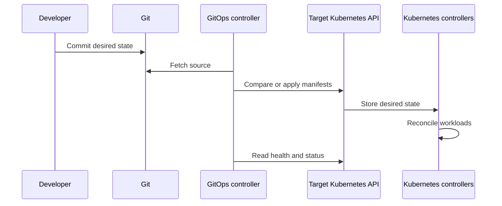
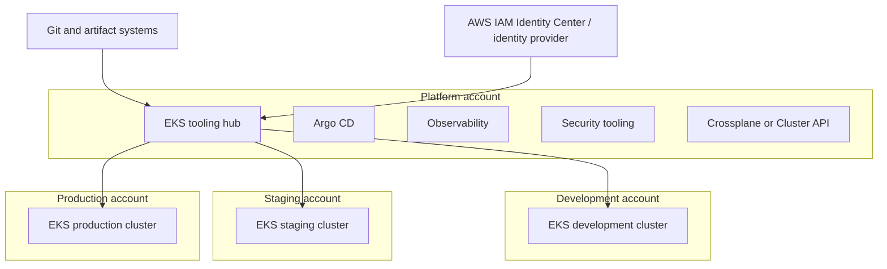
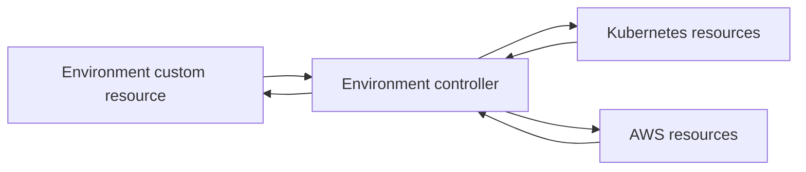

# Tooling Clusters and `kind` Custom Kubernetes Clusters

> A detailed study guide for Kubernetes platform engineering, local development, GitOps, multi-cluster operations, and Amazon EKS.
>
> **Last reviewed:** 18 July 2026  
> **Scope:** Kubernetes tooling clusters, management clusters, workload clusters, `kind`, custom `kind` configuration, custom node images, and Kubernetes custom resource `kind`s.

---

## Table of contents

1. [Executive summary](#1-executive-summary)
2. [The terminology problem](#2-the-terminology-problem)
3. [What is a tooling cluster?](#3-what-is-a-tooling-cluster)
4. [Why organizations create tooling clusters](#4-why-organizations-create-tooling-clusters)
5. [What normally runs in a tooling cluster](#5-what-normally-runs-in-a-tooling-cluster)
6. [Tooling cluster architecture patterns](#6-tooling-cluster-architecture-patterns)
7. [Tooling cluster vs management, workload, and bootstrap clusters](#7-tooling-cluster-vs-management-workload-and-bootstrap-clusters)
8. [How a tooling cluster interacts with workload clusters](#8-how-a-tooling-cluster-interacts-with-workload-clusters)
9. [Failure behavior and blast radius](#9-failure-behavior-and-blast-radius)
10. [Security design for a tooling cluster](#10-security-design-for-a-tooling-cluster)
11. [High availability and disaster recovery](#11-high-availability-and-disaster-recovery)
12. [Amazon EKS reference architecture](#12-amazon-eks-reference-architecture)
13. [When a dedicated tooling cluster is appropriate](#13-when-a-dedicated-tooling-cluster-is-appropriate)
14. [What is `kind`?](#14-what-is-kind)
15. [How `kind` works internally](#15-how-kind-works-internally)
16. [What does `kind-custom` mean?](#16-what-does-kind-custom-mean)
17. [Anatomy of a custom `kind` configuration](#17-anatomy-of-a-custom-kind-configuration)
18. [Custom `kind` node images](#18-custom-kind-node-images)
19. [Application images, side-loading, and local registries](#19-application-images-side-loading-and-local-registries)
20. [The other meaning of `kind`: Kubernetes resource types](#20-the-other-meaning-of-kind-kubernetes-resource-types)
21. [Custom resources, CRDs, and operators](#21-custom-resources-crds-and-operators)
22. [Practical lab: create a local tooling cluster](#22-practical-lab-create-a-local-tooling-cluster)
23. [Optional lab: create and inspect a custom resource](#23-optional-lab-create-and-inspect-a-custom-resource)
24. [Common problems and troubleshooting](#24-common-problems-and-troubleshooting)
25. [Production readiness checklist](#25-production-readiness-checklist)
26. [Local `kind` checklist](#26-local-kind-checklist)
27. [Command cheat sheet](#27-command-cheat-sheet)
28. [Recommended learning path](#28-recommended-learning-path)
29. [Glossary](#29-glossary)
30. [Official references](#30-official-references)

---

# 1. Executive summary

A **tooling cluster** is a Kubernetes cluster whose main purpose is to run the software used to operate other platforms and clusters.

Typical tooling includes:

- GitOps controllers such as Argo CD or Flux.
- Monitoring and visualization platforms such as Prometheus and Grafana.
- Central logging services.
- Security scanners and policy systems.
- Secret-management integrations.
- CI/CD runners.
- Developer portals.
- Infrastructure and cluster lifecycle controllers such as Crossplane or Cluster API.

A tooling cluster is an **architectural role**, not a built-in Kubernetes object and not a specific product. You do not install something called a `ToolingCluster` from standard Kubernetes. An organization decides that a particular Kubernetes cluster will be used for tooling and then installs the selected platform components there.

`kind`, on the other hand, is a real Kubernetes SIG project. Its name means **Kubernetes IN Docker**. It creates local Kubernetes clusters whose nodes are containers. It is mainly used for Kubernetes testing, local development, CI, learning, and integration tests.

There is no generally recognized official Kubernetes product named **`kind-custom`**. In practice, the term usually means one of these things:

1. A custom configuration file for `kind`, often named `kind-custom.yaml`.
2. A custom `kind` node image.
3. An internal company script or wrapper around `kind`.
4. A **custom Kubernetes resource kind** created with a CustomResourceDefinition.

The context tells you which meaning applies.

The simplest mental model is:

```text
Tooling cluster = what a Kubernetes cluster is used for.

kind             = a tool that creates local Kubernetes clusters.

kind-custom.yaml = a user-defined configuration file for a kind cluster.

kind: Deployment = the resource type declared in Kubernetes YAML.

Custom kind      = a new Kubernetes API resource type introduced with a CRD.
```

---

# 2. The terminology problem

Kubernetes discussions use the word **cluster** for many different responsibilities, and use the word **kind** in several unrelated ways. This creates confusion even for experienced engineers.

## 2.1 Cluster terminology

| Term | Meaning |
|---|---|
| Tooling cluster | Runs operational, platform, security, observability, or delivery tools |
| Platform cluster | Often a broader synonym for a tooling cluster, although it can also host shared runtime services |
| Management cluster | Manages the lifecycle or desired state of other clusters |
| Workload cluster | Runs application workloads |
| Bootstrap cluster | A temporary cluster used to create another cluster |
| Hub cluster | Central cluster in a hub-and-spoke design |
| Spoke cluster | A target cluster managed or observed from a hub |
| Shared-services cluster | Runs services shared by applications, such as gateways, registries, messaging, or data platforms |
| Control plane | Kubernetes API server, scheduler, controller manager, and backing state; not the same as a tooling cluster |

These labels describe **responsibilities**, not necessarily different Kubernetes distributions.

One cluster can have more than one role. For example, a cluster running Argo CD, Crossplane, Cluster API, Grafana, and Vault could be both a tooling cluster and a management cluster.

## 2.2 The four common meanings of `kind`

| Expression | Meaning |
|---|---|
| `kind` | The Kubernetes IN Docker local cluster tool |
| `kind: Deployment` | A Kubernetes object's API type |
| Custom `kind` configuration | A configuration that changes how a local `kind` cluster is created |
| Custom resource kind | A user-defined Kubernetes API type created by a CRD |

Always ask: is the speaker referring to a **CLI tool**, a **YAML field**, a **configuration file**, or an **API extension**?

---

# 3. What is a tooling cluster?

A tooling cluster is a Kubernetes cluster dedicated primarily to the systems that help teams:

- Build software.
- Test software.
- Deploy software.
- Observe systems.
- Enforce security and compliance.
- Manage infrastructure.
- Manage other Kubernetes clusters.
- Provide self-service capabilities to developers.

A simple architecture looks like this:



The arrows do not all represent the same protocol:

- GitOps controllers read desired state from Git.
- Argo CD may connect to target Kubernetes API servers.
- Monitoring agents may send metrics to a central backend.
- Log agents may send logs to a central log store.
- Security tools may receive findings or query target APIs.
- Cluster API or Crossplane controllers call cloud APIs.
- Developers access dashboards and self-service interfaces.

## 3.1 It is not a standard Kubernetes resource

Standard Kubernetes includes resources such as:

```yaml
kind: Pod
kind: Deployment
kind: Service
kind: ConfigMap
kind: Secret
kind: StatefulSet
```

It does not include:

```yaml
kind: ToolingCluster
```

A project could define its own CRD named `ToolingCluster`, but that would be specific to that project. The generic industry phrase “tooling cluster” remains an architecture concept.

## 3.2 A role, not a technology

A tooling cluster can be created with:

- Amazon EKS.
- Google Kubernetes Engine.
- Azure Kubernetes Service.
- OpenShift.
- Rancher-managed Kubernetes.
- Self-managed Kubernetes.
- `kind` for local testing.
- Other conformant Kubernetes implementations.

The creation technology does not define the role. The installed services and operational responsibility define it.

---

# 4. Why organizations create tooling clusters

## 4.1 Separation of concerns

Application clusters focus on serving business traffic. The tooling cluster focuses on operating the platform.

This gives teams a clearer boundary:

```text
Workload cluster responsibility:
- Run customer-facing or internal applications
- Scale application pods
- Expose application services
- Maintain application availability

Tooling cluster responsibility:
- Deploy those applications
- Observe those applications
- Secure and govern those applications
- Manage platform workflows
```

## 4.2 Independent lifecycle

Kubernetes clusters must be upgraded, replaced, repaired, and sometimes rebuilt.

When Argo CD, the deployment catalog, and centralized dashboards live outside the target cluster, the platform team can replace that target cluster without also destroying the primary tools needed to perform the migration.

Example:

```text
Old production cluster
        |
        | applications are redeployed from Git
        v
New production cluster
```

A centralized GitOps service can register the new target and reconcile applications into it.

## 4.3 Reduced resource contention

Large operational tools consume CPU, memory, storage, and network bandwidth.

Examples include:

- Prometheus queries.
- Log indexing.
- Vulnerability scans.
- Image analysis.
- CI builds.
- Helm rendering for thousands of applications.
- Infrastructure reconciliation.

Separating those workloads helps prevent a monitoring query or CI build from competing directly with customer-facing application pods.

## 4.4 Centralized governance

A tooling cluster can offer one place for:

- Single sign-on.
- RBAC administration.
- Audit logs.
- Policy configuration.
- Deployment history.
- Service ownership metadata.
- Security findings.
- Platform APIs.

Centralization does not automatically make a system secure, but it can make controls easier to standardize.

## 4.5 Smaller access surface for workload clusters

Developers may need access to:

- Argo CD application status.
- Grafana dashboards.
- Logs.
- Deployment workflows.
- A service catalog.

They do not necessarily need direct cluster-admin access to production.

A tooling cluster can expose controlled interfaces while production API access remains restricted.

## 4.6 Consistent multi-cluster operations

Without a common platform, each cluster may develop its own:

- Deployment process.
- Monitoring rules.
- Logging format.
- Secret workflow.
- Policy model.
- Upgrade mechanism.

A tooling cluster can help deliver consistent platform capabilities across environments.

---

# 5. What normally runs in a tooling cluster

The exact inventory depends on the organization. The following categories are common.

## 5.1 GitOps and continuous delivery

Examples:

- Argo CD.
- Flux.
- Helm controllers.
- Image automation controllers.
- Promotion or environment orchestration services.

Purpose:

- Read desired state from Git or an OCI source.
- Compare desired state with live state.
- Apply Kubernetes resources.
- Detect drift.
- Report health and synchronization status.
- Automate environment promotion.

Argo CD supports managing multiple target clusters from one instance. Flux can also participate in multi-cluster and fleet-management patterns, including integrations with Cluster API.

## 5.2 Observability

Examples:

- Grafana.
- Prometheus.
- Thanos.
- Mimir.
- Loki.
- OpenSearch.
- Tempo.
- Jaeger.
- Alertmanager.
- OpenTelemetry collectors and gateways.

A common model separates local data collection from centralized storage:

```text
Workload cluster:
- node metrics collectors
- application metrics collectors
- log agents
- trace collectors

Tooling cluster or managed service:
- long-term metrics storage
- dashboards
- alert processing
- log indexing
- trace storage
```

This avoids requiring every cluster to host a complete long-term observability platform.

## 5.3 Security and compliance

Examples:

- Image and configuration scanners.
- Policy engines.
- Admission control tooling.
- Runtime security systems.
- Compliance reporting dashboards.
- Software bill of materials systems.
- Certificate management control services.

Some security controls must still run in every workload cluster. For example, an admission controller that blocks non-compliant resources must be reachable during admission in that cluster.

The tooling cluster may centralize the policy source, dashboards, or findings, while cluster-local components perform enforcement.

## 5.4 Secret and identity tooling

Examples:

- HashiCorp Vault.
- External Secrets-related central services.
- Certificate authorities.
- Identity proxies.
- Single sign-on integrations.

Important distinction:

- A central secrets backend may live outside the workload cluster.
- A cluster-local controller may read approved secret material and create or mount the required values.
- Kubernetes RBAC must restrict access to generated Secrets.
- Cloud workload identity should use short-lived credentials where possible.

## 5.5 CI/CD runners and build systems

Examples:

- GitHub Actions self-hosted runners.
- GitLab runners.
- Jenkins agents.
- Tekton.
- Argo Workflows.
- BuildKit or Kaniko-based builders.

Build workloads can be bursty and risky. Many organizations isolate them further into a separate build cluster or dedicated node pool rather than placing them next to the most privileged management controllers.

## 5.6 Developer experience

Examples:

- Backstage.
- Internal developer portals.
- Service catalogs.
- Scorecards.
- Template engines.
- Environment request systems.
- Documentation portals.

These systems combine data from Git, CI/CD, Kubernetes, cloud APIs, monitoring, and ownership directories.

## 5.7 Infrastructure and cluster lifecycle management

Examples:

- Crossplane.
- Cluster API.
- Cloud provider controllers.
- Infrastructure orchestration controllers.
- Fleet-management systems.

Crossplane providers add Kubernetes APIs that map to external APIs and reconcile external resources. Cluster API provides declarative APIs for creating, upgrading, and operating Kubernetes clusters.

When these controllers run in a tooling cluster, the cluster also becomes a management control plane.

---

# 6. Tooling cluster architecture patterns

There is no single correct architecture. The correct pattern depends on scale, security, availability, team structure, and cost.

## 6.1 Pattern A: tools and applications in one cluster

```text
One Kubernetes cluster
├── application namespaces
├── argocd namespace
├── monitoring namespace
├── security namespace
└── platform namespace
```

### Advantages

- Lowest cost.
- Simple networking.
- Simple cluster access.
- Appropriate for learning, prototypes, and small environments.
- Fewer clusters to upgrade.

### Disadvantages

- Tool and application failures share a blast radius.
- Resource contention is more likely.
- Rebuilding the cluster also removes the management tools.
- Privileged tooling lives next to application workloads.
- Harder to separate platform administrator and application administrator duties.

### Suitable for

- Local development.
- Small teams.
- Non-critical environments.
- Early platform prototypes.

## 6.2 Pattern B: dedicated tooling cluster plus workload clusters

```text
Tooling cluster
├── GitOps
├── dashboards
├── central security
└── platform APIs

Development cluster
Staging cluster
Production cluster
```

### Advantages

- Stronger lifecycle separation.
- Easier centralized operations.
- Reduced production resource contention.
- Better place for privileged controllers.
- Workload clusters can be replaced independently.

### Disadvantages

- More infrastructure cost.
- Additional networking and identity complexity.
- The tooling cluster becomes a critical dependency.
- Requires explicit disaster recovery.
- Requires secure multi-cluster access.

### Suitable for

- Multiple environments.
- Multiple teams.
- Regulated platforms.
- Organizations with dedicated platform engineering.

## 6.3 Pattern C: hub-and-spoke management



The hub may contain:

- Argo CD.
- Cluster API.
- Crossplane.
- Global policy definitions.
- Fleet inventory.
- Central observability interfaces.

The spokes run business workloads and required local agents.

This is a common multi-cluster model, but the hub must not be treated as a normal low-criticality development cluster. Its credentials and controllers may affect every spoke.

## 6.4 Pattern D: decentralized GitOps with centralized visibility

```text
Each workload cluster:
- Flux or Argo CD instance
- local reconciliation
- local credentials only

Central platform:
- dashboards
- policy source
- fleet inventory
- aggregated metrics and logs
```

### Advantages

- Failure of a central deployment controller does not stop reconciliation in every cluster.
- Each controller has a smaller permission boundary.
- Private clusters need outbound access to Git but may not need inbound API connectivity from a hub.
- Better fault-domain isolation.

### Disadvantages

- More controller installations to operate.
- Version and configuration consistency must be automated.
- Global visibility requires aggregation.
- More objects and credentials exist across the fleet.

This pattern is common with Flux because Flux controllers are often bootstrapped into each target cluster. It is also possible to run Argo CD per cluster.

## 6.5 Pattern E: shared control, local agents

This is common for observability and security:

```text
Central:
- Grafana
- long-term metrics store
- log store
- security findings database

Per workload cluster:
- metrics agent
- log collector
- tracing collector
- runtime security agent
```

The central system provides storage and analysis. Local components collect data and enforce local controls.

## 6.6 Pattern F: multiple specialized platform clusters

Large organizations may separate:

```text
GitOps management cluster
Observability cluster
Security cluster
Build cluster
Shared services cluster
Production workload clusters
```

This reduces the blast radius of any one tooling category but adds substantial operational overhead.

---

# 7. Tooling cluster vs management, workload, and bootstrap clusters

## 7.1 Tooling cluster

Defined by the tools it hosts.

Examples:

- Grafana.
- Argo CD.
- CI runners.
- Backstage.
- Security dashboards.

It does not need to manage cluster lifecycle.

## 7.2 Management cluster

Cluster API defines a management cluster as a Kubernetes cluster that manages the lifecycle of workload clusters and hosts providers and resources such as `Cluster` and `Machine`.

A management cluster may run:

- Cluster API core controllers.
- Infrastructure providers.
- Bootstrap providers.
- Control plane providers.
- Cluster definitions and machine definitions.

A tooling cluster becomes a management cluster when it actively manages other clusters or external infrastructure.

## 7.3 Workload cluster

A workload cluster runs the applications or services that deliver business value.

Examples:

- Web APIs.
- Data processors.
- Internal applications.
- Customer-facing services.
- Machine-learning inference.
- Batch jobs.

A workload cluster still needs some operational components such as:

- CNI.
- DNS.
- CSI drivers.
- metrics collection.
- log agents.
- ingress or Gateway controllers.
- security enforcement.

“Workload cluster” does not mean “only application containers and nothing else.”

## 7.4 Bootstrap cluster

A bootstrap cluster is temporary. It exists to create a durable management or workload cluster.

A typical Cluster API flow may be:

```text
1. Create temporary local kind cluster.
2. Install Cluster API providers in it.
3. Create a cloud-hosted management cluster.
4. Move management objects to the new cluster.
5. Delete the temporary kind cluster.
```

This illustrates why `kind` is frequently seen in management-cluster documentation.

## 7.5 Comparison table

| Question | Tooling cluster | Management cluster | Workload cluster | Bootstrap cluster |
|---|---|---|---|---|
| Primary purpose | Run platform tools | Manage cluster lifecycle | Run applications | Create another cluster |
| Usually long-lived | Yes | Yes | Yes | Usually no |
| Can run Argo CD | Yes | Yes | Yes | Technically, but uncommon |
| Can run Cluster API | Possibly | Yes | Possibly self-managed | Often temporarily |
| Runs customer workloads | Preferably limited | Preferably limited | Yes | No |
| Built-in Kubernetes term | No | Defined by management systems such as Cluster API | Common architecture term | Defined in cluster lifecycle workflows |

---

# 8. How a tooling cluster interacts with workload clusters

## 8.1 Kubernetes API access

A centralized controller may connect to the target cluster's Kubernetes API.

It needs:

- Network reachability.
- Server identity validation.
- Authentication.
- Kubernetes authorization.
- Credential rotation.
- Audit logging.

The controller should receive only the permissions it requires.

Example permission boundary:

```text
Argo CD project A
- may deploy only to namespace team-a
- may use only approved Git repositories
- may create only approved resource types

Argo CD platform project
- may deploy cluster add-ons
- has broader but separately controlled access
```

Avoid giving every application team unrestricted cluster-admin access through the delivery system.

## 8.2 Git as the desired-state interface

A common workflow is:



GitOps separates:

- Human change approval.
- Desired-state storage.
- Automated reconciliation.
- Runtime health.

Git is not the runtime database. The Kubernetes API and etcd hold current cluster state.

## 8.3 Metrics flow

A workload cluster can scrape local targets and send selected data to central storage.

```text
Application -> local collector -> remote write -> central metrics backend
```

Prometheus remote write is designed to send samples to compatible receivers. Prometheus federation is another mechanism for selected metric aggregation.

## 8.4 Log flow

```text
Container stdout/stderr
        |
        v
Node or cluster log agent
        |
        v
Central log gateway or store
        |
        v
Dashboard and alerting
```

Log pipelines must handle:

- Backpressure.
- Network failures.
- Retention.
- tenant labels.
- sensitive data.
- indexing cost.

## 8.5 Secret flow

```text
Approved external secret store
        |
        v
Workload identity-authenticated controller
        |
        v
Kubernetes Secret or direct volume integration
        |
        v
Application pod
```

The central tooling cluster should not become an unrestricted warehouse of long-lived credentials for all environments.

## 8.6 Cloud API access

Crossplane, Cluster API providers, DNS controllers, and other systems may call cloud APIs.

Use:

- Short-lived credentials.
- Workload identity.
- Separate cloud roles by controller and environment.
- Explicit resource scopes.
- Cloud audit logs.
- Permission boundaries where appropriate.

---

# 9. Failure behavior and blast radius

A central tooling cluster is important, but failure does not affect every function in the same way.

## 9.1 What usually continues if the tooling cluster fails?

Existing application pods in workload clusters normally continue running because the Kubernetes control plane in each workload cluster continues reconciling its own local state.

Examples that usually continue:

- Existing Deployments.
- Existing Services.
- Existing Ingress or Gateway routes.
- Existing autoscaling, if its controllers and metrics dependencies are local and healthy.
- Existing application traffic.

## 9.2 What may stop or degrade?

- New GitOps deployments.
- Drift correction.
- Central dashboards.
- Central alert processing.
- CI/CD workflows.
- Cluster creation.
- Infrastructure reconciliation.
- Central secret workflows.
- Security finding ingestion.
- Developer self-service.

## 9.3 Dangerous centralization

A system is more fragile when the tooling cluster is required for every runtime request.

Avoid designs where normal application traffic must pass through a non-runtime tooling service unless that service is intentionally engineered as a runtime dependency.

For example, Grafana can be unavailable without stopping an API from serving requests. That is desirable separation.

## 9.4 Credential blast radius

A compromised central controller may be more dangerous than a simple outage.

Potential impact:

- Unauthorized deployments across clusters.
- Secret access.
- Cluster-wide policy changes.
- Infrastructure creation or deletion.
- Supply-chain compromise.

Therefore, credential design is at least as important as cluster availability.

---

# 10. Security design for a tooling cluster

## 10.1 Treat it as a privileged environment

A tooling cluster often has more organizational power than a normal application cluster.

It may control:

- Deployment.
- Infrastructure.
- identity.
- policy.
- secrets.
- observability.
- cluster creation.

Apply production-level security even when it does not serve customer traffic directly.

## 10.2 Use least privilege

Separate identities for:

- GitOps application deployment.
- Cluster add-on deployment.
- Infrastructure management.
- Observability.
- Security scanning.
- CI builds.
- Human administration.

Do not reuse a single cluster-admin credential across all tools.

## 10.3 Separate tenants

Use a combination of:

- Namespaces.
- Kubernetes RBAC.
- GitOps project boundaries.
- Repository allowlists.
- Destination cluster and namespace allowlists.
- NetworkPolicy.
- ResourceQuota.
- LimitRange.
- Admission policies.
- Dedicated node pools where needed.

Namespace isolation alone is not a complete security boundary.

## 10.4 Protect secrets

Kubernetes guidance recommends careful RBAC around Secrets and encryption at rest.

Practical controls:

- Encrypt Kubernetes API data at rest.
- Restrict `get`, `list`, and `watch` on Secrets.
- Remember that permission to create a Pod may indirectly permit secret consumption.
- Prefer workload identity over static cloud keys.
- Rotate credentials.
- Avoid placing secrets directly in Git.
- Avoid logging secrets in CI output.
- Use separate secret backends or paths by environment.

## 10.5 Network controls

Consider:

- Private Kubernetes API endpoints.
- Restricted security groups or firewalls.
- NetworkPolicy for pod-to-pod traffic.
- Private connectivity between hub and spokes.
- Outbound egress control.
- DNS controls.
- Proxy or gateway access to external repositories.
- Separate ingress for human interfaces and internal APIs.

A NetworkPolicy is effective only when the selected CNI implementation enforces it.

## 10.6 Git and software supply chain controls

Protect the desired-state source:

- Require pull request review.
- Use branch protection.
- Require signed commits or attestations where appropriate.
- Restrict who can change deployment repositories.
- Pin third-party versions.
- Verify images and charts.
- Scan dependencies and images.
- Avoid unreviewed mutable tags.
- Record provenance.
- Protect CI credentials.

A perfectly secured cluster can still be compromised by an authorized but malicious Git change.

## 10.7 Separate build and deployment privileges

A build system creates artifacts. A deployment system installs artifacts.

Ideally:

```text
Build identity:
- may push images to approved registry paths
- cannot deploy to production

Deployment identity:
- may deploy approved references
- cannot modify source code
- cannot overwrite image artifacts
```

This reduces the damage from a compromised runner.

## 10.8 Auditability

Collect:

- Kubernetes audit logs.
- Cloud API audit logs.
- Git change history.
- GitOps reconciliation events.
- CI workflow history.
- identity provider sign-ins.
- administrator actions.
- policy decisions.

Time synchronization and consistent identity attribution are essential for incident investigation.

---

# 11. High availability and disaster recovery

## 11.1 Replicas are not the whole solution

A highly available tooling service needs:

- Multiple replicas where supported.
- Pod anti-affinity or topology spread.
- PodDisruptionBudgets.
- Resource requests and limits.
- Adequate node capacity.
- Multiple failure domains.
- Durable state.
- Tested backup and restore.
- Dependency availability.
- DNS and certificate continuity.

Kubernetes topology spread constraints can distribute replicas across nodes or zones. PodDisruptionBudgets limit simultaneous voluntary disruption for replicated applications.

## 11.2 Dedicated node pools

Critical tooling may run on dedicated nodes:

```text
Node pool: platform-critical
- taint: platform-critical=true:NoSchedule
- only critical controllers tolerate it

Node pool: build
- bursty CI jobs
- limited cloud permissions

Node pool: general-tools
- dashboards and portals
```

This prevents a large build workload from evicting or starving GitOps and identity controllers.

## 11.3 Backup design

Back up the data that cannot simply be reconstructed from Git.

Possible categories:

- Kubernetes objects.
- GitOps configuration not already in Git.
- identity configuration.
- dashboard configuration.
- alert rules.
- persistent volumes.
- database state.
- encryption keys.
- certificates.
- external system configuration.

Argo CD provides an administrative export/import process for disaster recovery. Git should remain the source of truth for application definitions, but not every runtime or platform state item is automatically represented in Git.

## 11.4 Restore sequence

A general recovery order is:

```text
1. Restore cluster networking and identity.
2. Restore persistent storage and required databases.
3. Restore GitOps and platform controller configuration.
4. Restore target cluster credentials or trust.
5. Validate repository access.
6. Resume reconciliation in a controlled order.
7. Validate alerts, dashboards, and audit flows.
```

Prevent an uncontrolled “reconcile storm” by planning controller startup and rate limits.

## 11.5 Avoid self-destruction loops

Be careful when a tooling cluster manages its own infrastructure.

Example risk:

```text
Crossplane running in cluster A
    manages cluster A infrastructure
```

A bad desired-state change could remove the environment hosting the controller responsible for recovery.

Mitigations include:

- Deletion protection.
- Management policies.
- approval gates.
- separate management cluster.
- cloud-side recovery access.
- tested bootstrap automation.

---

# 12. Amazon EKS reference architecture

A common AWS organization separates platform and workload accounts.



## 12.1 Possible account model

```text
AWS Organizations
├── Security OU
│   ├── Log archive account
│   └── Security tooling account
├── Infrastructure OU
│   └── Platform account
│       └── EKS tooling cluster
└── Workloads OU
    ├── Development account
    ├── Staging account
    └── Production account
```

The exact model depends on the organization. Do not combine accounts only to copy a diagram.

## 12.2 Identity

Use AWS and Kubernetes identity together:

- Human users authenticate through the approved identity provider.
- EKS access entries or other supported EKS access mechanisms grant cluster access.
- Kubernetes RBAC controls actions inside the cluster.
- Pods use EKS Pod Identity or IRSA-style workload identity patterns as appropriate.
- Cross-account roles restrict access by environment.
- CI and GitOps identities remain separate.

## 12.3 Network design

Options depend on whether target API endpoints are public or private.

Consider:

- Private EKS API endpoints.
- VPC connectivity.
- Transit Gateway.
- VPC peering where appropriate.
- PrivateLink-capable dependencies.
- controlled egress to Git and registries.
- DNS resolution across networks.
- security groups.
- firewall inspection.
- proxy design.

A hub must be able to reach target APIs when using a centralized pull-and-apply controller model.

AWS also documents current EKS managed capability patterns for Argo CD, including hub-and-spoke architectures. In those designs, a central EKS hub can manage spoke clusters, subject to supported connectivity and access configuration. Evaluate managed EKS capabilities against self-managed controllers based on required features, customization, support, resource consumption, and cost.

## 12.4 Example service placement

### Tooling EKS cluster

- Argo CD or Flux management components.
- Grafana.
- centralized alerting.
- developer portal.
- security dashboards.
- Crossplane or Cluster API.
- platform APIs.
- approved CI runners, possibly on separate nodes.

### Workload EKS clusters

- business applications.
- cluster-local DNS and networking.
- CSI drivers.
- ingress or Gateway components.
- metrics and log collectors.
- security enforcement agents.
- secret synchronization controllers.
- cluster-local autoscaling components.

## 12.5 GitOps delivery flow

```text
1. Developer pushes application code.
2. CI tests the code.
3. CI builds an OCI image.
4. CI pushes the image to Amazon ECR.
5. An approved process updates the deployment repository.
6. GitOps detects the desired-state change.
7. GitOps applies it to the selected EKS target.
8. EKS nodes retrieve the image from ECR.
9. Kubernetes rolls out the Deployment.
10. Metrics, logs, traces, and events are collected.
```

## 12.6 Reliability considerations

Use the EKS best-practices guidance for:

- Security.
- Reliability.
- networking.
- scalability.
- autoscaling.
- upgrades.
- cost optimization.

For critical tooling:

- Spread nodes and pods across Availability Zones.
- Define requests and limits.
- Use PodDisruptionBudgets.
- Back up persistent state.
- Test cluster replacement.
- Keep bootstrap infrastructure as code.
- Monitor control plane and controller health.
- Maintain emergency cloud-side access.

## 12.7 Cost considerations

A dedicated EKS tooling cluster adds:

- EKS cluster cost.
- Worker compute.
- EBS volumes.
- load balancers.
- NAT or egress processing.
- inter-AZ and inter-region transfer.
- logging and metrics storage.
- backup.
- operational labor.

Centralization can also reduce duplicated tooling. Evaluate total cost, not only cluster count.

---

# 13. When a dedicated tooling cluster is appropriate

## 13.1 Strong indicators

A dedicated tooling cluster becomes more attractive when:

- You operate several Kubernetes clusters.
- Production must be independently replaceable.
- Platform engineers manage shared services.
- Centralized GitOps is required.
- Security requires stronger separation.
- Observability has significant storage or query load.
- Cluster lifecycle controllers manage multiple environments.
- Different teams require controlled self-service.
- Audit and compliance requirements are substantial.

## 13.2 Weak indicators

It may be excessive when:

- There is one small non-production cluster.
- The team is learning Kubernetes.
- The platform is a short-lived prototype.
- Cost and operational capacity are extremely limited.
- The tooling is minimal.
- No one can reliably operate the additional cluster.

## 13.3 Evolution path

A reasonable progression is:

```text
Stage 1:
One cluster with applications and tools

Stage 2:
Dedicated namespaces and node pools

Stage 3:
Dedicated tooling cluster

Stage 4:
Separate build, observability, security, and management planes where justified
```

Do not start with the most complex architecture merely because it is possible.

---

# 14. What is `kind`?

`kind` means **Kubernetes IN Docker**.

The official project describes it as a tool for running local Kubernetes clusters using container “nodes.” It was primarily designed for testing Kubernetes itself, and it is widely used for local development and CI.

A `kind` cluster may look like:

```text
Laptop or CI runner
└── Docker / Podman / nerdctl
    ├── container: tooling-control-plane
    ├── container: tooling-worker
    └── container: tooling-worker2
```

Each node container contains the software needed to act as a Kubernetes node.

You interact with it through normal Kubernetes tools:

```bash
kubectl get nodes
kubectl get pods --all-namespaces
helm list --all-namespaces
```

## 14.1 Good use cases

- Learn Kubernetes.
- Test manifests.
- Test Helm charts.
- Test operators and controllers.
- Run integration tests.
- Reproduce bugs.
- Test several Kubernetes versions.
- Bootstrap Cluster API.
- Test GitOps behavior.
- Create disposable CI clusters.

## 14.2 Poor use cases

`kind` is not normally the right choice for:

- Production customer workloads.
- Durable multi-user shared clusters.
- Real cloud load-balancer behavior.
- Real cloud storage behavior.
- Real EKS IAM integration.
- Performance benchmarking intended to represent production.
- Long-lived critical databases.

It simulates Kubernetes behavior locally; it does not reproduce every managed-cloud integration.

---

# 15. How `kind` works internally

## 15.1 Node containers

In a normal cloud cluster, a node is usually a VM or physical machine.

In `kind`, a node is a container:

```text
Cloud Kubernetes:
VM -> kubelet -> pods

kind:
container -> kubelet -> pods
```

This means containers run inside a Kubernetes node that is itself a container.

## 15.2 Node image

`kind` uses a node image, commonly from the `kindest/node` image family.

The node image contains the environment needed for Kubernetes components. It is different from your application image.

```text
kind node image:
- Kubernetes node operating environment
- kubelet and required node components
- container runtime integration
- bootstrap support

application image:
- your API, worker, web server, or database software
- application dependencies
- application entrypoint
```

## 15.3 Bootstrap with kubeadm

`kind` uses Kubernetes bootstrap mechanisms, including kubeadm, to initialize the control plane and join worker nodes.

This is why custom `kind` configuration supports kubeadm configuration patches.

## 15.4 Kubeconfig

After cluster creation, `kind` writes or updates kubeconfig so `kubectl` can reach the local API server.

Useful commands:

```bash
kubectl config get-contexts
kubectl config current-context
kubectl cluster-info --context kind-tooling
```

Context names usually follow this form:

```text
kind-<cluster-name>
```

## 15.5 Networking

The node containers share a container network. Kubernetes networking is then configured inside the cluster.

Important implications:

- Host `localhost` is not the same as pod `localhost`.
- Pod `localhost` is not the same as node-container `localhost`.
- Port mappings may be needed to reach services from the host.
- Docker Desktop networking differs from native Linux Docker networking.
- A LoadBalancer Service does not automatically behave exactly like an AWS load balancer.

Use the official `kind` Ingress and LoadBalancer guidance for current supported methods.

## 15.6 Storage

Storage is local and disposable unless explicitly mounted or otherwise persisted.

Deleting the `kind` cluster removes its node containers and normal cluster-local data.

Do not assume a `kind` PersistentVolume behaves like EBS, EFS, or another cloud storage service.

---

# 16. What does `kind-custom` mean?

No official Kubernetes project with the general name **`kind-custom`** was identified in the official `kind` or Kubernetes documentation.

The most likely meanings follow.

## 16.1 Meaning 1: a filename such as `kind-custom.yaml`

Example:

```text
repository/
├── Makefile
├── scripts/
└── kind-custom.yaml
```

The file may contain:

```yaml
kind: Cluster
apiVersion: kind.x-k8s.io/v1alpha4
nodes:
  - role: control-plane
  - role: worker
```

Create the cluster with:

```bash
kind create cluster --name tooling --config kind-custom.yaml
```

The filename has no special power. These would be equivalent names:

```text
kind-custom.yaml
kind-config.yaml
local-cluster.yaml
tooling-cluster.yaml
integration-test-cluster.yaml
```

The `--config` argument gives the file meaning.

## 16.2 Meaning 2: a customized `kind` environment

A team may use the phrase “kind custom cluster” to describe a `kind` cluster with:

- Multiple workers.
- Custom port mappings.
- Custom node labels.
- Mounted files.
- A local image registry.
- A specific Kubernetes version.
- Audit logging.
- kubeadm patches.
- Custom networking.
- Preinstalled platform components.

## 16.3 Meaning 3: a custom node image

A project may build or select a custom node image and call the resulting environment “kind-custom.”

This is an advanced testing use case, especially for:

- Kubernetes development.
- Testing a particular patch.
- Testing a specific node configuration.
- Working offline.
- Reproducing low-level behavior.

## 16.4 Meaning 4: an internal wrapper

A repository may contain:

```text
make kind-custom
./scripts/kind-custom
kind-custom.sh
```

This could automate:

- Cluster creation.
- Registry creation.
- image loading.
- add-on installation.
- fixture deployment.
- tests.
- cleanup.

This name is internal to that repository. Inspect the Makefile or script to know what it does.

## 16.5 Meaning 5: a custom Kubernetes resource kind

Someone may say “custom kind” while discussing CRDs.

Example:

```yaml
apiVersion: platform.example.com/v1alpha1
kind: Environment
metadata:
  name: payments-dev
```

Here, `Environment` is a custom Kubernetes API type. This has nothing to do with the `kind` local-cluster tool.

---

# 17. Anatomy of a custom `kind` configuration

The official configuration begins with:

```yaml
kind: Cluster
apiVersion: kind.x-k8s.io/v1alpha4
```

This says:

- The configuration object is a `kind` cluster configuration.
- The configuration schema version is `kind.x-k8s.io/v1alpha4`.

It does **not** create a Kubernetes `Cluster` object in the target cluster. It is input to the `kind` CLI.

## 17.1 Detailed example

```yaml
# kind-custom.yaml
kind: Cluster
apiVersion: kind.x-k8s.io/v1alpha4

# Container nodes that will form the local Kubernetes cluster.
nodes:
  - role: control-plane

    # Make host ports available through the control-plane container.
    extraPortMappings:
      - containerPort: 80
        hostPort: 8080
        listenAddress: "127.0.0.1"
        protocol: TCP

      - containerPort: 443
        hostPort: 8443
        listenAddress: "127.0.0.1"
        protocol: TCP

    # Mount a host directory inside the node container.
    # Change ./data to an absolute path if your container runtime requires it.
    extraMounts:
      - hostPath: ./data
        containerPath: /data
        readOnly: false

    # kubeadm configuration can be patched for advanced testing.
    kubeadmConfigPatches:
      - |
        kind: InitConfiguration
        nodeRegistration:
          kubeletExtraArgs:
            node-labels: "platform-role=control-plane"

  - role: worker
    kubeadmConfigPatches:
      - |
        kind: JoinConfiguration
        nodeRegistration:
          kubeletExtraArgs:
            node-labels: "platform-role=tools,tooling-pool=general"

  - role: worker
    kubeadmConfigPatches:
      - |
        kind: JoinConfiguration
        nodeRegistration:
          kubeletExtraArgs:
            node-labels: "platform-role=tools,tooling-pool=general"

networking:
  # Keep this simple for the first lab.
  ipFamily: ipv4

  # Local development ranges. Do not overlap with networks that cause
  # routing problems on your host or corporate VPN.
  podSubnet: "10.244.0.0/16"
  serviceSubnet: "10.96.0.0/16"
```

## 17.2 Multi-node topology

```yaml
nodes:
  - role: control-plane
  - role: worker
  - role: worker
```

This creates one control-plane node and two workers.

It does not reproduce full cloud high availability because all node containers still run on one host. If the laptop or CI machine fails, every local node fails.

## 17.3 Extra port mappings

```yaml
extraPortMappings:
  - containerPort: 80
    hostPort: 8080
```

This maps:

```text
Host port 8080
    ->
Node-container port 80
```

A Kubernetes service or ingress path must still direct traffic to the correct pods. Port mapping alone does not deploy an ingress controller.

## 17.4 Extra mounts

```yaml
extraMounts:
  - hostPath: ./data
    containerPath: /data
```

This makes host data visible inside the node container.

Possible uses:

- Test files.
- local storage experiments.
- audit policy files.
- certificates.
- offline assets.

Be cautious with permissions and Docker Desktop file-sharing settings.

## 17.5 Node labels

Labels can help simulate node pools:

```yaml
node-labels: "workload-type=platform"
```

A pod can then select those nodes:

```yaml
spec:
  nodeSelector:
    workload-type: platform
```

## 17.6 Taints

For stronger scheduling simulation, a node may be tainted through kubeadm or after creation:

```bash
kubectl taint node tooling-worker platform=true:NoSchedule
```

A pod needs a toleration:

```yaml
tolerations:
  - key: platform
    operator: Equal
    value: "true"
    effect: NoSchedule
```

## 17.7 Networking configuration

Possible configuration areas include:

- IP family.
- API server address and port.
- Pod subnet.
- Service subnet.
- disabling the default CNI for custom CNI tests.
- kube-proxy mode.

Change these only when you understand host routing and the component you are testing.

## 17.8 Specific Kubernetes versions

A node image determines the Kubernetes version used by the node.

Use an image and digest published in the official `kind` release notes. Pinning a digest makes tests reproducible.

Conceptual example:

```yaml
nodes:
  - role: control-plane
    image: kindest/node:<supported-version>@sha256:<published-digest>
  - role: worker
    image: kindest/node:<same-supported-version>@sha256:<published-digest>
```

Do not invent a digest. Copy the tested image reference from the relevant official release.

---

# 18. Custom `kind` node images

## 18.1 Why select a node image?

- Test a Kubernetes version.
- Reproduce version-specific behavior.
- Run a compatibility test matrix.
- Test Kubernetes source changes.
- Work offline after preloading images.

## 18.2 Node image vs application image

This distinction is essential:

```text
kindest/node image:
Creates the Kubernetes node container.

my-company/payments-api image:
Runs as an application container inside a Pod.
```

Selecting a custom node image does not automatically make application images available to the cluster.

## 18.3 Building a node image

The official `kind` project documents building node images, especially for Kubernetes development.

This is advanced. For normal application testing, use official compatible node images rather than maintaining a custom node image.

## 18.4 Reproducibility

A reliable CI test should record:

- `kind` CLI version.
- node image tag and digest.
- kubectl version.
- Helm version.
- configuration file.
- installed add-on versions.
- test image digests.

Without this, “the same kind test” may not actually be the same environment.

---

# 19. Application images, side-loading, and local registries

## 19.1 Why a locally built image is not automatically visible

Suppose you run:

```bash
docker build -t demo-api:dev .
```

The image exists in the host container runtime. The `kind` node has its own container runtime image store.

Kubernetes may try to pull `demo-api:dev` from a remote registry and fail.

## 19.2 Side-load an image

Use:

```bash
kind load docker-image demo-api:dev --name tooling
```

Then ensure the workload does not force an unnecessary remote pull:

```yaml
containers:
  - name: demo-api
    image: demo-api:dev
    imagePullPolicy: IfNotPresent
```

For an untagged or `latest` image, Kubernetes pull behavior can be surprising. Use explicit development tags.

## 19.3 Verify the correct cluster name

If the cluster is named `tooling`, include:

```bash
--name tooling
```

Otherwise, the image may be loaded into a different default cluster or the command may fail.

## 19.4 Local registry

For repeated builds, a local registry can be more convenient:

```text
Host build
   |
   v
localhost registry
   |
   v
kind node container runtime
```

The official `kind` documentation provides a maintained local-registry script and explains the special handling required because `localhost` is scoped to each network namespace.

## 19.5 Private registries

Approaches include:

- Kubernetes `imagePullSecrets`.
- Pulling to the host and side-loading.
- Providing credentials to nodes.
- Mounting registry configuration.

For portable Kubernetes manifests, `imagePullSecrets` are often preferable where appropriate.

## 19.6 ECR differences

A local `kind` cluster does not automatically reproduce EKS-to-ECR identity behavior.

To test ECR-based workflows locally, you need explicit local authentication or an alternative image-loading strategy. Do not interpret a successful side-load test as proof that EKS node or pod permissions are correct.

---

# 20. The other meaning of `kind`: Kubernetes resource types

Every Kubernetes API object includes fields such as:

```yaml
apiVersion: apps/v1
kind: Deployment
metadata:
  name: demo
```

## 20.1 `apiVersion`

Identifies the API group and version.

Examples:

```text
v1
apps/v1
batch/v1
networking.k8s.io/v1
```

## 20.2 `kind`

Identifies the object type.

Examples:

```text
Pod
Deployment
StatefulSet
Service
Ingress
Job
Role
```

## 20.3 `metadata`

Identifies the object:

- Name.
- Namespace.
- labels.
- annotations.
- owner references.
- finalizers.

## 20.4 `spec`

Describes desired state.

## 20.5 `status`

Reports observed state, normally written by controllers.

This is the Kubernetes declarative model:

```text
User writes spec
Controller observes reality
Controller acts
Controller reports status
```

---

# 21. Custom resources, CRDs, and operators

## 21.1 CustomResourceDefinition

A CRD extends the Kubernetes API with a new resource type.

Example CRD:

```yaml
apiVersion: apiextensions.k8s.io/v1
kind: CustomResourceDefinition
metadata:
  name: environments.platform.example.com
spec:
  group: platform.example.com
  scope: Namespaced
  names:
    plural: environments
    singular: environment
    kind: Environment
    shortNames:
      - env
  versions:
    - name: v1alpha1
      served: true
      storage: true
      schema:
        openAPIV3Schema:
          type: object
          properties:
            spec:
              type: object
              required:
                - owner
                - stage
              properties:
                owner:
                  type: string
                stage:
                  type: string
                  enum:
                    - development
                    - staging
                    - production
```

After installing it, users can create:

```yaml
apiVersion: platform.example.com/v1alpha1
kind: Environment
metadata:
  name: payments-dev
spec:
  owner: payments-team
  stage: development
```

The new custom kind is:

```text
Environment
```

## 21.2 A CRD alone does not create business behavior

A CRD gives the Kubernetes API:

- A new endpoint.
- Schema validation.
- Storage for objects.
- discovery through kubectl.
- standard API operations.

It does not automatically create cloud resources or Deployments.

For behavior, you normally need a controller.

## 21.3 Controller reconciliation

A controller repeatedly compares desired state with observed state.



Possible controller behavior:

```text
Environment object says:
- stage: development
- owner: payments-team

Controller creates:
- Namespace
- ResourceQuota
- RoleBindings
- NetworkPolicies
- GitOps Application
- cloud resources
```

## 21.4 Operator pattern

An operator combines custom resources and controllers to encode operational knowledge.

Examples of operational knowledge:

- Provision.
- configure.
- upgrade.
- back up.
- fail over.
- repair.
- scale.
- delete safely.

## 21.5 CRD lifecycle risks

Be careful with:

- API version changes.
- conversion.
- schema compatibility.
- finalizers.
- deletion behavior.
- controller upgrades.
- stored versions.
- backup and restore.

A custom API becomes part of your platform contract.

## 21.6 Relationship to Crossplane and Cluster API

Crossplane and Cluster API use Kubernetes-style APIs and controllers.

Examples:

```text
Crossplane:
Kubernetes object -> provider controller -> AWS API

Cluster API:
Cluster/Machine objects -> providers -> infrastructure and Kubernetes clusters
```

These projects demonstrate how Kubernetes can act as a control plane for more than pods.

---

# 22. Practical lab: create a local tooling cluster

This lab creates a disposable local cluster and installs Argo CD as a representative platform tool.

## 22.1 Prerequisites

Install and verify:

- Docker, Podman, or nerdctl with a supported setup.
- `kind`.
- `kubectl`.
- Helm.

Check:

```bash
docker version
kind version
kubectl version --client
helm version
```

For Podman or nerdctl, use the corresponding runtime commands and review current `kind` runtime guidance.

## 22.2 Create a working directory

```bash
mkdir -p tooling-cluster-lab/data
cd tooling-cluster-lab
```

## 22.3 Create `kind-custom.yaml`

```yaml
kind: Cluster
apiVersion: kind.x-k8s.io/v1alpha4

nodes:
  - role: control-plane
    extraPortMappings:
      - containerPort: 80
        hostPort: 8080
        listenAddress: "127.0.0.1"
        protocol: TCP
      - containerPort: 443
        hostPort: 8443
        listenAddress: "127.0.0.1"
        protocol: TCP

  - role: worker
    kubeadmConfigPatches:
      - |
        kind: JoinConfiguration
        nodeRegistration:
          kubeletExtraArgs:
            node-labels: "platform-role=tools"

  - role: worker
    kubeadmConfigPatches:
      - |
        kind: JoinConfiguration
        nodeRegistration:
          kubeletExtraArgs:
            node-labels: "platform-role=tools"
```

## 22.4 Create the cluster

```bash
kind create cluster \
  --name tooling \
  --config kind-custom.yaml \
  --wait 5m
```

Expected context:

```text
kind-tooling
```

## 22.5 Inspect the cluster

```bash
kubectl config current-context
kubectl cluster-info
kubectl get nodes -o wide
kubectl get pods --all-namespaces
kubectl get nodes --show-labels
```

Expected conceptual result:

```text
tooling-control-plane   Ready   control-plane
tooling-worker          Ready
tooling-worker2         Ready
```

## 22.6 Install Argo CD with Helm

Add the chart repository:

```bash
helm repo add argo https://argoproj.github.io/argo-helm
helm repo update
```

Install:

```bash
helm upgrade --install argocd argo/argo-cd \
  --namespace argocd \
  --create-namespace
```

Wait:

```bash
kubectl wait \
  --namespace argocd \
  --for=condition=Available \
  deployment \
  --all \
  --timeout=10m
```

Inspect:

```bash
kubectl get all -n argocd
```

## 22.7 Access the UI locally

Use port forwarding:

```bash
kubectl port-forward \
  service/argocd-server \
  --namespace argocd \
  8081:443
```

Open:

```text
https://localhost:8081
```

Your browser may warn about the local certificate.

Retrieve the initial administrator password according to the current Argo CD installation documentation. A common installation stores it in an initial admin secret, but always verify the chart version and current documentation before relying on a command in automation.

## 22.8 Create a namespace for platform applications

```bash
kubectl create namespace platform-apps
```

## 22.9 Deploy a simple sample

```yaml
apiVersion: apps/v1
kind: Deployment
metadata:
  name: hello
  namespace: platform-apps
spec:
  replicas: 2
  selector:
    matchLabels:
      app: hello
  template:
    metadata:
      labels:
        app: hello
    spec:
      nodeSelector:
        platform-role: tools
      containers:
        - name: hello
          image: registry.k8s.io/e2e-test-images/agnhost:2.39
          args:
            - netexec
            - --http-port=8080
          ports:
            - containerPort: 8080
          resources:
            requests:
              cpu: 20m
              memory: 32Mi
            limits:
              cpu: 100m
              memory: 128Mi
---
apiVersion: v1
kind: Service
metadata:
  name: hello
  namespace: platform-apps
spec:
  selector:
    app: hello
  ports:
    - name: http
      port: 80
      targetPort: 8080
```

Save as `hello.yaml` and apply:

```bash
kubectl apply -f hello.yaml
kubectl rollout status deployment/hello -n platform-apps
kubectl get pods -n platform-apps -o wide
```

Access it:

```bash
kubectl port-forward \
  service/hello \
  --namespace platform-apps \
  8082:80
```

Then request:

```bash
curl http://localhost:8082/hostname
```

## 22.10 What this lab proves

It proves that you can:

- Create a custom multi-node local Kubernetes cluster.
- Use normal kubeconfig and kubectl workflows.
- Install a platform tool.
- Schedule platform workloads onto labeled nodes.
- Deploy and reach a sample service.

It does not prove:

- AWS IAM works.
- EKS networking works.
- EBS/EFS works.
- production high availability works.
- a real cloud load balancer works.
- cross-account access is secure.
- production backup is complete.

## 22.11 Clean up

```bash
kind delete cluster --name tooling
```

Because the cluster is disposable, ensure important lab files are stored on the host or in Git before deletion.

---

# 23. Optional lab: create and inspect a custom resource

This lab demonstrates the other meaning of custom `kind`.

## 23.1 Install the CRD

Save as `environment-crd.yaml`:

```yaml
apiVersion: apiextensions.k8s.io/v1
kind: CustomResourceDefinition
metadata:
  name: environments.platform.example.com
spec:
  group: platform.example.com
  scope: Namespaced
  names:
    plural: environments
    singular: environment
    kind: Environment
    shortNames:
      - env
  versions:
    - name: v1alpha1
      served: true
      storage: true
      schema:
        openAPIV3Schema:
          type: object
          properties:
            spec:
              type: object
              required:
                - owner
                - stage
              properties:
                owner:
                  type: string
                  minLength: 1
                stage:
                  type: string
                  enum:
                    - development
                    - staging
                    - production
      additionalPrinterColumns:
        - name: Owner
          type: string
          jsonPath: .spec.owner
        - name: Stage
          type: string
          jsonPath: .spec.stage
```

Apply:

```bash
kubectl apply -f environment-crd.yaml
```

Inspect discovery:

```bash
kubectl api-resources | grep -i environment
kubectl explain environment
kubectl explain environment.spec
```

## 23.2 Create a custom resource

Save as `payments-dev.yaml`:

```yaml
apiVersion: platform.example.com/v1alpha1
kind: Environment
metadata:
  name: payments-dev
  namespace: platform-apps
spec:
  owner: payments-team
  stage: development
```

Apply and inspect:

```bash
kubectl apply -f payments-dev.yaml
kubectl get environments -n platform-apps
kubectl get env -n platform-apps
kubectl describe environment payments-dev -n platform-apps
kubectl get environment payments-dev -n platform-apps -o yaml
```

## 23.3 Test schema validation

Change:

```yaml
stage: invalid-stage
```

Kubernetes should reject the object because the CRD schema allows only the declared enum values.

## 23.4 Understand the limitation

No controller was installed.

Therefore:

```text
Environment object exists in Kubernetes
BUT
No Namespace, AWS account, database, or application is created automatically
```

A controller is required to turn the custom resource into managed behavior.

---

# 24. Common problems and troubleshooting

## 24.1 Docker permission denied

Symptoms:

```text
permission denied while trying to connect to the Docker daemon
```

Check:

```bash
docker ps
docker info
```

Correct host runtime permissions before debugging Kubernetes.

Avoid randomly mixing `sudo docker` and non-root Docker use, because this can create ownership problems in Docker configuration files.

## 24.2 Cluster exists but kubectl points elsewhere

Check:

```bash
kubectl config get-contexts
kubectl config current-context
```

Select:

```bash
kubectl config use-context kind-tooling
```

Or pass:

```bash
kubectl --context kind-tooling get nodes
```

## 24.3 ImagePullBackOff for a local image

Check:

```bash
kubectl describe pod <pod-name>
kubectl get events --sort-by=.metadata.creationTimestamp
```

Likely causes:

- Image was built only on the host.
- Image was loaded into the wrong `kind` cluster.
- `imagePullPolicy: Always`.
- Wrong image name or tag.

Fix:

```bash
kind load docker-image demo-api:dev --name tooling
```

Use:

```yaml
imagePullPolicy: IfNotPresent
```

for a side-loaded development image.

## 24.4 Host port is unavailable

Symptoms:

```text
bind: address already in use
```

Check:

```bash
lsof -i :8080
```

or the operating-system equivalent.

Change `hostPort` or stop the conflicting process.

## 24.5 Port mapping exists but the application is unreachable

Remember the full path:

```text
Host port
-> node container port
-> ingress or service path
-> pod target port
```

A missing ingress controller, wrong Service selector, wrong target port, or unready pod can break the path.

Check:

```bash
kubectl get pods -A
kubectl get svc -A
kubectl get endpointslices -A
kubectl describe svc <service>
kubectl logs <pod>
```

## 24.6 Pods remain Pending

Inspect:

```bash
kubectl describe pod <pod>
kubectl get events --sort-by=.metadata.creationTimestamp
kubectl get nodes --show-labels
kubectl describe nodes
```

Common causes:

- Node selector does not match.
- Taint is not tolerated.
- Insufficient CPU or memory.
- PVC cannot bind.
- Topology rule cannot be satisfied.

## 24.7 Mount does not work

Check:

- Host path exists.
- Path is shared with Docker Desktop.
- Permissions allow access.
- SELinux settings where applicable.
- Configuration uses the expected absolute or relative path.
- The mount is on the node that runs the pod.

Remember that `extraMounts` mount into the node container. A pod still needs a Kubernetes volume configuration to mount the corresponding node path.

## 24.8 Corporate VPN conflicts

Symptoms may include:

- API timeouts.
- unreachable pod or service CIDRs.
- DNS problems.
- traffic routed into the VPN.

Choose non-overlapping local Pod and Service CIDRs, or adjust VPN and runtime networking with network-administrator approval.

## 24.9 CRD exists but nothing happens

Check:

```bash
kubectl get crd
kubectl get deployment -A
kubectl get pods -A
```

A CRD does not include a controller unless the installation package deploys one.

Find the controller and inspect:

```bash
kubectl logs deployment/<controller> -n <namespace>
```

## 24.10 Finalizer prevents deletion

Inspect:

```bash
kubectl get <resource> <name> -o yaml
```

A finalizer tells Kubernetes that a controller must complete cleanup before deletion finishes.

Do not remove finalizers blindly. First determine:

- Which controller owns it.
- Which external resource requires cleanup.
- Whether the controller is running.
- Whether forced removal would orphan infrastructure.

## 24.11 Tooling cluster outage

Check in this order:

```text
1. Kubernetes API availability
2. node readiness
3. DNS and CNI
4. storage
5. identity and certificates
6. critical controller pods
7. external dependencies
8. target-cluster connectivity
9. Git and registry connectivity
10. reconciliation queues and errors
```

---

# 25. Production readiness checklist

## Architecture

- [ ] The cluster's role is explicitly documented.
- [ ] Tooling, management, shared-service, and workload responsibilities are distinguished.
- [ ] Central and cluster-local components are identified.
- [ ] Runtime dependencies on the tooling cluster are understood.
- [ ] Failure behavior is documented.
- [ ] A build cluster or node isolation is considered for untrusted build workloads.

## Identity and access

- [ ] Human authentication uses the approved identity provider.
- [ ] Kubernetes RBAC follows least privilege.
- [ ] Cloud permissions are separate by controller and environment.
- [ ] Static credentials are minimized.
- [ ] Break-glass access is controlled and audited.
- [ ] GitOps repository and destination restrictions are configured.
- [ ] Access reviews are scheduled.

## Network

- [ ] Target API reachability is deliberate.
- [ ] Private endpoint requirements are documented.
- [ ] NetworkPolicy is supported and enforced by the CNI.
- [ ] Ingress is restricted.
- [ ] Egress destinations are controlled.
- [ ] DNS dependencies are monitored.
- [ ] Cross-account and cross-region paths are understood.

## Availability

- [ ] Critical controllers have appropriate replicas.
- [ ] Pods are spread across nodes or zones.
- [ ] PodDisruptionBudgets are configured where appropriate.
- [ ] Resource requests and limits are defined.
- [ ] Critical tools have reserved capacity.
- [ ] Storage failure modes are understood.
- [ ] Dependencies are highly available.

## Security

- [ ] Secrets are encrypted at rest.
- [ ] Secret RBAC is restricted.
- [ ] Git changes require review.
- [ ] Artifacts are scanned and pinned.
- [ ] Admission policy is defined.
- [ ] Audit logs are retained.
- [ ] Controller images and charts are version controlled.
- [ ] Software supply-chain controls are in place.

## Disaster recovery

- [ ] Cluster creation is infrastructure as code.
- [ ] GitOps bootstrap is automated.
- [ ] Non-Git state is backed up.
- [ ] Encryption keys and certificates are recoverable.
- [ ] Target-cluster credentials can be recreated.
- [ ] Restore order is documented.
- [ ] Recovery tests are performed.
- [ ] Reconciliation after restore is controlled.

## Operations

- [ ] Controller health is monitored.
- [ ] Reconciliation errors alert the correct team.
- [ ] Capacity trends are monitored.
- [ ] Version upgrade ownership is assigned.
- [ ] Add-on compatibility is tested.
- [ ] Platform SLOs are defined.
- [ ] Costs are allocated and reviewed.

---

# 26. Local `kind` checklist

- [ ] Container runtime is healthy.
- [ ] `kind`, `kubectl`, and Helm versions are recorded.
- [ ] Cluster name is explicit.
- [ ] Node image version and digest are pinned for CI.
- [ ] Pod and Service CIDRs do not conflict with the host or VPN.
- [ ] Required host ports are free.
- [ ] File mounts exist and are shared with the runtime.
- [ ] Local images are side-loaded or pushed to a configured registry.
- [ ] `imagePullPolicy` matches the test strategy.
- [ ] Test add-on versions are pinned.
- [ ] Tests select the correct kubeconfig context.
- [ ] Logs and cluster state are exported before failed CI clusters are deleted.
- [ ] Cleanup runs even after test failure.

---

# 27. Command cheat sheet

## Cluster lifecycle

```bash
kind create cluster
kind create cluster --name tooling
kind create cluster --name tooling --config kind-custom.yaml
kind get clusters
kind delete cluster --name tooling
```

## Contexts

```bash
kubectl config get-contexts
kubectl config current-context
kubectl config use-context kind-tooling
```

## Inspect

```bash
kubectl cluster-info
kubectl get nodes -o wide
kubectl get pods --all-namespaces
kubectl get events --all-namespaces \
  --sort-by=.metadata.creationTimestamp
```

## Images

```bash
docker build -t demo-api:dev .
kind load docker-image demo-api:dev --name tooling
```

## Workloads

```bash
kubectl apply -f manifest.yaml
kubectl rollout status deployment/<name> -n <namespace>
kubectl describe pod <pod> -n <namespace>
kubectl logs <pod> -n <namespace>
```

## Helm

```bash
helm repo add <name> <url>
helm repo update
helm upgrade --install <release> <chart> \
  --namespace <namespace> \
  --create-namespace
helm list --all-namespaces
```

## CRDs

```bash
kubectl get crd
kubectl api-resources
kubectl explain <kind>
kubectl get <custom-resource-plural> -A
```

## Debugging

```bash
kubectl describe node <node>
kubectl describe pod <pod> -n <namespace>
kubectl get endpointslices -A
kubectl auth can-i <verb> <resource> \
  --as system:serviceaccount:<namespace>:<service-account>
```

---

# 28. Recommended learning path

## Phase 1: Kubernetes fundamentals

Learn:

- Pod.
- Deployment.
- StatefulSet.
- DaemonSet.
- Job and CronJob.
- Service.
- Ingress and Gateway concepts.
- ConfigMap and Secret.
- Namespace.
- requests and limits.
- probes.
- labels and selectors.
- RBAC.
- PersistentVolume and PersistentVolumeClaim.

Practice with one local `kind` cluster.

## Phase 2: Scheduling and availability

Learn:

- node selectors.
- affinity and anti-affinity.
- taints and tolerations.
- topology spread.
- PodDisruptionBudgets.
- PriorityClass.
- autoscaling.
- disruptions and evictions.

Build a three-node local topology and inspect scheduling decisions.

## Phase 3: Platform tooling

Install and understand:

- Helm.
- Argo CD or Flux.
- Prometheus and Grafana.
- a logging stack.
- certificate management.
- policy tooling.
- secret integration.

Do not install everything at once. Understand the responsibility and failure mode of each tool.

## Phase 4: Kubernetes API extension

Learn:

- API groups and versions.
- CRDs.
- schema validation.
- status subresources.
- finalizers.
- owner references.
- controllers.
- reconciliation.
- operator pattern.

Create a simple CRD, then write or study a controller.

## Phase 5: Multi-cluster architecture

Learn:

- tooling vs management vs workload clusters.
- centralized and decentralized GitOps.
- hub-and-spoke.
- identity federation.
- private API connectivity.
- fleet observability.
- backup and disaster recovery.

## Phase 6: AWS EKS implementation

Learn:

- EKS control plane and data plane.
- managed node groups and Karpenter.
- VPC and CNI behavior.
- load balancers.
- EBS and EFS CSI.
- ECR image access.
- EKS access entries and Kubernetes RBAC.
- Pod Identity and workload permissions.
- CloudWatch and external observability.
- multi-account platform design.
- upgrades and cost optimization.

---

# 29. Glossary

**Add-on**  
Software installed in or around Kubernetes to provide networking, storage, observability, policy, delivery, or other capabilities.

**Bootstrap cluster**  
A temporary Kubernetes cluster used to create another cluster.

**Cluster API**  
A Kubernetes subproject that provides declarative APIs and controllers for provisioning, upgrading, and operating Kubernetes clusters.

**Controller**  
A control loop that observes desired and actual state and takes action to reduce the difference.

**CRD**  
CustomResourceDefinition. A Kubernetes API object that defines a new custom resource type.

**Custom resource**  
An object of a type added to the Kubernetes API, usually through a CRD.

**Drift**  
A difference between intended configuration and current live state.

**GitOps**  
An operating model in which declarative desired state is stored in a versioned source and reconciled automatically.

**Hub cluster**  
A central cluster that manages, deploys to, or observes other clusters.

**IRSA**  
IAM Roles for Service Accounts, an AWS pattern for providing AWS permissions to Kubernetes workloads. Review current EKS guidance and Pod Identity options when designing a new platform.

**`kind`**  
Kubernetes IN Docker, a tool for local Kubernetes clusters using container nodes.

**`kindest/node`**  
The node image family commonly used by `kind`.

**Management cluster**  
A cluster that manages the lifecycle or desired state of other clusters.

**Operator**  
A controller, often combined with custom resources, that encodes operational knowledge.

**Platform engineering**  
The discipline of building and operating reusable internal capabilities that help application teams deliver software safely and efficiently.

**Reconciliation**  
The repeated process of comparing desired and observed state and taking corrective action.

**Spoke cluster**  
A cluster managed or observed from a central hub.

**Tooling cluster**  
A cluster primarily used to host operational and platform tools.

**Workload cluster**  
A cluster primarily used to run applications or business services.

---

# 30. Official references

The following sources were used to verify and expand this guide. Prefer official documentation over blog copies or third-party tutorials.

## `kind`

- Official project: <https://kind.sigs.k8s.io/>
- Quick start: <https://kind.sigs.k8s.io/docs/user/quick-start/>
- Configuration: <https://kind.sigs.k8s.io/docs/user/configuration/>
- Ingress: <https://kind.sigs.k8s.io/docs/user/ingress/>
- Local registry: <https://kind.sigs.k8s.io/docs/user/local-registry/>
- Private registries: <https://kind.sigs.k8s.io/docs/user/private-registries/>
- Known issues: <https://kind.sigs.k8s.io/docs/user/known-issues/>
- Rootless operation: <https://kind.sigs.k8s.io/docs/user/rootless/>
- Working offline: <https://kind.sigs.k8s.io/docs/user/working-offline/>
- Auditing example: <https://kind.sigs.k8s.io/docs/user/auditing/>

## Kubernetes API extension and controllers

- Custom resources: <https://kubernetes.io/docs/concepts/extend-kubernetes/api-extension/custom-resources/>
- Create CRDs: <https://kubernetes.io/docs/tasks/extend-kubernetes/custom-resources/custom-resource-definitions/>
- Extending the Kubernetes API: <https://kubernetes.io/docs/concepts/extend-kubernetes/api-extension/>
- Operator pattern: <https://kubernetes.io/docs/concepts/extend-kubernetes/operator/>
- Controllers: <https://kubernetes.io/docs/concepts/architecture/controller/>
- CRD API reference: <https://kubernetes.io/docs/reference/kubernetes-api/apiextensions/custom-resource-definition-v1/>

## Kubernetes reliability and security

- Pod topology spread constraints: <https://kubernetes.io/docs/concepts/scheduling-eviction/topology-spread-constraints/>
- Disruptions and PodDisruptionBudgets: <https://kubernetes.io/docs/concepts/workloads/pods/disruptions/>
- RBAC: <https://kubernetes.io/docs/reference/access-authn-authz/rbac/>
- RBAC good practices: <https://kubernetes.io/docs/concepts/security/rbac-good-practices/>
- Secret good practices: <https://kubernetes.io/docs/concepts/security/secrets-good-practices/>
- Encrypt data at rest: <https://kubernetes.io/docs/tasks/administer-cluster/encrypt-data/>
- Securing a cluster: <https://kubernetes.io/docs/tasks/administer-cluster/securing-a-cluster/>

## Cluster API and Crossplane

- Cluster API concepts: <https://cluster-api.sigs.k8s.io/user/concepts>
- Cluster API glossary: <https://cluster-api.sigs.k8s.io/reference/glossary>
- Cluster API quick start: <https://cluster-api.sigs.k8s.io/user/quick-start>
- Cluster API manifesto: <https://cluster-api.sigs.k8s.io/user/manifesto>
- Crossplane providers: <https://docs.crossplane.io/latest/packages/providers/>
- Crossplane API concepts: <https://docs.crossplane.io/latest/api/>

## Argo CD and Flux

- Argo CD cluster management: <https://argo-cd.readthedocs.io/en/stable/operator-manual/cluster-management/>
- Argo CD declarative setup: <https://argo-cd.readthedocs.io/en/stable/operator-manual/declarative-setup/>
- Argo CD ApplicationSet cluster generator: <https://argo-cd.readthedocs.io/en/stable/operator-manual/applicationset/Generators-Cluster/>
- Argo CD high availability: <https://argo-cd.readthedocs.io/en/stable/operator-manual/high_availability/>
- Argo CD disaster recovery: <https://argo-cd.readthedocs.io/en/stable/operator-manual/disaster_recovery/>
- Flux project: <https://fluxcd.io/>
- Flux getting started: <https://fluxcd.io/flux/get-started/>
- Flux installation: <https://fluxcd.io/flux/installation/>
- Flux multi-tenancy: <https://fluxcd.io/flux/installation/configuration/multitenancy/>
- Flux repository structures: <https://fluxcd.io/flux/guides/repository-structure/>

## Prometheus

- Federation: <https://prometheus.io/docs/prometheus/latest/federation/>
- Remote write tuning: <https://prometheus.io/docs/practices/remote_write/>
- Remote write specification: <https://prometheus.io/docs/specs/prw/remote_write_spec/>

## Amazon EKS

- EKS best-practices guide: <https://docs.aws.amazon.com/eks/latest/best-practices/introduction.html>
- EKS multi-account strategy: <https://docs.aws.amazon.com/eks/latest/best-practices/multi-account-strategy.html>
- EKS cluster upgrade practices: <https://docs.aws.amazon.com/eks/latest/best-practices/cluster-upgrades.html>
- Argo CD on EKS: <https://docs.aws.amazon.com/eks/latest/userguide/argocd.html>
- EKS capabilities: <https://docs.aws.amazon.com/eks/latest/userguide/capabilities.html>
- EKS capabilities considerations: <https://docs.aws.amazon.com/eks/latest/userguide/capabilities-considerations.html>
- AWS hub-and-spoke Argo CD architecture: <https://aws.amazon.com/blogs/containers/deep-dive-streamlining-gitops-with-amazon-eks-capability-for-argo-cd/>
- AWS multi-cluster management with Cluster API and Argo CD: <https://aws.amazon.com/blogs/containers/multi-cluster-management-for-kubernetes-with-cluster-api-and-argo-cd/>
- AWS multi-cluster GitOps with EKS, Flux, and Crossplane: <https://aws.amazon.com/blogs/containers/part-1-build-multi-cluster-gitops-using-amazon-eks-flux-cd-and-crossplane/>

---

## Final mental model

```text
A tooling cluster is an architectural control and operations environment.

It may run:
- GitOps
- observability
- security
- infrastructure controllers
- developer tooling

A management cluster is specifically responsible for managing other clusters
or infrastructure. A tooling cluster may also be a management cluster.

kind is a local cluster tool. It runs Kubernetes nodes as containers.

kind-custom usually means a customized kind setup, not a separate official
Kubernetes product.

In Kubernetes YAML, kind means the object's API type.

A custom Kubernetes kind is created through a CRD and normally becomes useful
when a controller reconciles it.
```
